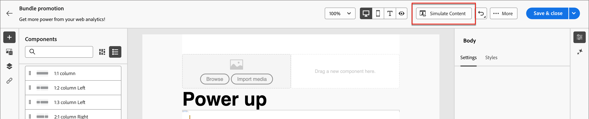

# 电子邮件创作

使用Adobe Journey Optimizer B2B Edition向客户发送电子邮件。 您可以在电子邮件设计器中创建、个性化和预览消息。

## 在帐户历程中添加电子邮件操作

在添加&#x200B;_[!UICONTROL Take an action]_&#x200B;历程并执行以下操作时，可以在Account节点中设置电子邮件投放：

1. 对于&#x200B;]_目标上的_[!UICONTROL &#x200B;操作，请选择&#x200B;**[!UICONTROL 人员]**。
1. 若要对人员&#x200B;]_执行_[!UICONTROL &#x200B;操作，请选择&#x200B;**[!UICONTROL 发送电子邮件]**。
1. 对于&#x200B;_[!UICONTROL 电子邮件源]_，请选择&#x200B;**[!UICONTROL 新建电子邮件]**。

   或者，您还可以选择`Select email from Adobe Marketo Engage`选项，在Marketo Engage中使用预先编写的电子邮件之一，并将其作为Account历程的一部分发送。

   >[!NOTE]
   >
   >如果您是首次创建电子邮件，请确保已在Adobe Marketo Engage中配置电子邮件渠道。 若要了解更多信息，请参阅Marketo Engage文档中的[确保电子邮件可投放性](https://experienceleague.adobe.com/en/docs/marketo/using/getting-started/initial-setup/setup-steps#ensure-email-deliverability)。

   {width="700" zoomable="yes"}

1. 在&#x200B;_[!UICONTROL 执行操作]_&#x200B;面板的底部，单击&#x200B;**[!UICONTROL 创建电子邮件]**。

1. 在对话框中，为电子邮件输入唯一的&#x200B;**[!UICONTROL 名称]**&#x200B;和&#x200B;**[!UICONTROL 主题行]**。

   {width="400"}

1. 单击&#x200B;**[!UICONTROL 创建]**。

   在电子邮件内容页面的&#x200B;_[!UICONTROL 电子邮件属性]_&#x200B;部分中，_[!UICONTROL 发件人电子邮件]_&#x200B;和&#x200B;_[!UICONTROL 回复地址]_&#x200B;字段已配置。 您可以为&#x200B;_[!UICONTROL From name]_&#x200B;和&#x200B;_[!UICONTROL Description]_（可选）字段输入值。

## 创建电子邮件内容

单击&#x200B;_[!UICONTROL 电子邮件]_&#x200B;预览面板顶部的&#x200B;**[!UICONTROL 添加电子邮件内容]**。

{width="700" zoomable="yes"}

此操作将启动电子邮件Designer，您可以在其中从以下选项中选择所需的电子邮件设计方式：

* [使用Designer电子邮件界面从头开始设计电子邮件](#design-your-email-from-scratch)。

* [从文件或.zip文件夹导入现有HTML内容](#import-existing-html-content)。

* [从内置或自定义电子邮件模板列表中选择现有模板](#select-a-template)。

要使用表达式编辑器配置和个性化主题行，请单击&#x200B;_Personalization_&#x200B;图标并添加任何Marketo Engage令牌。

创建并个性化电子邮件内容后，可导出内容以供验证或稍后使用。 单击&#x200B;**[!UICONTROL 导出HTML]**，将内容保存为.zip文件，其中包括您的HTML和资源。

>[!TIP]
>
>使用由generative AI提供支持的Adobe Journey Optimizer B2B版本中的AI Assistant将您的内容提升到新的级别。 AI Assistant可以帮助您优化投放的影响，方法是生成整个电子邮件、提供有针对性的文本内容，并为可与受众产生共鸣的图像获取AI Assistant推荐。 [了解更多](./ai-assistant-emails.md)

### 从头开始设计电子邮件

1. 从Designer主页中，选择&#x200B;**[!UICONTROL 从头开始设计]**&#x200B;选项。

1. 要开始内容设计，请从&#x200B;**[!UICONTROL 结构]**&#x200B;中拖动一个项，然后将其放到画布上。

   对每个结构组件重复此步骤以构建电子邮件的布局。

1. 根据需要从&#x200B;_结构_&#x200B;添加任意数量的项，并编辑右侧窗格中每个项的设置。

   选择n：n列组件以定义所选列数（3到10之间）。 您还可以通过移动列下方的箭头来定义每列的宽度。

   每个列大小不能小于结构组件总宽度的10%。 只能删除空列。

1. 展开&#x200B;**[!UICONTROL 内容]**&#x200B;部分并将所需数量的元素添加到一个或多个结构组件中。

1. 如果需要，您可以在&#x200B;_[!UICONTROL 设置]_&#x200B;或&#x200B;_[!UICONTROL 样式]_&#x200B;选项卡中为每个组件进行其他自定义。

   例如，可以更改每个组件的文本样式、填充或边距。

1. 从Asset选取器中，您可以直接选择存储在Assets库中的资源。

   双击包含资产的文件夹。 将项目拖放到结构组件中。

1. 插入个性化字段以根据用户档案属性、受众成员资格、上下文属性等自定义您的内容。

1. 单击&#x200B;**[!UICONTROL 启用条件内容]**&#x200B;以添加动态内容，并根据条件规则将内容调整为目标配置文件。

1. 从左窗格中选择&#x200B;**[!UICONTROL 链接]**&#x200B;选项卡以显示您的内容中受跟踪的所有URL。

   您可以修改跟踪类型或标签，并根据需要添加标记。

如果需要，您可以通过单击高级菜单中的&#x200B;**[!UICONTROL 切换到代码编辑器]**&#x200B;来进一步个性化电子邮件。 代码编辑器允许您编辑电子邮件源代码，如添加跟踪或自定义HTML标记。

>[!CAUTION]
>
>切换到代码编辑器后，无法还原到此电子邮件的可视设计器。

内容完成后，单击顶部的&#x200B;**[!UICONTROL 模拟内容]**&#x200B;以检查渲染。 您可以选择桌面视图或移动设备视图。

准备就绪后，单击“保存”。

### 导入现有HTML内容

导入的内容可以是：

* 具有合并样式表的HTML文件
* 包含HTML文件、样式表(.css)和图像文件的.zip文件夹

>[!NOTE]
>
>.zip文件结构没有限制。 但是，引用必须是相对的，并且适合.zip文件夹的树结构。

_要导入包含HTML内容的文件：_

1. 从电子邮件Designer主页中，选择&#x200B;**[!UICONTROL 导入HTML]**。

1. 拖放包含HTML内容的HTML或.zip文件，然后单击[!UICONTROL 导入]。

   HTML内容上传完成后，您的内容处于&#x200B;_兼容模式_。 在此模式下，您只能对文本进行个性化，向内容添加链接或包含资源。

### 选择模板

您可以从以下内容中进行选择：

* 示例模板。 Journey Optimizer界面提供了20个现成的电子邮件模板，您可以选择这些模板。

* 已保存模板。

* 使用&#x200B;_模板_&#x200B;菜单从头创建的自定义模板，或使用&#x200B;_[!UICONTROL 另存为内容模板]_&#x200B;选项从历程中的电子邮件中保存的自定义模板。

_要使用示例模板或保存的模板之一开始构建内容：_

1. 从电子邮件内容编辑工作区访问&#x200B;_电子邮件Designer_。

   在&#x200B;_[!UICONTROL 创建电子邮件]_&#x200B;页面上，默认选中&#x200B;**[!UICONTROL 示例模板]**&#x200B;选项卡。

1. 要使用自定义模板，请选择&#x200B;**[!UICONTROL 保存的模板]**&#x200B;选项卡。

   此时将显示在当前沙盒中创建的所有内容模板的列表。 您可以按名称、上次修改时间或上次创建时间对它们进行排序。

1. 从列表中选择您选择的模板。

1. 选择类别后，您可以使用左右箭头在该类别的所有模板（示例或保存的模板，具体取决于您的选择）之间导航。

1. 单击页面右上角的&#x200B;**[!UICONTROL 使用此模板]**。

1. 根据需要在&#x200B;_电子邮件Designer_&#x200B;中编辑内容。

## 检查警报

在设计电子邮件内容时，如果缺少关键设置，则会在界面（页面右上方）中显示警报。

如果未看到此按钮，则表示没有检测到问题。

可以检测到两种类型的警报：

* 引用推荐和最佳实践的&#x200B;**_警告_**，例如：

   * `The opt-out link is not present in the email body`：最佳做法是在电子邮件正文中添加退订链接。

     >[!NOTE]
     >
     >营销风格的电子邮件必须包含选择退出链接，这对于事务型消息不是必需的。

   * `Text version of HTML is empty`：别忘了定义电子邮件正文的文本版本，此文本版本在HTML内容无法显示时使用。

   * `Empty link is present in email body`：检查电子邮件中的所有链接是否正确。

   * `Email size has exceeded the limit of 100KB`：要获得最佳投放，请确保电子邮件大小不超过100KB。

* **_错误_**，阻止您测试或激活历程/营销活动，只要未解决这些错误，例如：

   * `The subject line is missing`：电子邮件主题行是必填的。

   * `The email version of the message is empty`：尚未配置电子邮件内容时显示此错误。

## 检查并测试电子邮件

定义消息内容后，您可以使用测试用户档案来预览、发送校样，并控制它在常用桌面、移动和基于Web的客户端中的呈现。 如果插入个性化内容，则可以使用测试用户档案数据预览此内容在消息中的显示方式。

若要预览电子邮件内容，请单击“模拟内容”****，然后添加测试用户档案，以使用测试用户档案数据检查邮件。

{width="700" zoomable="yes"}
