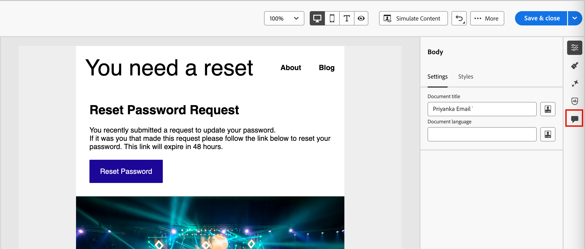
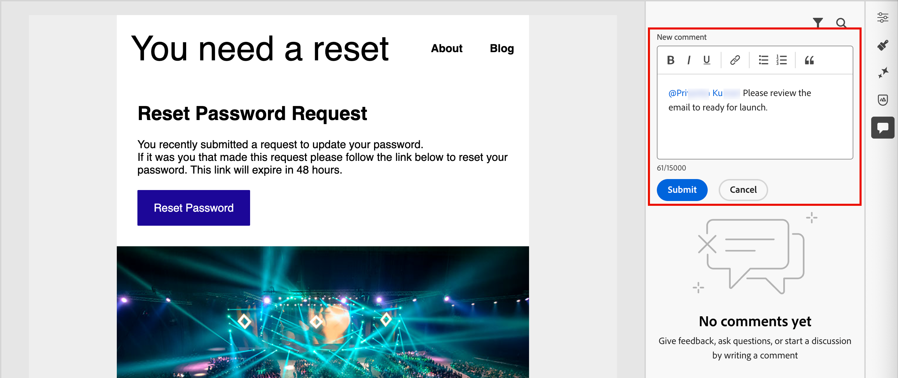
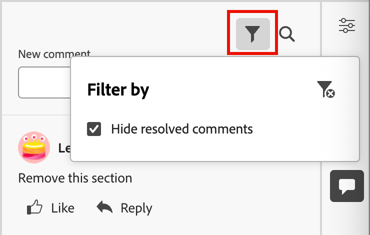

# 电子邮件协作工具

[电子邮件设计空间](./email-authoring.md)包括用于评论和解决的协作工具，以便营销团队可以直接在[!DNL Journey Optimizer B2B Edition]内无缝审查、讨论和最终确定电子邮件资产。 用户可以在电子邮件设计空间内评论、建议编辑和解决反馈，而不是通过外部工具（如聊天、电子邮件线程或电子表格）共享草稿。 在帐户历程中启动电子邮件促销活动之前，请使用以下工具简化工作流、减少错误并确保利益相关者保持一致：

* **_集中式反馈_** — 在一个位置收集和跟踪所有反馈。

* **_更快的审阅_** — 协作者可以在创作环境中审阅电子邮件副本和资产。

* **_准确性提高_** — 通过使所有编辑都绑定到电子邮件本身，降低了通信错误的风险。

* **_透明度_** — 所有评论和解决方案均保持记录状态，以明确说明建议和实施了哪些更改。

* **_上下文中的Collaboration_** — 查看布局中的电子邮件正文副本、图像和call-to-action (CTA)元素。

<!-- Enable asynchronous collaboration between team members for an email asset
Allow users to attach comments to specific design elements
Provide a unified interface for viewing and managing all comments within a project
Support comment placement, editing, deleting, and navigation
Display visual indicators (badges) for elements with associated comments -->

## 为审阅人启用电子邮件协作工具

产品管理员可以通过在Adobe Experience Cloud中通过&#x200B;**[!UICONTROL 权限]** UI分配&#x200B;_管理B2B电子邮件_&#x200B;权限，来启用对电子邮件协作工具的访问。

+++ 启用电子邮件权限

1. 在权限应用程序中，转到&#x200B;**[!UICONTROL 角色]**&#x200B;选项卡，然后选择所需的[角色](https://experienceleague.adobe.com/zh-hans/docs/experience-platform/access-control/abac/permissions-ui/roles){target="_blank"}。

1. 单击&#x200B;**[!UICONTROL 编辑]**，修改权限。

1. 添加&#x200B;**[!UICONTROL B2B Assets]**&#x200B;资源，然后选择&#x200B;**[!UICONTROL 管理B2B电子邮件]**。

   {width="700" zoomable="yes"}

1. 单击&#x200B;**[!UICONTROL 保存]**&#x200B;以应用更改。

   已分配给该角色的任何用户的权限都会自动更新。

1. 要将此角色分配给新用户，请选择“**[!UICONTROL 角色]**”仪表板中的“_[!UICONTROL 用户]_”选项卡，然后单击“**[!UICONTROL 添加用户]**”。

   * 输入用户名和电子邮件地址，或从列表中选择现有用户。

     如果尚未创建用户，请参阅[Experience Platform文档](https://experienceleague.adobe.com/zh-hans/docs/experience-platform/access-control/abac/permissions-ui/users){target="_blank"}。

   * 单击&#x200B;**[!UICONTROL 保存]**&#x200B;以应用更改。

+++

## 显示协作工具和注释

在电子邮件设计空间创建、编辑或查看内容时，您可以访问&#x200B;_Collaboration_&#x200B;面板以添加或管理电子邮件内容的注释。

单击右侧导航中的&#x200B;_Collaboration_ ( )图标。

电子邮件设计右侧导航中的{width="700" zoomable="yes"}

## Collaboration工作流程

您可以使用协作工具遵循标准内容工作流：

1. [邀请](#invite-collaborators-and-reviewers)您的协作者和审阅者。
1. 审阅者[添加注释](#add-comments)。
1. 阅读评论，[添加回复](#reply-to-a-comment)以讨论反馈，并进行必要的编辑。
1. 审阅者或作者[解析注释](#resolve-comments)。

>[!BEGINSHADEBOX]

**使用协作工具的最佳实践**

* 使用`@`标记，以便反馈能够快速到达合适的团队成员。

* 将相关反馈分组到单个注释线程中，而不是多个分散的注释中。

* 始终在收到注释后立即将其解决，以保持工作流程干净。

* 保存最终批准的版本以供合规/审核之用。

>[!ENDSHADEBOX]

### 邀请协作者和审阅者

1. 选择电子邮件的正文。

1. 单击右侧导航中的&#x200B;_Collaboration_ ( )图标。

1. 在右侧面板的顶部，输入邀请文本，以便用户进行协作并提供反馈。

   使用`@`符号寻址并通知用户。 这些用户会收到电子邮件和产品内脉冲通知。

   在符号后面输入名称的前几个字母时，弹出列表会显示匹配的用户名。 您可以在名称中输入更多字母以改善结果。

   {width="550"}

   选择要为通知添加的名称。

   添加您要在邀请中包括的任意数量的协作者或审阅人。

   {width="700" zoomable="yes"}

1. 单击&#x200B;**[!UICONTROL 提交]**。

### 添加评论

作为电子邮件协作者或审阅者，在设计空间中打开电子邮件并添加您的反馈。 您可以在&#x200B;_Collaboration_&#x200B;面板中输入常规反馈，也可以在画布中选择组件并添加特定于该设计元素的注释。 使用`@`(如&#x200B;_@John的标记团队成员，请更新CTA副本_。

每个新评论都会启动一个跟帖，协作者可以在其中使用&#x200B;_回复_&#x200B;继续讨论。 与设计元素关联的每个注释/线程都进行了编号，以便您可以轻松识别其应用位置的元素。

#### 一般评论和反馈

在&#x200B;_Collaboration_&#x200B;面板中，使用顶部的文本字段输入有关电子邮件内容的常规注释。 使用`@`符号寻址并通知用户。

用于电子邮件反馈和用户标记的Collaboration面板中的{width="400"}

单击&#x200B;**[!UICONTROL 提交]**&#x200B;以记录评论并将通知发送给任何已标记的用户。

#### 组件注释

1. 选择结构或内容组件。

1. 单击工具栏中的&#x200B;_Collaboration_&#x200B;工具。

   电子邮件编辑器工具栏中的{width="600"}

1. 在文本字段中输入您的评论。

1. 单击&#x200B;**[!UICONTROL 提交]**。

协作者可以单击电子邮件画布上的编号图钉图标以查看注释。

{width="450"}

#### 回复评论

对于每个评论，您可以使用&#x200B;_[!UICONTROL 回复]_&#x200B;功能继续讨论或回答问题。

单击评论底部的&#x200B;**[!UICONTROL 回复]**，然后输入回复文本。 要在您的回复中包含当前评论的引用，请单击&#x200B;_更多菜单_ (**...**)图标，然后选择&#x200B;**[!UICONTROL 引用回复]**。

{width="350"}

### 解决评论

作为作者或设计者，评估审阅人的反馈并确定要进行的更改。 完成更改并满足请求后，单击&#x200B;_更多菜单_ ( **...** )图标，然后选择&#x200B;**[!UICONTROL 解决]**。

{width="350"}

在确认对话框中，单击&#x200B;**[!UICONTROL 解决]**。

## 管理评论

管理评论和线程以评估协作工作的状态。

### 发表评论

如果评论未与电子邮件画布上的某个元素关联，则可以根据需要&#x200B;_将评论_&#x200B;固定到某个元素。 单击&#x200B;_更多菜单_ ( **...** )图标，然后选择&#x200B;**[!UICONTROL 置入评论]**。 然后，在画布上选择设计组件。

{width="350"}

### 删除或删除评论

您可以通过删除注释日志来清理它们。 单击&#x200B;_更多菜单_ ( **...** )图标，然后选择&#x200B;**[!UICONTROL 删除评论]**&#x200B;或&#x200B;**[!UICONTROL 删除]**。

{width="350"}

* 移除注释时，该操作会将该注释与设计元素（在创建注释时选择）分离。 该评论仍然是电子邮件的评论记录的一部分。

* 删除评论时，该操作会将其从记录中永久删除。

### 已解决的评论

默认情况下，已解析的注释在&#x200B;_Collaboration_&#x200B;面板中隐藏。 通过清除过滤器，您可以随时显示已解析的注释。 单击&#x200B;_筛选器_ （ ）图标，并清除&#x200B;**[!UICONTROL 隐藏已解析的评论]**&#x200B;复选框。

{width="350"}

已解析的评论包括&#x200B;_取消解析_ （ ）图标。 如果您确定未解析注释/线程且需要进一步更改，请单击图标以删除&#x200B;_[!UICONTROL 已解析]_&#x200B;标记。

{width="300"}
