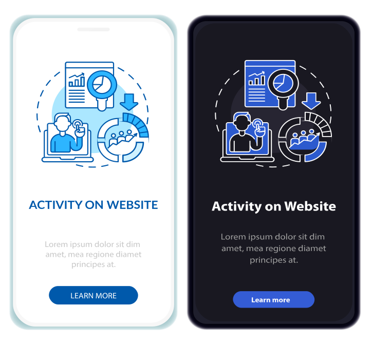
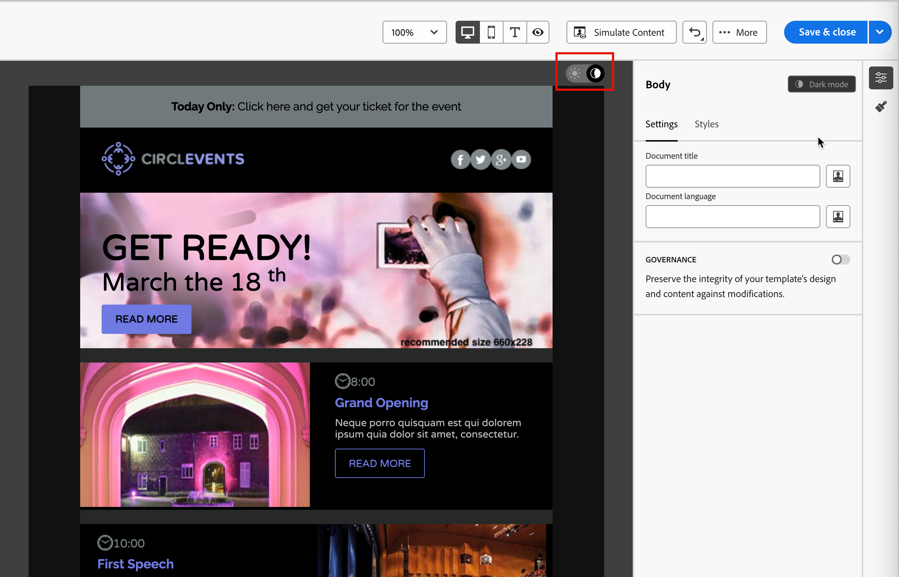
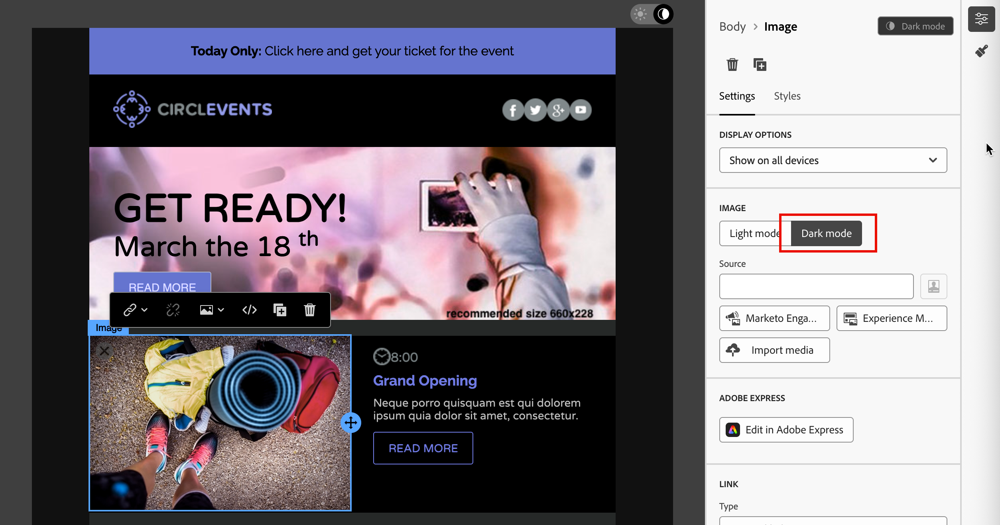

# 电子邮件内容的深色模式 {#dark-mode}

>[!CONTEXTUALHELP]
>id="ajo-b2b_dark_mode"
>title="切换到深色模式"
>abstract="切换到深色模式以预览其渲染效果，并可定义特定的自定义设置。 最终的渲染效果取决于收件人的电子邮件客户端。 请注意，并非所有电子邮件客户端都支持自定义深色模式。"

>[!CONTEXTUALHELP]
>id="ajo-b2b_dark_mode_preview"
>title="切换到深色模式"
>abstract="切换至深色模式，以预览内容在支持深色模式的电子邮件客户端中的渲染效果。 最终的渲染效果取决于收件人的电子邮件客户端。 请注意，并非所有电子邮件客户端都支持深色模式。"

_Dark mode_ allows a supporting email client or app to display emails with darker backgrounds and lighter colors for text, buttons, and other visual elements. This type of display can reduce eye strain, save battery life, and improve readability in low-light environments for a more comfortable viewing experience. As a growing trend across major operating systems and apps, it is now an important consideration in modern email design to ensure that content remains legible and visually appealing for all users.

{width="50%"}

As you [create your email content](./email-authoring.md) in the [!DNL Journey Optimizer B2B Edition] visual design space, you can switch to the _&#x200B;**[!UICONTROL Dark mode]**&#x200B;_ view. In this view, you can also define specific custom settings for supporting email clients when their dark mode is enabled.

## Email client considerations

There is significant variance in the way that different email clients and apps apply dark mode. For this reason, you should consider the expectations for dark mode rendering with caution. Before you use dark mode in the email design space, consider the following email client use cases:
<!--
* Check out the list of [email clients supporting dark mode](https://www.caniemail.com/search/?s=dark){target="_blank"}

* Learn more on Dark mode in this [Litmus blog post](https://www.litmus.com/blog/the-ultimate-guide-to-dark-mode-for-email-marketers){target="_blank"}
-->

+++Clients that do not support dark mode

某些电子邮件客户端根本不支持此功能，例如：

* [!DNL Yahoo! Mail]
* [!DNL AOL]

If you define dark mode custom settings in the email design, these email clients cannot display any dark mode rendering. <!--Regardless of whether the interface is in light or dark mode, your email will render the same.-->

+++

+++Clients applying their own dark mode {#default-support}

Some email clients systematically apply their own default dark mode to all received emails. They automatically adjust colors, backgrounds, images, and other elements according to their dark mode settings and external settings are not possible. These clients include:

* Gmail (Desktop Webmail, iOS, Android™, Mobile Webmail)
* Outlook Windows
* Outlook Windows Mail

<!--It is important to note that less than 25% of email clients offer customization options for dark mode. Clients such as Gmail implement their own dark mode rendering, which is not subject to external modification.-->
In this case, the client dark mode settings override the custom dark mode settings that you define in [!DNL Journey Optimizer B2B Edition]

+++

+++Clients that support custom dark mode

Many of the most popular email clients offer the option to render custom dark mode with the `@media (prefers-color-scheme: dark)` query, which is the method used by the [!DNL Journey Optimizer B2B Edition] email styles. This list of clients includes:

* Apple Mail macOS
* Apple Mail iOS
* Outlook macOS
* Outlook.com
* Outlook iOS
* Outlook Android™

In this case, the specific settings you define in the [!DNL Journey Optimizer B2B Edition] are rendered. However, some restrictions could apply according to each email client. For example, some clients (such as Apple Mail 16 (macOS 13)) do not generate dark mode if images are present in the email content.

For optimal results, test your content with the email clients that you are targeting. To see a simulation that comes as close as possible to the final result for each client, use the [Litmus email test rendering](./email-test-rendering.md) integration in the email design space.

+++

## Design for dark mode

As you style your email content for dark mode in [!DNL Journey Optimizer B2B Edition], the visual design space provides two types of tools:

* Use the [preview function](#preview-default-dark-mode) to review the default dark mode rendering for most supporting email clients.

* If you want to override the default settings of supporting email clients, define and apply custom dark mode settings to your email content. [Learn more](#define-custom-dark-mode)

### Preview default dark mode {#preview-dark-mode}

<!-- Should work with templates and themes, NOT for LP and fragments - but TBC with eng. 
>[!NOTE]
>
>Currently you may not be able to switch to dark mode if you select an [email template](use-email-templates.md) or if you apply a [theme](apply-email-themes.md).-->

1. Open the email content in the email design space.

   At the top right of the canvas, there is a light-dark selector that toggles the content display between light (default) and dark mode.

   {width="700" zoomable="yes"}

1. Change the selector to _Dark mode_ (  ).

   The canvas displays the content using the default dark mode preview.x

   By default, the dark mode preview applies the `full color invert` color scheme to all elements except images and icons. This color scheme detects areas with light and dark elements and inverts them. Light backgrounds become dark and dark text becomes light, or dark backgrounds become light and light text becomes dark.

   {width="700" zoomable="yes"}

>[!CAUTION]
>
>The final rendering could vary according to the recipient&#39;s email client. To see a simulation that comes as close as possible to the final result for each email client, use the [Litmus test email rendering](./email-test-rendering.md) integration.

### 定义自定义深色模式设置 {#custom-dark-mode}

>[!CONTEXTUALHELP]
>id="ajo-b2b_dark_mode_image"
>title="为深色模式使用特定图像"
>abstract="您可以选择另一张图片，在启用深色模式时显示。 为深色模式添加特定图片并不能保证其在所有电子邮件客户端中都能正确渲染。 请注意，并非所有电子邮件客户端都支持自定义深色模式。"

After switching to dark mode, you can choose to edit specific styling elements of your content that are displayed only when dark mode is enabled in the recipient&#39;s email client (provided it supports that feature).

>[!NOTE]
>
>深色模式的最终渲染取决于每个电子邮件客户端，因此结果可能因不同而异。 Review the [email client considerations](#email-client-considerations) for more information.

The custom dark mode styling in the email design space uses the<!-- `@media (prefers-color-scheme: dark)` method--> `@media (prefers-color-scheme: dark)` CSS query, which detects if the email client is set to dark mode and applies the dark-themed design that is defined in your email.

_To define custom dark mode settings :_

1. If needed, move the selector to _Dark mode_ (  ) at the top right of the design canvas.

1. Edit any styling color attributes, such as text, backgrounds, or buttons.

   {width="700" zoomable="yes"}

1. For the images and icons, define specific assets for dark mode only.

   You cannot change the colors of images and icons, but you can define alternative assets to be used for dark mode. You can experiment with different color combinations for your icons or make adjustments for color and saturation for photographic images.

   {width="80%"}

   Select any image and switch to **[!UICONTROL Dark mode]** using the dedicated toggle in the **[!UICONTROL Settings]** pane. Then, select a different image asset.

   {width="700" zoomable="yes"}

   See [Add image assets](./email-authoring.md#add-image-assets) for more information about selecting an image asset.

1. At any point during your design changes, select **[!UICONTROL Switch to live view]** to check how your content might render on various device sizes.

   From this view, change the selector to _Dark mode_ (  ) to preview the dark mode version of your content across the different devices.

   {width="800" zoomable="yes"}

   >[!CAUTION]
   >
   >实时视图是一个通用预览，用于比较呈现在各种设备大小中的外观。 最终渲染可能因收件人的电子邮件客户端而异。

1. 完成深色模式更改后，单击&#x200B;**[!UICONTROL 模拟内容]**。

   {width="700" zoomable="yes"}

   使用预览和校对工具测试您的电子邮件设计。 有关详细信息，请参阅[预览和测试您的电子邮件内容](./email-simulate-content.md)。

1. 如果您拥有Litmus Enterprise帐户，请选择&#x200B;**[!UICONTROL 渲染电子邮件]**&#x200B;以查看Litmus中各种电子邮件客户端的最终深色模式渲染。

   有关详细信息，请参阅[使用Litmus测试电子邮件渲染](./email-test-rendering.md)。

   >[!CAUTION]
   >
   >虽然模拟与电子邮件在深色模式中的显示方式非常接近，但由于电子邮件服务提供商或设备级设置的变化，实际呈现可能会有所不同。

## 最佳做法 {#best-practices}

随着主要电子邮件客户端采用深色模式的次数增加，必须考虑您的电子邮件在浅色和深色环境中的呈现方式 — 无论您是否使用[自定义深色模式](#define-custom-dark-mode)。

深色模式可以改变颜色、背景和图像 — 有时会覆盖设计选择。 要确保可视一致性、可访问性和品牌完整性，请遵循以下最佳实践：

| 实践 |            |
| -------- | ---------- |
| 优化您的图像和徽标 | 清单：<ul><li>将徽标和图标保存为具有透明背景的PNG文件，以避免在深色模式下显示白色框。 <li>避免使用带有硬编码白色或浅色背景的图像。 <li>如果无法使用透明度，请将图像置于设计中的纯色背景上，以防止尴尬的颜色反转。 |
| 关注您的背景 | 清单：<ul><li>确保文本颜色和背景颜色之间的对比度足以在浅色和深色模式下阅读。 <li>避免仅依赖背景颜色处理关键内容。 某些客户端在深色模式下会覆盖背景颜色，因此请确保关键信息仍然可见。 |
| 在深色模式下设计可访问的内容 | 清单：<ul><li>使用颜色组合，易于区分色盲人士。 <li>使用中间调调色板确保与明暗背景的对比度。 <li>使用具有高对比度的无障碍颜色组合以提高可读性并符合[!DNL Web Content Accessibility Guidelines (WCAG)]标准。 使用[!DNL WebAIM Contrast Checker]等工具验证颜色对比度。 <li>避免使用细字体，因为它可能会影响可读性。 如果您的品牌需要细字体，请在深色模式下将其粗体。 <li>跳过纯黑色的纯白色，这可能会导致眼睛疲劳，而且在某些电子邮件客户端中可以自动翻转。 <li>如果不支持深色模式，请提供可访问的回退样式。 |
| 在深色模式环境中测试电子邮件 | 清单：<ul><li>使用电子邮件设计空间中的[深色模式预览](#preview-dark-mode)，该预览使用反转的颜色方案来提前发现问题。 <li>使用带有[[!UICONTROL 渲染电子邮件]](./email-test-rendering.md)选项的Litmus Enterprise帐户模拟您跨主要电子邮件客户端（如Apple Mail、Gmail和Outlook）的设计，并查看颜色和图像在深色模式下的行为。 |

<!--KEEP dark mode accessibility best practices IN ONE SINGLE LOCATION - for now listed on this page.
If needed, it can be moved to the Design accessible content page:
The best practices for designing accesible content in dark mode are listed in [this section](accessible-content.md#dark-mode).-->

<!--**Inline critical styles**

Inline CSS helps maintain more control over styling, as some clients strip external styles in dark mode.-->
