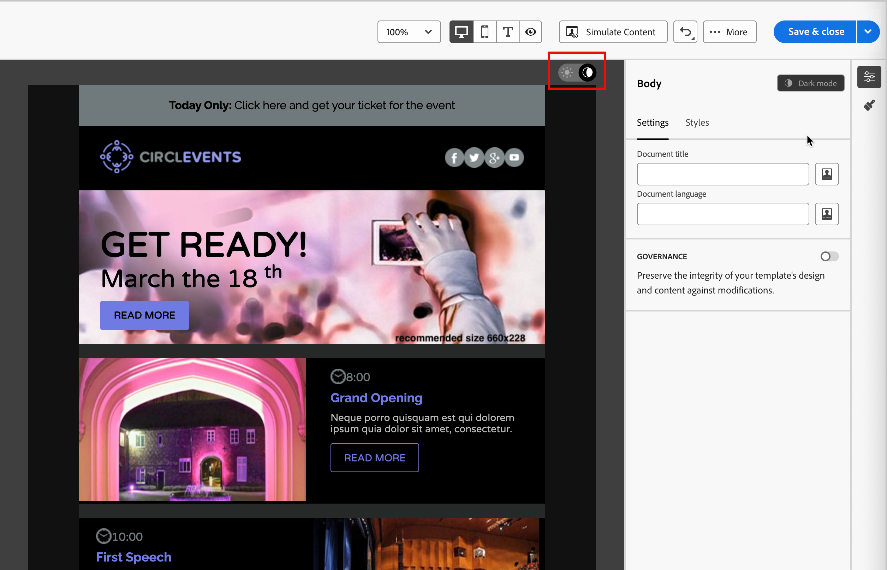

# 电子邮件内容的深色模式 {#dark-mode}

>[!CONTEXTUALHELP]
>id="ajo-b2b_dark_mode"
>title="切换到深色模式"
>abstract="切换到深色模式以预览其渲染效果，并可定义特定的自定义设置。 最终的渲染效果取决于收件人的电子邮件客户端。请注意，并非所有电子邮件客户端都支持自定义深色模式。"

>[!CONTEXTUALHELP]
>id="ajo-b2b_dark_mode_preview"
>title="切换到深色模式"
>abstract="切换至深色模式，以预览内容在支持深色模式的电子邮件客户端中的呈现效果。 最终的渲染效果取决于收件人的电子邮件客户端。请注意，并非所有电子邮件客户端都支持深色模式。"

_深色模式_&#x200B;允许支持此功能的电子邮件客户端或应用程序为文本、按钮和其他可视元素显示具有更暗背景和较浅颜色的电子邮件。 这种显示器可以减轻眼睛疲劳，节省电池寿命，并改善在弱光环境中的可读性，以获得更舒适的观看体验。 作为主流操作系统和应用程序中的一种发展趋势，它现在是现代电子邮件设计中的一个重要考虑事项，以确保内容清晰易读，并且对于所有用户来说都具有吸引力。

{width="50%"}

当您在[视觉设计空间中](./email-authoring.md)创建您的电子邮件内容[!DNL Journey Optimizer B2B Edition]时，您可以切换到&#x200B;_&#x200B;**[!UICONTROL 深色模式]**&#x200B;_&#x200B;视图。 在此视图中，您还可以定义特定的自定义设置，以便在启用电子邮件客户端的深色模式时支持这些客户端。

## 电子邮件客户端注意事项

不同的电子邮件客户端和应用程序应用深色模式的方式存在显着差异。 因此，您应该谨慎考虑对深色模式渲染的期望。 在电子邮件设计空间中使用深色模式之前，请考虑以下电子邮件客户端用例：
<!--
* Check out the list of [email clients supporting dark mode](https://www.caniemail.com/search/?s=dark){target="_blank"}

* Learn more on Dark mode in this [Litmus blog post](https://www.litmus.com/blog/the-ultimate-guide-to-dark-mode-for-email-marketers){target="_blank"}
-->

+++不支持深色模式的客户端

某些电子邮件客户端根本不支持此功能，例如：

* [!DNL Yahoo! Mail]
* [!DNL AOL]

如果您在电子邮件设计中定义深色模式自定义设置，则这些电子邮件客户端无法显示任何深色模式渲染。<!--Regardless of whether the interface is in light or dark mode, your email will render the same.-->

+++

+++客户端应用自己的深色模式{#default-support}

某些电子邮件客户端会系统地将其自己的默认深色模式应用于所有接收的电子邮件。 它们会根据其深色模式设置以及外部设置自动调整颜色、背景、图像和其他元素。 这些客户端包括：

* Gmail(桌面Webmail、iOS、Android™、Mobile Webmail)
* Outlook Windows
* Outlook Windows Mail

<!--It is important to note that less than 25% of email clients offer customization options for dark mode. Clients such as Gmail implement their own dark mode rendering, which is not subject to external modification.-->
在这种情况下，客户端深色模式设置将覆盖您在[!DNL Journey Optimizer B2B Edition]中定义的自定义深色模式设置

+++

+++支持自定义深色模式的客户端

许多最流行的电子邮件客户端提供了使用`@media (prefers-color-scheme: dark)`查询呈现自定义深色模式的选项，该查询是[!DNL Journey Optimizer B2B Edition]电子邮件样式使用的方法。 此客户端列表包括：

* Apple Mail macOS
* Apple Mail iOS
* Outlook macOS
* Outlook.com
* Outlook iOS
* Outlook Android™

在本例中，将呈现您在[!DNL Journey Optimizer B2B Edition]中定义的特定设置。 但是，可能会根据每个电子邮件客户端应用某些限制。 例如，如果电子邮件内容中存在图像，则某些客户端(如Apple Mail 16 (macOS 13))不会生成深色模式。

为了获得最佳结果，请使用您定位的电子邮件客户端测试您的内容。 若要查看与每个客户端的最终结果尽可能接近的模拟，请在电子邮件设计空间中使用[Litmus电子邮件测试渲染](./email-test-rendering.md)集成。

+++

## 深色模式设计

当您在[!DNL Journey Optimizer B2B Edition]中为深色模式设计电子邮件内容样式时，可视化设计空间提供了两种类型的工具：

* 使用[预览功能](#preview-default-dark-mode)查看大多数支持电子邮件客户端的默认深色模式渲染。

* 如果要覆盖支持电子邮件客户端的默认设置，请定义自定义深色模式设置并将其应用于电子邮件内容。 [了解详情](#define-custom-dark-mode)

### 预览默认深色模式 {#preview-dark-mode}

<!-- Should work with templates and themes, NOT for LP and fragments - but TBC with eng. 
>[!NOTE]
>
>Currently you may not be able to switch to dark mode if you select an [email template](use-email-templates.md) or if you apply a [theme](apply-email-themes.md).-->

1. 在电子邮件设计空间中打开电子邮件内容。

   在画布的右上角，有一个浅色和深色选择器，可在浅色（默认）和深色模式之间切换内容显示。

   {width="700" zoomable="yes"}

1. 将选择器更改为&#x200B;_深色模式_ （  ）。

   画布使用默认深色模式preview.x显示内容。

   默认情况下，深色模式预览会将`full color invert`颜色方案应用于除图像和图标以外的所有元素。 此颜色方案检测具有浅色和深色元素的区域，并将其反转。 浅色背景变为深色，深色文本变为浅色，或深色背景变为浅色文本变为深色。

   {width="700" zoomable="yes"}

>[!CAUTION]
>
>最终渲染可能会因收件人的电子邮件客户端而异。 若要查看与每个电子邮件客户端的最终结果尽可能接近的模拟，请使用[Litmus测试电子邮件渲染](./email-test-rendering.md)集成。

### 定义自定义深色模式设置 {#custom-dark-mode}

>[!CONTEXTUALHELP]
>id="ajo-b2b_dark_mode_image"
>title="为深色模式使用特定图像"
>abstract="您可以选择在深色模式打开时显示的其他图像。  添加深色模式的特定图像无法保证它在所有电子邮件客户端中正确呈现。 请注意，并非所有电子邮件客户端都支持自定义深色模式。"

切换到深色模式后，您可以选择编辑内容的特定样式元素，这些元素仅在收件人的电子邮件客户端中启用深色模式（前提是它支持该功能）时显示。

>[!NOTE]
>
>深色模式的最终渲染取决于每个电子邮件客户端，因此结果可能因不同而异。 有关详细信息，请参阅[电子邮件客户端注意事项](#email-client-considerations)。

电子邮件设计空间中的自定义深色模式样式使用<!-- `@media (prefers-color-scheme: dark)` method--> `@media (prefers-color-scheme: dark)` CSS查询，可检测电子邮件客户端是否设置为深色模式，并应用电子邮件中定义的深色主题设计。

定义自定义深色模式设置(_T):_

1. 如果需要，请将选择器移至设计画布右上角的&#x200B;_深色模式_ （  ）。

1. 编辑任何样式颜色属性，如文本、背景或按钮。

   {width="700" zoomable="yes"}

1. 对于图像和图标，仅为深色模式定义特定资产。

   您无法更改图像和图标的颜色，但可以定义用于深色模式的替代资源。 您可以试验图标的不同颜色组合，或调整照片图像的颜色和饱和度。

   {width="80%"}

   选择任意图像并使用&#x200B;**[!UICONTROL 设置]**&#x200B;窗格中的专用切换开关切换到&#x200B;**[!UICONTROL 深色模式]**。 然后，选择其他图像资源。

   {width="700" zoomable="yes"}

   有关选择图像资源的详细信息，请参阅[添加图像资源](./email-authoring.md#add-image-assets)。

1. 在设计更改期间，随时选择&#x200B;**[!UICONTROL 切换到实时视图]**&#x200B;以检查内容在各种设备大小上的呈现方式。

   在此视图中，将选择器更改为&#x200B;_深色模式_ （  ）以预览不同设备上的内容深色模式版本。

   {width="800" zoomable="yes"}

   >[!CAUTION]
   >
   >实时视图是一个通用预览，用于比较呈现在各种设备大小中的外观。 最终渲染可能因收件人的电子邮件客户端而异。

1. 完成深色模式更改后，单击&#x200B;**[!UICONTROL 模拟内容]**。

   {width="700" zoomable="yes"}

   使用预览和校对工具测试您的电子邮件设计。 有关详细信息，请参阅[预览和测试您的电子邮件内容](./email-simulate-content.md)。

1. 如果您拥有Litmus Enterprise帐户，请选择&#x200B;**[!UICONTROL 渲染电子邮件]**&#x200B;以查看Litmus中各种电子邮件客户端的最终深色模式渲染。

   有关详细信息，请参阅[使用Litmus](./email-test-rendering.md)测试电子邮件渲染。

   >[!CAUTION]
   >
   >虽然模拟与电子邮件在深色模式中的显示方式非常接近，但由于电子邮件服务提供商或设备级设置的变化，实际呈现可能会有所不同。

## 最佳实践 {#best-practices}

随着主要电子邮件客户端采用深色模式的次数增加，必须考虑您的电子邮件在浅色和深色环境中的呈现方式 — 无论您是否使用[自定义深色模式](#define-custom-dark-mode)。

深色模式可以改变颜色、背景和图像 — 有时会覆盖设计选择。 要确保可视一致性、可访问性和品牌完整性，请遵循以下最佳实践：

| 实践 |            |
| -------- | ---------- |
| 优化您的图像和徽标 | 清单：<ul><li>将徽标和图标保存为具有透明背景的PNG文件，以避免在深色模式下显示白色框。 <li>避免使用带有硬编码白色或浅色背景的图像。 <li>如果无法使用透明度，请将图像置于设计中的纯色背景上，以防止尴尬的颜色反转。 |
| 关注您的背景 | 清单：<ul><li>确保文本颜色和背景颜色之间的对比度足以在浅色和深色模式下阅读。 <li>避免仅依赖背景颜色处理关键内容。 某些客户端在深色模式下会覆盖背景颜色，因此请确保关键信息仍然可见。 |
| 在深色模式下设计可访问的内容 | 清单：<ul><li>使用颜色组合，易于区分色盲人士。 <li>使用中间调调色板确保与明暗背景的对比度。 <li>使用具有高对比度的无障碍颜色组合以提高可读性并符合[!DNL Web Content Accessibility Guidelines (WCAG)]标准。 使用诸如[!DNL WebAIM Contrast Checker]之类的工具验证颜色对比度。 <li>避免使用细字体，因为它可能会影响可读性。 如果您的品牌需要细字体，请在深色模式下将其粗体。 <li>跳过纯黑色的纯白色，这可能会导致眼睛疲劳，而且在某些电子邮件客户端中可以自动翻转。 <li>如果不支持深色模式，请提供可访问的回退样式。 |
| 在深色模式环境中测试电子邮件 | 清单：<ul><li>使用电子邮件设计空间中的[深色模式预览](#preview-dark-mode)，它使用反转的颜色方案来提前发现问题。 <li>使用带有[[!UICONTROL 呈现电子邮件]](./email-test-rendering.md)选项的Litmus Enterprise帐户模拟您跨主要电子邮件客户端(如Apple Mail、Gmail和Outlook)的设计，并查看颜色和图像在深色模式下的行为。 |

<!--KEEP dark mode accessibility best practices IN ONE SINGLE LOCATION - for now listed on this page.
If needed, it can be moved to the Design accessible content page:
The best practices for designing accesible content in dark mode are listed in [this section](accessible-content.md#dark-mode).-->

<!--**Inline critical styles**

Inline CSS helps maintain more control over styling, as some clients strip external styles in dark mode.-->
