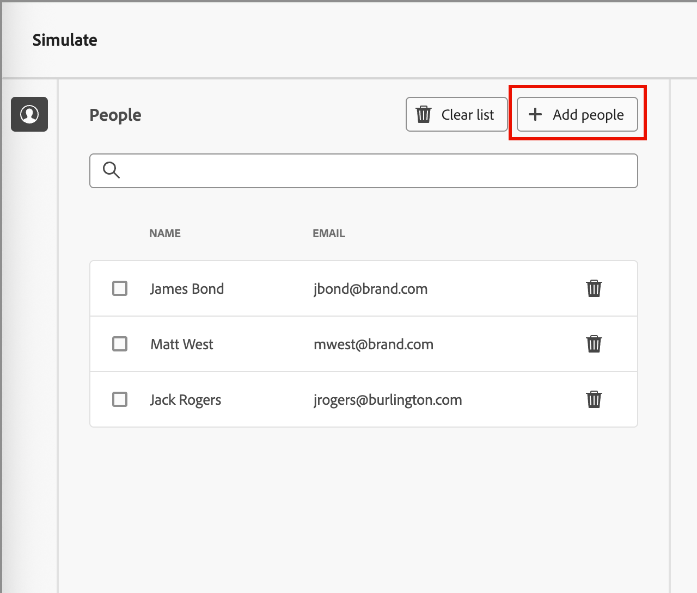

# 预览和测试您的电子邮件内容 {#preview-simulate}

>[!CONTEXTUALHELP]
>id="ajo-b2b_email_preview_simulate"
>title="检查您的内容的渲染方式"
>abstract="定义内容后可预览它，并根据所使用的渠道检查渲染是否正确。"

使用&#x200B;_模拟内容_&#x200B;功能预览电子邮件内容并向特定收件人发送测试投放。 必须定义必需的电子邮件字段，包括&#x200B;_[!UICONTROL 发件人姓名]_、_[!UICONTROL 发件人地址]_、_[!UICONTROL 回复地址]_&#x200B;和&#x200B;_[!UICONTROL 主题行]_，才能访问预览和测试功能。

>[!IMPORTANT]
>
>如果出现错误，则无法预览电子邮件。 检查&#x200B;_警报_&#x200B;以确保没有错误阻止预览功能。 警告不会阻止预览，但应在发布触发电子邮件投放的历程之前解决它们。

## 显示电子邮件预览

您可以从[电子邮件设计空间](./email-authoring.md)或从&#x200B;_[!UICONTROL 摘要]_&#x200B;访问渲染预览，当您[从电子邮件列表](./emails-list.md#edit-emails)打开电子邮件时。

1. 单击顶部的&#x200B;**[!UICONTROL 模拟内容]**。

   {width="800" zoomable="yes"}

   >[!NOTE]
   >
   >如果存在错误或未为电子邮件定义必填字段，则此按钮不可用。

1. 在&#x200B;_[!UICONTROL 模拟]_&#x200B;页面中，从&#x200B;**[!UICONTROL 人员]**&#x200B;列表中选择用于呈现电子邮件的人员配置文件。

   在内容预览中，将根据所选人员配置文件填充个性化元素。

   {width="800" zoomable="yes"}

   如果左侧的&#x200B;_[!UICONTROL 人员]_&#x200B;列表为空，则[使用连接的Marketo Engage实例中的联系人添加人员](#add-people-to-the-profiles-list)。

   >[!TIP]
   >
   >您还可以使用[Litmus测试呈现集成](./email-test-rendering.md)来检查常用桌面、移动和基于Web的客户端中的电子邮件呈现。

## 调整显示选项

使用显示工具根据设备类型或缩放级别更改预览：

* 选择&#x200B;_桌面_ （ ）图标以使用桌面样式和长宽比显示预览。
* 选择&#x200B;_移动设备_ （ ）图标以使用移动设备样式和长宽比显示预览。
* 单击&#x200B;_缩放级别_&#x200B;箭头并选择缩放百分比以查看内容如何根据缩放级别进行更改。

{width="600" zoomable="yes"}

## 发送校样

验证是投放的测试消息，允许您和团队成员在将电子邮件发送给受众成员之前对其进行审核。 校样的收件人可以检查邮件渲染、内容、个性化设置和配置。 您可以使用选定的测试用户档案发送校样。

1. 单击右上方的&#x200B;**[!UICONTROL 发送校样]**。

   {width="500"}

1. 在&#x200B;_发送验证_&#x200B;页面中，输入第一个收件人的电子邮件地址。

1. 对于要包含在审核中的其他每个收件人，请单击“添加收件人”****，然后在“发送至”**[!UICONTROL 字段中输入其电子邮件地址]**。

   您最多可以为校样投放添加十个收件人。

1. 对于每个收件人，通过选择用于个性化邮件内容的测试用户档案来设置&#x200B;**[!UICONTROL 模拟为]**&#x200B;字段。

   {width="700" zoomable="yes"}

1. 单击&#x200B;**[!UICONTROL 发送校样]**。

## 将人员添加到用户档案列表

1. 在&#x200B;_[!UICONTROL 人员]_&#x200B;列表顶部，单击&#x200B;**[!UICONTROL 添加人员]**。

   {width="500"}

1. 在&#x200B;_[!UICONTROL 添加测试人员]_&#x200B;对话框中，输入联系人的完整电子邮件地址。

   要添加多个联系人，请输入多个地址，地址之间用逗号分隔。

1. 选中要添加到测试用户档案列表中的每个匹配联系人的复选框。

   {width="700" zoomable="yes"}

1. 单击右上方的&#x200B;**[!UICONTROL 添加]**。
