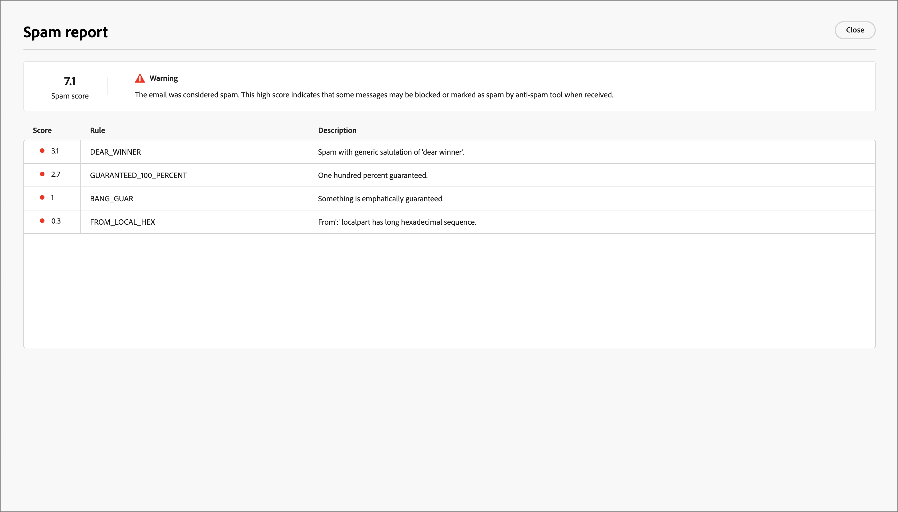

# 查看垃圾邮件报告

许多电子邮件收件箱提供商和大多数公司系统都采用垃圾邮件过滤流程。 发送触发这些过滤器的电子邮件可能会严重影响可投放性。 在Journey Optimizer B2B edition中，您可以通过生成垃圾邮件报告来检查电子邮件内容垃圾邮件评分。 此报表使用[[!DNL SpamAssassin]](https://spamassassin.apache.org/)测试电子邮件，并帮助您确定反垃圾邮件工具是否可以将邮件视为垃圾邮件。 您可以使用报表中的信息执行操作，提高电子邮件内容分数和可投放性。

在查看电子邮件设置或编辑内容时，打开&#x200B;_[!UICONTROL 模拟]_&#x200B;页面并生成&#x200B;_垃圾邮件报告_&#x200B;以查看可能触发反垃圾邮件过滤的评分和标记元素。

1. 从&#x200B;_[!UICONTROL 模拟]_&#x200B;页面，单击右上角的&#x200B;**[!UICONTROL 垃圾邮件报告]**。

   {width="700" zoomable="yes"}

   报告过程扫描电子邮件内容并生成一个分数，其中包含用于生成分数的触发的过滤规则列表。 因素包括正文布局、结构、图像大小、垃圾邮件触发词和其他元素。 有关电子邮件元素的规则评估测试列表，请参阅[[!DNL SpamAssassin] 测试列表](https://spamassassin.apache.org/old/tests_3_0_x.html)。

1. 检查每个项目的得分和描述。

   >[!NOTE]
   >
   >垃圾邮件分数通过SpamAssassin计算，而Adobe并不拥有规则或评分逻辑。 有关[!DNL SpamAssassin]开源项目的更多详细信息，请参阅[[!DNL SpamAssassin] 文档](https://cwiki.apache.org/confluence/display/SPAMASSASSIN/)。

   分数越低，电子邮件被标记为垃圾邮件的可能性就越小。

   {width="600" zoomable="yes"}

   得分大于5的报表包含一条警告，指出某些邮件在收到时可能被阻止或标记为垃圾邮件。 最佳做法是确保得分低于2。

   {width="600" zoomable="yes"}

1. 如果电子邮件内容中存在可以改进的元素，请编辑您的内容以应用必要的更新。

1. 完成更改后，返回到&#x200B;_[!UICONTROL 模拟]_&#x200B;页面并再次单击&#x200B;**[!UICONTROL 垃圾邮件报告]**&#x200B;以检查所得得分改进。
