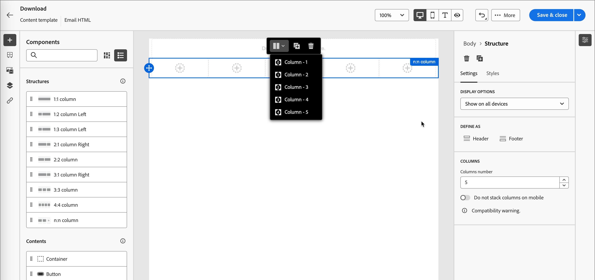
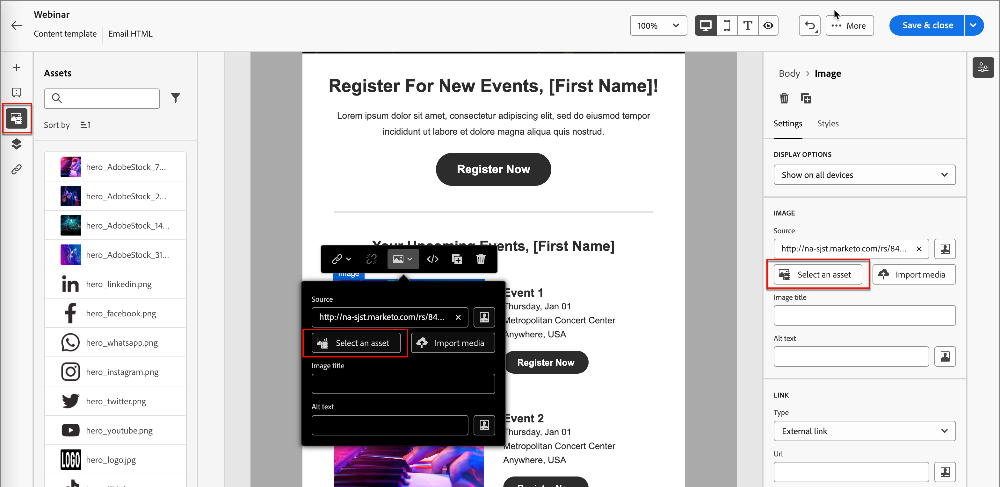

# 电子邮件模板

为了加快和改进设计过程，您可以创建独立的电子邮件模板，以在Adobe Journey Optimizer B2B Edition客户历程中重用自定义内容。 通过模板，您的以内容为导向的团队成员可以在历程之外处理电子邮件内容。 然后，营销策划人员可以在他们的帐户历程中重复使用和调整这些独立的模板。 例如，一个团队成员仅负责内容，无权访问帐户历程。 但是，他们可以创建一个电子邮件模板，营销人员可以选择该模板作为电子邮件通信的起点，并根据历程的要求对其进行自定义。

## 访问和管理电子邮件模板

要访问Adobe Journey Optimizer B2B版本中的电子邮件模板，请转到左侧导航并单击&#x200B;**[!UICONTROL 内容管理]** > **[!UICONTROL 模板]**。 此操作将打开一个列表页面，其中包含在该实例中创建的所有电子邮件模板，这些模板在表中列出。

该表按&#x200B;_[!UICONTROL 已修改]_&#x200B;列排序，最近更新的模板默认位于列表顶部。 单击列标题可在升序和降序之间更改。

要按名称搜索模板，请在搜索栏中输入文本字符串。 单击左上角的&#x200B;_筛选器_&#x200B;图标可根据创建或修改日期以及您创建或修改的模板筛选列表。

{width="700" zoomable="yes"}

通过单击右上角的&#x200B;_自定义表_&#x200B;图标，自定义要在表中显示的列。 选择要显示的列，然后单击&#x200B;**[!UICONTROL 应用]**。

在列表页面中，您可以执行以下部分中描述的操作。

## 创建电子邮件模板

您可以通过单击右上角的&#x200B;**[!UICONTROL 创建模板]**，从电子邮件模板列表页面创建新的电子邮件模板。

1. 在对话框中，输入有用的&#x200B;**[!UICONTROL Name]**&#x200B;和&#x200B;**[!UICONTROL Description]**（可选）。

   {width="400"}

1. 设置初始&#x200B;**[!UICONTROL 图像源]**。

   如果您订阅了Experience Manager Assetsas a Cloud Service以及默认的Adobe Marketo Engage Design Studio，则可以从任一源选择图像资源。 要实现此目的，您必须在创建电子邮件模板或可视片段时选择图像源。 但是，您也可以在编辑内容时选择图像源。

   有关图像源的更多信息，请参阅[Assets](./assets-overview.md)。

1. 单击&#x200B;**[!UICONTROL 创建]**。

“_[!UICONTROL 设计您的模板]_”页面打开，并提供多个用于创建模板的选项： _[!UICONTROL 从头开始设计]_、_[!UICONTROL 导入HTML]_&#x200B;或&#x200B;_[!UICONTROL 选择设计模板]_。

{width="800" zoomable="yes"}

### 从头开始设计 {#design-from-scratch}

>[!CONTEXTUALHELP]
>id="ajo-b2b_structure_components_template"
>title="添加结构组件"
>abstract="结构组件定义模板的版面。拖放&#x200B;**结构**&#x200B;组件到画布中，开始设计您的模板内容。"

>[!CONTEXTUALHELP]
>id="ajo-b2b_content_components_template"
>title="关于内容组件"
>abstract="内容组件是空的内容占位符，您可用它来创建模板的版面。"

使用电子邮件设计器定义电子邮件内容的结构。 通过简单的拖放操作添加和移动结构组件，您可以在几秒钟内设计可重用电子邮件内容的形状。

1. 从&#x200B;_[!UICONTROL 设计您的模板]_&#x200B;主页中，选择&#x200B;**[!UICONTROL 从头开始设计]**&#x200B;选项。

1. 将组件拖放到画布中以定义电子邮件的结构布局，开始设计内容。

   可用的设计工具等效于[电子邮件创作](./email-authoring.md)所用的工具。 不同之处在于，此内容随后另存为模板，可在帐户历程中的多个发送电子邮件节点中重复使用。

### 导入HTML

Adobe Journey Optimizer B2B版本允许您导入现有HTML内容以设计电子邮件模板。 此内容可以是：

* 包含合并样式表的HTML文件。
* 包含HTML文件、样式表(.css)和图像的.zip文件

  >[!NOTE]
  >
  >.zip文件结构没有限制。 但是，引用必须是相对的，并且适合.zip文件夹的树结构。

_要导入包含HTML内容的文件：_

1. 从&#x200B;_[!UICONTROL 设计模板]_&#x200B;主页中，选择&#x200B;**[!UICONTROL 导入HTML]**&#x200B;选项。

1. 拖放包含HTML内容的HTML或.zip文件，然后单击&#x200B;**[!UICONTROL 导入]**。

   上传HTML内容后，您的内容处于&#x200B;_兼容模式_。 在此模式下，您只能对文本进行个性化，向内容添加链接或包含资源。

1. 若要使用电子邮件设计器内容组件，请单击&#x200B;**[!UICONTROL HTML转换器]**&#x200B;选项卡，然后单击&#x200B;**[!UICONTROL 转换]**。

>[!NOTE]
>
>在HTML文件中使用`<table>`标记作为第一层可能会导致样式丢失，包括顶层标记中的背景和宽度设置。

您可以根据需要使用可视电子邮件编辑器工具个性化导入的内容。

### 选择设计模板

在&#x200B;_[!UICONTROL 设计模板]_&#x200B;主页中，使用“选择设计模板”部分开始从模板构建内容。 您可以使用Journey Optimizer B2B Edition实例中的示例模板或保存的电子邮件模板。

>[!BEGINTABS]

>[!TAB 已保存模板]

在&#x200B;_设计模板_&#x200B;主页上，默认选中&#x200B;_示例模板_&#x200B;选项卡。 要使用自定义模板，请选择&#x200B;**[!UICONTROL 保存的模板]**&#x200B;选项卡。

此时将显示在当前沙盒中创建的所有电子邮件模板的列表。 您可以按&#x200B;_[!UICONTROL 名称]_、_[!UICONTROL 上次修改时间]_&#x200B;和&#x200B;_[!UICONTROL 上次创建时间]_&#x200B;对它们进行排序。

{width="800" zoomable="yes"}

从列表中选择所需的模板。

选择后，这将显示模板的预览。 在预览模式下，您可以使用左右箭头在某个类别（示例或已保存，具体取决于您的选择）的所有模板之间导航。

{width="800" zoomable="yes"}

当显示与您想要使用的内容匹配时，单击预览窗口右上角的&#x200B;**[!UICONTROL 使用此模板]**。

此操作会将内容复制到可视内容设计器中，您可以在其中根据需要编辑内容。

>[!TAB 示例模板]

Adobe Journey Optimizer B2B Edition提供了一系列&#x200B;_现成的电子邮件模板_，这些模板可用于创建电子邮件和电子邮件模板。

{width="800" zoomable="yes"}

>[!ENDTABS]

## 添加结构和内容

通过将&#x200B;**[!UICONTROL 组件]**&#x200B;菜单中的结构拖放到画布中以定义电子邮件的布局，开始设计内容。

根据需要添加任意数量的结构，并在右侧的元素属性中编辑其设置。

选择&#x200B;_[!UICONTROL n：n列]_&#x200B;组件以定义您选择的列数（3到10之间）。 通过移动底部的箭头来定义每列的宽度。

>[!NOTE]
>
>每个列大小不能低于结构组件总宽度的10%。 您只能删除空列。

展开&#x200B;**[!UICONTROL 内容]**&#x200B;部分并将所需数量的元素添加到一个或多个结构组件中。

可以使用右侧面板中的&#x200B;_[!UICONTROL 设置]_&#x200B;或&#x200B;_[!UICONTROL 样式]_&#x200B;选项卡进一步自定义每个组件。 例如，可以更改每个组件的文本样式、填充或边距。

### 浏览图层、设置和样式

以下示例概述了在由三列组成的结构组件内调整填充和垂直对齐的步骤。

1. 直接在电子邮件中或使用左侧菜单中提供的导航树选择结构组件。

1. 在工具栏中，单击&#x200B;**[!UICONTROL 选择一个列]**，然后选择要编辑的列。

   {width="800" zoomable="yes"}

   也可以从结构树中选择它。 该列的可编辑参数显示在&#x200B;_[!UICONTROL 样式]_&#x200B;选项卡中。

1. 在&#x200B;**[!UICONTROL 对齐方式]**&#x200B;下，选择&#x200B;_Top_、_Middle_&#x200B;或&#x200B;_Bottom_&#x200B;图标。

1. 在&#x200B;**[!UICONTROL 内边距]**&#x200B;下，定义所有边的内边距。

   如果要微调边距，请选择&#x200B;**[!UICONTROL 每边不同的边距]**。 单击锁定图标可中断同步。

1. 如果需要，请调整其他列的对齐和填充。

1. 保存更改。

### 使内容个性化

以下示例概述了使用商机/帐户属性和系统令牌对模板内容进行个性化的步骤。

1. 选择文本组件并单击工具栏中的&#x200B;_添加个性化_&#x200B;图标。

   {width="500"}

   此操作打开&#x200B;_编辑Personalization_&#x200B;对话框。

1. 单击&#x200B;**+**&#x200B;或&#x200B;**...**&#x200B;将令牌添加到空白空间。

   {width="700" zoomable="yes"}

1. 单击&#x200B;**[!UICONTROL 保存]**。

### 添加片段

在可视内容编辑器中，_片段_&#x200B;图标显示在左侧。 以下示例概述了将片段添加到模板内容的步骤。

1. 要打开片段列表，请单击&#x200B;_片段_&#x200B;图标。

   您可以：

   * 对列表进行排序。
   * 浏览、搜索或筛选列表。
   * 在“缩略图”和“列表”视图之间切换。
   * 刷新列表以反映任何最近创建的片段。

   {width="700" zoomable="yes"}

1. 将任意片段拖放到结构组件占位符中。

   编辑器在电子邮件结构的部分/元素中呈现片段。

片段的内容在结构中动态更新，以呈现内容在电子邮件中如何显示的可视化。

如果要添加片段以使其占据电子邮件中的整个水平布局，请添加1:1列结构，然后将片段拖放到其中。

保存电子邮件后，当您在摘要中选择&#x200B;_[!UICONTROL 使用者]_&#x200B;选项卡时，该电子邮件会显示在片段详细信息页面中。 添加到电子邮件模板的片段在模板中不可编辑 — 内容由源片段定义。

### 添加资源

在可视内容编辑器中，选择左侧显示的&#x200B;_Assets_&#x200B;图标。

>[!NOTE]
>
>如果您订阅了Experience Manager Assetsas a Cloud Service以及默认的Adobe Marketo Engage Design Studio，则可以从在“模板详细信息”页面中选择的源中选择图像资源。

以下示例概述了将资源添加到模板内容的步骤：

1. 要打开资源库，请单击&#x200B;_Assets_&#x200B;图标。

   在资产选择器中，您可以直接选择存储在源库中的资产。

1. 通过将图像资产拖放到结构组件中来添加新资产。

1. 在画布上选择图像资源并单击图像源工具中的&#x200B;**[!UICONTROL 选择资源]**&#x200B;以替换该资源。

   {width="700" zoomable="yes"}

### 预览和编辑URL

1. 单击左侧的&#x200B;_[!UICONTROL 链接]_&#x200B;图标以显示要跟踪的内容的所有URL。

1. 如果需要，请单击&#x200B;_编辑_ （铅笔）图标并修改&#x200B;_跟踪类型_&#x200B;或&#x200B;_标签_，然后为链接添加&#x200B;_标记_。

{width="500"}

### 查看选项

利用可视电子邮件编辑器中提供的视图和内容验证选项。

* 通过预设缩放选项放大/缩小内容。

* 切换在桌面、移动设备或纯文本/纯文本中查看内容。
   * 单击&#x200B;_眼睛_&#x200B;图标可跨设备预览内容。
   * 选择一个现成的设备或输入自定义维度以预览内容。

### 更多选项

在可视内容编辑器的&#x200B;_更多选项_&#x200B;选择器中，您可以执行以下操作：

{width="500"}

* **重置模板** — 单击此选项可将可视电子邮件设计器画布清除为空白并重新启动生成内容。
* **另存为片段** — 将其全部或部分另存为片段，以便在多个电子邮件或电子邮件模板中重复使用。 您可以提供片段的名称和描述，并将其添加到可用片段的列表。
* **更改您的设计** — 返回&#x200B;_设计您的模板_&#x200B;页面。 从此处，您可以执行创建电子邮件模板一节中概述的任何操作过程。
* **导出HTML** — 将可视画布中的内容以HTML格式下载到本地系统，并打包为zip文件。

## 查看电子邮件模板详细信息

在“模板”列表页面中，单击电子邮件模板的名称，以打开电子邮件模板详细信息页面。 在此处，您可以查看电子邮件模板的基本属性并访问可视内容编辑器，以对模板内容进行更改。

{width="700" zoomable="yes"}

* 查看电子邮件模板的详细信息，如名称和描述。 可以编辑这些设置。 单击说明框外部以自动保存更改。

* 查看电子邮件模板属性，例如创建者、创建者、上次更新者和修改者。

* 单击右上角的&#x200B;**[!UICONTROL 更多]**&#x200B;可对电子邮件模板执行快速操作，如&#x200B;_复制_&#x200B;和&#x200B;_删除_。

* 如果存在活动警报（电子邮件模板存在错误和警告），请单击右上方的&#x200B;**[!UICONTROL 警报]**&#x200B;以查看相关信息。

  虽然这些警报不禁止使用电子邮件模板创建电子邮件，但此信息让您的团队中的营销人员能够查看哪些内容可能不起作用，以及在将其用于投放之前所需的更新。

## 查看引用使用的电子邮件模板

在电子邮件模板详细信息页面中，单击&#x200B;**[!UICONTROL 使用者]**&#x200B;选项卡以查看此电子邮件模板在帐户历程的电子邮件中的使用位置的详细信息。

{width="400"}

Journey Optimizer B2B Edition中的电子邮件在历程中嵌入和创作，因此使用模板的电子邮件的父历程显示在引用中。

* 单击链接将会转到相应的历程电子邮件，其中使用电子邮件模板。

* 可随时退出视图，方法是单击“上一步”箭头，该箭头将返回列表页。

## 编辑电子邮件模板

此操作可从以下位置执行：

* 详细信息页面 — 单击&#x200B;**[!UICONTROL 编辑电子邮件模板]**。
* 列表页面 — 单击电子邮件模板旁边的省略号(**...**)，然后选择&#x200B;**[!UICONTROL 编辑]**。

此操作会将您引导至&#x200B;_根据电子邮件模板的上次保存状态设计您的模板_&#x200B;页面或可视内容编辑器页面。 在此处，您可以根据需要编辑电子邮件模板内容。 有关编辑选项的信息，请参阅[创建电子邮件模板](#create-email-templates)。

## 重复的电子邮件模板

您可以使用以下任一方法复制电子邮件模板：

* 从右侧的电子邮件模板详细信息中，展开&#x200B;**[!UICONTROL 更多]**&#x200B;并单击&#x200B;**[!UICONTROL 复制]**。

  {width="400"}

* 从&#x200B;_电子邮件模板_&#x200B;列表页面，单击模板旁边的省略号(...)，然后选择&#x200B;**[!UICONTROL 复制]**。

在对话框中，输入有用的名称（唯一）和描述。 单击&#x200B;**[!UICONTROL 复制]**&#x200B;以完成操作。

然后，重复的（新）电子邮件模板出现在&#x200B;_电子邮件模板_&#x200B;列表中。

## 删除电子邮件模板

无法撤消电子邮件模板删除，因此在启动删除操作之前请检查。 您可以使用以下任一方法删除电子邮件模板：

* 从右侧的模板详细信息中，展开&#x200B;**[!UICONTROL 更多]**&#x200B;并单击&#x200B;**[!UICONTROL 删除]**。
* 从&#x200B;_电子邮件模板_&#x200B;列表页面，单击模板旁边的省略号(...)，然后选择&#x200B;**[!UICONTROL 删除]**。

  {width="500"}

此操作将打开确认对话框。 您可以通过单击&#x200B;**[!UICONTROL 取消]**&#x200B;或单击&#x200B;**[!UICONTROL 删除]**&#x200B;确认删除来中止该进程。

## 执行批量操作

在电子邮件模板列表页面中，通过选中左侧的复选框一次选择多个模板。 选择多个模板时，底部会显示一个横幅。

{width="600"}

**[!UICONTROL 删除]** — 一次最多可以删除20个模板。 确认对话框允许您中止操作或确认删除模板。

## 从保存的模板创作电子邮件

在&#x200B;_创建电子邮件_&#x200B;屏幕中，使用&#x200B;_选择设计模板_&#x200B;部分开始从模板构建内容。

要使用创建的某个电子邮件模板开始构建内容，请执行以下步骤：

1. 从&#x200B;_编辑内容_&#x200B;页面访问Email Designer。

   在&#x200B;_创建电子邮件_&#x200B;页面上，默认选中&#x200B;_示例模板_&#x200B;选项卡。

1. 要使用自定义电子邮件模板，请选择&#x200B;**[!UICONTROL 保存的模板]**&#x200B;选项卡。

   此选项卡显示在沙盒中创建的所有电子邮件模板的列表。 您可以按名称&#x200B;_、_&#x200B;上次修改时间&#x200B;_和_&#x200B;上次创建时间&#x200B;_对它们进行排序。_

1. 从列表中选择您选择的模板。

   选择后，这将显示模板的预览。 在预览模式下，您可以使用左右箭头在某个类别（示例或已保存，具体取决于您的选择）的所有模板之间导航。

1. 单击右上方的&#x200B;**[!UICONTROL 使用此模板]**。

1. 在可视内容设计器中，根据需要编辑内容。
