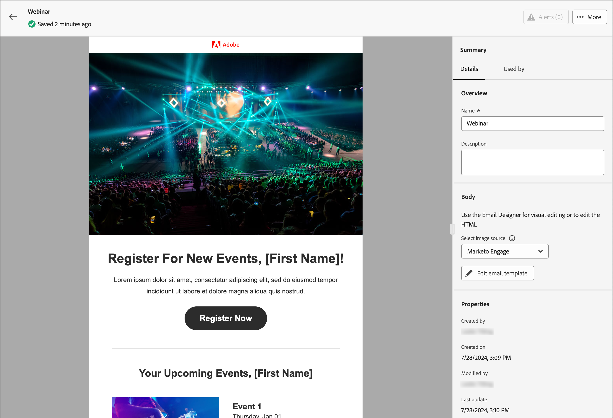

# 电子邮件模板

为了加快并改进设计过程，您可以创建独立的电子邮件模板，以在Adobe Journey Optimizer B2B edition客户历程中重用自定义内容。 通过模板，您的以内容为导向的团队成员可以在历程之外处理电子邮件内容。 然后，营销策划人员可以在他们的帐户历程中重复使用和调整这些独立的模板。 例如，一个团队成员仅负责内容，无权访问帐户历程。 但是，他们可以创建一个电子邮件模板，营销人员可以选择该模板作为电子邮件通信的起点，并根据历程的要求对其进行自定义。

## 访问和管理电子邮件模板

要在Adobe Journey Optimizer B2B edition中访问电子邮件模板，请转到左侧导航并单击&#x200B;**[!UICONTROL 内容管理]** > **[!UICONTROL 模板]**。 此操作将打开一个列表页面，其中包含在该实例中创建的所有电子邮件模板，这些模板在表中列出。

默认情况下，该表按&#x200B;_[!UICONTROL 已修改]_&#x200B;列排序，最近更新的模板位于顶部。 单击列标题可在升序和降序之间更改。

要按名称搜索模板，请在搜索栏中输入文本字符串。 单击左上角的&#x200B;_筛选器_&#x200B;图标可根据创建或修改日期以及您创建或修改的模板筛选列表。

{width="700" zoomable="yes"}

通过单击右上角的&#x200B;_自定义表_&#x200B;图标，自定义要在表中显示的列。 选择要显示的列，然后单击&#x200B;**[!UICONTROL 应用]**。

从显示的模板列表中，您可以执行以下部分中描述的操作。

## 创建电子邮件模板

通过单击右上方的&#x200B;**[!UICONTROL 创建模板]**，可以从电子邮件模板列表页面创建电子邮件模板。

1. 在对话框中，输入有用的&#x200B;**[!UICONTROL Name]**&#x200B;和&#x200B;**[!UICONTROL Description]**（可选）。

   {width="400"}

1. 单击&#x200B;**[!UICONTROL 创建]**。

“_[!UICONTROL 设计您的模板]_”页面打开，并提供多个用于创建模板的选项： _[!UICONTROL 从头开始设计]_、_[!UICONTROL 导入HTML]_&#x200B;或&#x200B;_[!UICONTROL 选择设计模板]_。

{width="800" zoomable="yes"}

选择您要用于启动电子邮件模板设计的方法后，使用可视设计器[创作电子邮件模板内容](./email-template-authoring.md)。

### 从头开始设计

使用可视内容编辑器定义电子邮件内容的结构。 通过简单的拖放操作添加和移动结构组件，您可以在几秒钟内设计可重用电子邮件内容的形状。

>[!NOTE]
>
>可用的设计工具等效于[电子邮件创作](./email-authoring.md)所用的工具。 不同之处在于，此内容随后保存为模板，可在帐户历程中的多个&#x200B;_发送电子邮件_&#x200B;节点中重复使用。

1. 从&#x200B;_[!UICONTROL 设计您的模板]_&#x200B;主页中，选择&#x200B;**[!UICONTROL 从头开始设计]**&#x200B;选项。

1. [将结构和内容](./email-authoring.md#add-structure-and-content)添加到模板。

### 导入HTML

Adobe Journey Optimizer B2B edition允许您导入现有HTML内容以设计电子邮件模板。

{{$include /help/_includes/content-design-import.md}}

{width="500"}

>[!NOTE]
>
>在HTML文件中使用`<table>`标记作为第一层可能会导致样式丢失，包括顶层标记中的背景和宽度设置。

您可以根据需要使用可视设计器个性化导入的内容。

### 选择设计模板

{{$include /help/_includes/content-design-select-template.md}}

## 查看电子邮件模板详细信息

在“模板”列表页面中，单击电子邮件模板的名称，以打开电子邮件模板详细信息页面。 在此处，您可以查看电子邮件模板的基本属性并访问可视内容编辑器，以对模板内容进行更改。

{width="700" zoomable="yes"}

* 查看电子邮件模板的详细信息，如名称和描述。 可以编辑这些设置。 单击说明框外部以自动保存更改。

* 查看电子邮件模板属性，例如创建者、创建者、上次更新者和修改者。

* 单击右上角的&#x200B;**[!UICONTROL 更多]**&#x200B;可对电子邮件模板执行快速操作，如&#x200B;_复制_&#x200B;和&#x200B;_删除_。

* 如果存在活动警报（电子邮件模板存在错误和警告），请单击右上方的&#x200B;**[!UICONTROL 警报]**&#x200B;以查看相关信息。

  这些警报不禁止使用电子邮件模板创建电子邮件。 此信息让您的团队中的营销人员了解可能无法正常使用的内容以及在可用于交付之前所需的更新。

## 查看引用使用的电子邮件模板

在电子邮件模板详细信息页面中，单击&#x200B;**[!UICONTROL 使用者]**&#x200B;选项卡以查看此电子邮件模板在帐户历程的电子邮件中的使用位置的详细信息。

{width="400"}

Journey Optimizer B2B edition中的电子邮件在历程中嵌入和创作，因此使用模板的电子邮件的父历程显示在引用中。

* 单击链接将会转到相应的历程电子邮件，其中使用电子邮件模板。

* 可随时退出视图，方法是单击“上一步”箭头，该箭头将返回列表页。

## 编辑电子邮件模板

此操作可从以下位置执行：

* 详细信息页面 — 单击&#x200B;**[!UICONTROL 编辑电子邮件模板]**。
* 列表页面 — 单击电子邮件模板旁边的省略号(**...**)，然后选择&#x200B;**[!UICONTROL 编辑]**。

此操作会将您转到&#x200B;_设计模板_&#x200B;页面或可视内容编辑器页面（基于电子邮件模板的上次保存状态）。 在此处，您可以根据需要编辑电子邮件模板内容。 有关编辑选项的信息，请参阅[创建电子邮件模板](#create-email-templates)。

## 重复的电子邮件模板

您可以使用以下任一方法复制电子邮件模板：

* 从右侧的电子邮件模板详细信息中，展开&#x200B;**[!UICONTROL 更多]**&#x200B;并单击&#x200B;**[!UICONTROL 复制]**。

  {width="400"}

* 从&#x200B;_电子邮件模板_&#x200B;列表页面，单击模板旁边的省略号(...)，然后选择&#x200B;**[!UICONTROL 复制]**。

在对话框中，输入有用的名称（唯一）和描述。 单击&#x200B;**[!UICONTROL 复制]**&#x200B;以完成操作。

然后，重复的（新）电子邮件模板出现在&#x200B;_电子邮件模板_&#x200B;列表中。

## 删除电子邮件模板

无法撤消电子邮件模板删除，因此在启动删除操作之前请检查。 您可以使用以下任一方法删除电子邮件模板：

* 从右侧的模板详细信息中，展开&#x200B;**[!UICONTROL 更多]**&#x200B;并单击&#x200B;**[!UICONTROL 删除]**。
* 从&#x200B;_电子邮件模板_&#x200B;列表页面，单击模板旁边的省略号(...)，然后选择&#x200B;**[!UICONTROL 删除]**。

  {width="500"}

此操作将打开确认对话框。 您可以通过单击&#x200B;**[!UICONTROL 取消]**&#x200B;或单击&#x200B;**[!UICONTROL 删除]**&#x200B;确认删除来中止该进程。

## 执行批量操作

在电子邮件模板列表页面中，通过选中左侧的复选框一次选择多个模板。 选择多个模板时，底部会显示一个横幅。

{width="600"}

**[!UICONTROL 删除]** — 一次最多可以删除20个模板。 确认对话框允许您中止操作或确认删除模板。

## 从保存的模板创作电子邮件

在&#x200B;_创建电子邮件_&#x200B;屏幕中，使用&#x200B;_选择设计模板_&#x200B;部分开始从模板构建内容。

要使用创建的某个电子邮件模板开始构建内容，请执行以下步骤：

1. 从&#x200B;_编辑内容_&#x200B;页面访问Email Designer。

   在&#x200B;_创建电子邮件_&#x200B;页面上，默认选中&#x200B;_示例模板_&#x200B;选项卡。

1. 要使用自定义电子邮件模板，请选择&#x200B;**[!UICONTROL 保存的模板]**&#x200B;选项卡。

   此选项卡显示在沙盒中创建的所有电子邮件模板的列表。 您可以按名称&#x200B;_、_&#x200B;上次修改时间&#x200B;_和_&#x200B;上次创建时间&#x200B;_对它们进行排序。_

1. 从列表中选择您选择的模板。

   选择后，这将显示模板的预览。 在预览模式下，您可以使用左右箭头在某个类别（示例或已保存，具体取决于您的选择）的所有模板之间导航。

1. 单击右上方的&#x200B;**[!UICONTROL 使用此模板]**。

1. 在可视内容设计器中，根据需要编辑内容。
