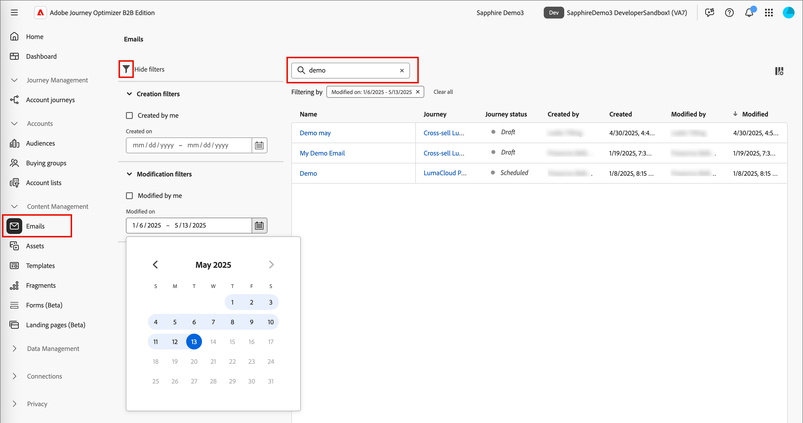

# 电子邮件

当您[创建电子邮件](./add-email.md)时，将其添加到历程节点的上下文中。 如果要在历程图之外处理电子邮件，请使用&#x200B;_[!UICONTROL 电子邮件]_&#x200B;列表查找并更新电子邮件。 您可以查看电子邮件或更新设置和内容。

## 访问和管理电子邮件

要在Adobe Journey Optimizer B2B edition中访问电子邮件，请转到左侧导航并单击&#x200B;**[!UICONTROL 内容管理]** > **[!UICONTROL 电子邮件]**。 此操作将打开一个列表页面，其中包含为实例创建的所有电子邮件，这些电子邮件在表中列出。

默认情况下，该表按&#x200B;_[!UICONTROL 已修改]_&#x200B;列排序，最近更新的电子邮件位于顶部。 单击列标题可在升序和降序之间更改。

要按名称搜索电子邮件，请在搜索栏中输入文本字符串。 单击左上角的&#x200B;_过滤器_ （）图标，以按创建和修改日期筛选显示的电子邮件。 您还可以将列表限制在您创建或修改的电子邮件。

{width="700" zoomable="yes"}

## 编辑电子邮件

单击列表中的电子邮件名称以将其打开。 您可以查看和更改[电子邮件设置](./add-email.md#define-the-email-settings)。 单击&#x200B;**[!UICONTROL 编辑电子邮件内容]**&#x200B;以对该内容[进行更新](./email-authoring.md)。

如果页面右上角显示[警报](./add-email.md#check-alerts)，请单击以查看警告或错误，并根据需要处理这些项目。

{width="700" zoomable="yes"}
