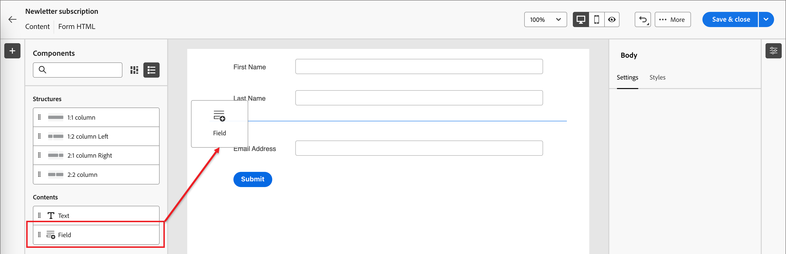
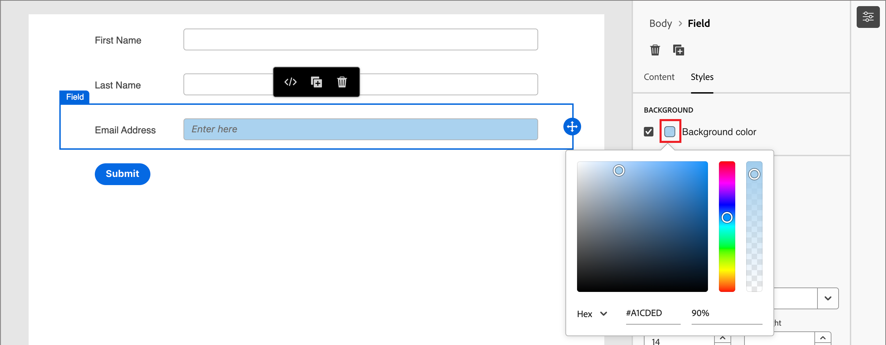
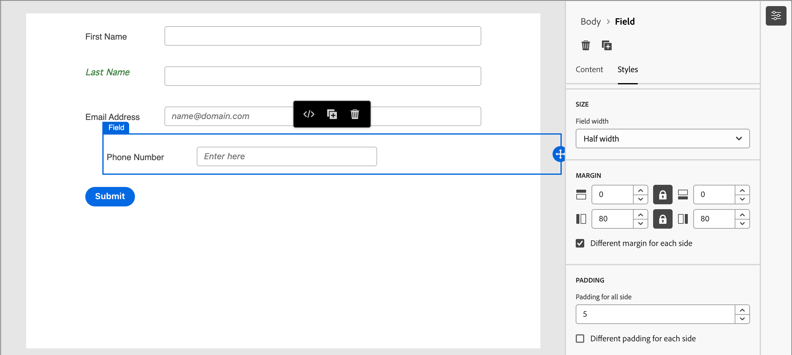
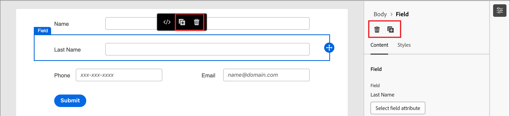
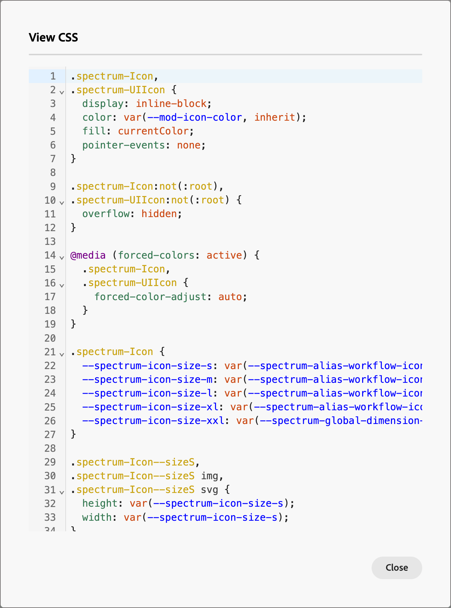

# 表单设计

在您[创建表单](./forms.md#create-forms)后，可视化设计空间将打开一个草稿，其中包含默认的基本表单定义。 在右侧的&#x200B;_[!UICONTROL 摘要]_&#x200B;面板中，单击&#x200B;**[!UICONTROL 编辑表单]**&#x200B;并使用可视设计空间定义表单样式和字段组件。

{width="700" zoomable="yes"}

## 字段

表单字段用于捕获人员配置文件数据，这些数据可用于定向人员并将他们与帐户和购买组关联。 所有新表单都以单列布局中的以下字段开头：

* 名字
* 姓氏
* 电子邮件地址

使用字段设计工具构建一组字段和布局，以便收集基于帐户的营销活动所需的数据。

### 添加字段 {#add-field}

1. 在左侧的&#x200B;_[!UICONTROL 组件]_&#x200B;面板中，将&#x200B;**[!UICONTROL 字段]**&#x200B;内容组件拖放到画布上。

   {width="700" zoomable="yes"}

1. 单击&#x200B;**[!UICONTROL 选择字段属性]**。

1. 在&#x200B;_[!UICONTROL 选择字段属性]_&#x200B;对话框中，选中要用于字段的人员配置文件属性的复选框，然后单击&#x200B;**[!UICONTROL 选择]**。

   [XDM业务架构](../data/field-mapping.md#xdm-business-person-attributes)确定可用的属性。  还可使用为Journey Optimizer B2B edition实例定义的任何自定义字段。 使用“搜索”文本框按名称筛选列表，或单击“筛选”图标按架构/数据类型筛选列表。

   {width="700" zoomable="yes"}

   在画布上，所选属性的默认字段标签会填充到画布上。 **[!UICONTROL 字段详细信息]**&#x200B;将显示在右侧的面板中。

1. 如果需要，请更改&#x200B;**[!UICONTROL 标签]**&#x200B;文本。

   此文本显示在表单中的字段旁边。 默认文本填充自字段属性。

1. 根据字段的数据类型设置&#x200B;**[!UICONTROL 字段类型]**：

   | 字段类型 | 使用情况 | 示例 |
   | ---------- | ----- | ------- |
   | **[!UICONTROL 复选框]** | 使用此类型，以便访客可以选择&#x200B;_true_（选中）或&#x200B;_false_（未选中）值。 | |
   | **[!UICONTROL 复选框组]** | 使用此类型，以便访客可以为多个项目选择&#x200B;_true_（选中）或&#x200B;_false_（未选中）值。 | |
   | **[!UICONTROL 货币]** | 使用此类型可允许代表为Journey Optimizer B2B edition实例选择的默认货币类型的浮动字段。 | |
   | **[!UICONTROL 日期]** | 使用此类型可将输入限制为日期格式，并在字段中提供日历选择器。 | |
   | **[!UICONTROL 双精度]** |  | |
   | **[!UICONTROL 电子邮件]** | 使用此类型将输入限制为电子邮件地址格式。 | |
   | **[!UICONTROL 数字]** | 使用此类型可将字段限制为某个数值。 | |
   | **[!UICONTROL 单选按钮组]** | 使用此类型可允许访客选择一组选项中的一个。 | |
   | **[!UICONTROL 选择]** | 使用此类型可允许访客使用下拉列表选择一组选项中的一个。 | |
   | **[!UICONTROL 滑块]** | 使用此类型可允许访客使用滑块设置数值。 | |
   | **[!UICONTROL 电话]** | 将此类型用于电话号码输入字段。 | |
   | **[!UICONTROL 文本]** | 将此类型用于标准文本（字符串）输入字段。 | |
   | **[!UICONTROL 文本区域]** | 使用此类型支持较长的文本输入。 | |
   | **[!UICONTROL URL]** | 使用此类型可将文本输入限制为URL，包括标准URL协议。 | |

1. 根据所选的字段类型，为字段输入和验证设置其他选项：

   {width="400" zoomable="yes"}

   * **[!UICONTROL 占位符]** — 为访客提供字段预期值的字段占位符值。

   * **[!UICONTROL 说明]** — 帮助访客完成该字段的说明性文本。 输入要显示为该字段的&#x200B;_悬停文本_&#x200B;的文本。

     >[!TIP]
     >
     >_说明与占位符文本_ 
     >
     >使用这两个属性来引导访客填写字段。 将指针悬停在字段上时，说明文本显示为工具提示/弹出文本。 占位符文本在字段中显示&#x200B;_灰显_，当访客在字段中输入其文本时，该文本将消失。 您可以使用这两种方法，也可以只使用一种方法。

   * **[!UICONTROL 默认值]** — 使用此选项为字段指定默认值。

   * **[!UICONTROL 验证消息]** — 使用此选项为字段指定验证消息。 如果访客为该字段输入无效值，则会显示此消息。 默认情况下，_[!UICONTROL Standard]_&#x200B;消息已设置。 选择&#x200B;**[!UICONTROL 自定义]**&#x200B;并输入您自己的消息。

   * **最大长度** — 输入可在字段中输入的最大字符数。

1. 根据需要设置&#x200B;**[!UICONTROL 字段行为]**：

   * **必需** — 选中此复选框可使提交表单所需的字段输入变为必需。

   * **启用输入掩码** — 选中此复选框可限制使用输入掩码从访客输入的内容。 例如，您可能希望访客以特定格式输入电话号码。 在对话框中，为任意数字使用`9`，为任意字母使用`a`，为任一数字使用`*`输入掩码。 单击“保存”启用指定的输入掩码。

     {width="500" zoomable="yes"}定义输入掩码

### 更改字段样式 {#field-styling}

选择右侧面板中的&#x200B;**[!UICONTROL 样式]**&#x200B;选项卡以更改所选字段的样式。

* **[!UICONTROL 背景]** — 选中此复选框可为字段应用背景颜色。 白色是默认颜色。 单击&#x200B;**[!UICONTROL 背景颜色]**&#x200B;方块以打开弹出式拾色器并选择字段背景的颜色。

  {width="600" zoomable="yes"}

* **[!UICONTROL 标签]** — 标签样式控制字段旁边显示的文本的可视特性。 选择相对于字段的顶部标签或侧标签显示。 可以设置字体大小、行高、文本样式和文本对齐方式。 单击&#x200B;**[!UICONTROL 字体颜色]**&#x200B;方块以打开弹出式拾色器并选择标签文本的颜色。

  {width="600" zoomable="yes"}

* **[!UICONTROL 边框]** — 单击&#x200B;**[!UICONTROL 边框颜色]**&#x200B;方块以打开弹出式拾色器并选择边框颜色。 您可以定义字段的边框，包括颜色和线宽。 清除复选框可删除显示的字段边框。 您还可以更改边角的边框大小（像素宽度）、样式和半径设置。

  {width="600" zoomable="yes"}

* **[!UICONTROL 大小]** — 选择大小设置以确定字段的显示宽度。 选择&#x200B;_[!UICONTROL 全宽]_、_[!UICONTROL 半宽]_&#x200B;或&#x200B;_[!UICONTROL 自动]_。

* **[!UICONTROL 边距]** — 设置字段周围的边距（像素）。 您可以在所有四个边上设置相同的边距，也可以选中&#x200B;**[!UICONTROL 每个边的不同边距]**&#x200B;复选框以分别设置水平边距和垂直边距。

* **[!UICONTROL 内边距]** — 设置字段周围的内边距（像素）。 您可以在所有四个边上设置相同的边距，也可以选中&#x200B;**[!UICONTROL 每个边的不同边距]**&#x200B;复选框以分别设置水平和垂直边距。

  {width="600" zoomable="yes"}

### 字段重新排序 {#field-reorder}

您可以在可视工作区中直接移动表单字段。 单击所选字段右边缘的&#x200B;_移动_&#x200B;工具，并将其拖动到新位置。

将结构组件添加到表单并将字段移动到列中以将它们分组并更改布局。 单击所选列组件左边缘的&#x200B;_移动_&#x200B;工具，并将其拖动到表单中的新位置。

{width="500"}

### 删除或复制字段 {#field-delete-duplicate}

单击工具栏或右侧面板中的&#x200B;_删除_&#x200B;图标（）以删除选定的字段。 在确认对话框中单击&#x200B;**[!UICONTROL 删除]**。

单击工具栏或右侧面板中的&#x200B;_复制_&#x200B;图标（）以复制所选字段。 新字段显示在原始字段的正下方。 单击&#x200B;**[!UICONTROL 选择字段属性]**&#x200B;以设置该字段的属性。 根据需要设置字段类型、详细信息和样式。

{width="600" zoomable="yes"}

## “提交”按钮

默认情况下，提交按钮（页脚字段）是表单的一部分，无法删除。 选择表单中的按钮/页脚组件以更改按钮的文本和样式。

### 编辑按钮内容 {#button-content}

使用右侧面板中显示的&#x200B;_[!UICONTROL Content]_&#x200B;选项卡，更改&#x200B;**[!UICONTROL 按钮文本]**&#x200B;字段中的文本。 调整按钮大小以适应文本的长度。

{width="600" zoomable="yes"}

### 设置提交按钮的样式 {#button-styles}

选择右侧面板中的&#x200B;**[!UICONTROL 样式]**&#x200B;选项卡以更改所选按钮/页脚组件的样式。

* **[!UICONTROL 背景]** — 选中此复选框可为按钮应用背景颜色。 蓝色是默认颜色。 单击&#x200B;**[!UICONTROL 背景颜色]**&#x200B;方块以打开弹出式拾色器并选择按钮背景的颜色。

  {width="600" zoomable="yes"}

* **[!UICONTROL 标签]** — 标签样式控制按钮内文本的可视特征。 可以设置字体大小、行高、文本样式和文本对齐方式。 单击&#x200B;**[!UICONTROL 字体颜色]**&#x200B;方块以打开弹出式拾色器并选择标签文本的颜色。

* **[!UICONTROL 边框]** — 单击&#x200B;**[!UICONTROL 边框颜色]**&#x200B;方块以打开弹出式拾色器并选择边框颜色。 您可以定义按钮的边框，包括颜色和线条宽度。 清除复选框可删除显示的按钮边框。 您还可以更改圆角的边框大小（像素宽度）、样式和半径设置。

* **[!UICONTROL 大小]** — 选择大小设置以确定按钮的显示宽度。 选择&#x200B;_[!UICONTROL 全宽]_、_[!UICONTROL 半宽]_&#x200B;或&#x200B;_[!UICONTROL 自动]_。 内边距会根据大小和对齐设置进行调整。

  {width="600" zoomable="yes"}

* **[!UICONTROL 按钮对齐方式]** — 当您选择按钮的&#x200B;_半宽_&#x200B;或&#x200B;_自动_&#x200B;大小时，请将对齐方式设置为左、右或居中。 内边距会根据大小和对齐设置进行调整。

* **[!UICONTROL 边距]** — 设置字段周围的边距（像素）。 您可以在所有四个边上设置相同的边距，也可以选中&#x200B;**[!UICONTROL 每个边的不同边距]**&#x200B;复选框以分别设置水平边距和垂直边距。

* **[!UICONTROL 内边距]** — 设置字段周围的内边距（像素）。 您可以在所有四个边上设置相同的边距，也可以选中&#x200B;**[!UICONTROL 每个边的不同边距]**&#x200B;复选框以分别设置水平和垂直边距。 如果更改大小和对齐设置，则填充会进行调整。

  {width="600" zoomable="yes"}

## 表单样式 {#form-styling}

当在结构或表单元件外部单击时，可以更改表单元区的样式。 表单组件（字段和按钮）将继承定义顶级样式的&#x200B;_正文_&#x200B;样式，除非在字段或按钮/页脚级别定义了其他样式。

{width="600" zoomable="yes"}

### CSS样式

新表单使用默认的CSS进行样式设置。 如果要通过修改CSS来更改样式，可以复制样式，然后使用它来定义表单的自定义CSS。

为表单&#x200B;:_定义自定义CSS(_T)

1. 单击右侧面板中的&#x200B;**[!UICONTROL 查看CSS]**&#x200B;以查看CSS代码。

   {width="450" zoomable="yes"}

1. 在滚动窗口中选择CSS代码并将其复制到剪贴板。

1. 单击&#x200B;**[!UICONTROL 关闭]**。

1. （可选）将复制的代码粘贴到您收藏的CSS工具中，并编辑CSS以反映所需的样式。

1. 单击右侧面板中的&#x200B;**[!UICONTROL 添加自定义CSS]**。

1. 将CSS代码粘贴到窗口中。

   {width="450" zoomable="yes"}

   您可以在此窗口中编辑粘贴的文本。

1. 单击&#x200B;**[!UICONTROL 保存]**。

### 手动设置样式

更改右侧面板中的设置以定义整个表单的显示。

* **[!UICONTROL 背景颜色]** — 选中此复选框可在表单区域周围应用背景颜色。 白色是默认颜色。 单击颜色方块以打开弹出式拾色器，并为表单背景选择颜色。

* **[!UICONTROL 视区背景]** — 选中此复选框以将背景颜色应用于所有表单组件。 缺省值为无颜色（继承自外部背景）。 单击颜色方块以打开弹出式拾色器，并为窗体结构组件选择颜色。

  {width="600" zoomable="yes"}

* **[!UICONTROL 文本]** — 为表单选择&#x200B;**[!UICONTROL 字体系列]**，这会影响表单字段的标签、提示和占位符文本。 它还会影响默认的提交按钮文本。

* **[!UICONTROL 大小]** — 更改表单的大小（宽度）（以像素为单位）。

* **[!UICONTROL 边距]** — 设置表单组件周围的边距（以像素为单位）。 您可以在所有四个边上设置相同的边距，也可以选中&#x200B;**[!UICONTROL 每个边的不同边距]**&#x200B;复选框以分别设置水平边距和垂直边距。

  {width="600" zoomable="yes"}
