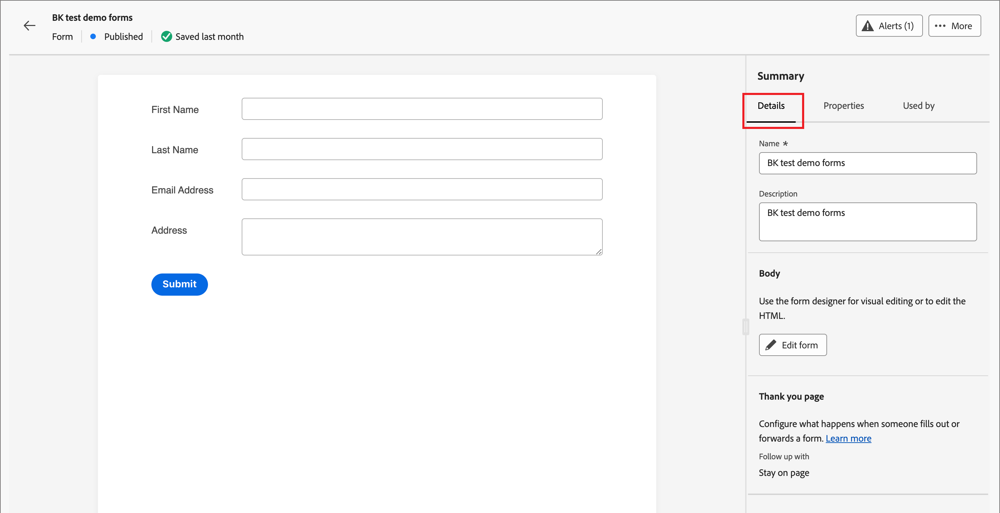
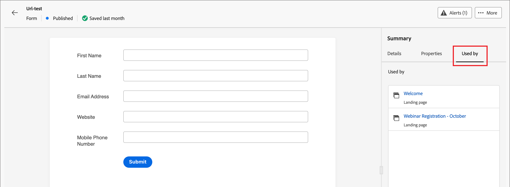

# 表单

要从网页访客中捕获信息，请创建表单并将其添加到您的登陆页面。 表单是一组字段，页面访客填写并提交它们以获取某种内容或选件，例如白皮书、按需网络研讨会或免费试用。

表单应捕获的信息量取决于内容或选件的值。 如果您提供简单的内容（如白皮书），则应当只收集最低限度的信息，如姓名、电子邮件和公司。 如果选件具有更高价值（如演示或免费试用），则可以收集更多信息。 要求提交的表单允许查看内容称为&#x200B;_封闭内容_。 您的组织决定应该封闭哪些内容，哪些不是（_自由_）。 最佳实践是允许免费提供某些内容，并仅提供您的优质或高需求内容。

## 访问和管理表单

要在Journey Optimizer B2B edition中访问表单，请转到左侧导航并单击&#x200B;**[!UICONTROL 内容管理]** > **[!UICONTROL Forms]**。 此操作将打开一个列表页面，其中包含在该实例中创建的所有表单，这些表单在表中列出。

{width="700" zoomable="yes"}

该表按&#x200B;_[!UICONTROL 已修改]_&#x200B;列排序，最近更新的表单默认位于顶部。 单击列标题可在升序和降序之间更改。

### 表单状态和生命周期

表单状态决定了在登陆页面或登陆页面模板中使用的表单可用性，以及您可以对表单进行的更改。

| 状态 | 描述 |
| -------------------- | ----------- |
| 草稿 | 创建表单时，它处于草稿状态。 在您定义或编辑字段之前，它会保持此状态，直到您发布它以用于登陆页面或登陆页面模板。 可用操作：  <ul><li>编辑所有详细信息<li>在可视设计空间中编辑<li>发布<li>重复<li>删除 |
| 发布日期 | 发布表单后，该表单将可用于登陆页面或登陆页面模板。 无法在可视设计空间中修改已发布的表单内容。 可用操作：  <ul><li>编辑名称、描述或感谢页面<li>添加到登陆页面或登陆页面模板<li>创建草稿版本<li>重复<li>删除（如果未使用）<li>嵌入代码 |
| 以草稿发布 | 从已发布的表单创建草稿时，已发布的版本仍可用于登陆页面或登陆页面模板，并且草稿内容可在可视设计空间中修改。 如果您发布草稿版本，则该草稿版本会替换当前已发布的版本，并且使用草稿的登陆页面或登陆页面模板中的内容会进行更新。 可用操作：  <ul><li>编辑名称、描述或感谢页面<li>添加到登陆页面或登陆页面模板<li>在可视设计空间中编辑草稿版本<li>发布草稿版本<li>重复<li>删除（如果未使用）<li>嵌入代码 |

{zoomable="yes"}

### 筛选表单列表

要按名称搜索表单，请在搜索栏中输入文本字符串以查找匹配项。 单击&#x200B;_筛选器_&#x200B;图标（）以显示可用的筛选器选项并更改设置以根据指定的条件筛选显示的项。

{width="700" zoomable="yes"}

### 自定义列显示

通过单击右上角的&#x200B;_自定义表_&#x200B;图标（）自定义要在表中显示的列。

在对话框中，选择要显示的列，然后单击&#x200B;**[!UICONTROL 应用]**。

在Forms列表中显示{width="300"}

## 创建表单

在Journey Optimizer B2B edition中开始构建可重用表单之前，需要考虑以下几个因素：

* 确定您需要什么表单。

  可能只能使用四种标准表单。 一个用于访问可下载的内容，一个用于访问高级网页，一个用于查看视频，一个用于注册网络研讨会等活动。 如果您需要更改表单中的字段，更轻松地更新在全球范围内使用的四个标准表单，而不是更改分布在所有营销项目中的多个表单。<!-- Global forms also make progressive profiling much easier to implement. -->

* 对于每个标准表单，请确定要使用的字段以及如何显示它们。

  请考虑使用较短的表单，因为已证明它们更适合转化。 当您仔细考虑每个表单时，请确定哪些字段对于表单而言是合理且必要的。

  考虑是否预填表单字段，以便预填名称和电子邮件等基本信息。 但其他信息，如职称和组织规模，则并非如此。 这样，访客只需填写两个字段并提交表单。 您也可以使用社交表单填写来自Facebook或Twitter的数据。

* 规划访客提交表单后显示哪些跟进页面（_感谢_&#x200B;页面）。

  每个人都获得相同的页面吗？该页面是否为动态页面？是否基于他们的数据？ 例如，医疗保健行业的人可能会看到与技术行业的人不同的页面内容。

* 如果您已经拥有所需的信息，请考虑是否完全绕过表单。

  如果您允许访问登陆页面的已知人员绕过表单，则他们只需直接访问内容即可。 绕过表单可提供更精简的访客体验。

### 添加新表单

您可以在Journey Optimizer B2B edition中创建表单，方法是单击&#x200B;_[!UICONTROL Forms]_&#x200B;列表页右上角的&#x200B;**[!UICONTROL 创建表单]**。

1. 在&#x200B;_[!UICONTROL 创建表单]_&#x200B;对话框中，输入有用的&#x200B;**[!UICONTROL 名称]**（必需）和&#x200B;**[!UICONTROL 描述]**（可选）。

   表单要求：

   * 名称 — 最多100个字符，必须唯一，不区分大小写

   * 描述 — 最多300个字符

   * 允许使用Alpha、数字和特殊字符

   * 保留字符为&#x200B;**_不允许_**： `\ / : * ? " < > |`

   {width="400"}

1. 单击&#x200B;**[!UICONTROL 创建]**。

   此时将打开表单详细信息页面，其中包含默认的基本表单定义。

   {width="700" zoomable="yes"}

### 更改默认表单设计

使用可视化设计工具根据需要更改表单内容：

* [添加字段](./form-design.md#add-a-field)
* [更改字段样式](./form-design.md#change-field-styling)
* [字段重新排序](./form-design.md#reorder-fields)
* [更改提交按钮文本和样式](./form-design.md#edit-and-style-the-submit-button)
* [更改表单样式](./form-design.md#change-form-styling)

单击&#x200B;**[!UICONTROL 保存并关闭]**&#x200B;以保存表单内容设计更改并转到表单详细信息。

### 设置感谢页面

在右侧的&#x200B;_[!UICONTROL 摘要]_&#x200B;面板中，滚动到&#x200B;**[!UICONTROL 感谢页面]**&#x200B;部分，然后使用&#x200B;**[!UICONTROL 跟进]**&#x200B;设置定义访客提交表单时会发生什么情况：

* **[!UICONTROL 停留在页面]** — 选择此选项可在提交表单时将访客停留在同一页面。

* **[!UICONTROL 登陆页面]** — 选择此选项可选择任意Journey Optimizer B2B edition或Marketo Engage登陆页面作为跟进。

* **[!UICONTROL 外部URL]** — 选择此选项可将任何URL指定为后续页面。 访客提交表单后，浏览器会加载指定的URL。

  >[!TIP]
  >
  >如果您希望使用表单下载文件，则可以指定托管文件的URL。 对于此配置，“提交”按钮可用作下载按钮。

### 发布表单草稿

当您准备好将表单用于登陆页面或登陆页面模板时，请单击&#x200B;**[!UICONTROL 发布]**。

{width="400"}

此操作将打开确认对话框。 您可以通过单击&#x200B;**[!UICONTROL 取消]**&#x200B;或单击&#x200B;**[!UICONTROL 发布]**&#x200B;进行确认来中止发布过程。

## 查看表单详细信息

单击列表页面中任何表单的名称，可打开片段详细信息页面。 您可以选择编辑表单、重命名表单或更新表单说明。 进行更新，然后单击名称或描述字段外部以自动保存更改。

>[!NOTE]
>
>如果登陆页面或登陆页面模板正在使用已发布的表单，则无法编辑内容或更改感谢页面。 如果要对表单进行更改，可以创建草稿版本。

{width="600" zoomable="yes"}

单击&#x200B;**[!UICONTROL 编辑表单]**&#x200B;以在可视设计空间中打开片段。

随时通过单击左上角的&#x200B;_返回_&#x200B;箭头退出视图，该箭头将返回到&#x200B;_[!UICONTROL Forms]_&#x200B;列表页。

## 查看引用使用的表单

在右侧的&#x200B;_[!UICONTROL 摘要]_&#x200B;面板中，单击&#x200B;**[!UICONTROL 使用者]**&#x200B;选项卡以查看有关当前在Journey Optimizer B2B edition中使用表单的位置、登陆页和登陆页模板的详细信息。

>[!IMPORTANT]
>
>无法删除任何登陆页面或登陆页面模板当前正在使用的任何表单。

{width="600" zoomable="yes"}的引用使用

引用根据类别显示： _登陆页面_&#x200B;或&#x200B;_登陆页面模板_。 单击链接以打开相应的页面或使用表单的模板。

## 删除表单

无法删除登陆页面或登陆页面模板当前正在使用的任何表单。 在启动表单移除之前，您可以检查&#x200B;_used-by_&#x200B;引用。 此外，删除操作无法撤消，因此在启动删除操作之前请检查。

您可以使用以下任一方法删除表单：

* 单击右上角的&#x200B;**[!UICONTROL ...更多]**&#x200B;并选择&#x200B;**[!UICONTROL 删除]**。
* 从&#x200B;_[!UICONTROL Forms]_&#x200B;列表页面，单击表单名称旁边的省略号，然后选择&#x200B;**[!UICONTROL 删除]**。

此操作将打开确认对话框。 您可以通过单击&#x200B;**[!UICONTROL 取消]**&#x200B;或单击&#x200B;**[!UICONTROL 删除]**&#x200B;确认删除来中止该进程。

{width="400"}

如果该表单当前正在使用中，则该操作会打开一个信息对话框，警告您无法删除该表单。 单击&#x200B;**[!UICONTROL 确定]**，这将中止删除操作。

{width="400"}

## 复制表单

复制表单，作为一种从使用现有表单作为表单设计的起点来创建新表单的快速轻松方法。

您可以使用以下任一方法复制表单：

* 在表单详细信息页面的右上方，单击&#x200B;**[!UICONTROL ...更多]**&#x200B;并选择&#x200B;**[!UICONTROL 复制]**。
* 从&#x200B;_[!UICONTROL Forms]_&#x200B;列表页面，单击表单名称旁边的省略号并选择&#x200B;**[!UICONTROL 复制]**。

{width="450"}

在对话框中，输入有用的名称（唯一）和描述。 单击&#x200B;**[!UICONTROL 复制]**&#x200B;以完成操作。

{width="400"}

编辑重复表单以根据需要更改名称并更改表单以供其使用。

## 编辑表单

表单的更改取决于其当前状态：

* 当表单处于&#x200B;_草稿_&#x200B;状态时，您可以编辑其任何详细信息和内容（字段、按钮和样式）。
* 当表单处于&#x200B;_已发布_&#x200B;状态时，可以编辑表单名称或描述。 您无法编辑内容。
* 当表单处于&#x200B;_已发布，状态为_&#x200B;草稿时，您可以编辑表单名称或描述。 在草稿版本中，您还可以编辑内容和感谢页面。

>[!BEGINTABS]

>[!TAB 草稿]

1. 从&#x200B;_[!UICONTROL Forms]_&#x200B;列表页面，单击表单名称以将其打开。

   此时将显示表单内容的预览，表单详细信息位于右侧。

1. 修改任何详细信息，如名称和描述。

   {width="600" zoomable="yes"}

1. 若要更改可视化设计空间中的表单，请单击&#x200B;**[!UICONTROL 编辑表单]**。

   根据需要使用可视化设计工具：

   * [添加字段](./form-design.md#add-a-field)
   * [更改字段样式](./form-design.md#change-field-styling)
   * [字段重新排序](./form-design.md#reorder-fields)
   * [更改提交按钮文本和样式](./form-design.md#submit-button)
   * [更改表单样式](./form-design.md#change-form-styling)

   单击&#x200B;**[!UICONTROL 保存并关闭]**&#x200B;以返回表单详细信息。

1. 当表单符合您的条件并且您想在登陆页面或登陆页面模板中使用时，单击&#x200B;**[!UICONTROL 发布]**。

>[!TAB 已发布]

1. 从&#x200B;_[!UICONTROL Forms]_&#x200B;列表页面，单击表单名称以将其打开。

   此时将显示表单内容的预览，表单详细信息位于右侧。

1. 要创建草稿版本以编辑表单，请单击右侧&#x200B;_[!UICONTROL 摘要]_&#x200B;面板中的&#x200B;**[!UICONTROL 编辑表单]**。

1. 在对话框中单击&#x200B;**[!UICONTROL 创建草稿版本]**&#x200B;以在可视设计空间中打开草稿版本。

   {width="400"}

1. 根据需要使用可视化设计工具来更新表单内容：

   * [添加字段](./form-design.md#add-a-field)
   * [更改字段样式](./form-design.md#change-field-styling)
   * [字段重新排序](./form-design.md#reorder-fields)
   * [更改提交按钮文本和样式](./form-design.md#submit-button)
   * [更改表单样式](./form-design.md#change-form-styling)

   单击&#x200B;**[!UICONTROL 保存并关闭]**&#x200B;以返回表单详细信息。

1. 如果草稿表单符合您的条件，并且您想使更改可用于登陆页面或登陆页面模板，请单击&#x200B;**[!UICONTROL 发布]**。

   发布草稿版本时，草稿版本会替换当前已发布的版本，并且表单内容会在其已使用的登陆页面或登陆页面模板中更新。

>[!TAB 已发布草稿]

1. 单击表单名称以将其打开。

1. 选择&#x200B;**[!UICONTROL 草稿]**&#x200B;选项卡。

   此时将显示草稿版本表单内容的预览，表单详细信息位于右侧。

   {width="700" zoomable="yes"}

1. 单击右侧&#x200B;_[!UICONTROL 摘要]_&#x200B;窗格中的&#x200B;**[!UICONTROL 编辑表单]**，并根据需要使用可视化设计工具：

   * [添加字段](./form-design.md#add-a-field)
   * [更改字段样式](./form-design.md#change-field-styling)
   * [字段重新排序](./form-design.md#reorder-fields)
   * [更改提交按钮文本和样式](./form-design.md#submit-button)
   * [更改表单样式](./form-design.md#change-form-styling)

   单击&#x200B;**[!UICONTROL 保存并关闭]**&#x200B;以返回表单详细信息。

1. 如果草稿表单符合您的条件，并且您希望所做的更改可用于登陆页面和登陆页面模板，请单击&#x200B;**[!UICONTROL 发布]**。

   发布草稿版本时，草稿版本会替换当前已发布的版本，并且表单会在其已使用的登陆页面和模板中更新。

>[!ENDTABS]

## 将表单添加到登陆页面或模板

Forms设计为可重复使用，可在您设计[登陆页面](./landing-page-design.md)或[登陆页面模板](./landing-page-templates.md)时插入。

{{$include /help/_includes/content-design-add-forms.md}}

## 用于页面和模板创作的表单操作

当表单包含在登陆页面或登陆页面模板中时，无法在页面或模板中更改表单内容。 但是，您可以应用以下操作：

* **[!UICONTROL 删除]** — 此操作从当前页面或模板内容中删除表单（片段源不受影响）。
* **[!UICONTROL 复制]** — 此操作复制编辑器内同一页面或模板中的表单（具有相同的维度），并添加在表单正下方。
* **[!UICONTROL 查看HTML]** — 此操作将打开一个弹出窗口，其中包含表单的HTML。 您可以编辑HTML，或复制它以用于其他Web内容。
* **[!UICONTROL 编辑表单]** — 此操作将打开一个新的浏览器选项卡，其中包含表单编辑器页面和详细信息。

在登陆页面设计空间中选择表单时，可以从右侧的上下文工具栏和属性面板中执行这些操作。

{width="600" zoomable="yes"}
