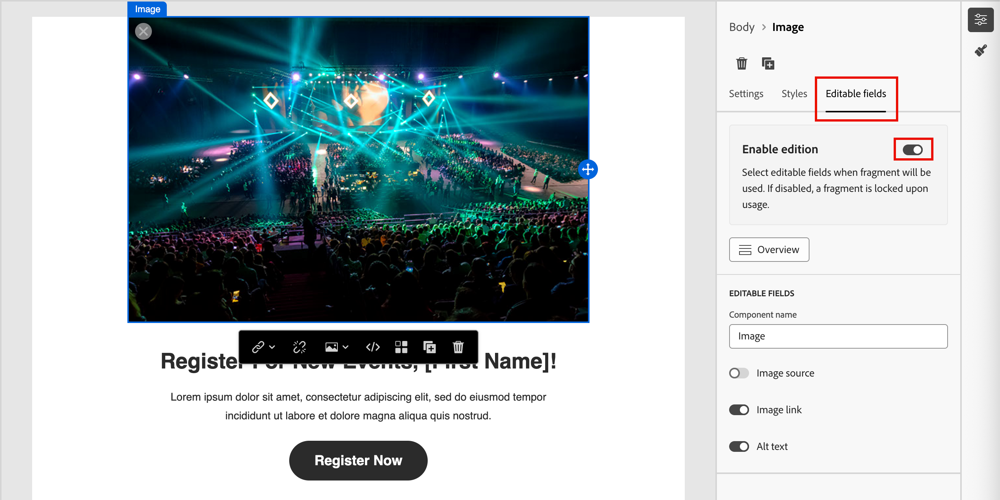

# 片段创作

在您[创建片段](./fragments.md#create-fragments)后，请使用可视化设计空间在片段中创作结构和内容组件。

## 添加结构和内容 {#design-fragment}

{{$include /help/_includes/content-design-components.md}}

## 添加资源

{{$include /help/_includes/content-design-assets.md}}

## 导航图层、设置和样式

{{$include /help/_includes/content-design-navigation.md}}

## 个性化内容

{{$include /help/_includes/content-design-personalization.md}}

## 条件内容

要根据规则将内容自适应到目标配置文件的条件内容添加，请选择一个内容组件，然后单击组件工具栏中的&#x200B;**[!UICONTROL 启用条件内容]**&#x200B;按钮。 当发布的片段包含在电子邮件中时，条件规则将确定在电子邮件中呈现的条件组件的变体。

有关详细信息，请参阅&#x200B;[_条件内容_](./conditional-content.md)。

## 启用片段自定义

当作者向[电子邮件](./email-authoring.md#content-authoring---use-visual-fragments)或[电子邮件模板](./email-template-authoring.md#content-authoring---use-visual-fragments)添加片段时，默认情况下锁定片段内容。 对已发布片段所做的任何更改都会自动传播到使用该片段的所有内容资产。 当您将片段中组件的参数指定为可编辑时，电子邮件或模板作者可以指定特定于其需求的自定义字段值。 此自定义标志仅限于图像、文本和按钮可视组件。

例如，如果您设计的可重用横幅包括可单击按钮，则可以将该按钮的URL参数指定为可编辑。 然后，电子邮件作者可以使用更特定于其电子邮件促销活动的URL。 借助这些可自定义的字段，营销人员可以管理和个性化可重用内容，而无需创建全新的内容块或中断从原始片段继承的更新。

1. 在可视内容编辑器中，选择要启用自定义的图像、文本或按钮元素。

1. 在右侧的组件详细信息中，选择&#x200B;**[!UICONTROL 可编辑字段]**&#x200B;选项卡。

1. 单击&#x200B;**[!UICONTROL 启用版本]**&#x200B;选项切换并设置可编辑的字段。

   {width="700" zoomable="yes"}

   您可以为显示的字段启用自定义设置，具体取决于组件类型和片段中定义的参数。

   对于要允许自定义的每个字段，将切换开关更改为启用状态。

1. 单击&#x200B;**[!UICONTROL 概述]**&#x200B;查看所有可编辑的字段及其默认值。

   {width="700" zoomable="yes"}

1. 保存更改。

## 编辑链接的URL跟踪

{{$include /help/_includes/content-design-links.md}}
