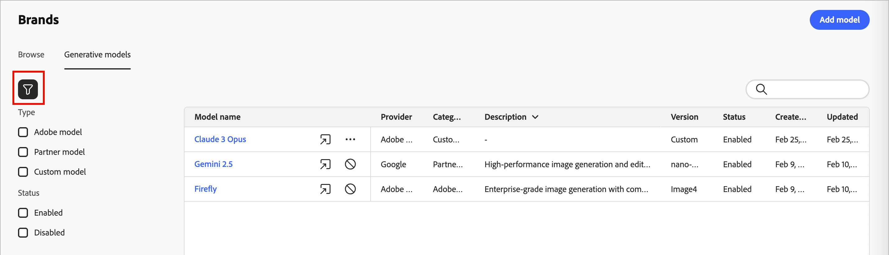

# 用于品牌协调的创作AI模型

通过内置模型、自定义Firefly模型和第三方图像生成提供商扩展您的AI图像创建功能，以满足您的特定需求并改善品牌一致性：

- **[!UICONTROL Adobe模型]**&#x200B;由Firefly Image Model 4提供支持，现成可用，无需其他设置即可立即生成图像。
- 由Gemini 2.5 Flash支持的&#x200B;**[!UICONTROL 合作伙伴模型]**&#x200B;提供了针对特定用例的专门功能。
- **[!UICONTROL 自定义模型]**&#x200B;是在您自己的资产上训练并由您的组织添加的特定于品牌的模型。

请参阅[Adobe Firefly文档](https://helpx.adobe.com/firefly/web/work-with-enterprise-features/train-custom-models/custom-models-overview.html){target="_blank"}以了解自定义模型。

在为电子邮件或登陆页面内容生成图像时，营销人员可以选择任何启用的创成模型。

## 管理创成模型

您可以从一个中心位置查看所有可用模型，进行筛选和搜索以查找特定模型，以及配置品牌的模型设置。

1. 在左侧导航中，转到&#x200B;**[!UICONTROL 内容管理]** > **[!UICONTROL 品牌]**。

1. 在页面中，选择&#x200B;**[!UICONTROL 生成模型]**&#x200B;选项卡。

{width="800" zoomable="yes"}

### 筛选和搜索列表

单击&#x200B;_筛选器_ 图标以访问筛选器菜单。 按&#x200B;**[!UICONTROL 类型]**&#x200B;或&#x200B;**[!UICONTROL 状态]**&#x200B;筛选模型。

{width="700" zoomable="yes"}

您还可以使用搜索栏按名称查找特定的生成模型。

### 模型操作

对于列表中的自定义模型，请单击&#x200B;_更多菜单_ 图标。 您可以选择&#x200B;**[!UICONTROL 启用]**&#x200B;或&#x200B;**[!UICONTROL 禁用]**&#x200B;以更改模型的可用性状态，或者选择&#x200B;**[!UICONTROL 删除]**&#x200B;以从列表中删除模型。

生成模型列表中的{width="450"}

对于内置模型，单击&#x200B;_启用_ （ ）或&#x200B;_禁用_ （ ）图标以更改用于生成图像的模型可用性。

>[!NOTE]
>
>只能删除自定义模型。

## 添加生成模型

创建自定义Firefly模型或连接第三方图像生成提供商，以扩展您的创作AI功能。

>[!NOTE]
>
>创建自定义Firefly模型需要Firefly ETLA协议。

1. 在&#x200B;_[!UICONTROL 生成模型]_&#x200B;选项卡中，单击&#x200B;**[!UICONTROL 添加模型]**。

1. 输入模型的&#x200B;**[!UICONTROL 名称]**。

<!-- 1. Select a **[!UICONTROL Model provider]**. future development -->

1. 输入&#x200B;**[!UICONTROL 模型ID]**。

   要查找模型ID，请访问Firefly网站并导航到经过训练的模型。 发布模型后，可在模型的“管理”部分中找到唯一标识符。 有关详细信息，请参阅[Firefly自定义模型文档](https://helpx.adobe.com/firefly/web/work-with-enterprise-features/train-custom-models/custom-models-overview.html){target="_blank"}。

1. 或者，输入&#x200B;**[!UICONTROL 描述]**&#x200B;以帮助识别模型及其预期用途。

   {width="550" zoomable="yes"}

1. 单击&#x200B;**[!UICONTROL 测试连接]**&#x200B;以验证模型配置。

1. 连接测试成功后，单击&#x200B;**[!UICONTROL 保存]**&#x200B;以保存模型配置。

   保存模型可将其添加到创成模型列表，您可以在其中启用模型以供营销人员使用。 您还可以随时禁用或删除它。

   {width="600" zoomable="yes"}
