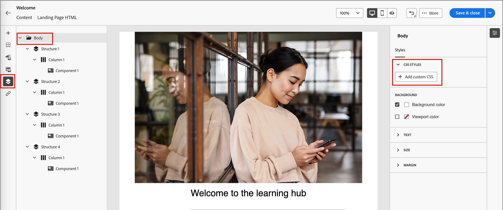

# 登陆页面设计

在您[创建登陆页面](./landing-pages.md#create-a-landing-page)之后，请使用可视化设计空间在页面中创作结构和内容组件。

## 添加结构和内容 {#structure-content-landing-page}

{{$include /help/_includes/content-design-components.md}}

### 添加自定义 CSS

您可以直接在登陆页面设计空间中添加自己的自定义CSS。 使用自定义CSS可应用高级和特定的样式，以便更加灵活地控制内容的外观。 最佳实践是在包含组件（如图像、按钮和文本）之前添加此最高级别的样式。

如果画布中至少有一个内容组件，请选择左侧导航树中的&#x200B;**[!UICONTROL Body]**&#x200B;组件以访问自定义CSS编辑器。

{width="800" zoomable="yes"}

{{$include /help/_includes/content-design-custom-css.md}}

### 添加资源

{{$include /help/_includes/content-design-assets.md}}

### 添加表单

{{$include /help/_includes/content-design-add-forms.md}}

### 导航图层、设置和样式

{{$include /help/_includes/content-design-navigation.md}}

### 个性化内容

{{$include /help/_includes/content-design-personalization.md}}

### 编辑链接的URL跟踪

{{$include /help/_includes/content-design-links.md}}

### 保存您所做的工作

随时单击&#x200B;**[!UICONTROL 保存]**&#x200B;以保存草稿登陆页面。

您可以继续对草稿页面进行编辑。 当您准备好显示页面并在电子邮件或短信消息中提供链接时，可以发布页面。

### 查看选项

利用可视设计空间中可用的视图和内容验证选项。

* 通过预设缩放选项放大/缩小内容。

* 切换在桌面、移动设备或纯文本/纯文本中查看内容。
   * 单击&#x200B;_查看_&#x200B;图标可跨设备预览内容。
   * 选择一个现成的设备或输入自定义维度以预览内容。

### 更多选项

从可视化设计空间顶部的&#x200B;_[!UICONTROL 更多……]_&#x200B;菜单中，可以执行以下操作：

{width="500"}

* **[!UICONTROL 重置登陆页面]** — 单击此选项可将可视化设计画布清除为空白并重新启动页面内容生成操作。
* **[!UICONTROL 更改您的设计]** — 返回到&#x200B;_[!UICONTROL 创建您的主登陆页面]_&#x200B;主页。 从该位置，您可以选择另一个模板来重新启动设计过程，或者选择在空白画布中从头开始设计页面。
<!--- * **[!UICONTROL Save as content template]** - Save the page body as a landing page template to be reused across multiple landing pages. You provide a name and description for the template and save it to the list of saved  landing page templates. -->
* **[!UICONTROL 导出HTML]** — 将可视画布中的内容以HTML格式下载到您的本地系统，并打包为zip文件。
