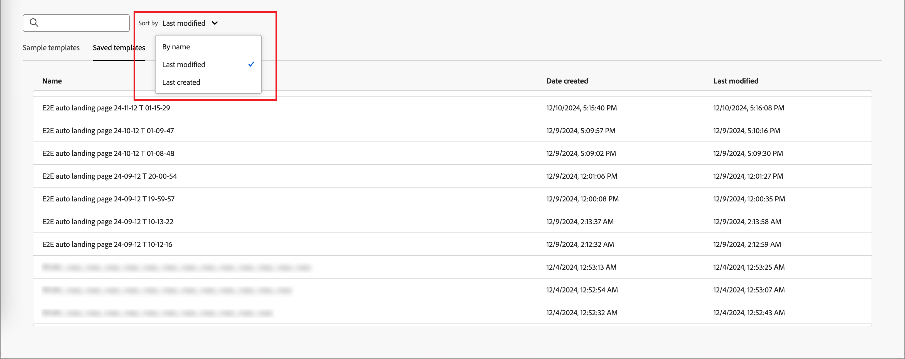

# 创建和发布登陆页面

作为营销人员，您可以定义并发布要合并到帐户和人员历程中的页面。 添加新登陆页面时，您可以配置主页面和任何子页面、设计内容、测试它并发布它。

>[!BEGINSHADEBOX]

## 登陆页面先决条件 {#landing-page-prerequisites}

在营销人员创建登陆页面以支持其历程和营销活动之前，必须完成以下配置和资产：

* [登陆页面子域](../admin/configure-channels-landing-pages.md#lp-subdomains) — 设置专用于托管登陆页面的子域。
* [登陆页面预设](../admin/configure-channels-landing-pages.md#lp-presets) — 预设定义了应用于登陆页面的子域和其他设置。
* [表单](./forms.md)（用于数据捕获用例） — 当您要在登陆页面上嵌入表单并将数据提交到Experience Platform时，此为必需字段。
  <!-- * Subscription list (for subscription use cases) - Required if you want customers to subscribe to or unsubscribe from a specific service. This is in AJO B2C-->

>[!ENDSHADEBOX]

## 创建登陆页面 {#create-landing-page}

>[!CONTEXTUALHELP]
>id="ajo-b2b_lp_create"
>title="定义和配置您的登陆页面"
>abstract="要创建登陆页面，您需要选择一个预设，然后配置主要页面和子页面，最后在发布之前测试您的页面。"

1. 转到左侧导航并选择&#x200B;**[!UICONTROL 内容管理]** > **[!UICONTROL 登陆页面]**。

1. 单击右上方的&#x200B;**[!UICONTROL 创建登陆页面]**。

1. 在页面上，输入有用的&#x200B;**[!UICONTROL Title]** （必需）和&#x200B;**[!UICONTROL Description]** （可选）。

   标题和描述条件：

   * 标题 — 最多100个字符，必须唯一，不区分大小写

   * 描述 — 最多300个字符

   * 允许使用Alpha、数字和特殊字符

   * 保留字符为&#x200B;**_不允许_**： `\ / : * ? " < > |`

   {width="600"}

1. 选择&#x200B;**[!UICONTROL 预设]**。

   产品管理员[配置预设](../admin/configure-channels-landing-pages.md#lp-presets)以定义用于登陆页面的子域和其他设置。 您可以选择一个预设，然后单击&#x200B;**[!UICONTROL 查看预设]**&#x200B;以打开预设详细信息，并检查设置以确保它符合您的登陆页面要求。

1. 单击&#x200B;**[!UICONTROL 创建]**。

   将显示主页面及其属性。

   {width="700" zoomable="yes"}

## 配置主要页面 {#configure-primary-page}

>[!CONTEXTUALHELP]
>id="ajo-b2b_lp_primary_page"
>title="定义主要页面设置"
>abstract="定义主页面，当收件人单击登陆页面链接（如来自电子邮件或网站的链接）时，将立即显示该主页面。"

>[!CONTEXTUALHELP]
>id="ajo-b2b_lp_access_settings"
>title="定义登陆页面 URL"
>abstract="在此部分中，定义一个唯一的登陆页面 URL。 URL的第一部分要求您之前将登陆页面子域设置为您选择的预设的一部分。"

1. 根据需要更改&#x200B;**[!UICONTROL 页面名称]**，默认情况下为&#x200B;_主页面_。

1. 定义页面URL的结束部分。

   您选择的预设决定URL的第一部分。

   >[!CAUTION]
   >
   >登陆页面URL必须是唯一的。
   >
   >您仅需将此URL复制粘贴到Web浏览器中（即使已发布），就无法访问登陆页面。 使用预览功能对其进行测试。

1. 如果您想要匿名登陆页面，请禁用&#x200B;**[!UICONTROL 需要已识别的用户]**&#x200B;选项。

   <!-- The option 'Require identified users' would be visible in both AJO & AJOB2B when the Landing page is of type 'Data capture' -->

1. 单击&#x200B;_日历_ （）图标以设置&#x200B;**[!UICONTROL 页面到期]**。

   选择到期日期后，请选择页面到期时的操作：

   * **[!UICONTROL 重定向URL]** — 输入要用作重定向的页面的URL。

     {width="400"}

     <!-- * **[!UICONTROL Custom page]** - Configure a subpage and select it from the list. -->
   * **[!UICONTROL 浏览器错误]** — 输入要代替页面显示的错误文本。

     {width="400"}

## 选择内容设计类型 {#choose-design-type}

要为页面添加&#x200B;_[!UICONTROL 内容]_，请单击&#x200B;**[!UICONTROL 打开Designer]**。 _[!UICONTROL 创建主登陆页面]_&#x200B;主页加载，设计过程从选择开始设计的方式开始：

* [[!UICONTROL 从头开始设计]](#design-from-scratch)
* [[!UICONTROL 为您自己的编码]](#code-your-own)
* [[!UICONTROL 导入HTML]](#import-html)
* [使用登陆页面模板](#select-template)

{width="800" zoomable="yes"}

选择首选的登陆页面设计启动方法后，请使用可视化设计工具[完成页面内容](./landing-page-design.md)。

### 从头开始设计 {#design-from-scratch}

使用可视内容编辑器定义登陆页面内容的结构。 通过执行简单的拖放操作来添加和移动结构组件，您可以在几秒钟内设计页面内容的形状。

1. 从&#x200B;_[!UICONTROL 创建主登陆页面]_&#x200B;主页中，选择&#x200B;**[!UICONTROL 从头开始设计]**&#x200B;选项。

1. 选择您希望如何管理页面内容的样式：

   * **[!UICONTROL 使用主题]** — 选择此选项可在&#x200B;_主题模式_&#x200B;中创建页面内容。 在此模式下，您可以使用定义的[品牌主题](./brand-themes.md)来简化内容创作过程，并确保设计符合定义的标准。

   * **[!UICONTROL 手动样式]** — 选择此选项可在&#x200B;_手动模式_&#x200B;中创建页面内容。 在此模式下，您可以手动为添加到空白画布的所有结构和内容组件设置样式。

1. 单击&#x200B;**[!UICONTROL 确认]**。

1. [将结构和内容](./landing-page-design.md#structure-content-landing-page)添加到页面。

### 自己编写代码 {#code-your-own}

_自己编写代码_&#x200B;允许您编写或粘贴原始HTML，以直接在设计空间中构建页面内容。 当您需要完全控制标记时，请使用此模式。 使用此模式需要您具备HTML技能。

选择此模式后，将停留在代码编辑器中；无法切换到可视编辑器。

1. 从&#x200B;_[!UICONTROL 创建主登陆页面]_&#x200B;主页中，选择&#x200B;**[!UICONTROL 自己编写代码]**&#x200B;选项。

1. 输入或粘贴您的原始 HTML 代码。

如果要清除页面内容并从新设计开始，请从“选项”菜单中选择“更改设计”****。

### 导入HTML {#import-html}

Adobe Journey Optimizer B2B edition允许您导入现有HTML内容以设计登陆页面。

{{$include /help/_includes/content-design-import.md}}

{width="500"}

>[!NOTE]
>
>在HTML文件中使用`<table>`标记作为第一层可能会导致样式丢失，包括顶层标记中的背景和宽度设置。

您可以根据需要通过可视设计空间个性化导入的内容。

### 选择模板 {#select-template}

[!BADGE Beta 版]{type=Informative tooltip="Beta功能"}

如果您要使用登陆页面模板，则可以从：

* **示例模板**。 Journey Optimizer B2B edition界面提供了一系列现成的登陆页面模板，您可以将这些模板用作登陆页面设计的起点。

* **已保存模板**。 使用&#x200B;_[!UICONTROL 模板]_&#x200B;菜单<!-- or the _[!UICONTROL Save as content template]_ option when designing a landing page. -->中组织成员创建的已保存自定义模板

使用&#x200B;_[!UICONTROL 选择设计模板]_&#x200B;部分开始从模板构建内容。 您可以使用示例模板或从Journey Optimizer B2B edition实例保存的自定义登陆页面模板。

>[!BEGINTABS]

>[!TAB 已保存模板]

默认情况下，_创建主登陆页面_&#x200B;主页显示&#x200B;_示例模板_&#x200B;选项卡。 要使用自定义模板，请选择&#x200B;**[!UICONTROL 保存的模板]**&#x200B;选项卡。

此时将显示所有已保存的登陆页面模板的列表。 您可以按&#x200B;_[!UICONTROL 名称]_、_[!UICONTROL 上次修改时间]_&#x200B;和&#x200B;_[!UICONTROL 上次创建时间]_&#x200B;对它们进行排序。

{width="700" zoomable="yes"}

选择模板缩略图以显示预览。 在预览模式下，您可以使用左右箭头在某个类别（示例或已保存，具体取决于您的选择）的所有模板之间导航。

{width="800" zoomable="yes"}

当显示与您想要使用的内容匹配时，单击预览窗口右上角的&#x200B;**[!UICONTROL 使用此模板]**。

此操作可将内容复制到可视化设计空间中，您可以根据需要在该空间编辑内容。

<!-- 
>[!NOTE]
>
>Saved templates may have governance (content locking) settings applied to one or more components. The design tools provide guidelines about locked components when you [author content from a governed template](./email-authoring-governance.md). 
-->

>[!TAB 示例模板]

Adobe Journey Optimizer B2B edition提供了一系列&#x200B;_现成的_&#x200B;登陆页面模板，这些模板可用于创建您自己的登陆页面和登陆页面模板。

<!-- {width="800" zoomable="yes"} -->

>[!ENDTABS]

## 检查警报 {#check-alerts}

设计登陆页面内容时，如果缺少关键设置，将在右上角显示警报。

{width="250"}

如果未看到此按钮，则表示没有检测到问题。

警报有两种类型：

* 引用推荐和最佳实践的&#x200B;**_警告_**，例如：

   * `Placeholder links are present in the landing page body`：不要忘记使用有效链接替换占位符。

   * `Text version of HTML is empty`：别忘了定义页面正文的文本版本，此文本版本在HTML内容无法显示时使用。

   * `Empty link is present in page body`：检查页面中的所有链接是否正确。

* **_错误_**，阻止您测试或激活历程/营销活动，只要未解决这些错误，例如：

   * `The landing page content is empty`：页面内容是必需的。

## 测试登陆页面 {#test-landing-page}

>[!CONTEXTUALHELP]
>id="ajo-b2b_preview_lp_profiles"
>title="预览和测试登陆页面"
>abstract="定义登陆页面设置和内容后，请使用测试配置文件预览页面。"

定义登陆页面设置和内容后，您可以使用测试用户档案预览页面。 如果插入[个性化内容](./personalization.md)，则可以使用测试配置文件数据检查此内容在登陆页面中的显示方式。

>[!PREREQUISITES]
>
>要预览和测试登陆页面，您必须具有&#x200B;**[!UICONTROL 发布消息]**&#x200B;权限以及包含[测试用户档案](../audiences/test-profiles.md)的已定义数据集。

1. 单击&#x200B;**[!UICONTROL 预览和测试]**&#x200B;以打开测试配置文件选择。

   >[!NOTE]
   >
   >当您在可视设计空间时，还可以使用&#x200B;**[!UICONTROL 模拟内容]**。

1. 从&#x200B;_[!UICONTROL 模拟]_&#x200B;屏幕中，选择测试配置文件。

   {width="700" zoomable="yes"}

   如果未列出您需要的配置文件，请单击&#x200B;**[!UICONTROL 管理测试配置文件]**&#x200B;以使用已知的[测试配置文件](../audiences/test-profiles.md)电子邮件地址并将其添加到列表。

   +++添加测试轮廓

   对于&#x200B;**[!UICONTROL 身份命名空间]**，请单击&#x200B;_选择_ （ ）图标，然后选择要用于测试配置文件的`Email`命名空间。

   {width="700" zoomable="yes"}

   在&#x200B;**[!UICONTROL 标识值]**&#x200B;字段中，输入用于标识测试配置文件的电子邮件地址，然后单击&#x200B;**[!UICONTROL 添加配置文件]**。 您可以重复此操作，以添加多个配置文件。

   {width="700" zoomable="yes"}

   单击左上方的后退箭头可返回&#x200B;_[!UICONTROL 模拟]_&#x200B;页面。

   +++

1. 选择&#x200B;**[!UICONTROL 打开预览]**&#x200B;以测试您的登陆页面。

   登陆页面预览将在新选项卡中打开。 选定的测试配置文件数据替换个性化元素。

   {width="600"}

1. 选择其他测试用户档案以预览登陆页面每个变体的渲染。

## 发布页面 {#publish-landing-page}

>[!PREREQUISITES]
>
>要发布登陆页面，您必须具有&#x200B;**[!UICONTROL 发布消息]**&#x200B;权限。  发布之前，[检查并解决所有警报](#check-alerts)。

当草稿页面符合您的条件并且您希望从历程消息中链接该页面时，单击右上角的&#x200B;**[!UICONTROL 发布]**。 在确认对话框中，单击&#x200B;**[!UICONTROL 发布]**。

{width="250"}

发布登陆页面后，该页面会以&#x200B;**_[!UICONTROL 已发布]_**&#x200B;状态显示在登陆页面列表中。 这意味着它已经上线并准备好用于通过历程发送的电子邮件、短信或WhatsApp消息中。

您不能通过将URL复制粘贴到Web浏览器中来访问已发布的登陆页面。 您可以随时使用[预览函数](#test-landing-page)对其进行测试。

您可以通过特定报告监控登陆页面影响。
