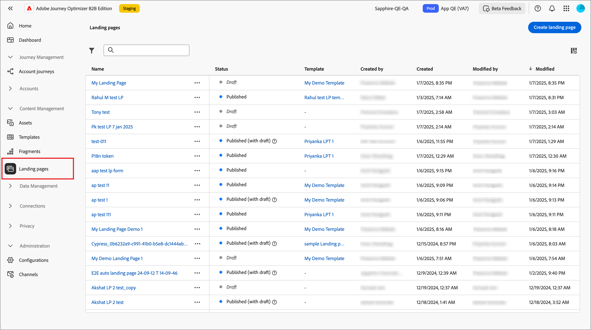
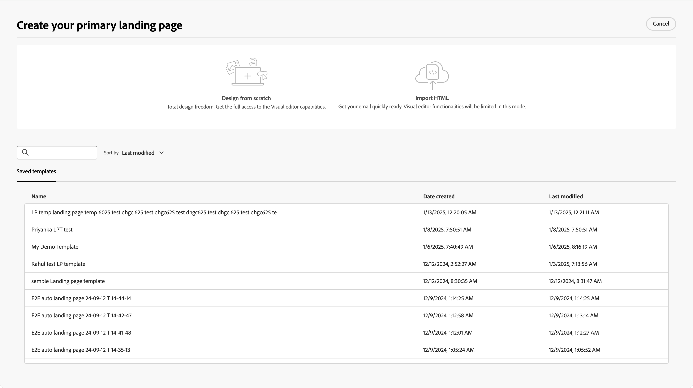

# 登陆页面

登陆页面是一个独立的网页，您可以在联系人和客户单击电子邮件、短信消息或任何数字位置中的链接项目后指引他们。 您可以将这些页面合并到您的帐户历程中，以使您的潜在客户和客户在Web上查看您的消息，并在您的帐户历程中前进。 您可以在登陆页面Designer中创建、个性化和预览登陆页面。

要在客户单击特定链接时将其指引到定义的网页，请在Journey Optimizer B2B edition中创建登陆页面。

* 创建页面
* 设计登陆页面和创作内容
* 测试页面
* Publish页面
* 从您的历程内容链接到页面

例如，您可以创建和设计登陆页面，以将用户定向到在线信息。 该页面可能包括一个表单，用户可以在其中选择加入或选择退出接收您的通信。 也可以是订阅定期通信（如新闻稿）的机会。

您可以在可视设计器中创建、个性化和预览登陆页面。
<!-- 
For the Beta phase, you can only design landing pages from scratch and publish your landing pages. The landing pages will be served on adobe hosted domain for the Beta phase. The capability to define your branded domains for hosting will be delivered in a future release. -->

## 访问和管理登陆页面

要在Adobe Journey Optimizer B2B edition中访问登陆页面，请转到左侧导航并单击&#x200B;**[!UICONTROL 内容管理]** > **[!UICONTROL 登陆页面]**。 此操作会打开一个列表页面，其中包含在该实例中创建的所有登陆页面，这些页面在表中列出。

{width="800" zoomable="yes"}

该表按&#x200B;_[!UICONTROL 已修改]_&#x200B;列排序，最近更新的项默认位于顶部。 单击列标题可在升序和降序之间更改。

### 筛选登陆页面列表

要按名称搜索登陆页面，请在搜索栏中输入匹配项的文本字符串。 单击&#x200B;_筛选器_&#x200B;图标（）以显示可用的筛选器选项并更改设置以根据指定的条件筛选显示的项。

{width="700" zoomable="yes"}

### 自定义列显示

通过单击右上角的&#x200B;_自定义表_&#x200B;图标（）自定义要在表中显示的列。

在对话框中，选择要显示的列，然后单击&#x200B;**[!UICONTROL 应用]**。

{width="300"}

### 登陆页面状态和生命周期

登陆页面状态决定了在电子邮件和短信内容中进行链接的可用性，以及您可以对登陆页面进行的更改。

| 状态 | 描述 |
| -------------------- | ----------- |
| 草稿 | 创建登陆页面时，该页面处于草稿状态。 在您定义或编辑可视内容时，它保持此状态，直到您将其发布为托管页面。 可用操作：  <ul><li>编辑名称或描述<li>编辑链接URL<li>在可视设计器中编辑<li>发布<li>复制<li>Delete |
| 发布日期 | 发布登陆页面时，该页面托管在Journey Optimizer B2B edition实例上，可供在电子邮件或短信消息内容中进行链接。 可用操作：  <ul><li>编辑名称或描述<li>编辑链接URL<li>在电子邮件或短信消息内容中添加链接<li>创建草稿版本<li>复制<li>Delete |
| 以草稿发布 | 从已发布的登陆页面创建草稿时，已发布的版本会保留，并且草稿内容可以在可视设计器中进行修改。 如果您发布草稿版本，则该草稿版本会替换当前已发布的版本，并且托管页面中的内容会更新。 可用操作：  <ul><li>编辑名称或描述<li>编辑链接URL<li>在电子邮件或短信消息内容中添加链接<li>在可视设计器中编辑草稿版本<li>Publish草稿版本<li>复制<li>删除（删除两个版本）<li>放弃草稿（返回已发布） |

{zoomable="yes"}

## 创建登陆页面

您可以通过单击右上角的&#x200B;**[!UICONTROL 创建登陆页面]**，在Journey Optimizer B2B edition中添加新的登陆页面。

1. 在&#x200B;_[!UICONTROL 创建登陆页面]_&#x200B;对话框中，输入有用的&#x200B;**[!UICONTROL Name]**&#x200B;和&#x200B;**[!UICONTROL Description]**（可选）。

   登陆页面要求：

   * 名称 — 最多100个字符，必须唯一，不区分大小写

   * 描述 — 最多300个字符

   * 允许使用Alpha、数字和特殊字符

   * 保留字符为&#x200B;**_不允许_**： `\ / : * ? " < > |`

   {width="400"}

1. 如果需要，并且配置了多个子域，请将&#x200B;**[!UICONTROL 子域]**&#x200B;更改为用于登陆页面。

1. 单击&#x200B;**[!UICONTROL 创建]**。

   _[!UICONTROL 创建主登陆页面]_&#x200B;主页将打开，并提供了多个用于创建页面的选项：_[!UICONTROL 从头开始设计]_、_[!UICONTROL 导入HTML]_&#x200B;或使用保存的模板。

   {width="800" zoomable="yes"}

   选择要用于开始登陆页面设计的方法后，使用可视化设计器[设计页面](./landing-page-design.md)。

### 从头开始设计

使用可视内容编辑器定义登陆页面内容的结构。 通过执行简单的拖放操作来添加和移动结构组件，您可以在几秒钟内设计页面内容的形状。

1. 从&#x200B;_[!UICONTROL 创建主登陆页面]_&#x200B;主页中，选择&#x200B;**[!UICONTROL 从头开始设计]**&#x200B;选项。

1. [将结构和内容](./landing-page-design.md#add-structure-and-content)添加到页面。

### 导入HTML

Adobe Journey Optimizer B2B edition允许您导入现有HTML内容以设计登陆页面。

{{$include /help/_includes/content-design-import.md}}

{width="500"}

>[!NOTE]
>
>在HTML文件中使用`<table>`标记作为第一层可能会导致样式丢失，包括顶层标记中的背景和宽度设置。

您可以根据需要使用可视设计器个性化导入的内容。

### 选择已保存的模板

您可以从以下内容中进行选择：

* **示例模板**。 Journey Optimizer界面提供一系列现成的登陆页面模板，您可以从中进行选择。

* **已保存模板**。 使用&#x200B;_[!UICONTROL 模板]_&#x200B;菜单<!-- or the _[!UICONTROL Save as content template]_ option when designing a landing page. -->中组织成员创建的已保存自定义模板

使用&#x200B;_[!UICONTROL 选择设计模板]_&#x200B;部分开始从模板构建内容。 您可以使用示例模板或从Journey Optimizer B2B edition实例保存的自定义登陆页面模板。

>[!BEGINTABS]

>[!TAB 已保存模板]

在&#x200B;_创建主登陆页面_&#x200B;主页上，默认选中&#x200B;_示例模板_&#x200B;选项卡。 要使用自定义模板，请选择&#x200B;**[!UICONTROL 保存的模板]**&#x200B;选项卡。

此时将显示所有已保存的登陆页面模板的列表。 您可以按&#x200B;_[!UICONTROL 名称]_、_[!UICONTROL 上次修改时间]_&#x200B;和&#x200B;_[!UICONTROL 上次创建时间]_&#x200B;对它们进行排序。

{width="700" zoomable="yes"}

从列表中选择所需的模板。

选择后，这将显示模板的预览。 在预览模式下，您可以使用左右箭头在某个类别（示例或已保存，具体取决于您的选择）的所有模板之间导航。

{width="800" zoomable="yes"}

当显示与您想要使用的内容匹配时，单击预览窗口右上角的&#x200B;**[!UICONTROL 使用此模板]**。

此操作会将内容复制到可视内容设计器中，您可以在其中根据需要编辑内容。

>[!TAB 示例模板]

Adobe Journey Optimizer B2B edition提供了一系列&#x200B;_现成的_&#x200B;登陆页面模板，这些模板可用于创建您自己的登陆页面和登陆页面模板。

<!-- {width="800" zoomable="yes"} -->

>[!ENDTABS]

<!-- 
>[!NOTE]
>
> Saved templates may have governance (content locking) settings applied to one or more components. The visual designer provides guidelines about locked components when you [author an email from a governed template](./email-authoring-governance.md). -->

## 编辑登陆页面

对登陆页面的编辑取决于其当前状态：

* 当登陆页面处于&#x200B;**_草稿_**&#x200B;状态时，您可以编辑其任何详细信息、URL和可视内容。
* 当登陆页面处于&#x200B;**_已发布_**&#x200B;状态时，您可以编辑描述，但不能编辑名称。 要更改可视内容，您必须创建页面的草稿版本。
* 当登陆页面处于&#x200B;**_已发布，状态为_**&#x200B;草稿时，编辑详细信息仅限于描述。 您还可以编辑草稿版本的可视内容。

>[!BEGINTABS]

>[!TAB 草稿]

1. 从&#x200B;_[!UICONTROL 登陆页面]_&#x200B;列表页面中，单击登陆页面名称以将其打开。

   此时将显示可视化内容的预览，其中登陆页面的详细信息位于右侧。

1. 修改任何详细信息，如名称和描述。

   {width="700" zoomable="yes"}

1. 要对可视设计器中的内容进行更改，请单击&#x200B;**[!UICONTROL 编辑登陆页]**。

   根据需要使用可视设计器工具：

   * [添加结构和内容](./landing-page-design.md#add-structure-and-content)
   * [添加Assets](./landing-page-design.md#add-assets)
   * [导航图层、设置和样式](./landing-page-design.md#navigate-the-layers-settings-and-styles)
   * [使内容个性化](./landing-page-design.md#personalize-content)
   * [编辑链接的URL跟踪](./landing-page-design.md#edit-linked-url-tracking)

1. 单击&#x200B;**[!UICONTROL 保存]**，或单击&#x200B;**[!UICONTROL 保存并关闭]**&#x200B;以返回登陆页面的详细信息。

1. 如果页面符合您的条件并且您希望可供显示，请单击&#x200B;**[!UICONTROL Publish]**。

>[!TAB 已发布]

1. 从&#x200B;_[!UICONTROL 登陆页面]_&#x200B;列表页面，单击页面名称以将其打开。

   此时将显示可视化内容的预览，其中登陆页面的详细信息位于右侧。

1. 如果需要，请修改说明。

   对于已发布的登陆页面，无法更改所有其他详细信息。

1. 如果要更新内容，请单击右侧的&#x200B;**[!UICONTROL 编辑登陆页面]**。

   在对话框中单击&#x200B;**[!UICONTROL 创建草稿版本]**&#x200B;以在可视设计器中打开草稿版本。

   {width="300"}

   根据需要使用可视设计器工具：

   * [添加结构和内容](./landing-page-design.md#add-structure-and-content)
   * [添加Assets](./landing-page-design.md#add-assets)
   * [导航图层、设置和样式](./landing-page-design.md#navigate-the-layers-settings-and-styles)
   * [使内容个性化](./landing-page-design.md#personalize-content)
   * [编辑链接的URL跟踪](./landing-page-design.md#edit-linked-url-tracking)

1. 单击&#x200B;**[!UICONTROL 保存]**，或单击&#x200B;**[!UICONTROL 保存并关闭]**&#x200B;以返回登陆页面的详细信息。

1. 当草稿登陆页面符合您的条件并且您希望在已发布的页面上提供更改时，请单击&#x200B;**[!UICONTROL Publish]**。

   发布草稿版本时，草稿版本会替换当前已发布的版本，并且页面URL的内容会更新。

>[!TAB 已发布草稿]

打开登陆页面时，默认情况下将显示草稿版本。 预览空间顶部的选项卡允许您在已发布版本和草稿版本之间切换显示。 草稿操作和详细信息将显示在右侧。

{width="700" zoomable="yes"}的预览和详细信息

要更新内容，请执行以下操作：

1. 单击右上方的&#x200B;**[!UICONTROL 编辑登陆页面]**。 根据需要使用可视设计器工具：

   * [添加结构和内容](./landing-page-design.md#add-structure-and-content)
   * [添加Assets](./landing-page-design.md#add-assets)
   * [导航图层、设置和样式](./landing-page-design.md#navigate-the-layers-settings-and-styles)
   * [使内容个性化](./landing-page-design.md#personalize-content)
   * [编辑链接的URL跟踪](./landing-page-design.md#edit-linked-url-tracking)

1. 单击&#x200B;**[!UICONTROL 保存]**，或单击&#x200B;**[!UICONTROL 保存并关闭]**&#x200B;以返回登陆页面的详细信息。

1. 当草稿页面符合您的条件并且您想要提供更改时，请单击&#x200B;**[!UICONTROL Publish]**。

   发布草稿版本时，草稿版本会替换当前已发布的版本，并且托管页面中的内容会更新。

>[!ENDTABS]

### 检查警报

设计登陆页面内容时，如果关键设置缺失，会在界面（右上方）中显示警报。

{width="250"}

如果未看到此按钮，则表示没有检测到问题。

可以检测到两种类型的警报：

* 引用推荐和最佳实践的&#x200B;**_警告_**，例如：

   * `Placeholder links are present in the landing page body`：不要忘记使用有效链接替换占位符。

   * `Text version of HTML is empty`：别忘了定义页面正文的文本版本，此文本版本在HTML内容无法显示时使用。

   * `Empty link is present in page body`：检查页面中的所有链接是否正确。

* **_错误_**，阻止您测试或激活历程/营销活动，只要未解决这些错误，例如：

   * `The landing page content is empty`：页面内容是必需的。

## 复制登陆页面

您可以使用以下任一方法复制登陆页面：

* 从&#x200B;_[!UICONTROL 登陆页面]_&#x200B;列表页面，单击登陆页面名称旁边的&#x200B;_更多_&#x200B;图标(**...**)，然后选择&#x200B;**[!UICONTROL 复制]**。
* 在登陆页面详细信息页面的右上角，单击&#x200B;**[!UICONTROL ...更多]**&#x200B;并选择&#x200B;**[!UICONTROL 复制]**。

{width="600" zoomable="yes"}

在对话框中，输入有用的名称（唯一）和描述（可选）。 单击&#x200B;**[!UICONTROL 复制]**&#x200B;以完成操作。

{width="350"}

然后，重复的（新）页面出现在&#x200B;_登陆页面_&#x200B;列表中。

## 删除登陆页面

您可以使用以下任一方法删除登陆页面：

* 从&#x200B;_[!UICONTROL 登陆页面]_&#x200B;列表页面，单击登陆页面名称旁边的&#x200B;_更多_&#x200B;图标(**...**)，然后选择&#x200B;**[!UICONTROL 删除]**。
* 在登陆页面详细信息页面的右上角，单击&#x200B;**[!UICONTROL ...更多]**&#x200B;并选择&#x200B;**[!UICONTROL 删除]**。

此操作将打开确认对话框。 您可以通过单击&#x200B;**[!UICONTROL 取消]**&#x200B;或单击&#x200B;**[!UICONTROL 删除]**&#x200B;确认删除来中止该进程。

{width="400"}
