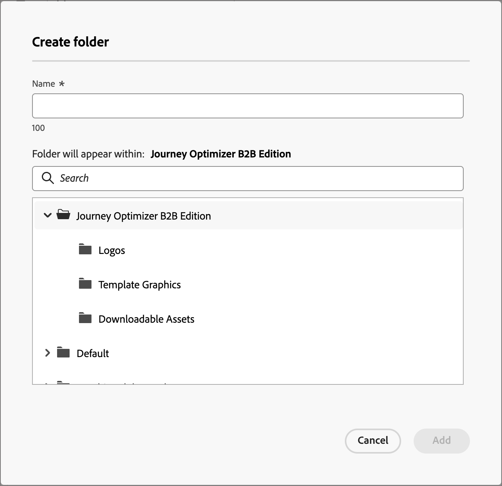

# 使用Marketo Engage资源

Marketo EngageDesign Studio是Journey Optimizer B2B版本的默认资源源，您可以轻松管理和使用内容中用于帐户历程的可用资源。

## 浏览和访问资源

要从Journey Optimizer B2B版本中访问Adobe Marketo Engage Design Studio资源，请转到左侧导航并单击&#x200B;**[!UICONTROL 内容管理]** > **[!UICONTROL Assets]**。 此操作会打开一个列表页面，其中列出了所有资产。

{width="600" zoomable="yes"}

* 要按文件夹查看资源，请单击左上角的&#x200B;_显示文件夹_&#x200B;图标以打开文件夹结构。

* 要按任意列对表进行排序，请单击列标题。

* 要在所选文件夹中搜索图像资源，请在搜索栏中输入文本字符串。

* 要自定义表中显示的列，请单击右上角的&#x200B;_自定义表_&#x200B;图标。

  选择要显示在列表中的列，然后单击&#x200B;**[!UICONTROL 应用]**。

## 查看资源详细信息

单击任何资源的名称以打开资源详细信息页面。

## 查看由引用使用的资源

在资源详细信息页面中，单击&#x200B;**[!UICONTROL 使用者]**&#x200B;选项卡，以查看有关当前在Journey Optimizer B2B版本中使用资源的位置、电子邮件、电子邮件模板和片段的详细信息。

>[!IMPORTANT]
>
>无法删除任何电子邮件、电子邮件模板或片段&#x200B;**中当前&#x200B;_正在使用_的任何资产**。

引用按类别显示： _电子邮件_、_电子邮件模板_&#x200B;或&#x200B;_片段_。 Journey Optimizer B2B Edition中的电子邮件在历程中嵌入和创作，因此使用资源的电子邮件的父历程显示在引用中。

单击链接会将您定向到使用资产的相应电子邮件、电子邮件模板或片段。

## 添加资源

从Assets列表页面，您可以将图像资源添加到Adobe Marketo Engage Design Studio。

1. 单击右上方的&#x200B;**[!UICONTROL 添加Assets]**。

1. 在&#x200B;_[!UICONTROL 添加资源]_&#x200B;对话框中，将一个或多个文件从您的系统拖放到文件框中。

   {width="500" zoomable="yes"}

   您还可以单击&#x200B;_[!UICONTROL 从计算机中选择文件]_&#x200B;链接以使用本地文件系统查找和选择文件。

   您一次最多可以从包含10个文件的本地系统上传资产。 最大文件大小为100 MB。

   对话框中显示所选图像的文件名。 资源文件名必须是唯一的（跨文件夹），如果具有该名称的文件已存在，则会显示一条消息。 名称最多可包含100个字符，并且不能包含特殊字符（如`;`、`:`、`\`和`|`）。

1. 使用文件夹选择器选择要存储资产的目标文件夹。

1. 要在上载一个或多个具有现有文件名的文件时覆盖（替换）文件，请选中&#x200B;**[!UICONTROL 覆盖现有文件]**&#x200B;复选框。

1. 单击&#x200B;**[!UICONTROL 添加]**。

## 删除资源

无法删除任何电子邮件、电子邮件模板或片段中当前使用的任何资产。 在启动资产移除之前，请检查用例引用。 此外，删除操作无法撤消，因此在启动删除操作之前请检查。

您可以使用以下任一方法删除资源：

* 转到资源详细信息，单击&#x200B;**[!UICONTROL ...右上角的“更多]**”，然后从选项中选择“**[!UICONTROL 删除]**”。

  {width="500" zoomable="yes"}

* 在&#x200B;_[!UICONTROL Assets]_&#x200B;列表页面上，单击资产项旁边的&#x200B;_省略号_ (**[!UICONTROL ...]**)，然后从选项中选择&#x200B;**[!UICONTROL 删除]**。

  {width="500" zoomable="yes"}

此操作将打开确认对话框。 您可以通过单击&#x200B;**[!UICONTROL 取消]**&#x200B;或单击&#x200B;**[!UICONTROL 删除]**&#x200B;确认删除来中止该进程。

如果资源当前正在使用中，则该操作会打开一个信息对话框，警告您无法删除该资源。 单击&#x200B;**[!UICONTROL 确定]**，这将中止删除。

## 替换资产

您可以使用以下任一方法替换资产：

* 转到资源详细信息，单击&#x200B;**[!UICONTROL ...右上角的More]**，然后从选项中选择&#x200B;**[!UICONTROL 替换]**。

* 在&#x200B;_[!UICONTROL Assets]_&#x200B;列表页面上，单击资产项旁边的&#x200B;_省略号_ (**[!UICONTROL ...]**)，然后从选项中选择&#x200B;**[!UICONTROL 替换]**。

在&#x200B;_[!UICONTROL 替换资产]_&#x200B;对话框中，将替换文件从您的系统拖放到文件框中。 您还可以单击&#x200B;_[!UICONTROL 从计算机中选择文件]_&#x200B;链接以使用本地文件系统选择文件。 （如果在本地系统中选择多个文件，则使用所选的第一个文件来替换。）

{width="520" zoomable="yes"}

若要继续，请单击&#x200B;**[!UICONTROL 替换]**。 单击&#x200B;**[!UICONTROL 取消]**&#x200B;可中止该进程。

如果要替换的文件当前正在使用中，则会显示一个信息对话框，警告您新的图像文件会在所有使用位置（电子邮件、电子邮件模板和片段）替换图像。

## 下载资产

您可以使用以下任一方法下载资源：

* 转到资源详细信息，然后单击右上方的&#x200B;**[!UICONTROL 下载]**。

* 在&#x200B;_[!UICONTROL Assets]_&#x200B;列表页面上，单击资源项旁边的&#x200B;_省略号_ (**[!UICONTROL ...]**)，然后从选项中选择&#x200B;**[!UICONTROL 下载]**。

在确认对话框中，单击&#x200B;**[!UICONTROL 下载]**&#x200B;以开始将资源下载到本地系统。 单击&#x200B;**[!UICONTROL 取消]**&#x200B;可中止该进程。

## 对所选资源应用批量操作

在列表页面(_[!UICONTROL 内容管理]_ > _[!UICONTROL Assets]_)中，通过选中左侧的每个复选框一次选择多个资源。 选择多个资产时，底部会显示一条消息横幅。

{width="700" zoomable="yes"}

您可以执行以下批量操作：

+++移动资产

1. 在选择横幅上，单击&#x200B;**移动**。

   此操作会打开&#x200B;_[!UICONTROL 移动Assets]_&#x200B;对话框，其中列出了选定资源的名称，并允许您选择要将这些资源移动到的&#x200B;_目标_&#x200B;文件夹。

1. 选择文件夹。

   _[!UICONTROL 所选资源旁边的路径更新将移动到：]_。

1. 单击&#x200B;**[!UICONTROL 移动]**。

+++

+++删除资源

>[!NOTE]
>
>您最多可以对20个所选资源应用批量删除。

1. 在选择横幅上，单击&#x200B;**[!UICONTROL 删除]**。

1. 在确认对话框中，单击&#x200B;**[!UICONTROL 删除]**。

   如果任意选定资源当前正在使用中，将中止删除该资源，并显示一条警报消息。

+++

## 创建文件夹

1. 在&#x200B;_[!UICONTROL Assets]_&#x200B;列表页面上，单击右上方的&#x200B;**[!UICONTROL 创建文件夹]**。

1. 在对话框中，输入文件夹名称并为新文件夹选择目标（父）文件夹。

   文件夹名称必须是唯一的，最多可包含100个字符，并且不能包含特殊字符，如`;`、`:`、`\`、`|`。

   {width="500"}

1. 单击&#x200B;**[!UICONTROL 添加]**。

## 应用文件夹级别的操作

您可以将操作应用到文件夹或文件夹中的资源。 单击文件夹的省略号(**...**)图标以显示针对该文件夹执行的操作选项。

{width="500"}

您可以在文件夹级别执行以下操作：

+++添加资源

1. 选择&#x200B;**[!UICONTROL 添加资源]**&#x200B;以将图像文件上载到文件夹。

1. 在&#x200B;_[!UICONTROL 添加资源]_&#x200B;对话框中，从系统中拖放文件。 您还可以单击链接以使用文件系统选择文件。

   您可以从本地系统添加资源，一次最多可添加10个文件。 您可以选择在上载一个或多个具有现有文件名的文件时覆盖文件。

   对话框中显示所选图像的文件名。 资源文件名必须是唯一的（跨文件夹），如果具有该名称的文件已存在，则会显示错误消息。 名称最多可包含100个字符，并且不能包含特殊字符（如`;`、`:`、`\`和`|`）。

1. 单击&#x200B;**[!UICONTROL 添加]**。

+++

+++创建子文件夹

1. 选择&#x200B;**[!UICONTROL 创建文件夹]**。

1. 在对话框中，输入文件夹名称。

   文件夹名称必须是唯一的，最多可包含100个字符，并且不能包含特殊字符，如`;`、`:`、`\`、`|`。

1. 单击&#x200B;**[!UICONTROL 添加]**。

+++

+++重命名文件夹

1. 选择&#x200B;**[!UICONTROL 重命名]**。

1. 在对话框中，输入新文件夹名称。

   文件夹名称必须是唯一的，最多可包含100个字符，并且不能包含特殊字符，如`;`、`:`、`\`、`|`。

1. 单击&#x200B;**[!UICONTROL 保存]**。

+++

+++移动文件夹

1. 要将文件夹移动到另一个父文件夹，请选择&#x200B;**[!UICONTROL 移动]**。

1. 在对话框中，选择目标文件夹作为子文件夹的新父文件夹。

1. 单击&#x200B;**[!UICONTROL 移动]**。

   如果尝试将文件夹移动到它自己的子文件夹之一（在所选文件夹的结构中），则会显示一条错误消息，并取消移动。

+++

+++删除文件夹

1. 选择&#x200B;**[!UICONTROL 删除]**。

1. 在确认对话框中，单击&#x200B;**[!UICONTROL 删除]**。

如果文件夹中的任何资产当前正在使用中，操作将打开警报对话框，通知您无法删除该资产。 单击&#x200B;**[!UICONTROL 确定]**，这将中止删除。

+++

+++转换为存档文件夹

将文件夹存档会使文件夹中的文件无法搜索。 对于您不希望团队成员以后使用的资源文件（例如过时的活动促销徽章或季节性内容），请使用存档功能。 之后，如果希望内容再次可用，可以取消存档文件夹。

* 选择&#x200B;**[!UICONTROL 转换为存档文件夹]**。 此时会显示确认横幅，以确认文件夹状态已更改为archived。

* 选择&#x200B;**[!UICONTROL 取消存档文件夹]**。 此时会显示确认横幅，以确认文件夹状态已更改为unarchived 。

+++

## 在电子邮件内容中使用资源

通过可视内容编辑器，可在您团队的电子邮件、电子邮件模板或可视片段创作中使用Assets。

从可视编辑器UI中，选择左侧边栏上的&#x200B;_资产选择器_&#x200B;图标。

{width="700" zoomable="yes"}

此操作更改显示可用资源列表的工具面板。 有多种方法可以将图像资产添加到可视画布：

* 从左侧导航中拖放图像缩略图。

* 将图像组件添加到画布并单击&#x200B;**[!UICONTROL 浏览]**&#x200B;以打开&#x200B;_[!UICONTROL 从Adobe Marketo Engage中选择资源]_&#x200B;对话框。

  {width="700" zoomable="yes"}

  从该对话框中，可以从所选存储库中选择图像。 单击&#x200B;**[!UICONTROL 选择]**&#x200B;以添加资产。

  有多种工具可帮助您找到所需的资源：

   * 单击左上角的&#x200B;_筛选器_&#x200B;图标以根据您的条件筛选显示的项目。

   * 在&#x200B;_搜索_&#x200B;字段中输入文本，以筛选显示的项目以匹配资源名称。

  {width="600" zoomable="yes"}
