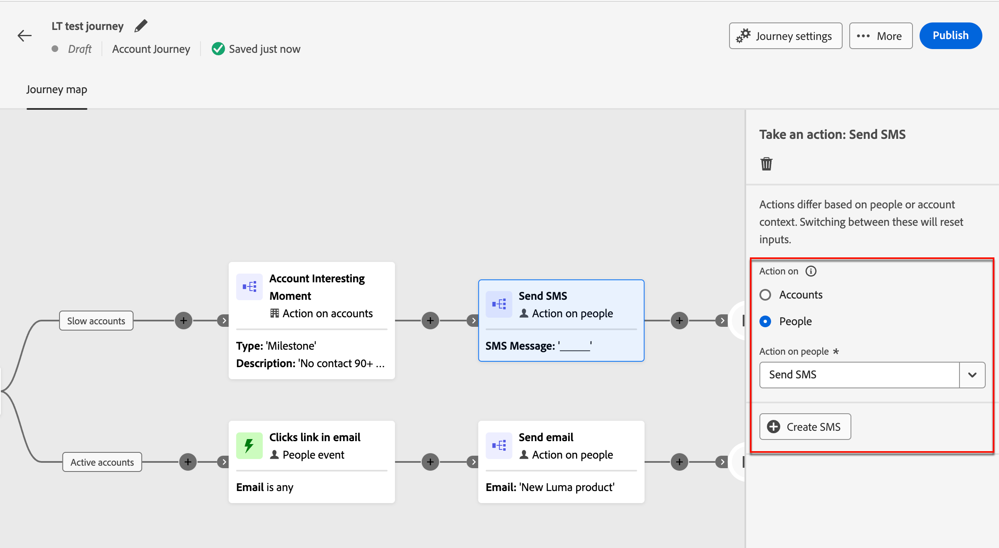
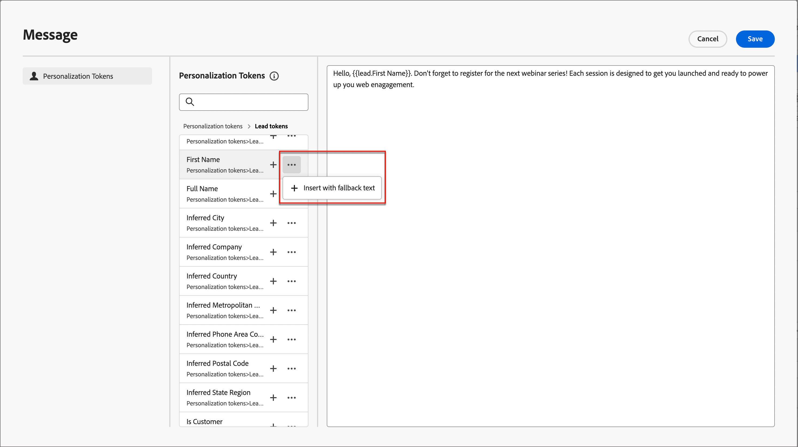
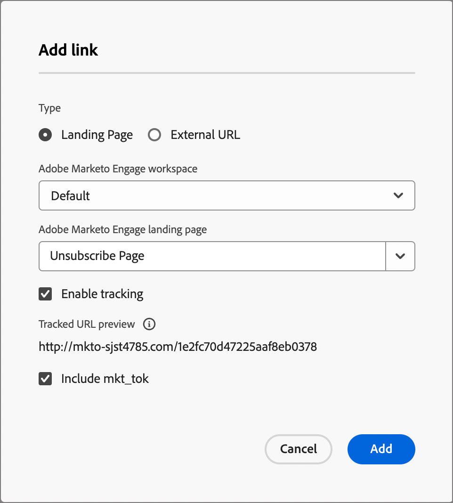

# 短信创作

使用Adobe Journey Optimizer B2B edition在其移动设备上向客户发送短信(SMS)。 您可以从短信编辑器中创建、个性化和预览文本格式的消息。

在为帐户历程创建短信消息之前，请确保从[管理员](../admin/configure-channels-sms.md)设置中配置了&#x200B;_[!UICONTROL 短信服务提供程序]_。

## 在帐户历程中添加短信操作

添加&#x200B;_[!UICONTROL 执行操作]_&#x200B;节点并执行以下操作时，您可以在帐户历程中设置短信投放：

1. 对于&#x200B;_[!UICONTROL 目标上的]_&#x200B;操作，请选择&#x200B;**[!UICONTROL 人员]**。

1. 若要对人员&#x200B;_[!UICONTROL 执行]_&#x200B;操作，请选择&#x200B;**[!UICONTROL 发送短信]**。

   {width="800" zoomable="yes"}

1. 在&#x200B;_[!UICONTROL 执行操作]_&#x200B;面板的底部，单击&#x200B;**[!UICONTROL 创建短信]**。

1. 在对话框中，为短信消息输入唯一的&#x200B;**[!UICONTROL Name]**。

   {width="400"}

1. 单击&#x200B;**[!UICONTROL 创建]**。

   _历程映射_&#x200B;打开，您可以创建消息并设置用于发送消息的短信属性。

### 创建短信消息

>[!IMPORTANT]
>
>**短信同意管理** 
>
>根据行业标准和法规，所有短信营销消息都必须包含一种让接收者轻松取消订阅的方式。 要实现此目的，短信收件人可以使用选择启用和选择禁用关键词进行回复。 支持并遵循所有标准的选择加入和选择退出关键词。 此外，还支持并遵循为短信服务提供商帐户配置的任何自定义关键字。

在&#x200B;**[!UICONTROL 消息]**&#x200B;字段中输入要发送的文本。

您可以创建最多1600个字符的消息，每160个字符即被视为一条短信消息。

{width="800" zoomable="yes"}

#### 个性化设置短信

1. 在创作文本消息时，随时单击文本消息框右侧的&#x200B;_个性化_&#x200B;图标（）。

   显示的页面提供了对Adobe Marketo Engage潜在客户和系统令牌的访问权限。 包括标准令牌和自定义令牌。 您可以使用&#x200B;_搜索_&#x200B;栏找到所需的令牌，或者浏览文件夹树查找并选择任何潜在客户/系统令牌。

1. 将光标放在要添加令牌的消息中的位置。

1. 通过单击令牌旁边的加号( **+**)符号添加令牌。

   如果要添加带有回退的令牌（如果该字段对于潜在客户不可用，将显示默认值），请单击&#x200B;_更多_&#x200B;图标( **...**)，然后选择&#x200B;**[!UICONTROL 插入带有回退文本]**。

   {width="700" zoomable="yes"}

1. 在&#x200B;_[!UICONTROL 输入回退值]_&#x200B;对话框中，输入显示为回退的文本，然后单击&#x200B;**[!UICONTROL 添加]**。

   {width="400"}

1. 放置个性化令牌后，单击&#x200B;**[!UICONTROL 保存]**&#x200B;以保存更改并返回主短信创作工作区。

   您可以根据需要继续编辑包含令牌的消息。

#### 向文本消息添加链接(URL)

1. 输入消息文本后，单击文本消息框右侧的&#x200B;_链接_&#x200B;图标（）。

1. 在对话框中，选择要链接的URL类型：

   * **[!UICONTROL 登陆页面]** — 选择此选项可从Marketo Engage实例中选择任何已批准的Adobe Marketo Engage登陆页面。 选择工作区，然后选择登陆页面。

   * **[!UICONTROL 外部URL]** — 此类型是您在文本框中输入的任何外部URL。

1. 如果选择使用登陆页面，请设置跟踪选项。

   * **[!UICONTROL 启用跟踪]** — 选中此复选框可启用跟踪，这需要&#x200B;_缩短_ URL。 对于登陆页面，它会使用缩短URL的Marketo Engage子域。 此时将显示缩短的URL格式的示例。 实际URL是在将短信发送给收件人时创建的。

   * **[!UICONTROL 包含mkt_tok]** — 选中此复选框可跟踪针对用户的活动。

     >[!NOTE]
     >
     >当您允许跟踪但禁用&#x200B;_[!UICONTROL 包含mkt_tok]_&#x200B;时，目标URL在重定向后不包含`mkt_tok`查询字符串参数。 Marketo Engage登陆页面和Munchkin使用此参数以确保跟踪人员活动（例如，当人员取消订阅电子邮件时）。 除非参数导致您的网站出现问题，否则请勿禁用此选项。 
     >有关在网站上使用Munchkin跟踪代码的更多信息，请参阅[Marketo Engage文档](https://experienceleague.adobe.com/en/docs/marketo/using/product-docs/administration/additional-integrations/add-munchkin-tracking-code-to-your-website){target="_blank"}。

   {width="470"}

1. 链接选项完成后，单击&#x200B;**[!UICONTROL 添加]**&#x200B;以保存更改并将URL链接添加到短信消息。

### 设置短信属性

1. 在&#x200B;_[!UICONTROL 短信属性]_&#x200B;部分中，为您的消息输入&#x200B;**[!UICONTROL Name]**（必需，最多100个字符）和&#x200B;**[!UICONTROL Description]**（可选，最多300个字符）。

   这些字段允许使用Alpha、数字和特殊字符。 以下保留字符是&#x200B;**不允许的**： `\`、`/`、`:`、`*`、`?`、`"`、`<`、`>`和`|`。

1. 选择&#x200B;**[!UICONTROL 短信类型]**：

   * 将`Marketing`用于需要用户同意的促销短信。
   * 将`Transactional`用于非商业邮件，如订单确认、密码重置通知或投放信息。

1. 对于&#x200B;**[!UICONTROL SMS配置]**，请选择预定义的API配置之一。

   此设置确定用于传递消息的SMS网关服务提供商和帐户。

1. 输入要&#x200B;用于通信的&#x200B;**[!UICONTROL 发件人号码]**。

   {width="700" zoomable="yes"}

   收件人号码始终映射到Marketo Engage中的`Lead.mobilePhone`字段。

### 模拟短信内容 {#preview-test}

>[!CONTEXTUALHELP]
>id="ajo-b2b_sms_preview_simulate"
>title="检查您的内容的渲染方式"
>abstract="定义内容后，您可以预览并检查是否为您所使用的渠道正确渲染了此内容。"

定义消息内容后，您可以使用测试用户档案来模拟（预览）其内容。 如果插入个性化内容，则可以使用测试用户档案数据检查此内容在消息中的显示方式。

>[!IMPORTANT]
>
>请确保先保存短信消息，然后再继续模拟短信。

1. 单击短信创作工作区顶部的&#x200B;**[!UICONTROL 模拟内容]**。

1. 在&#x200B;_[!UICONTROL 模拟内容]_&#x200B;页面中，单击&#x200B;**[!UICONTROL 添加联系人]**。

1. 使用&#x200B;_模拟内容_&#x200B;页面管理用于测试配置文件的潜在客户。

   在显示的列表中，您可以从Marketo Engage lead数据库中搜索并添加任何潜在客户（一次最多10个潜在客户）。

   要搜索，请输入整个电子邮件地址，然后按&#x200B;_Enter_。 将显示相应的潜在客户配置文件以供选择。

   所选配置文件的个性化字段的预览更新。

   所有添加的潜在客户都显示在左侧。

   您可以通过添加更多人员并从配置文件列表中删除各个潜在客户来管理此列表（它不会从数据库中删除这些潜在客户）。

1. 模拟选定商机的内容。

   选择左侧列出的任何潜在客户。 页面上的SMS预览将更新所选潜在客户。

   您还可以从预览空间上方的选择器中选择潜在客户，以更新相应潜在客户的页面上的SMS预览。

1. 要退出&#x200B;_[!UICONTROL 模拟内容]_&#x200B;页面并返回短信创作工作区，请单击右上方的&#x200B;**[!UICONTROL 关闭]**。

## 短信同意管理

向收件人提供取消订阅以停止从品牌接收通信的功能，并遵守此选择是一项法律要求。 未能遵守这些法规会为您的品牌带来法律风险。 此功能还可帮助您避免向收件人发送未经请求的通信，这种通信可能会导致他们将您的邮件标记为垃圾邮件并损害您的声誉。

提供此选项后，短信收件人可以使用选择启用和选择禁用关键词进行回复。 支持并接受所有标准的选择加入和选择退出关键词，以及短信服务提供商配置的任何自定义关键词。 取消订阅后，用户档案将自动从未来营销消息的受众中删除。

Journey Optimizer B2B edition提供了使用以下逻辑管理短信消息中的选择退出的功能：

* 默认情况下，如果商机选择不接收您的通信，则相应的用户档案将从后续短信投放中排除

* 来自不同来源(如AEP或短信服务提供商)的潜在客户同意将同步到Journey Optimizer B2B edition。 目前，在实例级别，它仅支持每个商机的单个同意状态（商机“John Doe”订阅或取消订阅实例中的所有促销短信）。 它当前不支持在品牌级别/单个订阅列表级别同意双重选择加入。
