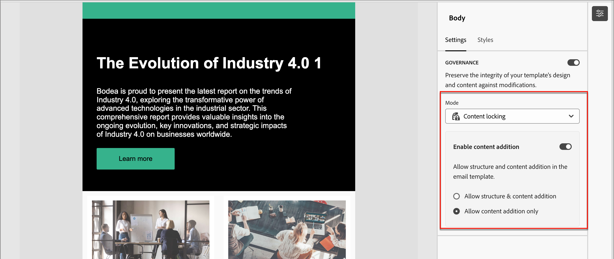

# 模板内容管理

在许多营销组织中，都有设计电子邮件促销活动的内容专业人员。 给定的设计可用作整个组织中自定义帐户历程的基础。 为确保遵循已批准的内容设计，您可以使用内容治理功能来锁定模板组件。 在电子邮件模板中激活内容锁定后，营销人员可以仅更改允许的元素，以使其与内容策略保持一致。

例如，您可以锁定为保持品牌通信连续性而设计的页眉和页脚。 您还可以锁定包含主体部分的列，但允许作者修改文本，以使其满足帐户历程设计中的目的。

## 激活模板的内容管理

在使用该可视设计空间[创作电子邮件模板的结构组件和内容组件](./email-template-authoring.md)后，启用治理并根据需要应用特定内容锁定。

1. 在可视设计空间中，使用&#x200B;_导航树_&#x200B;访问层/容器和元素。

   单击画布左侧的&#x200B;_导航树_&#x200B;图标（）以显示树。

1. 在树中，选择根&#x200B;**[!UICONTROL Body]**&#x200B;组件。

   默认情况下，画布右侧的属性面板显示&#x200B;_[!UICONTROL 设置]_&#x200B;选项卡。

1. 启用&#x200B;**[!UICONTROL 治理]**&#x200B;选项。

   {width="800" zoomable="yes"}

   启用此选项后，默认&#x200B;_[!UICONTROL 模式]_&#x200B;为&#x200B;**[!UICONTROL 只读]**。 在根级别设置此模式后，模板中的所有元素都会被锁定。 左侧的树结构在根元素和所有子元素旁显示&#x200B;_只读_&#x200B;图标（）。

1. 要在模板中启用特定内容锁定，请将&#x200B;**[!UICONTROL 模式]**&#x200B;更改为&#x200B;**[!UICONTROL 内容锁定]**。

   在根级别设置此模式后，模板中的所有元素都会被解锁。 左侧的树结构在根元素旁显示&#x200B;_内容锁定_&#x200B;图标（）。 根据需要将内容锁定应用于包含（结构）和单个内容组件。

   若要允许历程电子邮件作者添加结构元素或内容元素，请打开&#x200B;**[!UICONTROL 启用内容添加]**。 选择要允许的添加类型：

   * **[!UICONTROL 允许结构和内容添加]** — 如果要允许作者同时添加结构和内容元素，请选择此选项。

   * **[!UICONTROL 仅允许添加内容]** — 如果要允许作者仅添加内容元素，请选择此选项。

   {width="600" zoomable="yes"}

   在根级别设置此模式后，模板中的所有元素都会被锁定。 左侧的树结构在根元素和所有子元素旁显示&#x200B;_只读_&#x200B;图标（）。
<!-- 

   
- 
- 
- 
- 
-  -->

## 对结构应用锁定

使用结构继承模型，根据要应用的治理规划电子邮件模板的布局和结构。 使用结构元件作为容器，以易于指定为锁定或可编辑的方式对项目进行分组。 设置好电子邮件模板设计后，查看结构并根据计划应用锁定功能。

在结构级别应用锁定类型为其子组件提供了缺省设置。 然后，您可以根据需要在列或内容元素级别应用特定的锁定设置。

1. 单击画布左侧的&#x200B;_导航树_&#x200B;图标（）以显示树。

1. 在树中选择结构。

   默认情况下，画布右侧的属性面板显示&#x200B;_[!UICONTROL 设置]_&#x200B;选项卡。

1. 设置&#x200B;**[!UICONTROL 锁定类型]**：

   * **[!UICONTROL 已锁定]** — 使用此设置，默认情况下锁定所有子组件。 左侧的树结构在所有子组件旁显示&#x200B;_只读_&#x200B;图标（）。

   * **[!UICONTROL 可编辑]** — 使用此设置，默认情况下所有子组件均可编辑。 左侧的树结构不会在子组件旁边显示图标。

   {width="800" zoomable="yes"}

## 设置子组件的锁定

1. 在树中选择元件。

   默认情况下，画布右侧的属性面板显示&#x200B;_[!UICONTROL 设置]_&#x200B;选项卡。

1. 启用&#x200B;**[!UICONTROL 使用特定锁定]**&#x200B;选项。

1. 选择要应用的治理类型：

   * **[!UICONTROL 可编辑]** — 允许在电子邮件创作期间对组件进行完全的编辑控制。
   * **[!UICONTROL 仅限可编辑的内容]** — 允许电子邮件作者更改内容，但不允许更改组件本身。
   * **[!UICONTROL 已锁定]** — 阻止在电子邮件创作期间对组件进行任何更改。

     对于锁定的组件，您可以通过打开&#x200B;**[!UICONTROL 允许删除]**&#x200B;选项，允许在电子邮件创作期间删除该组件。

   {width="800" zoomable="yes"}
