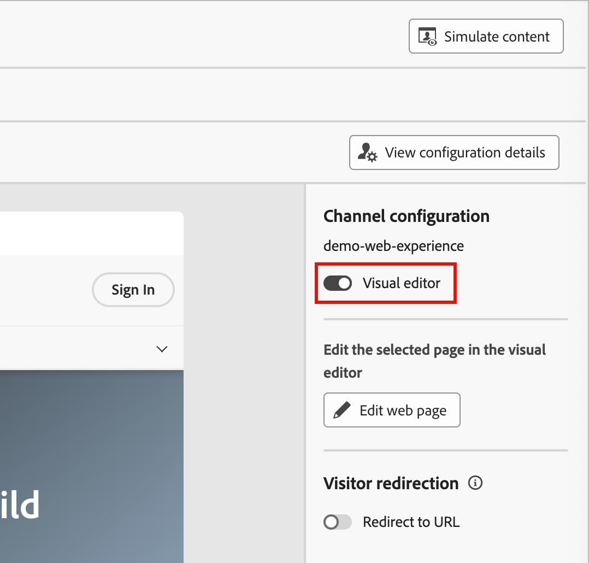
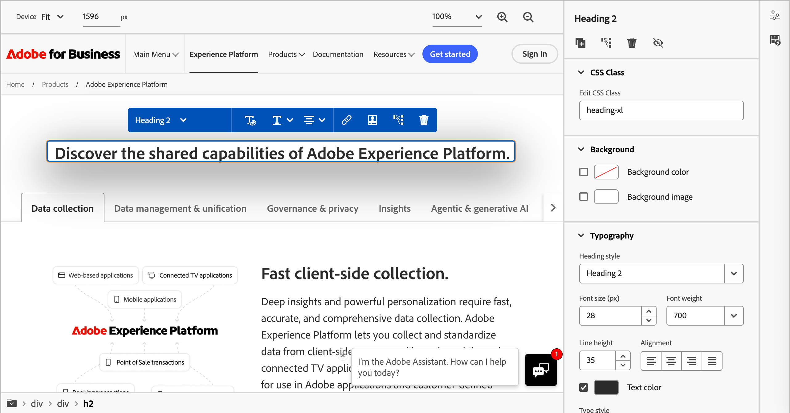
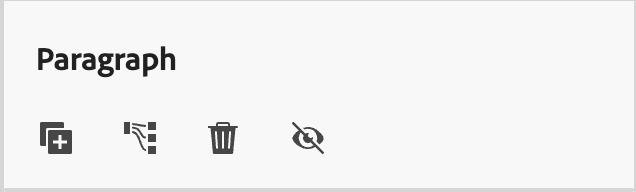
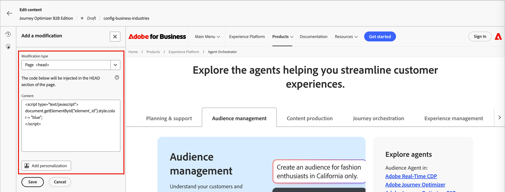
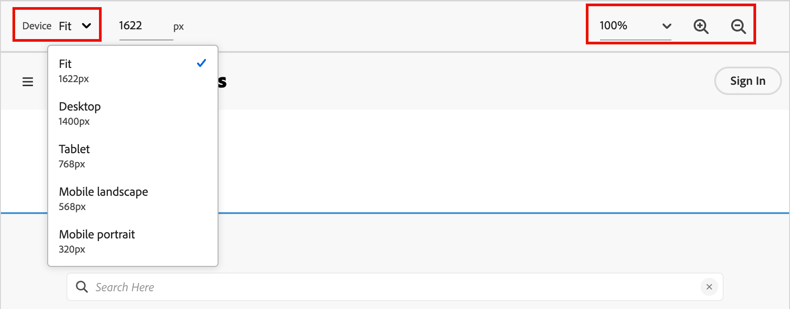
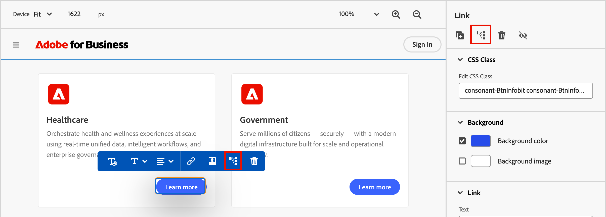

# Web体验设计

在您[创建Web体验](./web-experiences.md#create-a-web-experience)后，请使用内容设计空间定义要应用于网页的修改。

>[!BEGINSHADEBOX]

**先决条件**

在设计Web体验之前，请确保满足以下要求：

* 产品管理员已配置了一个或多个Web通道，以定义要包含用于Web体验的URL（页面）。 有关详细信息，请参阅[Web通道配置](../admin/configure-channels-web.md)。

* 您的网站已实现[Adobe Experience Platform Web SDK](https://experienceleague.adobe.com/zh-hans/docs/experience-platform/collection/js/js-overview) (`alloy.js`)，用于访问者识别和内容传递。 需要Adobe Experience Platform Web SDK版本2.16或更高版本。

* 您拥有在旅程中创建和管理Web体验所需的[权限](../admin/user-management.md#b2b-product-permissions)：
   * _[!UICONTROL 营销活动]_ > _[!UICONTROL 管理营销活动]_ — 需要添加或更新Web个性化操作节点。
   * _[!UICONTROL 营销活动]_ > _[!UICONTROL 查看营销活动]_ — 需要查看Web个性化操作节点的详细信息。

>[!ENDSHADEBOX]

>[!IMPORTANT]
>
>在设计Web体验之前，请确保为Web浏览器安装了Adobe Experience Cloud可视编辑帮助浏览器扩展。 需要此扩展才能在Journey Optimizer B2B版Web体验设计空间中可靠地打开、创作和预览网页。 
>
>Google Chrome和Microsoft Edge当前是唯一支持Journey Optimizer B2B版本中的扩展和创作Web体验的浏览器。 有关详细信息，请参阅[安装可视编辑帮助程序扩展](./web-experiences.md#install-the-visual-editing-helper-extension)。

## Web体验编辑器

Journey Optimizer B2B版本为设计Web修改提供了两种类型的编辑器：

| 编辑器 | 描述 | 最适合 |
| ------ | ----------- | -------- |
| [可视编辑器](#visual-editor) | 所见即所得（_所见即所得_）编辑器显示您的网站，允许您直接选择和修改元素。 它需要Google Chrome或Microsoft Edge Web浏览器中的[Visual Editing Helper扩展](./web-experiences.md#install-the-visual-editing-helper-extension)。 | 对可见的页面元素（如文本、图像、按钮和横幅）进行可视更改。 |
| [非可视编辑器](#non-visual-editor) | 基于代码的编辑器，用于应用无法通过可视编辑器进行的修改。 | 定向难以以可视方式选择的元素，应用高级CSS更改，或修改隐藏元素。 |

在Web体验属性中，使用&#x200B;**[!UICONTROL 可视编辑器]**&#x200B;选项来确定编辑器的类型。 启用该选项以使用可视编辑器，或禁用该选项以使用非可视编辑器。

{width="400"}

## 可视化编辑器 {#visual-editor}

>[!CONTEXTUALHELP]
>id="ajo-b2b_web_experience_browse"
>title="使用浏览模式"
>abstract="在此模式下，您可以导航至为所选 Web 渠道配置进行个性化的具体页面。"

可视编辑器在iframe中加载网页，您可以在其中选择元素并直接在页面预览中应用修改。 完成以下步骤以使用可视编辑器来设计您的Web体验：

1. 在Web体验详细信息页面中显示&#x200B;_[!UICONTROL 内容]_&#x200B;选项卡后，单击右侧面板中的&#x200B;**[!UICONTROL 编辑Web体验]**。

   可视编辑器根据Web渠道配置加载您的网站。

   {width="800" zoomable="yes"}

1. 如果需要，请单击右上方的&#x200B;**[!UICONTROL 浏览]**，然后使用站点导航栏加载要修改的特定页面。

   您还可以在顶部的字段中输入页面URL。

   >[!NOTE]
   >
   >确保加载的页面与Web渠道配置中定义的URL模式匹配。 单击右上角的&#x200B;**[!UICONTROL 查看配置详细信息]**&#x200B;以查看所选Web渠道配置的URL或页面匹配规则。

   在可视编辑器中{width="700" zoomable="yes"}

   <!-- If the web channel configuration is defined using page matching rules, use the left and right arrows to sequence through the matched pages -- right now these buttons don't do anything -->

   单击右上角的&#x200B;**[!UICONTROL 设计]**&#x200B;以在设计空间加载该页面。

1. 要定义您希望如何修改显示的页面以获得Web体验，您可以：

   * [将新组件](#insert-new-components)（分隔条、HTML、图像、标题、段落或链接）插入到Web体验的页面。

   * 从页面中选择任何现有元素，如图像、按钮、段落、文本、容器、标题或链接，并[为Web体验](#modify-elements)修改它。

   * [为元素添加点击跟踪](#click-tracking-for-web-experiences)以测量参与度和收集见解。

1. 重复步骤2以加载要包含在Web体验中的其他页面，并重复步骤3以定义页面修改。

1. [查看您的修改](#manage-modifications)并做出任何所需的调整。

1. 修改完成后，单击编辑器上方的左箭头可返回到Web体验属性。

### 修改元素

单击所显示页面中的元素以将其选定。 蓝色边框表示所选的元素，并且会出现一个带修改选项的上下文工具栏。

{width="700" zoomable="yes"}

工具栏选项取决于所选的组件类型：

| 操作 | 描述 |
| ------ | ----------- |
| **[!UICONTROL 文本选项]** | 更改所选元素的文本元素类或文本样式。 |
| **[!UICONTROL 选择图像]** | 替换图像源或将图像添加到元素。 |
| **[!UICONTROL 编辑链接/添加链接]** | 修改或添加链接URL。 |
| **[!UICONTROL 安排]** | 在显示内向后或向前移动所选元素。 |
| **[!UICONTROL 添加个性化内容]** | 插入个性化设置。 |
| **[!UICONTROL 点击跟踪元素]** | 为元素添加点击跟踪。 |
| **[!UICONTROL 删除]** | 从页面中删除选定的元素。 |

对于选定的元素，右侧面板中的属性会发生更改，以反映可用的样式和操作。 单击面板顶部的操作图标可复制、点击跟踪、删除或隐藏选定的元素。

{width="300"}

+++文本元素

1. 在页面上选择一个文本元素。

1. 输入新的文本内容，或选择文本字符串并输入替换文本。

1. （可选）使用[文本格式选项](./content-components.md#text)，例如粗体、斜体和对齐方式。

1. 单击文本元素外部以应用更改。

有关文本组件的文本样式选项的更多信息，请参阅[内容组件](./content-components.md#text)。

+++

+++图像元素

1. 在页面上选择一个图像元素。

1. 单击上下文工具栏或右侧面板中的&#x200B;_[!UICONTROL 选择图像]_&#x200B;图标。

1. 浏览并从资源库中选择图像。

1. 根据需要使用右侧面板中的[图像样式选项](./content-components.md#image)。

+++

+++按钮元素

1. 在页面上选择一个按钮元素。

1. （可选）为按钮输入新文本，或者选择文本字符串并输入替换文本。

   您可以使用帐户或人员配置文件中的数据通过个性化更改按钮文本。

1. 根据需要使用右侧面板中的[按钮样式选项](./content-components.md#button)。

+++

+++ 容器元素

1. 在页面上选择一个容器元素。

1. 根据需要使用右侧面板中的[容器样式选项](./content-components.md#container)。

+++

### 插入新组件

当您在可视编辑器的设计左侧导航中选择&#x200B;**+**&#x200B;图标时，可以将以下组件类型作为Web体验修改添加到页面中：

* **[!UICONTROL 分隔线]** — 使用此组件插入分隔线来组织电子邮件的布局和内容。 您可以从右侧面板中的属性调整样式属性，例如线条的颜色、样式和高度。 有关详细信息，请参阅&#x200B;_内容组件_&#x200B;中的[分隔线](./content-components.md#divider)。
* **[!UICONTROL HTML]** — 使用此组件将HTML代码复制粘贴到现有结构中。 它使您能够创建免费的模块化HTML组件以重用某些外部内容。 有关更多信息，请参阅&#x200B;_内容组件_&#x200B;中的[HTML](./content-components.md#html)。
* **[!UICONTROL 图像]** — 使用此组件将图像文件插入到页面中。 您可以从右侧面板中的属性调整样式属性，例如宽度和高度。 有关详细信息，请参阅&#x200B;_内容组件_&#x200B;中的[图像](./content-components.md#image)。
* **[!UICONTROL 标题]** — 使用此组件插入标题类文本。 您可以从右侧面板中的属性调整样式属性，例如文本颜色、样式、字体和大小。 有关详细信息，请参阅&#x200B;_内容组件_&#x200B;中的[文本](./content-components.md#text)。
* **[!UICONTROL 段落]** — 使用此组件插入标准文本元素。 您可以从右侧面板中的属性调整样式属性，例如文本颜色、样式、字体和大小。 有关详细信息，请参阅&#x200B;_内容组件_&#x200B;中的[文本](./content-components.md#text)。
* **[!UICONTROL 链接]** — 使用此组件插入指向指定URL的独立文本链接。 您可以从右侧面板中的属性调整样式属性，例如文本颜色、样式、对齐方式和大小。

选择左侧的组件类型，然后将鼠标悬停在要添加该组件的位置旁边的元素上。

{width="800" zoomable="yes"}

单击显示的按钮之一放置组件：

* ***[!UICONTROL 在]**&#x200B;之前插入 — 将组件插入到选定元素之前。
* ***[!UICONTROL 在]**&#x200B;之后插入 — 在选定元素之后插入组件。

要取消选择要插入的组件类型，请在页面顶部显示的上下文蓝色横幅中单击&#x200B;**[!UICONTROL ESC]**。

## 非可视编辑器 {#non-visual-editor}

当需要进行无法在可视编辑器中轻松完成的修改时，请使用非可视编辑器。 这种基于代码的方法使您能够精确控制元素定位和修改。 完成以下步骤以使用非可视编辑器来设计您的Web体验：

1. 在Web体验详细信息页面中显示&#x200B;_[!UICONTROL 内容]_&#x200B;选项卡时，单击右侧面板中的&#x200B;**[!UICONTROL 添加修改]**。

   非可视编辑器根据Web渠道配置加载页面。

   {width="800" zoomable="yes"}

1. 定义要进行的第一次修改。

   左侧面板显示现有修改的列表（如果有）。 单击&#x200B;**[!UICONTROL 添加]**&#x200B;以定义新的修改。 如果未定义任何修改，则面板将默认为&#x200B;_[!UICONTROL 添加修改]_&#x200B;选项。

   * 选择&#x200B;**[!UICONTROL 修改类型]**：

     | 类型 | 描述 |
     | ---- | ----------- |
     | [**[!UICONTROL CSS选择器]**](#css-selector-modifications) | 使用CSS选择器字符串的目标元素。 |
     | [**[!UICONTROL 页]**](#page-modifications) | 将自定义HTML、CSS或JavaScript插入页面级别的元素，如`<head>`或`<body>`。 |

   * 根据类型配置修改参数：

      * **[!UICONTROL CSS选择器]** — 输入有效的CSS选择器以定位特定的元素。
      * **[!UICONTROL 操作类型]** — 选择要执行的操作（编辑、隐藏、删除、插入、替换）。
      * **[!UICONTROL 内容]** — 提供要应用的内容或样式。

1. 单击&#x200B;**[!UICONTROL 保存]**&#x200B;以应用修改。

### CSS选择器修改

通过修改CSS选择器，您可以使用标准CSS选择器语法准确地定位元素。

1. 选择&#x200B;**[!UICONTROL CSS选择器]**&#x200B;作为修改类型。

1. 在&#x200B;**[!UICONTROL CSS元素选择器]**&#x200B;字段中输入选择器。

<!-- This field helps you find and select the HTML elements (or nodes in the DOM tree). -->

    **示例选择器：**
    
    |选择器|目标|
    | -------- | ------- |
    | &#39;#hero-banner&#39; | ID为&#39;hero-banner&#39;的元素|
    | &#39;.cta-button&#39; |类为&#39;cta-button&#39;的所有元素|
    | &#39;header nav a&#39; |导航内的链接，标题内|
    | &#39;[data-offer=&quot;premium&quot;]&#39; |具有特定数据属性的元素|

1. 选择&#x200B;**[!UICONTROL 操作类型]**&#x200B;并指定所需的信息/内容。

   * **[!UICONTROL 设置内容]** — 在&#x200B;**[!UICONTROL 内容]**&#x200B;字段中输入由&#x200B;_[!UICONTROL CSS元素选择器]_&#x200B;值标识的元素的文本。

   * **[!UICONTROL 设置属性]** — 指定要与当前CSS选择器关联的属性，以便该属性能够标识该元素。 在&#x200B;**[!UICONTROL 属性名称]**&#x200B;字段中输入名称，在&#x200B;**[!UICONTROL 内容]**&#x200B;字段中输入值。 如果属性已存在，则更新值；否则，将添加具有指定名称和值的新属性。

   {width="800" zoomable="yes"}

1. （可选）单击&#x200B;**[!UICONTROL 添加个性化]**&#x200B;并使用[个性化编辑器](./personalization.md#personalization-editor)为内容创建自定义个性化。

### 页面修改

您可以使用页面`<head>`修改类型添加自定义代码。 `<head>`元素是元数据（有关数据的数据）的容器，它位于`<html>`标记和`<body>`标记之间。 在这种情况下，代码不会等待主体或页面加载事件，而是在页面加载开始时执行。

`<head>`元素通常用于将JavaScript或CSS代码添加到页面顶部。 适用于后续可视化操作的选择器取决于此选项卡中添加的 HTML 元素。

>[!NOTE]
>
>Custom code runs in the visitor&#39;s browser. Ensure that your code is secure, tested, and does not negatively impact page performance or user experience.

1. Choose **[!UICONTROL Page`<head>`]** as the modification type.

1. 在&#x200B;**[!UICONTROL Content]**&#x200B;框中添加您的自定义代码。

   >[!CAUTION]
   >
   >您只能将`<script>`和`<style>`元素添加到`<head>`部分。 Adding `
` tags and other elements might cause remaining `<head>` elements to populate within the `<body>`.

   {width="800" zoomable="yes"}

1. (Optional) Click **[!UICONTROL Add personalization]** and use the [personalization editor](./personalization.md#personalization-editor) to create a customized personalization for the content.

## 管理修改 {#manage-modifications}

>[!CONTEXTUALHELP]
>id="ajo-b2b_web_experience_modifications"
>title="轻松管理所有更改"
>abstract="通过此面板，您可以浏览并管理为该网页定义的所有调整和新增内容。"

All modifications that you create are tracked and can be managed from the **[!UICONTROL Modifications]** panel of both the visual editor and non-visual editor. Click the _[!UICONTROL Modifications]_ <!-- (  ) -->icon in the left toolbar to view all modifications.

Each modification record includes:

* The target element or selector
* The modification type (such as edit, hide, or insert)
* A preview of the change

{width="500" zoomable="yes"}

### Edit a modification

1. In the _[!UICONTROL Modifications]_ list, find the modification that you want to edit.

1. Click the _More menu_ ( **...** ) icon and choose **[!UICONTROL Edit]**.

1. Update the modification properties as needed.

1. 单击&#x200B;**[!UICONTROL 保存]**&#x200B;以保存更改。

### Delete a modification

1. In the _[!UICONTROL Modifications]_ list, find the modification that you want to remove.

1. 单击&#x200B;_更多菜单_ ( **...** )图标，然后选择&#x200B;**[!UICONTROL 删除修改]**。

1. 出现提示时，确认删除。

<!-- ### Reorder modifications

Modifications are applied in the order that they appear in the list. If you have multiple modifications that affect the same element, the order may impact the final result.

Drag and drop modifications in the list to change the order. The preview updates to reflect the new modification order. -->

## 预览您的修改

发布之前，预览修改对访客的显示方式。

使用可视编辑器顶部的设备预览选项查看您对以下内容所做的修改：

* 桌面
* 平板电脑
* 移动设备

{width="550" zoomable="yes"}

预览将更新，以显示修改在每个设备大小上的呈现方式。

使用URL栏导航到您的Web渠道配置中的不同页面。 然后，根据URL匹配规则，验证修改是否正确应用于目标页面。

## Web体验的点击跟踪 {#web-click-tracking}

跟踪用户与元素的交互以衡量参与度并收集见解。 点击跟踪数据可在参与报表中使用，并可用于衡量Web体验修改的有效性。

激活（实时）Web体验后，您还可以使用Adobe Customer Journey Analytics（需要产品订阅）构建报表。 为了改进Web体验监控，您还可以跟踪网站任何特定元素的点击量。 通过跟踪，可在Web报表中显示该元素的点击次数。

有关Customer Journey Analytics和构建Web报表的更多信息，请参阅[Customer Journey Analytics文档](https://experienceleague.adobe.com/zh-hans/docs/analytics-platform/using/cja-landing)。

1. 在Web体验编辑器中选择元素，例如图像或链接。

1. 在元素属性或上下文工具栏中，单击&#x200B;_[!UICONTROL 点击跟踪元素]_&#x200B;图标。

   {width="600" zoomable="yes"}

1. 打开左侧面板中的点击跟踪列表，并修改&#x200B;**[!UICONTROL 跟踪的操作]**&#x200B;值以在您的报告中标识此交互。

   {width="600" zoomable="yes"}
