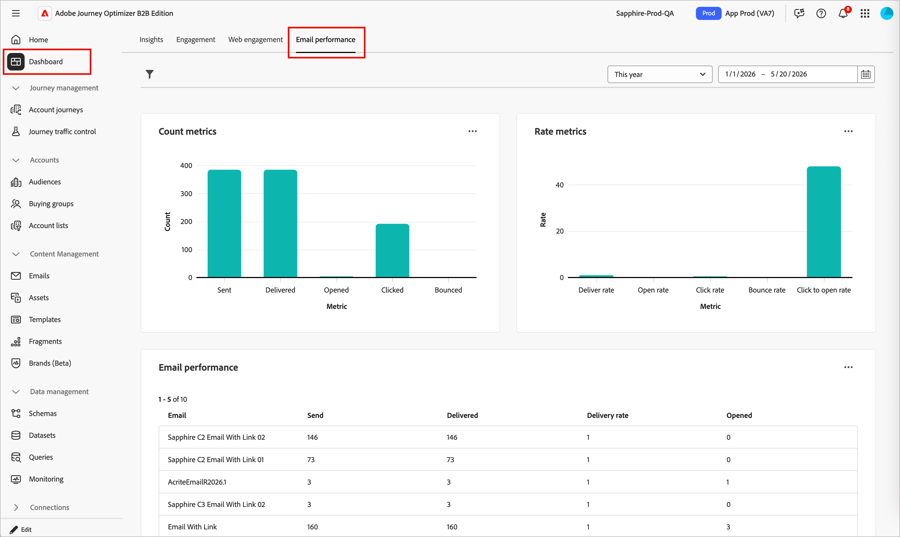

# 电子邮件性能报表

**电子邮件性能**&#x200B;报表为营销人员提供了在Adobe Journey Optimizer B2B edition中查看所有历程中的电子邮件活动的统一视图。 它汇总发送、投放、参与和选择退出量度。 通过显示原始计数和计算比率，您可以监控活动运行状况、比较电子邮件性能并快速识别可投放性或参与问题。 有关电子邮件和短信渠道中的历程级别量度，请参阅[帐户历程仪表板](./journeys-dashboard.md)。

## 访问报告

1. 在左侧导航中，选择&#x200B;**[!UICONTROL 仪表板]**。
1. 选择报告仪表板顶部的&#x200B;**[!UICONTROL 电子邮件性能]**&#x200B;选项卡。

{width="800" zoomable="yes"}

## 筛选数据

单击左上角的&#x200B;_筛选器_（）图标，以使用两种受支持的筛选器类型筛选数据显示。 这些过滤器同时应用于所有面板：

* **[!UICONTROL 历程]** — 筛选报告以显示一个或多个选定旅程的数据。 使用此过滤器可隔离对您的营销活动或项目重要的历程的性能。

* **日期范围** — 将所有量度限制为在指定的时间范围内发送的电子邮件。 支持预设范围和自定义日期选取器。 日期范围选择器位于功能板的右上角。

{width="500"}

在筛选器对话框中更改筛选器时，单击&#x200B;**[!UICONTROL 应用]**。

## 计数和比率量度图表

电子邮件性能报表的顶部包含两个并排条形图，这些条形图提供了所选日期范围和历程中整个电子邮件程序运行状况的直观摘要。

**计数量度** — 显示电子邮件活动的绝对数量。 每个栏表示筛选范围中所有电子邮件的关键电子邮件事件总数：已发送、已投放、已打开、已单击、已退回和取消订阅。

**费率量度** — 显示计算的百分比费率，使您能够独立于量度评估参与度和可投放性质量：投放率、打开率、点击率、跳出率、点击打开率和取消订阅率。

将鼠标悬停在图表上可显示数字数据。

{width="500"}

| 量度 | 类型 | 描述 |
|--------|------|-------------|
| 已发送 | 计数 | 提交以进行投放的电子邮件总数。 |
| 已送达 | 计数 | 收件人的邮件服务器已成功接受电子邮件。 |
| 已打开 | 计数 | 至少打开一次的已投放电子邮件数。 |
| 已单击 | 计数 | 至少收到一次链接点击的电子邮件数。 |
| 已跳出 | 计数 | 无法投放的电子邮件（硬退回或软退回）。 |
| 取消订阅 | 计数 | 通过电子邮件中的取消订阅链接选择退出的收件人。 |
| 投放率 | 评价 | 已投放÷已发送。 指示到达收件箱的电子邮件百分比。 |
| 打开率 | 评价 | 已打开÷已送达。 测量收件人与主题行的参与度。 |
| 点击率 | 评价 | 已单击÷已投放。 测量每个投放电子邮件的总体点击参与度。 |
| 跳出率 | 评价 | 已退÷发送。 突出显示可投放性并列出运行状况问题。 |
| 点击打开率(CTOR) | 评价 | 单击÷打开。 衡量参与读者的内容和CTA有效性。 |
| 取消订阅率 | 评价 | 取消订阅÷送达。 表示相关性和受众适合。 |

## 电子邮件性能表

在页面底部，有一个详细的表显示过滤范围中每个电子邮件资产的每封电子邮件量度。 默认情况下，该表每页显示10行。

**取消订阅%**&#x200B;列是优先级指标，用于直接在表视图中监视选择退出活动。

| 列 | 描述 |
|--------|-------------|
| 电子邮件名称 | 在历程中配置的[电子邮件资产](../content/add-email.md)的名称。 |
| 已发送 | 所选日期范围内此电子邮件的总发送次数。 |
| 已送达 | 成功传送到收件人邮件服务器的电子邮件数。 |
| 投放% | 已投放÷已发送，以百分比表示。 |
| 打开 | 为此电子邮件记录的打开事件总数。 |
| 打开% | 打开÷已交付，以百分比表示。 |
| 点击次数 | 此电子邮件的链接点击事件总数。 |
| 单击% | 已投放÷点击次数，以百分比表示。 |
| CTOR % | 点击打开率：点击次数÷打开次数，以百分比表示。 |
| 退信数 | 无法投放的电子邮件数量（硬+软退回）。 |
| 退回% | 退回数÷已发送，以百分比表示。 |
| 取消订阅% | 取消订阅÷送达。 用于监控选择退出运行状况的优先级量度。 |
| 第一个活动 | 所选时段内此电子邮件第一个记录的事件（发送、打开或单击）的时间戳。 |
| 上一个活动 | 所选时段内此电子邮件最近记录的事件的时间戳。 |

## 导出报表数据

电子邮件性能报告支持数据导出，以便在外部工具中进行进一步分析或与利益相关者共享结果。 您可以以CSV格式导出表数据，这与任何数据分析或BI工具兼容。

>[!CAUTION]
>
>导出反映当前活动的筛选器。 在导出之前，请确保正确设置了日期范围和历程过滤器，以避免输出文件中的数据不完整。

**_导出报表数据:_**

1. 在右上角设置日期范围，并根据需要应用&#x200B;**[!UICONTROL 历程]**&#x200B;筛选。
1. 单击“电子邮件性能”面板右上角的&#x200B;**...**&#x200B;菜单图标，然后选择&#x200B;**[!UICONTROL 查看更多]**。
1. 单击菜单中的&#x200B;**[!UICONTROL 下载CSV]**。

   {width="700" zoomable="yes"}

   文件会自动下载到浏览器的默认下载位置。

1. 单击&#x200B;**[!UICONTROL 关闭]**&#x200B;以返回电子邮件性能报表。
