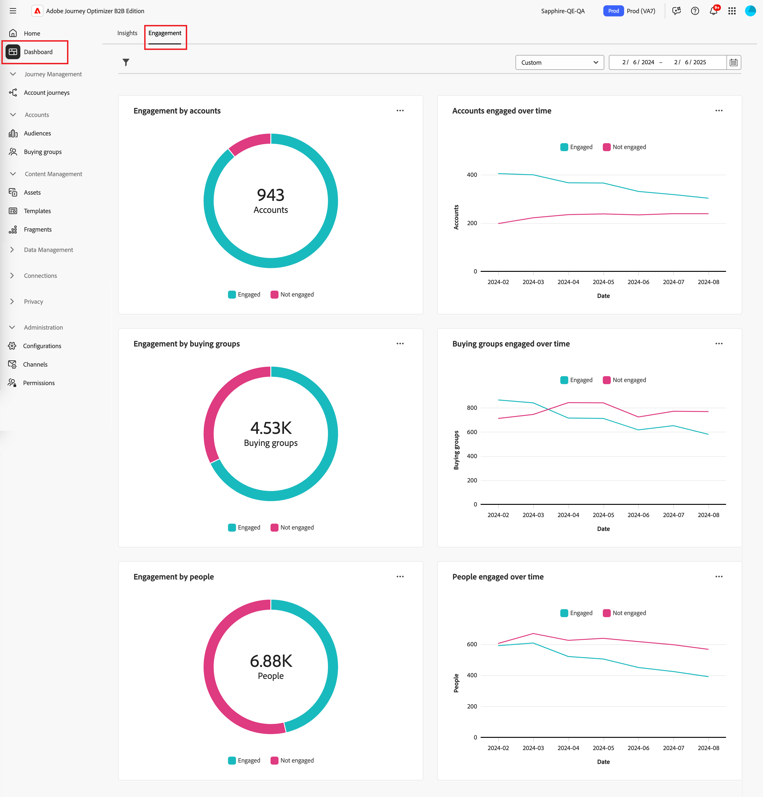

# 参与概述仪表板

此仪表板提供参与度的全面视图，并通过快照圆环图和随时间变化的趋势显示折线图展示帐户和个人交互的实时量度。 它有助于您有效地监控和制定参与策略。

要访问&#x200B;_参与仪表板_，请在左侧导航中选择&#x200B;**[!UICONTROL 仪表板]**&#x200B;项目。 然后选择页面顶部的&#x200B;**[!UICONTROL 参与]**&#x200B;选项卡。

<!-- To generate a shareable PDF of your current view, click **[!UICONTROL Export]** at the top-right corner of the page. To engage with the data, use the action menu in the top-right corner. -->

{width="800" zoomable="yes"}

## 按客户/购买群体/人员列出的参与度

圆形图将客户、购买团体或人员分为参与和非参与类别。 中心图显示每个类别中的总数，直观地了解总体参与情况。

{width="500"}

## 随着时间的推移，客户/购买组/参与人员

这些折线图显示一段时间内客户或人员的参与级别。 通过将“已参与”和“未参与”的不同行与带有时间戳的水平轴一起可视化，您可以查明趋势和模式。 您可以将鼠标悬停在一行上以显示任何给定日期的精确量度。

{width="500"}

## 筛选数据

您可以按日期范围和属性筛选显示的数据。

### 日期范围过滤器

使用右上角的&#x200B;_[!UICONTROL 日期范围筛选器]_&#x200B;根据日期范围筛选数据。

{width="380"}

对于&#x200B;**[!UICONTROL 自定义]**&#x200B;范围，您可以使用日历工具指定开始日期和结束日期。 结束日期默认为当天。

{width="380"}

### 属性过滤器

单击左上角的&#x200B;_筛选器_ （）图标，以使用以下任一属性筛选显示的数据：

* 解决方案兴趣
* 参与类型
* 区域
* 行业
* 购买群组成员角色

{width="500"}

为要用于筛选数据的每个属性选择任意数量的值，然后单击&#x200B;**[!UICONTROL 应用]**。

## 使用数据

要使用数据，请使用每个图表右上角的&#x200B;**...**&#x200B;菜单。

{width="300"}

### 穿透钻取

对于圆形图，请选择&#x200B;**[!UICONTROL 穿透钻取]**&#x200B;以深入分析各个组参与数据。

应用于仪表板的全局过滤器（数据范围和属性）会转移。 单击左上角的&#x200B;_筛选器_ （）图标以[更改穿透钻取视图的属性筛选器](#filter-the-data)。 使用右上角的日期范围选择器以[更改穿透钻取视图的日期范围](#date-range-filter)。

{width="700" zoomable="yes"}

| 帐户参与度 | 购买群组参与度 | 人员参与 |
| ---------------------- | --------------------------- | -------------------- |
| <li>帐户名称 <li>状态 <li>参与的人数（数字）<li>参与活动（数量） <li>上次参与（日期） | <li>购买群组 <li>帐户 <li>解决方案兴趣 <li>状态 <li>参与活动（数量） | <li>名称 <li>状态 <li>电子邮件（地址） <li>参与活动（数量） <li>上次参与（日期） |

您可以单击右上角的&#x200B;**...**&#x200B;菜单图标，然后选择&#x200B;**[!UICONTROL 查看更多]**&#x200B;到[查看扩展数据和见解](#view-more)。

### 查看更多信息

选择&#x200B;**[!UICONTROL 查看更多]**&#x200B;以查看扩展数据和见解。

{width="700" zoomable="yes"}

根据图表，存在以下项的扩展数据：

| 按客户/购买组/人员列出的参与度 | 帐户/购买组/参与人员 |
| ----------------------------------------------- | -------------------------------------------------- | 
| <li>已参与 <li>未参与 | <li>日期 <li>帐户/购买组/人员（数量） <li>已参与/未参与 |

要复制扩展数据，请单击右上方的&#x200B;**[!UICONTROL 下载CSV]**。
