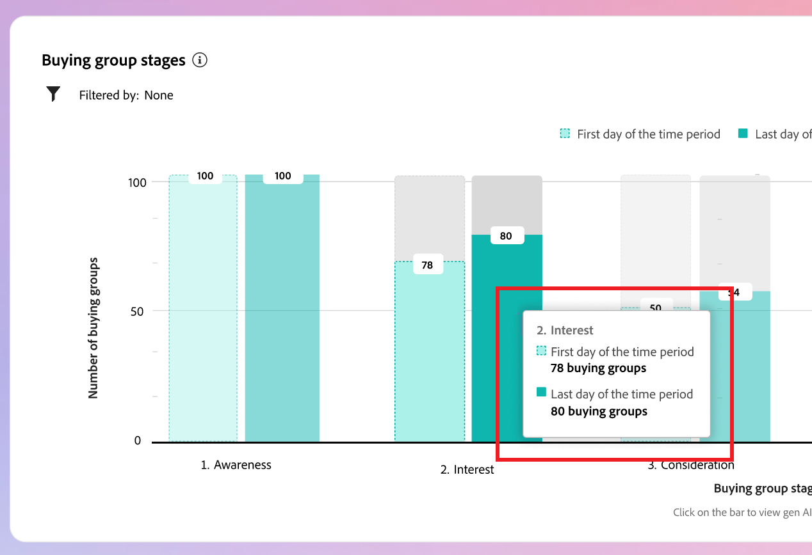
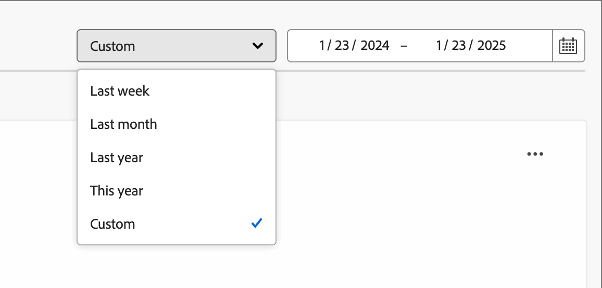
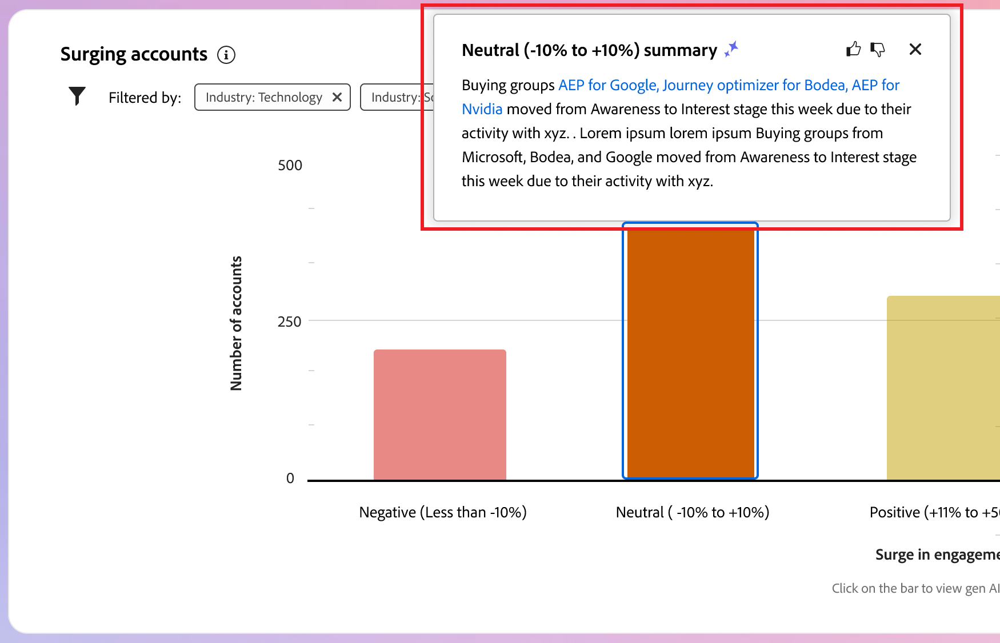
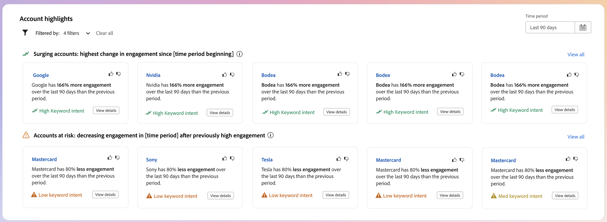
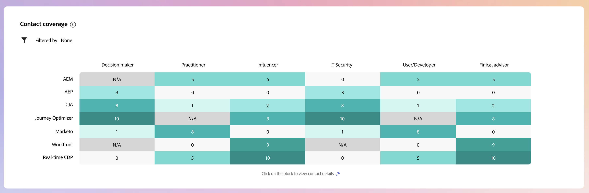
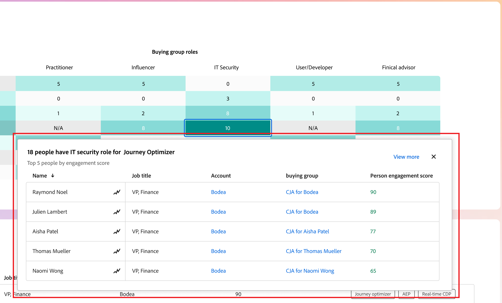

# 智能仪表板

智能仪表板可全面查看购买群组和帐户指标，帮助您更有效地监控和制定营销策略。

要访问&#x200B;_智能仪表板_，请在左侧导航中选择&#x200B;**[!UICONTROL 仪表板]**&#x200B;项。

{width="800" zoomable="yes"}

智能仪表板还提供对帐户和购买群组详细信息页面的访问权限，这些页面包括两种类型的创作AI功能：

* 帐户和购买组的摘要
* 人员、购买组和帐户的目标检测

{{intent-data-note}}

要利用智能功能板提供的信息和见解，您的Journey Optimizer B2B edition实例必须配备以下所需项目：

| 类型 | 要求 |
| ---- | ----------- |
| [购买团体阶段](#buying-group-stages) | 设置购买组阶段&#x200B;**和**&#x200B;添加到已创建的购买组。 |
| [购买团体焦点](#buying-group-highlights) | 设置购买组阶段&#x200B;**和**&#x200B;添加到已创建的购买组。 |
| [帐户激增](#surging-accounts) | 一个或多个已发布的历程&#x200B;**或**&#x200B;创建了购买群组。 |
| [帐户亮点](#account-highlights) | 一个或多个已发布的历程&#x200B;**或**&#x200B;创建了购买群组。 |
| [联系人覆盖范围](#contact-coverage) | 已创建一个或多个购买组（不需要阶段）。 |
| [联系人重叠](#contact-overlap) | 已创建一个或多个购买组（不需要阶段）。 |
| [帐户详细信息页面](../accounts/account-details.md) | 一个或多个已发布的历程。 |
| [购买群组详细信息页面](../buying-groups/buying-group-details.md) | 已创建一个或多个购买组（不需要阶段）。 |

## 购买群组阶段 {#buying-group-stages}

>[!CONTEXTUALHELP]
>id="ajo-b2b_intelligent_dashboard_buying_group_stages"
>title="购买群组阶段"
>abstract="此图概述了根据所配置的过渡规则，购买群组在不同阶段的进展情况。 第一条柱状图显示了所选时间范围内第一天与最后一天相比，特定阶段购买群体的数量变化。"

_[!UICONTROL 购买组阶段]_&#x200B;图表提供了跨不同阶段的购买组进展的概览（[基于管理员设置的过渡规则](../buying-groups/buying-group-stages.md)）。

>[!NOTE]
>
>Availability of buying group stages requires configuration of the buying group stages. See [Buying group stages](../buying-groups/buying-group-stages.md) for detailed information about stages and how to define and enable stages for buying groups.

{width="800" zoomable="yes"}

The chart uses the buying group stages from the most recently published version of the buying group stages model. There are two bars for each stage. The first bar indicates the number of buying groups on the first date of the selected time frame. And the second (in comparison) is the number of buying groups on the last date of the time frame. You can hover over each bar to see the number of buying groups in each stage.

{width="400"}

### Generative AI summary

Click a bar to surface a generative AI summary of buying groups in that stage for the selected time period.

{width="500"}

The generated summary provides an overview of buying group progression across different stages based on the configured transition rules.

### 时段 {#time-period-stages}

Use the date filter at the top right to change the date range for the data visualizations. Click the down arrow to set a relative date range, or to set custom start and end dates.

<!-- {width="300"} -->

### Attribute filter {#attribute-filter-stages}

Click the _Filter_ (  ) icon at the top left to filter the data display using any of these attributes:

* Solution Interest
* 帐户
* 阶段名称

<!-- Add screen when the UI is available {width="500"} -->

## 购买群组亮点 {#buying-group-highlights}

>[!CONTEXTUALHELP]
>id="ajo-b2b_intelligent_dashboard_buying_group_highlights_engagement"
>title="按参与度排名前 5 位的购买群组"
>abstract="根据标准化参与度得分，参与度最高的购买群组。"

>[!CONTEXTUALHELP]
>id="ajo-b2b_intelligent_dashboard_buying_group_highlights_velocity"
>title="按速度排名前 5 位的购买群组"
>abstract="根据各阶段进展速度划分的购买群组。"

>[!CONTEXTUALHELP]
>id="ajo-b2b_intelligent_dashboard_buying_group_highlights_stagnant"
>title="按停滞程度排名前 5 位的购买群组"
>abstract="停滞不前的购买群组，尽管完整度得分很高，但在各阶段的进展却不顺利。"

The _[!UICONTROL Buying group highlights]_ section is organized into three rows to surface information about the buying groups of interest to your organization.

{width="800" zoomable="yes"}

* **Top 5 buying groups by engagement** - This row displays the top engaged buying groups based on their normalized engagement score.
* **Top 5 High velocity buying groups** - This row displays the top buying groups based on the velocity with which they are progressing through the buying group stages.
* **Top 5 Stagnant buying groups** - This row displays the most stagnant buying groups that are not progressing through stages despite a high completeness score.

Each card includes the following data:

* **_Buying group name_**. Click the name to open the buying group detail page.
* **_Account name_**. Click the name to open the account detail page (hyperlinked to account detail page).
* **_Current stage_** for the buying group.
* **_Engagement score_** (normalized across all buying groups). If all buying groups have the same top score, it displays the last updated score.
* **_Completeness score_** (ranging from 1-100). If all buying groups have the same top score, it displays the last updated score.
* **_Category intent_**. Click _[!UICONTROL View details]_ to view the intent data:

  {width="500" zoomable="yes"}

   * The details popup displays the category name with intent level at the top.
   * The data for each row is organized in columns: the product name, product intent strength, and top keywords by intent strength.
   * The sort order is high to low for category, product, and keywords. If one or more of each type has the same intent strength, the sort uses alphabetical order.

  {{intent-data-note}}

At the top right of the _Buying group highlights_ panel, click **[!UICONTROL View All]** to navigate to the Buying groups list page.

### Attribute filter {#attribute-filter-bg-highlights}

Click the _Filter_ (  ) icon at the top left to filter the data display using any of these attributes:

* 解决方案兴趣
* 购买群组
* 帐户

<!-- Add screen when the UI is available {width="500"} -->

### 时段 {#time-period-bg-highlights}

Use the date filter at the top right to change the date range for the data visualizations. Click the down arrow to set a relative date range, or to set custom start and end dates.

<!-- {width="300"} -->

## 激增帐户 {#account-surge}

>[!CONTEXTUALHELP]
>id="ajo-b2b_intelligent_dashboard_account_surge"
>title="帐户激增"
>abstract="在选定的时间范围内，参与度势头发生显著变化的账户。"

The _[!UICONTROL Surging accounts]_ section displays a visualization of the accounts with a significant change in engagement momentum within the selected time frame.

>[!NOTE]
>
>Account surge data includes only accounts that Journey Optimizer B2B Edition ingests through account journeys or buying groups.

{width="800" zoomable="yes"}

Hover over each bar to view the number of accounts in each category.

{width="400"}

单击条形，以显示所选时间范围内类别中帐户的创作AI摘要。

{width="500"}

### 属性过滤器 {#attribute-filter-acct-surge}

单击左上角的&#x200B;_筛选器_ （ ）图标，以使用以下任一属性筛选数据显示：

* 解决方案兴趣
* 行业
* 区域

<!-- Add screen when the UI is available {width="500"} -->

### 时段 {#time-period-acct-surge}

使用右上角的日期过滤器可更改数据可视化的日期范围。 单击向下箭头可设置相对日期范围，或设置自定义开始日期和结束日期。

<!-- {width="300"} -->

## 帐户亮点 {#account-highlights}

>[!CONTEXTUALHELP]
>id="ajo-b2b_intelligent_dashboard_account_highlights_surging"
>title="激增帐户"
>abstract="在选定的时间范围内，参与度势头显著提升的账户 "

>[!CONTEXTUALHELP]
>id="ajo-b2b_intelligent_dashboard_account_highlights_at_risk"
>title="有风险的账户"
>abstract="在选定的时间范围内，参与度势头显著下降的帐户。"

_[!UICONTROL 帐户重点]_&#x200B;部分分为两行，以显示有关您组织感兴趣的帐户的信息。

>[!NOTE]
>
>帐户突出显示数据仅包括Journey Optimizer B2B edition通过帐户历程或购买组摄取的帐户。

{width="800" zoomable="yes"}

* **正在激增的帐户** — 此行显示了在所选时间范围内参与度增长显着的帐户。
* **有风险的帐户** — 此行显示了在所选时间范围内参与度动量显着减少的帐户。

每个信息卡都包含以下数据：

* **_帐户名称_**。 单击名称以打开帐户详细信息页面。
* 帐户的&#x200B;**_生成AI摘要_**。
* **_关键词意图_**。 单击&#x200B;_[!UICONTROL 查看详细信息]_&#x200B;查看目的数据：

  {width="500" zoomable="yes"}

   * 详细信息弹出窗口显示类别名称，意图级别位于顶部。
   * 每行的数据按列组织：产品名称、产品意图强度和按意图强度排列的关键字。
   * 类别、产品和关键字的排序顺序从高到低。 如果每种类型中的一种或多种具有相同的目的强度，则排序使用字母顺序。

  {{intent-data-note}}
<!-- 
At the top right of the _Buying group highlights_ panel, click **[!UICONTROL View All]** to navigate to the Buying groups list page. -->

### 属性过滤器 {#attribute-filter-acct-highlights}

单击左上角的&#x200B;_过滤器_ （ ）图标，可以使用以下任意属性筛选数据显示：

* 解决方案兴趣
* 购买群组

<!-- Add screen when the UI is available {width="500"} -->

### 时段 {#time-period-acct-highlights}

使用右上角的日期过滤器可更改数据可视化的日期范围。 单击向下箭头可设置相对日期范围，或设置自定义开始日期和结束日期。

<!-- {width="300"} -->

## 联系覆盖范围 {#contact-coverage}

>[!CONTEXTUALHELP]
>id="ajo-b2b_intelligent_dashboard_contact_coverage"
>title="联系覆盖范围"
>abstract="显示与解决方案兴趣相关的具有特定角色的联系人数量。 角色和解决方案兴趣的分配基于购买组模板。"

_[!UICONTROL 联系人覆盖范围]_&#x200B;部分显示了与解决方案兴趣相关的特定角色的联系人数目。 角色和解决方案兴趣的分配基于购买组模板。

>[!NOTE]
>
>联系范围数据基于在Journey Optimizer B2B edition实例中创建的购买群组。

{width="800" zoomable="yes"}

将鼠标悬停在每个单元格上可查看角色/解决方案感兴趣的联系人数量。

{width="400"}

单击单元格可查看有关角色/解决方案感兴趣的联系人的详细信息。

{width="700" zoomable="yes"}

### 属性过滤器 {#attribute-filter-contact-coverage}

单击左上角的&#x200B;_过滤器_ （ ）图标，可以使用以下任意属性筛选数据显示：

* 解决方案兴趣
* 帐户

<!-- Add screen when the UI is available {width="500"} -->

## 联系重叠 {#contact-overlap}

>[!CONTEXTUALHELP]
>id="ajo-b2b_intelligent_dashboard_contact_overlap"
>title="联系重叠"
>abstract="由于与多个解决方案兴趣相关联而隶属于多个购买群组的联系人列表。"

_[!UICONTROL 联系人重叠]_&#x200B;部分显示了一个联系人列表，这些联系人由于与多个解决方案兴趣关联而属于多个购买组。

>[!NOTE]
>
>联系人重叠数据基于在Journey Optimizer B2B edition实例中创建的购买组。

{width="800" zoomable="yes"}

单击&#x200B;_信息_ （  ）可显示包含以下详细信息的表：

* 购买团体名称（单击该名称可打开购买团体详细信息页面）
* 角色
* 解决方案兴趣
* 产品意图
* 产品

{width="600" zoomable="yes"}

### 属性过滤器 {#attribute-filter-contact-overage}

单击左上角的&#x200B;_过滤器_ （ ）图标，可以使用以下任意属性筛选数据显示：

* 解决方案兴趣
* 角色
* 帐户

<!-- Add screen when the UI is available {width="500"} -->
