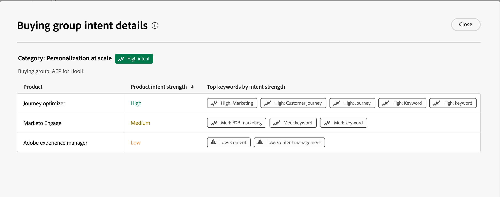

# 智能仪表板

智能仪表板可全面查看购买群组和帐户指标，帮助您更有效地监控和制定营销策略。

要访问&#x200B;_智能仪表板_，请在左侧导航中选择&#x200B;**[!UICONTROL 仪表板]**&#x200B;项。

{width="800" zoomable="yes"}

智能仪表板还提供对帐户和购买群组详细信息页面的访问权限，这些页面包括两种类型的创作AI功能：

* 帐户和购买组的摘要
* 人员、购买组和帐户的目标检测

{{intent-data-note}}

要利用智能功能板提供的信息和见解，您的Journey Optimizer B2B edition实例必须配备以下所需项目：

| 类型 | 要求 |
| ---- | ----------- |
| [购买团体阶段](#buying-group-stages) | 设置购买组阶段&#x200B;**和**&#x200B;添加到已创建的购买组。 |
| [购买团体焦点](#buying-group-highlights) | 设置购买组阶段&#x200B;**和**&#x200B;添加到已创建的购买组。 |
| [帐户激增](#surging-accounts) | 一个或多个已发布的历程&#x200B;**或**&#x200B;创建了购买群组。 |
| [帐户亮点](#account-highlights) | 一个或多个已发布的历程&#x200B;**或**&#x200B;创建了购买群组。 |
| [联系人覆盖范围](#contact-coverage) | 已创建一个或多个购买组（不需要阶段）。 |
| [联系人重叠](#contact-overlap) | 已创建一个或多个购买组（不需要阶段）。 |
| [帐户详细信息页面](../accounts/account-details.md) | 一个或多个已发布的历程。 |
| [购买群组详细信息页面](../buying-groups/buying-group-details.md) | 已创建一个或多个购买组（不需要阶段）。 |

## 购买群组阶段 {#buying-group-stages}

>[!CONTEXTUALHELP]
>id="ajo-b2b_intelligent_dashboard_buying_group_stages"
>title="购买群组阶段"
>abstract="此图概述了根据所配置的过渡规则，购买群组在不同阶段的进展情况。第一条柱状图显示了所选时间范围内第一天与最后一天相比，特定阶段购买群体的数量变化。"

_[!UICONTROL 购买组阶段]_&#x200B;图表提供了跨不同阶段的购买组进展的概览（[基于管理员设置的过渡规则](../buying-groups/buying-group-stages.md)）。

>[!NOTE]
>
>购买组阶段的可用性需要配置购买组阶段。 请参阅[购买组阶段](../buying-groups/buying-group-stages.md)，了解有关阶段以及如何为购买组定义和启用阶段的详细信息。

{width="800" zoomable="yes"}

该图表使用最新发布的购买群体阶段模型中的购买群体阶段。 每个舞台有两个横条。 第一个栏指示在选定时间范围的第一个日期购买群组的数量。 第二个（比较）是时间范围的最后日期购买群的数量。 您可以将鼠标悬停在每个栏上以查看每个阶段的购买组数量。

{width="400"}

### 创作AI摘要

单击栏可显示所选时段在该阶段中购买组的创作AI摘要。

{width="500"}

生成的摘要根据配置的过渡规则，概述了不同阶段中的购买组进展。

### 时段 {#time-period-stages}

使用右上角的日期过滤器可更改数据可视化的日期范围。 单击向下箭头可设置相对日期范围，或设置自定义开始日期和结束日期。

<!-- {width="300"} -->

### 属性过滤器 {#attribute-filter-stages}

单击左上角的&#x200B;_筛选器_ （ ）图标，使用以下任一属性筛选数据显示：

* 解决方案兴趣
* 帐户
* 阶段名称

<!-- Add screen when the UI is available {width="500"} -->

## 购买群组亮点 {#buying-group-highlights}

>[!CONTEXTUALHELP]
>id="ajo-b2b_intelligent_dashboard_buying_group_highlights_engagement"
>title="按参与度排名前 5 位的购买群组"
>abstract="根据标准化参与度得分，参与度最高的购买群组。"

>[!CONTEXTUALHELP]
>id="ajo-b2b_intelligent_dashboard_buying_group_highlights_velocity"
>title="按速度排名前 5 位的购买群组"
>abstract="根据各阶段进展速度划分的购买群组。"

>[!CONTEXTUALHELP]
>id="ajo-b2b_intelligent_dashboard_buying_group_highlights_stagnant"
>title="按停滞程度排名前 5 位的购买群组"
>abstract="停滞不前的购买群组，尽管完整度得分很高，但在各阶段的进展却不顺利。"

_[!UICONTROL 购买群组亮点]_&#x200B;分区分为三行，以显示有关您组织感兴趣的购买群组的信息。

{width="800" zoomable="yes"}

* **按参与度分类的前5个购买组** — 此行根据参与度得分显示参与度最高的购买组。
* **排名前5的高速购买组** — 此行根据购买组各阶段的进度显示排名最前的购买组。
* **前5个停滞购买组** — 此行显示尽管完整性分数较高，但阶段未进展的最停滞购买组。

每个信息卡都包含以下数据：

* **_购买团体名称_**。 单击名称以打开购买组详细信息页面。
* **_帐户名_**。 单击名称以打开帐户详细信息页面（超链接至帐户详细信息页面）。
* 购买团体的&#x200B;**_当前阶段_**。
* **_参与度得分_**（在所有购买群体中标准化）。 如果所有购买组的最高得分相同，将显示上次更新的得分。
* **_完整性分数_**（范围从1到100）。 如果所有购买组的最高得分相同，将显示上次更新的得分。
* **_类别意图_**。 单击&#x200B;_[!UICONTROL 查看详细信息]_&#x200B;查看意图数据：

  {width="500" zoomable="yes"}

   * 详细信息弹出窗口显示类别名称，意图级别位于顶部。
   * 每行的数据按列组织：产品名称、产品意图强度和按意图强度排列的关键字。
   * 类别、产品和关键字的排序顺序从高到低。 如果每种类型中的一种或多种具有相同的目的强度，则排序使用字母顺序。

  {{intent-data-note}}

在&#x200B;_购买群组摘要_&#x200B;面板的右上角，单击&#x200B;**[!UICONTROL 查看全部]**&#x200B;以导航到“购买群组”列表页面。

### 属性过滤器 {#attribute-filter-bg-highlights}

单击左上角的&#x200B;_筛选器_ （ ）图标，使用以下任一属性筛选数据显示：

* 解决方案兴趣
* 购买群组
* 帐户

<!-- Add screen when the UI is available {width="500"} -->

### 时段 {#time-period-bg-highlights}

使用右上角的日期过滤器可更改数据可视化的日期范围。 单击向下箭头可设置相对日期范围，或设置自定义开始日期和结束日期。

<!-- {width="300"} -->

## 激增帐户 {#account-surge}

>[!CONTEXTUALHELP]
>id="ajo-b2b_intelligent_dashboard_account_surge"
>title="帐户激增"
>abstract="在选定的时间范围内，参与度势头发生显著变化的账户。"

“_[!UICONTROL 激增的帐户]_”部分显示了在所选时间范围内参与量发生显着变化的帐户的可视化图表。

>[!NOTE]
>
>帐户激增数据仅包括Journey Optimizer B2B edition通过帐户历程或购买团体摄取的帐户。

{width="800" zoomable="yes"}

将鼠标悬停在每个栏上可查看每个类别中的帐户数。

{width="400"}

单击条形，以显示所选时间范围内类别中帐户的创作AI摘要。

{width="500"}

### 属性过滤器 {#attribute-filter-acct-surge}

单击左上角的&#x200B;_筛选器_ （ ）图标，使用以下任一属性筛选数据显示：

* 解决方案兴趣
* 行业
* 区域

<!-- Add screen when the UI is available {width="500"} -->

### 时段 {#time-period-acct-surge}

使用右上角的日期过滤器可更改数据可视化的日期范围。 单击向下箭头可设置相对日期范围，或设置自定义开始日期和结束日期。

<!-- {width="300"} -->

## 帐户亮点 {#account-highlights}

>[!CONTEXTUALHELP]
>id="ajo-b2b_intelligent_dashboard_account_highlights_surging"
>title="激增帐户"
>abstract="在选定的时间范围内，参与度势头显著提升的账户 "

>[!CONTEXTUALHELP]
>id="ajo-b2b_intelligent_dashboard_account_highlights_at_risk"
>title="有风险的账户"
>abstract="在选定的时间范围内，参与度势头显著下降的帐户。"

_[!UICONTROL 帐户高亮显示]_&#x200B;部分被组织为两行，以显示有关您组织感兴趣的帐户的信息。

>[!NOTE]
>
>帐户突出显示数据仅包括Journey Optimizer B2B edition通过帐户历程或购买组摄取的帐户。

{width="800" zoomable="yes"}

* **正在激增的帐户** — 此行显示了在所选时间范围内参与量显着增加的帐户。
* **有风险的帐户** — 此行显示了在所选时间范围内参与动量显着减少的帐户。

每个信息卡都包含以下数据：

* **_帐户名_**。 单击名称以打开帐户详细信息页面。
* 帐户的生成AI摘要&#x200B;**__**。
* **_关键词意图_**。 单击&#x200B;_[!UICONTROL 查看详细信息]_&#x200B;查看意图数据：

  {width="500" zoomable="yes"}

   * 详细信息弹出窗口显示类别名称，意图级别位于顶部。
   * 每行的数据按列组织：产品名称、产品意图强度和按意图强度排列的关键字。
   * 类别、产品和关键字的排序顺序从高到低。 如果每种类型中的一种或多种具有相同的目的强度，则排序使用字母顺序。

  {{intent-data-note}}
<!-- 
At the top right of the _Buying group highlights_ panel, click **[!UICONTROL View All]** to navigate to the Buying groups list page. -->

### 属性过滤器 {#attribute-filter-acct-highlights}

单击左上角的&#x200B;_筛选器_ （）图标，以使用以下任一属性筛选数据显示：

* 解决方案兴趣
* 购买群组

<!-- Add screen when the UI is available {width="500"} -->

### 时段 {#time-period-acct-highlights}

使用右上角的日期过滤器可更改数据可视化的日期范围。 单击向下箭头可设置相对日期范围，或设置自定义开始日期和结束日期。

<!-- {width="300"} -->

## 联系覆盖范围 {#contact-coverage}

>[!CONTEXTUALHELP]
>id="ajo-b2b_intelligent_dashboard_contact_coverage"
>title="联系覆盖范围"
>abstract="显示与解决方案兴趣相关的具有特定角色的联系人数量。角色和解决方案兴趣的分配基于购买组模板。"

_[!UICONTROL 联系人覆盖范围]_&#x200B;部分显示与解决方案兴趣相关的特定角色的联系人数量的可视化图表。 角色和解决方案兴趣的分配基于购买组模板。

>[!NOTE]
>
>联系范围数据基于在Journey Optimizer B2B edition实例中创建的购买群组。

{width="800" zoomable="yes"}

将鼠标悬停在每个单元格上可查看角色/解决方案感兴趣的联系人数量。

{width="400"}

单击单元格可查看有关角色/解决方案感兴趣的联系人的详细信息。

{width="700" zoomable="yes"}

### 属性过滤器 {#attribute-filter-contact-coverage}

单击左上角的&#x200B;_筛选器_ （）图标，以使用以下任一属性筛选数据显示：

* 解决方案兴趣
* 帐户

<!-- Add screen when the UI is available {width="500"} -->

## 联系重叠 {#contact-overlap}

>[!CONTEXTUALHELP]
>id="ajo-b2b_intelligent_dashboard_contact_overlap"
>title="联系重叠"
>abstract="由于与多个解决方案兴趣相关联而隶属于多个购买群组的联系人列表。"

_[!UICONTROL 联系人重叠]_&#x200B;部分显示联系人列表，这些联系人由于与多个解决方案兴趣关联而属于多个购买组。

>[!NOTE]
>
>联系人重叠数据基于在Journey Optimizer B2B edition实例中创建的购买组。

{width="800" zoomable="yes"}

单击&#x200B;_信息_ （）以显示包含以下详细信息的表：

* 购买团体名称（单击该名称可打开购买团体详细信息页面）
* 角色
* 解决方案兴趣
* 产品意图
* 产品

{width="600" zoomable="yes"}

### 属性过滤器 {#attribute-filter-contact-overage}

单击左上角的&#x200B;_筛选器_ （）图标，以使用以下任一属性筛选数据显示：

* 解决方案兴趣
* 角色
* 帐户

<!-- Add screen when the UI is available {width="500"} -->
