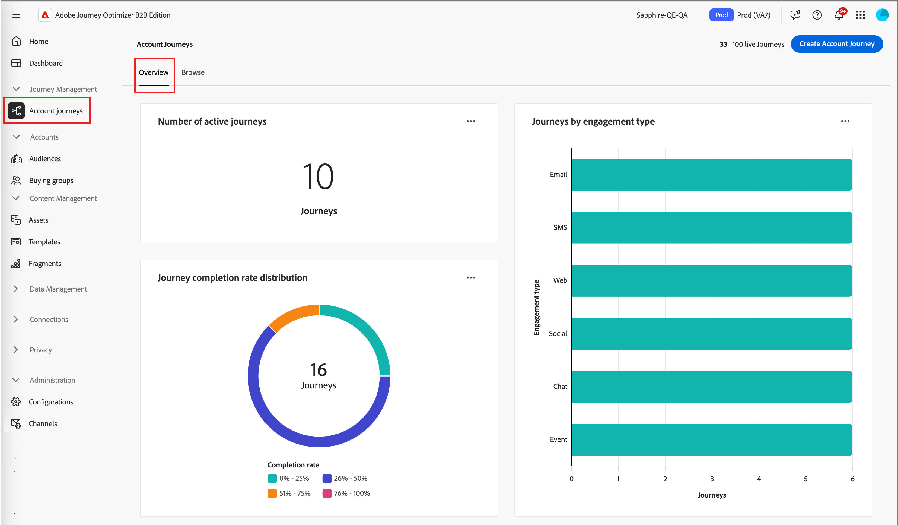

# 帐户历程概述仪表板

此仪表板提供活动帐户历程的全面概述，详细介绍使用圆图和条形图对完成和参与活动进行分类和量化的帐户进度。 它有助于营销人员通过关键交付和参与量度来评估电子邮件和短信渠道的有效性。

此概述适用于已发布的帐户历程，大约需要4个小时才能将数据开始填充到图表和表中。

{width="700" zoomable="yes"}

## 历程完成率分布

此图表根据历程的完成率说明了历程的分布，并分为四个不同的得分区间。 中心图表示历程总数，并提供了总体进度的快速快照。 分段的颜色指示每个分数范围内的历程比例，这使您能够一眼就评估完成趋势。

要查看更多详细信息，请单击右上角的&#x200B;**...**&#x200B;菜单图标。

{width="500"}

## 按参与类型划分的历程

此条形图根据参与类型显示历程的分布，并帮助您确定哪些参与在历程中最常使用。 每个栏表示特定的参与类型，其长度表示包含该类型活动的历程次数。 此可视化图表让您能够清晰而快速地了解客户历程中的参与趋势。

要查看更多详细信息，请单击右上角的&#x200B;**...**&#x200B;菜单图标。

{width="500"}

## 使用数据

要使用数据，请使用每个图表右上角的&#x200B;**...**&#x200B;菜单。

### [!UICONTROL 穿透钻取]

对于圆形图，选择&#x200B;**[!UICONTROL 穿透钻取]**&#x200B;以深入分析数据。

{width="700" zoomable="yes"}

您可以单击右上角的&#x200B;_更多_ (**...**)菜单，然后选择&#x200B;**[!UICONTROL 查看更多]**&#x200B;到[查看扩展数据](#view-more)。

### [!UICONTROL 查看更多]

选择&#x200B;**[!UICONTROL 查看更多]**&#x200B;以查看扩展数据和见解。

{width="700" zoomable="yes"}

显示的弹出窗口包括一个图表和一个表格，其中显示了历程数据的划分情况。

要下载数据，请单击数据表右上角的&#x200B;**[!UICONTROL 下载CSV]**。 要返回&#x200B;_概述_&#x200B;仪表板，请单击&#x200B;**[!UICONTROL 关闭]**。
