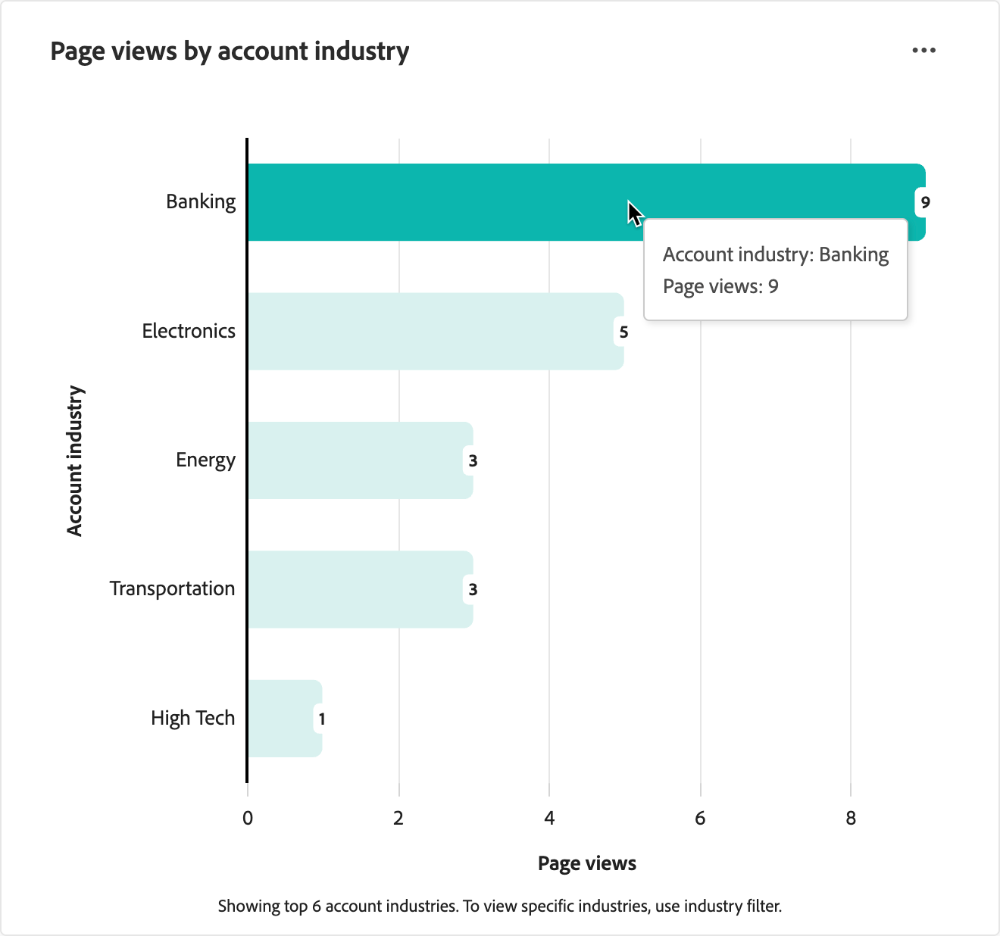

# Web参与仪表板

Web参与仪表板提供Web访客如何与关键内容交互的可见性。 它可跨客户行业和区域细分数据，以帮助您了解参与趋势。 使用此仪表板通过显示Web行为模式来支持战略决策，这些模式为内容战略和帐户定位提供信息。

要访问&#x200B;_Web参与仪表板_，请在左侧导航中选择&#x200B;**[!UICONTROL 仪表板]**&#x200B;项。 然后选择页面顶部的&#x200B;**[!UICONTROL Web参与]**&#x200B;选项卡。

{width="700" zoomable="yes"}

## 筛选数据

单击左上角的&#x200B;_筛选器_ （）图标，以使用以下任意属性筛选显示的数据：

* **[!UICONTROL 帐户区域]** — 按与帐户关联的一个或多个选定地理区域筛选数据。
* **[!UICONTROL 帐户行业]** — 按与帐户关联的一个或多个选定行业分类筛选数据。
* **[!UICONTROL 日期范围]** — 按选定的日期范围筛选数据。 默认范围是当前日期。

{width="500"}

为要用于筛选数据的每个属性选择任意数量的值，然后单击&#x200B;**[!UICONTROL 应用]**。

## [!UICONTROL 热门页面浏览量] {#top-page-views}

>[!CONTEXTUALHELP]
>id="ajo-b2b_web_engagement_top_page_views"
>title="最多页面浏览量"
>abstract="您网站上浏览次数最多的页面，有助于识别哪些内容带来了最多流量。"

此表显示前10个最常查看的网页，可帮助您识别哪些内容与访客产生最多共鸣。 数据包括：

| 列 | 描述 |
| ------ | ----------- |
| 页面名称 | 网页的名称或标题。 |
| 查看次数总计 | 查看页面的总次数。 |
| 已知访客(%) | 已知（已识别）访客获得的页面查看次数的百分比。 |
| 未知访客(%) | 归因未知（匿名）访客的页面查看次数的百分比。 |

{width="650" zoomable="yes"}

## [!UICONTROL 按帐户区域划分的页面浏览量] {#page-views-by-region}

>[!CONTEXTUALHELP]
>id="ajo-b2b_web_engagement_page_views_by_region"
>title="按帐户区域划分的页面浏览量"
>abstract="按关联帐户的地理区域划分的网站访客分布情况。"

此可视化图表显示按帐户区域划分的访客计数。 它说明了不同地理区域中的Web流量如何变化，使您能够根据区域受众定制内容和营销活动。 将鼠标悬停在图表中的条形图上可查看详细信息，包括：

* 帐户区域的名称
* 页面查看次数

{width="500" zoomable="yes"}

## [!UICONTROL 按帐户行业划分的页面浏览量] {#page-views-by-industry}

>[!CONTEXTUALHELP]
>id="ajo-b2b_web_engagement_page_views_by_industry"
>title="按帐户行业划分的页面浏览量"
>abstract="按关联帐户所属行业分类划分的网站访客分布情况。"

此可视化图表显示按帐户行业划分的访客计数。 使用此图表可了解Web流量在不同行业中的变化情况，使您能够制定特定于行业的内容策略。 将鼠标悬停在图表中的条形图上可查看详细信息，包括：

* 帐户行业名称
* 页面查看次数

{width="500" zoomable="yes"}

## 使用数据

要参与处理数据，请使用&#x200B;_更多_ (**...**) 每个图表右上角的菜单，然后选择&#x200B;**[!UICONTROL 查看更多]**&#x200B;以查看扩展数据和见解。

显示的弹出窗口包括一个图表和一个显示数据细分的表格。

要下载数据，请单击数据表右上角的&#x200B;**[!UICONTROL 下载CSV]**。

{width="700" zoomable="yes"}
