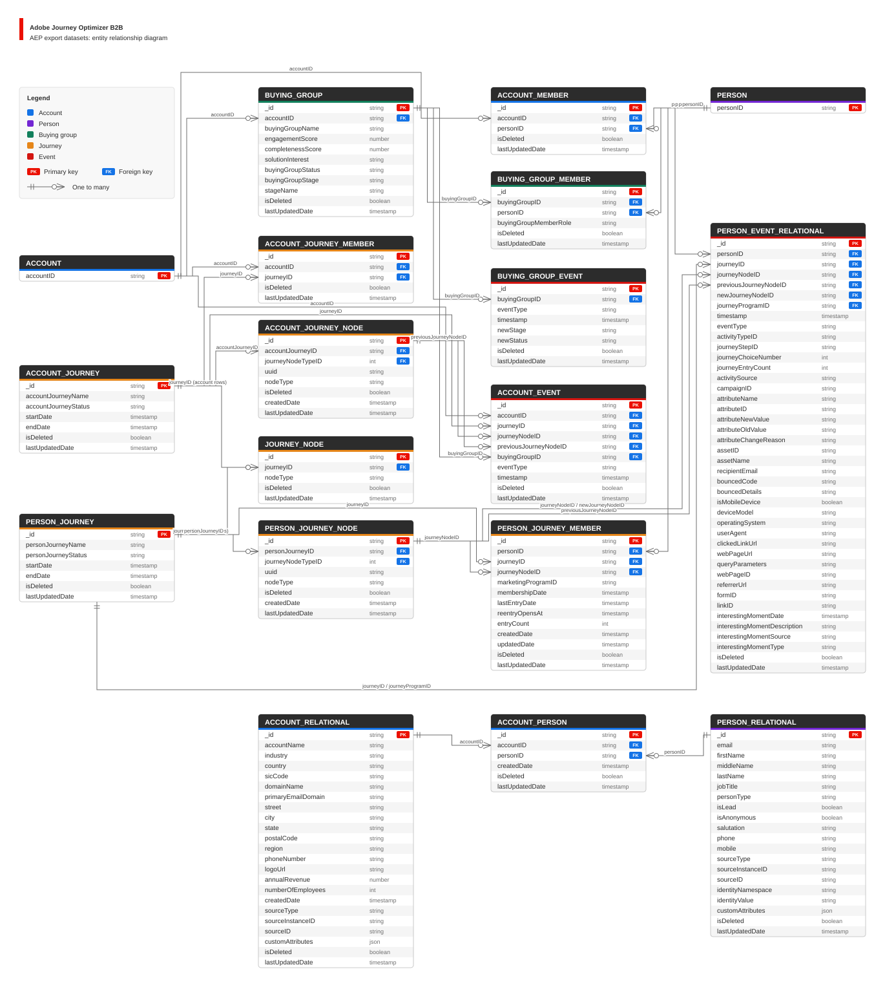

# 已导出[!DNL Experience Platform]数据集

[!DNL Adobe Journey Optimizer B2B Edition]在[!DNL Adobe Experience Platform]中提供帐户、人员、购买群组和历程信息。 数据集是相关记录的集合。 例如，人员数据集描述人员，成员资格数据集将人员连接到帐户或历程，事件数据集记录打开电子邮件等操作。

使用本指南了解每个数据集包含的内容、其字段的含义以及相关记录如何连接。 数据集名称遵循以下模式：

**`AJOB2B-<datasetVersion>-<entity>`**

此处，`<entity>`描述了信息，如`person`、`account_relational`或`person_event`。 `<datasetVersion>`标识数据集的字段定义的版本。 部分标题显示记录的名称；您的[!DNL Experience Platform]环境可能还包含旧版本。

有关支持这些导出的命名空间和架构设置，请参阅[B2B命名空间和架构](./namespaces-schemas.md)。

>[!NOTE]
>
>Adobe会保留旧的数据集版本，以避免中断现有的使用。 因此，您可能会在沙盒中找到同一数据集的多个版本。 如果您不再使用旧数据集，则可以请求Adobe将其删除。 在请求移除之前，请确认该数据集不再使用。

## 阅读本指南

- **字段名称：**&#x200B;与您在[!DNL Experience Platform]中看到的确切名称。 点分隔字段中的级别，如`consents.marketing.email.val`。
- **记录ID：**&#x200B;标识该数据集中的记录。
- **关系：**&#x200B;命名标识符匹配的数据集和字段。 例如，`Matches AJOB2B-1_5_4-buying_group (_id)`表示该字段引用购买组的`_id`。 匹配完整的标识符；请勿缩短它或尝试重建它。
- **标准Adobe格式：**&#x200B;使用Adobe的共享字段定义。
- **相关记录格式：**&#x200B;将信息组织为可以使用匹配标识符连接的记录。

例如，`buying_group_member.buyingGroupID`与`buying_group._id`匹配，其`personID`与`person_relational._id`或人员数据集的`personKey.sourceKey`匹配。 这些链接可帮助您了解谁属于购买组。 [!DNL Experience Platform]不会仅从链接中自动创建报告或受众。

某些标识符引用了本指南中没有单独数据集的信息，例如营销计划。 关系列会记录这一点，而不是命名此处不存在的数据集。

当记录被标记为已删除时，`isDeleted`为`true`；当记录未标记为已删除时，`false`。 请勿将其视为一般活跃成员或同意指示器。 `lastUpdatedDate`描述了记录的最新数据更新；对于事件，请使用`timestamp`了解活动何时发生。 空白字段表示信息不可用或不适用于该记录。

相关记录数据集使用版本`1_5_4`。 如果某个字段当前未填充或需要特殊处理，相关部分将说明客户可见的限制。

受众是指一组符合选定标准的人员。 受众创建的可用性取决于您用于将信息组合到人员配置文件中的[!DNL Experience Platform]设置。 数据集在[!DNL Experience Platform]中的存在本身并不意味着它可用于分段。

## 选择数据集

| 您希望了解的内容 | 要查找的数据集 |
|---|---|
| 人员及其电子邮件偏好设置 | `person` |
| 帐户详细信息和人员联系人详细信息 | `account_relational`, `person_relational` |
| 哪些人员与帐户关联 | `account_member`, `account_person` |
| 购买组、其成员和状态更改 | `buying_group`, `buying_group_member`, `buying_group_event` |
| 帐户历程和参与帐户 | `account_journey`, `account_journey_member`, `account_event` |
| 人员历程和参与人员 | `person_journey`, `person_journey_member` |
| 历程中的步骤 | `account_journey_node`, `person_journey_node`, `journey_node` |
| 电子邮件、Web和其他受支持的人员活动 | `person_event`, `person_event_relational` |

以下部分提供了完整数据集名称和字段详细信息。 历程描述了整体体验；成员资格将个人或帐户连接到该历程；事件描述了所发生的事。

+++实体关系图

导出到[!DNL Adobe Experience Platform]的数据集的实体关系图

+++

## `AJOB2B-1_5_1-person`

每个记录描述个人、其标识符和电子邮件营销偏好设置。 将其用于人员级别报表，并在配置了配置文件的情况下，用于帮助构建受众。

**格式：**&#x200B;标准Adobe格式

| 字段名称 | 关系 | 它告诉您的内容 |
|------------|-------------|-------------|
| `personID` | 记录Id | 人员的标识符。 使用完整值匹配相关记录。 |
| `personKey.sourceID` |  | 已连接系统中的人员标识符。 |
| `personKey.sourceInstanceID` |  | [!DNL Experience Platform]环境或连接帐户的标识符。 |
| `personKey.sourceType` |  | 连接的产品的名称。 |
| `personKey.sourceKey` |  | 用于匹配相关记录的完整人员标识符。 |
| `identityMap` |  | 帮助[!DNL Experience Platform]在连接的数据中识别同一人的其他标识符。 |
| `consents.marketing.email.val` |  | 电子邮件营销偏好设置：`n`表示选择退出；`y`表示此字段中未记录任何选择退出。 仅此字段无法建立发送营销电子邮件的权限。 |
| `consents.marketing.email.time` |  | 上次更新电子邮件首选项的日期和时间。 |
| `consents.marketing.email.reason` |  | 提供选择退出的原因（仅在取消订阅时设置）。 |
| `isDeleted` |  | 此人员记录是否标记为已删除。 |

>[!NOTE]
>
>您的组织可能具有此处列出的人员字段以外的其他人员字段。

当您的组织使用自己配置的帐户或人员数据集时，这些记录还可以包括`isDeleted`。 查看[客户拥有的数据集](#customer-owned-datasets)。

## `AJOB2B-1_5_4-account_member`

每条记录会将一个帐户链接到个人。 使用此数据集报告与每个帐户关联的用户；它描述关系，而不是每个用户档案。

**格式：**&#x200B;相关记录格式

| 字段名称 | 关系 | 它告诉您的内容 |
|------------|-------------|-------------|
| `_id` | 记录Id | 关系记录id。 |
| `accountID` | 匹配`AJOB2B-1_5_4-account_relational` (`_id`) | 帐户标识符。 |
| `personID` | 匹配`AJOB2B-1_5_4-person_relational` (`_id`) | 人员标识符。 |
| `isDeleted` |  | 此记录是否标记为已删除。 |
| `lastUpdatedDate` |  | 上次修改时间。 |

## `AJOB2B-1_5_4-buying_group`

每条记录都描述了与帐户关联的购买组，包括其名称、状态、解决方案兴趣以及参与和完整性分数。 当前未填充购买组阶段。

**格式：**&#x200B;相关记录格式

| 字段名称 | 关系 | 它告诉您的内容 |
|------------|-------------|-------------|
| `_id` | 记录Id | 购买团体记录ID（使用完整值）。 |
| `buyingGroupName` |  | 购买团体名称。 |
| `engagementScore` |  | 参与度分数。 |
| `completenessScore` |  | 完整性分数。 |
| `accountID` | 匹配`AJOB2B-1_5_4-account_relational` (`_id`) | 相关帐户标识符。 |
| `solutionInterest` |  | 解决方案兴趣标签。 |
| `buyingGroupStatus` |  | 状态。 |
| `buyingGroupStage` |  | 购买团体阶段名称。 |
| `isDeleted` |  | 此记录是否标记为已删除。 |
| `lastUpdatedDate` |  | 上次修改时间。 |

>[!NOTE]
>
>**可用性说明：** `buyingGroupStage`当前为空。 请勿使用它来按阶段筛选或分组购买群组。

## `AJOB2B-1_5_4-buying_group_member`

每个记录将某人链接到购买组，并记录此人的角色。 使用它来报告购买组构成和角色覆盖率。

`isDeleted`并不总是指示人员是否已从购买组中移除。 请勿单独使用此字段来确定当前成员资格。 没有可用的角色信息时，角色名称可以为空白。

**格式：**&#x200B;相关记录格式

| 字段名称 | 关系 | 它告诉您的内容 |
|------------|-------------|-------------|
| `_id` | 记录Id | 成员资格记录ID。 |
| `buyingGroupID` | 匹配`AJOB2B-1_5_4-buying_group` (`_id`) | 购买组标识符。 |
| `personID` | 匹配`AJOB2B-1_5_4-person_relational` (`_id`) | 人员标识符。 |
| `buyingGroupMemberRole` |  | 角色名称（如果可用）。 |
| `isDeleted` |  | 此记录是否标记为已删除。 |
| `lastUpdatedDate` |  | 上次修改时间。 |

## `AJOB2B-1_5_4-account_journey`

每个记录描述一个帐户历程，包括其名称、状态以及开始和结束日期。 使用它报告帐户的历程生命周期和状态。

**格式：**&#x200B;相关记录格式

| 字段名称 | 关系 | 它告诉您的内容 |
|------------|-------------|-------------|
| `_id` | 记录Id | 记录id历程（使用完整值）。 |
| `accountJourneyName` |  | 历程名称。 |
| `accountJourneyStatus` |  | 状态（例如，草稿、实时、已完成）。 |
| `startDate` |  | 开始时间戳。 |
| `endDate` |  | 结束时间戳。 |
| `isDeleted` |  | 此记录是否标记为已删除。 |
| `lastUpdatedDate` |  | 上次修改时间。 |

## `AJOB2B-1_5_4-account_journey_member`

每个记录将帐户与帐户历程关联。 使用它可识别和报告哪些帐户参与每个历程。

**格式：**&#x200B;相关记录格式

| 字段名称 | 关系 | 它告诉您的内容 |
|------------|-------------|-------------|
| `_id` | 记录Id | 成员资格记录ID。 |
| `accountID` | 匹配`AJOB2B-1_5_4-account_relational` (`_id`) | 帐户标识符。 |
| `journeyID` | 匹配`AJOB2B-1_5_4-account_journey` (`_id`) | 帐户历程标识符。 |
| `isDeleted` |  | 此记录是否标记为已删除。 |
| `lastUpdatedDate` |  | 上次修改时间。 |

## `AJOB2B-1_5_4-person_journey`

每个记录描述人员历程，包括其名称、状态以及开始和结束日期。 使用它报告历程生命周期和以人员为中心的历程的状态。

**格式：**&#x200B;相关记录格式

| 字段名称 | 关系 | 它告诉您的内容 |
|------------|-------------|-------------|
| `_id` | 记录Id | 记录id历程（使用完整值）。 |
| `personJourneyName` |  | 历程名称。 |
| `personJourneyStatus` |  | 状态（例如，草稿、实时、已完成）。 |
| `startDate` |  | 开始时间戳。 |
| `endDate` |  | 结束时间戳。 |
| `isDeleted` |  | 此记录是否标记为已删除。 |
| `lastUpdatedDate` |  | 上次修改时间。 |

## `AJOB2B-1_5_4-person_journey_member`

每个记录描述人员在历程中的成员资格，包括当前历程节点、成员资格和进入日期以及进入计数。 使用它可报告注册、重新进入和历程进度。

**格式：**&#x200B;相关记录格式

| 字段名称 | 关系 | 它告诉您的内容 |
|------------|-------------|-------------|
| `_id` | 记录Id | 成员资格记录ID。 |
| `marketingProgramID` |  | 历程所属的营销计划标识符。 |
| `personID` | 匹配`AJOB2B-1_5_4-person_relational` (`_id`) | 人员标识符。 |
| `journeyID` | 匹配`AJOB2B-1_5_4-person_journey` (`_id`) | 历程标识符。 |
| `journeyNodeID` | 匹配`AJOB2B-1_5_4-person_journey_node` (`_id`) | 人员当前所在历程节点的标识符。 |
| `membershipDate` |  | 此人成为营销计划成员的时间。 |
| `lastEntryDate` |  | 人员上次进入历程的时间。 |
| `reentryOpensAt` |  | 人员可重新进入历程的时间。 |
| `entryCount` |  | 人员进入历程的次数。 |
| `createdDate` |  | 记录创建时间。 |
| `updatedDate` |  | 记录上次更改的时间。 |
| `isDeleted` |  | 此记录是否标记为已删除。 |
| `lastUpdatedDate` |  | 上次修改时间。 |

## `AJOB2B-1_5_4-account_journey_node`

每个记录描述历程中的一个步骤，包括步骤类型及其所属的历程。 历程节点是一个步骤，例如开始、等待或决策。 `person_journey_node`中可能会显示相同的步骤；先将`accountJourneyID`与帐户历程匹配，然后再将步骤视为特定于帐户的步骤。

**格式：**&#x200B;相关记录格式

| 字段名称 | 关系 | 它告诉您的内容 |
|------------|-------------|-------------|
| `_id` | 记录Id | 节点记录ID（使用完整值）。 |
| `accountJourneyID` | 匹配`AJOB2B-1_5_4-account_journey` (`_id`) | 父历程标识符。 |
| `uuid` |  | 历程步骤的其他标识符。 |
| `journeyNodeTypeID` |  | 标识历程步骤类型的编号。 |
| `nodeType` |  | 标识历程步骤类型的标签。 |
| `isDeleted` |  | 此记录是否标记为已删除。 |
| `createdDate` |  | 记录创建时间。 |
| `lastUpdatedDate` |  | 上次修改时间。 |

## `AJOB2B-1_5_4-person_journey_node`

每个记录描述历程中的一个步骤，包括步骤类型及其所属的历程。 `account_journey_node`中可能会显示相同的步骤；先将`personJourneyID`与人员历程匹配，然后再将步骤视为特定于人员。

**格式：**&#x200B;相关记录格式

| 字段名称 | 关系 | 它告诉您的内容 |
|------------|-------------|-------------|
| `_id` | 记录Id | 节点记录ID（使用完整值）。 |
| `personJourneyID` | 匹配`AJOB2B-1_5_4-person_journey` (`_id`) | 父历程标识符。 |
| `uuid` |  | 历程步骤的其他标识符。 |
| `journeyNodeTypeID` |  | 标识历程步骤类型的编号。 |
| `nodeType` |  | 标识历程步骤类型的标签。 |
| `isDeleted` |  | 此记录是否标记为已删除。 |
| `createdDate` |  | 记录创建时间。 |
| `lastUpdatedDate` |  | 上次修改时间。 |

## `AJOB2B-1_5_4-account_event`

每个记录会捕获一个帐户历程事件：在历程中添加或删除的帐户，或在历程节点之间移动的帐户。 使用`eventType`和`timestamp`构建帐户活动时间线；当事件是买方集团属性时`buyingGroupID`可用。

**格式：**&#x200B;相关记录格式

`eventType`提供有关所发生情况的信息。 下表描述了每种活动的字段。

当前未为这些事件填充`lastUpdatedDate`。 使用`timestamp`作为活动日期。

### 帐户已添加到历程(`account.addAccountToJourney`)

| 字段名称 | 关系 | 它告诉您的内容 |
|------------|-------------|-------------|
| `_id` | 记录Id | 活动标识符。 |
| `eventType` |  | `account.addAccountToJourney`. |
| `timestamp` |  | 活动发生的时间。 |
| `accountID` | 匹配`AJOB2B-1_5_4-account_relational` (`_id`) | 帐户标识符。 |
| `journeyID` | 匹配`AJOB2B-1_5_4-account_journey` (`_id`) | 历程标识符。 |
| `journeyNodeID` | 匹配`AJOB2B-1_5_4-account_journey_node` (`_id`) | 历程的节点标识符。 |
| `buyingGroupID` | 匹配`AJOB2B-1_5_4-buying_group` (`_id`) | 购买组标识符，当历程添加是购买组归因时。 |
| `lastUpdatedDate` |  | 记录更新时间。 当前为空；使用活动日期的时间戳。 |

### 已从历程(`account.removeAccountFromJourney`)中删除帐户

| 字段名称 | 关系 | 它告诉您的内容 |
|------------|-------------|-------------|
| `_id` | 记录Id | 活动标识符。 |
| `eventType` |  | `account.removeAccountFromJourney`. |
| `timestamp` |  | 活动发生的时间。 |
| `accountID` | 匹配`AJOB2B-1_5_4-account_relational` (`_id`) | 帐户标识符。 |
| `journeyID` | 匹配`AJOB2B-1_5_4-account_journey` (`_id`) | 历程标识符。 |
| `journeyNodeID` | 匹配`AJOB2B-1_5_4-account_journey_node` (`_id`) | 历程的节点标识符。 |
| `buyingGroupID` | 匹配`AJOB2B-1_5_4-buying_group` (`_id`) | 购买组标识符，当历程移除是购买组属性时。 |
| `lastUpdatedDate` |  | 记录更新时间。 当前为空；使用活动日期的时间戳。 |

### 帐户在历程步骤之间移动(`account.changeAccountJourneyNode`)

| 字段名称 | 关系 | 它告诉您的内容 |
|------------|-------------|-------------|
| `_id` | 记录Id | 活动标识符。 |
| `eventType` |  | `account.changeAccountJourneyNode`. |
| `timestamp` |  | 活动发生的时间。 |
| `accountID` | 匹配`AJOB2B-1_5_4-account_relational` (`_id`) | 帐户标识符。 |
| `journeyID` | 匹配`AJOB2B-1_5_4-account_journey` (`_id`) | 历程标识符。 |
| `journeyNodeID` | 匹配`AJOB2B-1_5_4-account_journey_node` (`_id`) | 历程的节点标识符。 |
| `previousJourneyNodeID` | 引用`AJOB2B-1_5_4-account_journey_node` (`_id`)；值可能不匹配 | 上一个历程步骤的标识符。 此值可能与相应的步骤记录不匹配；不要仅依赖它来连接记录。 |
| `buyingGroupID` | 匹配`AJOB2B-1_5_4-buying_group` (`_id`) | 购买组标识符，当节点更改是购买组归因时。 |
| `lastUpdatedDate` |  | 记录更新时间。 当前为空；使用活动日期的时间戳。 |

## `AJOB2B-1_5_4-buying_group_event`

每条记录捕获购买组状态的更改，包括新状态及其更改时间。 当前未填充new-stage字段。

**格式：**&#x200B;相关记录格式

### 购买组状态已更改(`buyingGroup.changeStatus`)

| 字段名称 | 关系 | 它告诉您的内容 |
|------------|-------------|-------------|
| `_id` | 记录Id | 活动标识符。 |
| `eventType` |  | `buyingGroup.changeStatus`. |
| `timestamp` |  | 活动发生的时间。 |
| `buyingGroupID` | 匹配`AJOB2B-1_5_4-buying_group` (`_id`) | 购买组标识符。 |
| `newStatus` |  | 新状态值。 |
| `newStage` |  | 新的团购阶段。 当前为空白。 |
| `lastUpdatedDate` |  | 记录更新时间。 |

>[!NOTE]
>
>**可用性说明：**&#x200B;使用`newStatus`报告状态更改。 请勿使用`newStage`报告阶段更改，因为它当前为空。

## `AJOB2B-1_5-person_event`

每个记录描述人员级别的Web、电子邮件或其他支持的活动事件。 使用`eventType`和`timestamp`分析一段时间内的行为，仅为匹配的事件类型填充特定于事件的详细信息。

**格式：**&#x200B;标准Adobe格式

`eventType`告诉您发生了什么。 下表描述了每种活动的字段。 不适用于事件的详细信息为空白。

### 电子邮件已发送(`directMarketing.emailSent`)

| 字段名称 | 关系 | 它告诉您的内容 |
|------------|-------------|-------------|
| `_id` | 记录Id | 活动标识符。 |
| `eventType` |  | `directMarketing.emailSent`. |
| `timestamp` |  | 活动发生的时间。 |
| `personID` | 匹配`AJOB2B-1_5_1-person` (`personID`) | 人员标识符。 |
| `personKey.sourceID` |  | 已连接系统中的人员标识符。 |
| `personKey.sourceType` |  | 连接的产品的名称。 |
| `personKey.sourceInstanceID` |  | [!DNL Experience Platform]环境或连接帐户的标识符。 |
| `personKey.sourceKey` |  | 用于匹配相关记录的完整人员标识符。 |
| `directMarketing.emailSent.mailingKey.sourceID` |  | 邮件资产ID。 |
| `directMarketing.emailSent.mailingKey.sourceType` |  | 连接的产品的名称。 |
| `directMarketing.emailSent.mailingKey.sourceInstanceID` |  | 实例ID |
| `directMarketing.emailSent.mailingKey.sourceKey` |  | 完整的电子邮件内容标识符。 |
| `directMarketing.emailSent.mailingName` |  | 邮件名称。 |
| `_experience.journeyOrchestration.stepEvents.journeyID` | 匹配`AJOB2B-1_5_4-person_journey` (`_id`) | 历程id（如果已归因）。 |
| `_experience.journeyOrchestration.stepEvents.nodeID` | 匹配`AJOB2B-1_5_4-person_journey_node` (`_id`) | 历程的节点ID（如果已归因）。 |

### 电子邮件已送达(`directMarketing.emailDelivered`)

| 字段名称 | 关系 | 它告诉您的内容 |
|------------|-------------|-------------|
| `_id` | 记录Id | 活动标识符。 |
| `eventType` |  | `directMarketing.emailDelivered`. |
| `timestamp` |  | 活动发生的时间。 |
| `personID` | 匹配`AJOB2B-1_5_1-person` (`personID`) | 人员标识符。 |
| `personKey.sourceID` |  | 已连接系统中的人员标识符。 |
| `personKey.sourceType` |  | 连接的产品的名称。 |
| `personKey.sourceInstanceID` |  | [!DNL Experience Platform]环境或连接帐户的标识符。 |
| `personKey.sourceKey` |  | 用于匹配相关记录的完整人员标识符。 |
| `directMarketing.mailingKey.sourceID` |  | 邮件资产ID。 |
| `directMarketing.mailingKey.sourceType` |  | 连接的产品的名称。 |
| `directMarketing.mailingKey.sourceInstanceID` |  | 实例ID |
| `directMarketing.mailingKey.sourceKey` |  | 完整的电子邮件内容标识符。 |
| `directMarketing.mailingName` |  | 邮件名称。 |
| `directMarketing.email` |  | 电子邮件地址。 |
| `_experience.journeyOrchestration.stepEvents.journeyID` | 匹配`AJOB2B-1_5_4-person_journey` (`_id`) | 历程id（如果已归因）。 |
| `_experience.journeyOrchestration.stepEvents.nodeID` | 匹配`AJOB2B-1_5_4-person_journey_node` (`_id`) | 历程的节点ID（如果已归因）。 |

### 电子邮件取消订阅(`directMarketing.emailUnsubscribed`)

| 字段名称 | 关系 | 它告诉您的内容 |
|------------|-------------|-------------|
| `_id` | 记录Id | 活动标识符。 |
| `eventType` |  | `directMarketing.emailUnsubscribed`. |
| `timestamp` |  | 活动发生的时间。 |
| `personID` | 匹配`AJOB2B-1_5_1-person` (`personID`) | 人员标识符。 |
| `personKey.sourceID` |  | 已连接系统中的人员标识符。 |
| `personKey.sourceType` |  | 连接的产品的名称。 |
| `personKey.sourceInstanceID` |  | [!DNL Experience Platform]环境或连接帐户的标识符。 |
| `personKey.sourceKey` |  | 用于匹配相关记录的完整人员标识符。 |
| `directMarketing.mailingKey.sourceID` |  | 邮件资产ID。 |
| `directMarketing.mailingKey.sourceType` |  | 连接的产品的名称。 |
| `directMarketing.mailingKey.sourceInstanceID` |  | 实例ID |
| `directMarketing.mailingKey.sourceKey` |  | 完整的电子邮件内容标识符。 |
| `directMarketing.mailingName` |  | 邮件名称。 |
| `directMarketing.email` |  | 电子邮件地址。 |
| `_experience.journeyOrchestration.stepEvents.journeyID` | 匹配`AJOB2B-1_5_4-person_journey` (`_id`) | 历程id（如果已归因）。 |
| `_experience.journeyOrchestration.stepEvents.nodeID` | 匹配`AJOB2B-1_5_4-person_journey_node` (`_id`) | 历程的节点ID（如果已归因）。 |

### 电子邮件已打开(`directMarketing.emailOpened`)

| 字段名称 | 关系 | 它告诉您的内容 |
|------------|-------------|-------------|
| `_id` | 记录Id | 活动标识符。 |
| `eventType` |  | `directMarketing.emailOpened`. |
| `timestamp` |  | 活动发生的时间。 |
| `personID` | 匹配`AJOB2B-1_5_1-person` (`personID`) | 人员标识符。 |
| `personKey.sourceID` |  | 已连接系统中的人员标识符。 |
| `personKey.sourceType` |  | 连接的产品的名称。 |
| `personKey.sourceInstanceID` |  | [!DNL Experience Platform]环境或连接帐户的标识符。 |
| `personKey.sourceKey` |  | 用于匹配相关记录的完整人员标识符。 |
| `directMarketing.mailingKey.sourceID` |  | 邮件资产ID。 |
| `directMarketing.mailingKey.sourceType` |  | 连接的产品的名称。 |
| `directMarketing.mailingKey.sourceInstanceID` |  | 实例ID |
| `directMarketing.mailingKey.sourceKey` |  | 完整的电子邮件内容标识符。 |
| `directMarketing.mailingName` |  | 邮件名称。 |
| `directMarketing.email` |  | 电子邮件地址。 |
| `_experience.journeyOrchestration.stepEvents.journeyID` | 匹配`AJOB2B-1_5_4-person_journey` (`_id`) | 历程id（如果已归因）。 |
| `_experience.journeyOrchestration.stepEvents.nodeID` | 匹配`AJOB2B-1_5_4-person_journey_node` (`_id`) | 历程的节点ID（如果已归因）。 |
| `device.isMobileDevice` |  | 是否记录了活动的移动设备。 |
| `device.model` |  | 设备或电子邮件客户端信息。 |
| `environment.browserDetails.userAgent` |  | 浏览器或电子邮件客户端信息。 |
| `environment.operatingSystem` |  | 操作系统。 |

### 已单击电子邮件链接(`directMarketing.emailClicked`)

| 字段名称 | 关系 | 它告诉您的内容 |
|------------|-------------|-------------|
| `_id` | 记录Id | 活动标识符。 |
| `eventType` |  | `directMarketing.emailClicked`. |
| `timestamp` |  | 活动发生的时间。 |
| `personID` | 匹配`AJOB2B-1_5_1-person` (`personID`) | 人员标识符。 |
| `personKey.sourceID` |  | 已连接系统中的人员标识符。 |
| `personKey.sourceType` |  | 连接的产品的名称。 |
| `personKey.sourceInstanceID` |  | [!DNL Experience Platform]环境或连接帐户的标识符。 |
| `personKey.sourceKey` |  | 用于匹配相关记录的完整人员标识符。 |
| `directMarketing.mailingKey.sourceID` |  | 邮件资产ID。 |
| `directMarketing.mailingKey.sourceType` |  | 连接的产品的名称。 |
| `directMarketing.mailingKey.sourceInstanceID` |  | 实例ID |
| `directMarketing.mailingKey.sourceKey` |  | 完整的电子邮件内容标识符。 |
| `directMarketing.mailingName` |  | 邮件名称。 |
| `directMarketing.email` |  | 电子邮件地址。 |
| `directMarketing.linkURL` |  | 已单击链接URL。 |
| `_experience.journeyOrchestration.stepEvents.journeyID` | 匹配`AJOB2B-1_5_4-person_journey` (`_id`) | 历程id（如果已归因）。 |
| `_experience.journeyOrchestration.stepEvents.nodeID` | 匹配`AJOB2B-1_5_4-person_journey_node` (`_id`) | 历程的节点ID（如果已归因）。 |
| `device.isMobileDevice` |  | 是否记录了活动的移动设备。 |
| `device.model` |  | 设备或电子邮件客户端信息。 |
| `environment.browserDetails.userAgent` |  | 浏览器或电子邮件客户端信息。 |
| `environment.operatingSystem` |  | 操作系统。 |

### 电子邮件已退回(`directMarketing.emailBounced`)

| 字段名称 | 关系 | 它告诉您的内容 |
|------------|-------------|-------------|
| `_id` | 记录Id | 活动标识符。 |
| `eventType` |  | `directMarketing.emailBounced`. |
| `timestamp` |  | 活动发生的时间。 |
| `personID` | 匹配`AJOB2B-1_5_1-person` (`personID`) | 人员标识符。 |
| `personKey.sourceID` |  | 已连接系统中的人员标识符。 |
| `personKey.sourceType` |  | 连接的产品的名称。 |
| `personKey.sourceInstanceID` |  | [!DNL Experience Platform]环境或连接帐户的标识符。 |
| `personKey.sourceKey` |  | 用于匹配相关记录的完整人员标识符。 |
| `directMarketing.mailingKey.sourceID` |  | 邮件资产ID。 |
| `directMarketing.mailingKey.sourceType` |  | 连接的产品的名称。 |
| `directMarketing.mailingKey.sourceInstanceID` |  | 实例ID |
| `directMarketing.mailingKey.sourceKey` |  | 完整的电子邮件内容标识符。 |
| `directMarketing.mailingName` |  | 邮件名称。 |
| `directMarketing.email` |  | 电子邮件地址。 |
| `directMarketing.emailBouncedCode` |  | 退回类别/代码。 |
| `directMarketing.emailBouncedDetails` |  | 详细信息文本。 |
| `_experience.journeyOrchestration.stepEvents.journeyID` | 匹配`AJOB2B-1_5_4-person_journey` (`_id`) | 历程id（如果已归因）。 |
| `_experience.journeyOrchestration.stepEvents.nodeID` | 匹配`AJOB2B-1_5_4-person_journey_node` (`_id`) | 历程的节点ID（如果已归因）。 |

### 电子邮件软退回(`directMarketing.emailBouncedSoft`)

| 字段名称 | 关系 | 它告诉您的内容 |
|------------|-------------|-------------|
| `_id` | 记录Id | 活动标识符。 |
| `eventType` |  | `directMarketing.emailBouncedSoft`. |
| `timestamp` |  | 活动发生的时间。 |
| `personID` | 匹配`AJOB2B-1_5_1-person` (`personID`) | 人员标识符。 |
| `personKey.sourceID` |  | 已连接系统中的人员标识符。 |
| `personKey.sourceType` |  | 连接的产品的名称。 |
| `personKey.sourceInstanceID` |  | [!DNL Experience Platform]环境或连接帐户的标识符。 |
| `personKey.sourceKey` |  | 用于匹配相关记录的完整人员标识符。 |
| `directMarketing.mailingKey.sourceID` |  | 邮件资产ID。 |
| `directMarketing.mailingKey.sourceType` |  | 连接的产品的名称。 |
| `directMarketing.mailingKey.sourceInstanceID` |  | 实例ID |
| `directMarketing.mailingKey.sourceKey` |  | 完整的电子邮件内容标识符。 |
| `directMarketing.mailingName` |  | 邮件名称。 |
| `directMarketing.email` |  | 电子邮件地址。 |
| `directMarketing.emailBouncedCode` |  | 退回类别/代码。 |
| `directMarketing.emailBouncedDetails` |  | 详细信息文本。 |
| `_experience.journeyOrchestration.stepEvents.journeyID` | 匹配`AJOB2B-1_5_4-person_journey` (`_id`) | 历程id（如果已归因）。 |
| `_experience.journeyOrchestration.stepEvents.nodeID` | 匹配`AJOB2B-1_5_4-person_journey_node` (`_id`) | 历程的节点ID（如果已归因）。 |

### 网页已查看(`web.webpagedetails.pageViews`)

| 字段名称 | 关系 | 它告诉您的内容 |
|------------|-------------|-------------|
| `_id` | 记录Id | 活动标识符。 |
| `eventType` |  | `web.webpagedetails.pageViews`. |
| `timestamp` |  | 活动发生的时间。 |
| `personID` | 匹配`AJOB2B-1_5_1-person` (`personID`) | 人员标识符。 |
| `personKey.sourceID` |  | 已连接系统中的人员标识符。 |
| `personKey.sourceType` |  | 连接的产品的名称。 |
| `personKey.sourceInstanceID` |  | [!DNL Experience Platform]环境或连接帐户的标识符。 |
| `personKey.sourceKey` |  | 用于匹配相关记录的完整人员标识符。 |
| `web.webPageDetails.webPageKey.sourceID` |  | 页面资产ID。 |
| `web.webPageDetails.webPageKey.sourceType` |  | 连接的产品的名称。 |
| `web.webPageDetails.webPageKey.sourceInstanceID` |  | 实例ID |
| `web.webPageDetails.webPageKey.sourceKey` |  | 完整页面标识符。 |
| `web.webPageDetails.name` |  | 页面名称。 |
| `web.webPageDetails.URL` |  | 页面URL。 |
| `web.webPageDetails.queryParameters` |  | Web地址中包含的其他信息。 |
| `web.webPageDetails.webPageID` |  | 页面ID。 |
| `environment.browserDetails.userAgent` |  | 浏览器或电子邮件客户端信息。 |
| `web.webReferrer.URL` |  | 反向链接URL。 |

### 已单击Web链接(`web.webinteraction.linkClicks`)

| 字段名称 | 关系 | 它告诉您的内容 |
|------------|-------------|-------------|
| `_id` | 记录Id | 活动标识符。 |
| `eventType` |  | `web.webinteraction.linkClicks`. |
| `timestamp` |  | 活动发生的时间。 |
| `personID` | 匹配`AJOB2B-1_5_1-person` (`personID`) | 人员标识符。 |
| `personKey.sourceID` |  | 已连接系统中的人员标识符。 |
| `personKey.sourceType` |  | 连接的产品的名称。 |
| `personKey.sourceInstanceID` |  | [!DNL Experience Platform]环境或连接帐户的标识符。 |
| `personKey.sourceKey` |  | 用于匹配相关记录的完整人员标识符。 |
| `web.webInteraction.webInteractionKey.sourceID` |  | 交互资产ID。 |
| `web.webInteraction.webInteractionKey.sourceType` |  | 连接的产品的名称。 |
| `web.webInteraction.webInteractionKey.sourceInstanceID` |  | 实例ID |
| `web.webInteraction.webInteractionKey.sourceKey` |  | 完整的交互标识符。 |
| `web.webInteraction.linkID` |  | 链接ID。 |
| `web.webInteraction.linkURL` |  | 目标 URL。 |
| `web.webPageDetails.queryParameters` |  | Web地址中包含的其他信息。 |
| `web.webPageDetails.webPageID` |  | 页面ID。 |
| `environment.browserDetails.userAgent` |  | 浏览器或电子邮件客户端信息。 |
| `web.webReferrer.URL` |  | 反向链接URL。 |

### 表单已提交(`web.formFilledOut`)

| 字段名称 | 关系 | 它告诉您的内容 |
|------------|-------------|-------------|
| `_id` | 记录Id | 活动标识符。 |
| `eventType` |  | `web.formFilledOut`. |
| `timestamp` |  | 活动发生的时间。 |
| `personID` | 匹配`AJOB2B-1_5_1-person` (`personID`) | 人员标识符。 |
| `personKey.sourceID` |  | 已连接系统中的人员标识符。 |
| `personKey.sourceType` |  | 连接的产品的名称。 |
| `personKey.sourceInstanceID` |  | [!DNL Experience Platform]环境或连接帐户的标识符。 |
| `personKey.sourceKey` |  | 用于匹配相关记录的完整人员标识符。 |
| `web.fillOutForm.webFormKey.sourceID` |  | 表单资产ID。 |
| `web.fillOutForm.webFormKey.sourceType` |  | 连接的产品的名称。 |
| `web.fillOutForm.webFormKey.sourceInstanceID` |  | 实例ID |
| `web.fillOutForm.webFormKey.sourceKey` |  | 完整的表单标识符。 |
| `web.fillOutForm.webFormID` |  | 表单ID |
| `web.fillOutForm.webFormName` |  | 表单名称。 |
| `web.webPageDetails.queryParameters` |  | Web地址中包含的其他信息。 |
| `web.webPageDetails.webPageID` |  | 页面ID。 |
| `environment.browserDetails.userAgent` |  | 浏览器或电子邮件客户端信息。 |
| `web.webReferrer.URL` |  | 反向链接URL。 |

### 已记录有趣的时刻(`leadOperation.interestingMoment`)

| 字段名称 | 关系 | 它告诉您的内容 |
|------------|-------------|-------------|
| `_id` | 记录Id | 活动标识符。 |
| `eventType` |  | `leadOperation.interestingMoment`. |
| `timestamp` |  | 活动发生的时间。 |
| `personID` | 匹配`AJOB2B-1_5_1-person` (`personID`) | 人员标识符。 |
| `personKey.sourceID` |  | 已连接系统中的人员标识符。 |
| `personKey.sourceType` |  | 连接的产品的名称。 |
| `personKey.sourceInstanceID` |  | [!DNL Experience Platform]环境或连接帐户的标识符。 |
| `personKey.sourceKey` |  | 用于匹配相关记录的完整人员标识符。 |
| `leadOperation.interestingMoment.date` |  | 时间日期/时间。 |
| `leadOperation.interestingMoment.description` |  | 描述。 |
| `leadOperation.interestingMoment.source` |  | 相关产品或营销策划的名称。 |
| `leadOperation.interestingMoment.type` |  | 键入标签。 |
| `_experience.journeyOrchestration.stepEvents.journeyID` | 匹配`AJOB2B-1_5_4-person_journey` (`_id`) | 历程id（如果已归因）。 |
| `_experience.journeyOrchestration.stepEvents.nodeID` | 匹配`AJOB2B-1_5_4-person_journey_node` (`_id`) | 历程的节点ID（如果已归因）。 |

## `AJOB2B-1_5_4-journey_node`

每个记录描述一个历程步骤、它所属的历程以及步骤的类型。 相同的步骤可以显示在帐户和人员历程步骤数据集中。 将`journeyID`与相应的历程匹配；不要多次计算步骤，因为它出现在多个数据集中。

**格式：**&#x200B;相关记录格式

| 字段名称 | 关系 | 它告诉您的内容 |
|------------|-------------|-------------|
| `_id` | 记录Id | 节点记录ID（使用完整值）。 |
| `journeyID` | 匹配`AJOB2B-1_5_4-account_journey`或`AJOB2B-1_5_4-person_journey` (`_id`) | 父历程标识符。 |
| `nodeType` |  | 一种历程步骤，例如开始、结束、等待或决策。 |
| `isDeleted` |  | 此记录是否标记为已删除。 |
| `lastUpdatedDate` |  | 上次修改时间。 |

## `AJOB2B-1_5_4-account_relational`

每个记录描述一个帐户，包括其组织详细信息、位置、大小、收入和自定义字段。 使用此信息可将帐户上下文添加到购买小组和历程报表。

**格式：**&#x200B;相关记录格式

| 字段名称 | 关系 | 它告诉您的内容 |
|------------|-------------|-------------|
| `_id` | 记录Id | 帐户记录ID（使用完整值）。 |
| `accountName` |  | 帐户名称。 |
| `industry` |  | 行业分类。 |
| `country` |  | 国家。 |
| `sicCode` |  | 标准行业分类代码。 |
| `domainName` |  | 主Web域。 |
| `primaryEmailDomain` |  | 主电子邮件域。 |
| `street` |  | 街道地址。 |
| `city` |  | 城市。 |
| `state` |  | 省/市/自治区或区域。 |
| `postalCode` |  | 邮政编码。 |
| `region` |  | 地理区域。 |
| `phoneNumber` |  | 电话号码。 |
| `logoUrl` |  | 帐户徽标的URL。 |
| `annualRevenue` |  | 年收入。 |
| `numberOfEmployees` |  | 员工人数。 |
| `createdDate` |  | 记录创建时间。 |
| `sourceType` |  | 用于标识帐户的已连接系统的名称。 |
| `sourceInstanceID` |  | 您的组织或帐户在该连接系统中的标识符。 |
| `sourceID` |  | 所连接系统中的帐户标识符。 |
| `customAttributes` |  | 自定义字段名称和值一起存储为文本。 |
| `isDeleted` |  | 此记录是否标记为已删除。 |
| `lastUpdatedDate` |  | 上次修改时间。 |

## `AJOB2B-1_5_4-person_relational`

每个记录描述一个人，包括其联系信息、工作详细信息、标识符和自定义字段。 使用它可将人员信息添加到成员资格、历程和活动报表。

**格式：**&#x200B;相关记录格式

| 字段名称 | 关系 | 它告诉您的内容 |
|------------|-------------|-------------|
| `_id` | 记录Id | 用于匹配相关记录的完整人员标识符。 |
| `email` |  | 电子邮件地址。 |
| `firstName` |  | 名字。 |
| `middleName` |  | 中间名。 |
| `lastName` |  | 姓氏。 |
| `jobTitle` |  | 职务。 |
| `personType` |  | 人员类型：联系人、潜在客户或待定潜在客户。 |
| `isLead` |  | 此人是否为潜在客户。 |
| `isAnonymous` |  | 此人是否匿名。 |
| `salutation` |  | 致敬或敬意。 |
| `phone` |  | 主要电话号码。 |
| `mobile` |  | 手机号码。 |
| `sourceType` |  | 用于标识人员的已连接系统的名称，如[!DNL Marketo Engage]。 |
| `sourceInstanceID` |  | 您的组织或帐户在该连接系统中的标识符。 |
| `sourceID` |  | 所连接系统中的人员标识符。 |
| `identityNamespace` |  | 标识附加人员标识符类型的标签。 |
| `identityValue` |  | 辅助标识的值。 |
| `customAttributes` |  | 自定义字段名称和值一起存储为文本。 |
| `isDeleted` |  | 此记录是否标记为已删除。 |
| `lastUpdatedDate` |  | 上次修改时间。 |

## `AJOB2B-1_5_4-account_person`

每个记录都将帐户配置文件链接到人员配置文件。 使用它可报告帐户和人员配置文件数据集之间的关系。

**格式：**&#x200B;相关记录格式

| 字段名称 | 关系 | 它告诉您的内容 |
|------------|-------------|-------------|
| `_id` | 记录Id | 帐户 — 人员关系记录ID（使用完整值）。 |
| `accountID` | 匹配`AJOB2B-1_5_4-account_relational` (`_id`) | 完整的帐户标识符（引用`account_relational._id`）。 |
| `personID` | 匹配`AJOB2B-1_5_4-person_relational` (`_id`) | 完整人员标识符（引用`person_relational._id`）。 |
| `createdDate` |  | 创建帐户 — 人员关系的时间。 |
| `isDeleted` |  | 此记录是否标记为已删除。 |
| `lastUpdatedDate` |  | 上次修改时间。 |

## `AJOB2B-1_5_4-person_event_relational`

每个记录描述受支持的人员活动，例如查看网页、与电子邮件交互或移动历程。 使用`eventType`和`activityTypeID`了解所发生的情况。 仅填充与该类型活动相关的详细信息。

**格式：**&#x200B;相关记录格式

以下字段列表涵盖所有支持的活动类型。 单个记录仅包含适用于其活动的详细信息。

>[!NOTE]
>
>**可用性：**&#x200B;某些活动可能具有空白`_id`。 不要假定每个活动都有一个可用的记录标识符。 数据集不能保证完整的活动历史记录。

为历程活动(`person.journeyAdd`、`person.journeyRemove`、`person.journeyStart`、`person.journeyEnd`、`person.journeyNodeTransition`、`person.journeySplitNode`)以及与“更新人员配置文件”历程步骤关联的`person.attributeChanged`历程提供了活动详细信息（`journeyID`、`journeyNodeID`、`journeyStepID`和类似字段）。

仅为`person.attributeChanged`填充属性更改字段(`attributeName`、`attributeID`、`attributeNewValue`、`attributeOldValue`、`attributeChangeReason`)。

| 字段名称 | 关系 | 它告诉您的内容 |
|------------|-------------|-------------|
| `_id` | 记录Id | 活动的标识符（如果可用）。 |
| `timestamp` |  | 活动发生的时间。 |
| `eventType` |  | 活动标签。 值： `web.webpagedetails.pageViews`、`web.formFilledOut`、`web.webinteraction.linkClicks`、`directMarketing.emailSent`、`directMarketing.emailDelivered`、`directMarketing.emailBounced`、`directMarketing.emailBouncedSoft`、`directMarketing.emailUnsubscribed`、`directMarketing.emailOpened`、`directMarketing.emailClicked`、`leadOperation.interestingMoment`、`person.attributeChanged`、`person.journeyAdd`、`person.journeyRemove`、`person.journeyStart`、`person.journeyEnd`、`person.journeyNodeTransition`、`person.journeySplitNode`。 |
| `activityTypeID` |  | 活动代码。 将其与`eventType`一起使用，以区分共享相同事件标签的活动。 |
| `personID` | 匹配`AJOB2B-1_5_4-person_relational` (`_id`) | 用于将活动与人员记录匹配的完整人员标识符。 |
| `journeyID` | 匹配`AJOB2B-1_5_4-person_journey` (`_id`) | 完整历程标识符。 对于与历程无关联的活动，留空。 |
| `journeyNodeID` | 匹配`AJOB2B-1_5_4-person_journey_node` (`_id`) | 完整历程步骤标识符。 对于与历程无关联的活动，留空。 |
| `previousJourneyNodeID` | 匹配`AJOB2B-1_5_4-person_journey_node` (`_id`) | 上一个历程节点（为`person.journeyNodeTransition`和`person.journeySplitNode`填充）。 |
| `newJourneyNodeID` | 匹配`AJOB2B-1_5_4-person_journey_node` (`_id`) | 目标历程节点ID （`person.journeyNodeTransition`和`person.journeySplitNode`）。 通常等于`journeyNodeID`。 |
| `journeyStepID` |  | 与活动关联的历程步骤的标识符。 |
| `journeyChoiceNumber` |  | `person.journeySplitNode`的拆分选择编号。 记录为整数。 |
| `journeyEntryCount` |  | 此人进入历程（在历程添加/开始事件中填充）的次数。 记录为整数。 |
| `journeyProgramID` | 本指南中没有单独的营销项目数据集 | 与历程活动关联的营销计划的标识符。 |
| `activitySource` |  | 与活动关联的产品或操作的名称。 |
| `campaignID` |  | 当活动为营销活动归因时，为[!DNL Marketo Engage]营销活动ID。 |
| `attributeName` |  | 更改字段的名称（仅限`person.attributeChanged`）。 |
| `attributeID` |  | 更改字段的标识符（仅限`person.attributeChanged`）。 |
| `attributeNewValue` |  | 新字段值，记录为文本（仅限`person.attributeChanged`）。 |
| `attributeOldValue` |  | 上一个字段值，记录为文本（仅限`person.attributeChanged`）。 |
| `attributeChangeReason` |  | 更改的原因标签（仅限`person.attributeChanged`）。 |
| `assetID` |  | 相关电子邮件内容、页面或表单的标识符。 |
| `assetName` |  | 相关内容的名称。 |
| `recipientEmail` |  | 收件人电子邮件地址（如果可用）。 仅针对活动代码&#x200B;**27**（软退回）和&#x200B;**48**（销售电子邮件软退回）填充；对于其他电子邮件活动为空。 对于这些活动，使用`personID`查找人员记录。 `assetName`标识电子邮件内容，而不是收件人的地址。 |
| `bouncedCode` |  | 退回类别代码（仅限emailBounced / emailBouncedSoft）。 |
| `bouncedDetails` |  | 详细的退回原因（仅限emailBounced / emailBouncedSoft）。 |
| `isMobileDevice` |  | 是否记录了打开或单击电子邮件的移动设备。 |
| `deviceModel` |  | 设备型号（仅限emailOpen/emailClicked）。 |
| `operatingSystem` |  | 操作系统（仅限emailOpen/emailClicked）。 |
| `userAgent` |  | 浏览器或电子邮件客户端信息，用于电子邮件打开、电子邮件点击和Web活动。 |
| `clickedLinkUrl` |  | 已单击电子邮件链接URL（仅限电子邮件已单击）。 |
| `webPageUrl` |  | 网页URL （仅限`web.webpagedetails.pageViews`）。 |
| `queryParameters` |  | 网址中的其他信息，用于页面查看、表单提交或Web链接点击。 |
| `webPageID` |  | [!DNL Marketo Engage]网页ID(pageViews、formFilledOut、linkClicks)。 |
| `referrerUrl` |  | 反向链接URL(pageViews、formFilledOut、linkClicks)。 |
| `formID` |  | [!DNL Marketo Engage]表单ID （仅限`web.formFilledOut`）。 |
| `linkID` |  | [!DNL Marketo Engage]链接ID （仅限`web.webinteraction.linkClicks`）。 |
| `interestingMomentDate` |  | 时刻日期（仅限`leadOperation.interestingMoment`）。 |
| `interestingMomentDescription` |  | 自由文本描述（仅限interestedMoment）。 |
| `interestingMomentSource` |  | 相关产品或营销活动（仅限interestedMoment）。 |
| `interestingMomentType` |  | 类别/类型（仅限interestedMoment）。 |
| `isDeleted` |  | 此记录是否标记为已删除。 |
| `lastUpdatedDate` |  | 上次修改时间。 |

### 按活动类型列出的字段引用

下表显示了哪些详细信息适用于每个活动。 其他详细信息为空白。 某些活动共享相同的`eventType`标签：代码8和48都使用`directMarketing.emailBounced`。 使用`activityTypeID`区分它们。

#### 网页已查看(`web.webpagedetails.pageViews`) （活动类型1）

| 字段名称 | 关系 | 它告诉您的内容 |
|------------|-------------|-------------|
| `_id`, `timestamp`, `eventType`, `activityTypeID`, `personID` | 记录ID： `_id`；`personID`与`AJOB2B-1_5_4-person_relational` (`_id`)匹配 | 常用字段。 |
| `assetID` |  | 页面ID。 |
| `assetName` |  | 页面名称。 |
| `webPageUrl` |  | 页面URL。 |
| `queryParameters` |  | Web地址中包含的其他信息。 |
| `webPageID` |  | [!DNL Marketo Engage]网页id。 |
| `referrerUrl` |  | 反向链接URL。 |
| `userAgent` |  | 浏览器或电子邮件客户端信息。 |
| `isDeleted`, `lastUpdatedDate` |  | 常用字段。 |

#### 表单已提交(`web.formFilledOut`)（活动类型2）

| 字段名称 | 关系 | 它告诉您的内容 |
|------------|-------------|-------------|
| `_id`, `timestamp`, `eventType`, `activityTypeID`, `personID` | 记录ID： `_id`；`personID`与`AJOB2B-1_5_4-person_relational` (`_id`)匹配 | 常用字段。 |
| `assetID` |  | 表单ID |
| `assetName` |  | 表单名称。 |
| `formID` |  | [!DNL Marketo Engage]表单id。 |
| `queryParameters` |  | Web地址中包含的其他信息。 |
| `webPageID` |  | [!DNL Marketo Engage]网页id。 |
| `referrerUrl` |  | 反向链接URL。 |
| `userAgent` |  | 浏览器或电子邮件客户端信息。 |
| `isDeleted`, `lastUpdatedDate` |  | 常用字段。 |

#### 已单击Web链接(`web.webinteraction.linkClicks`)（活动类型3）

| 字段名称 | 关系 | 它告诉您的内容 |
|------------|-------------|-------------|
| `_id`, `timestamp`, `eventType`, `activityTypeID`, `personID` | 记录ID： `_id`；`personID`与`AJOB2B-1_5_4-person_relational` (`_id`)匹配 | 常用字段。 |
| `assetID` |  | 互动/链接ID。 |
| `assetName` |  | 目标 URL。 |
| `linkID` |  | [!DNL Marketo Engage]链接id。 |
| `queryParameters` |  | Web地址中包含的其他信息。 |
| `webPageID` |  | [!DNL Marketo Engage]网页id。 |
| `referrerUrl` |  | 反向链接URL。 |
| `userAgent` |  | 浏览器或电子邮件客户端信息。 |
| `isDeleted`, `lastUpdatedDate` |  | 常用字段。 |

#### 已发送电子邮件(`directMarketing.emailSent`)（活动类型6、39）

| 字段名称 | 关系 | 它告诉您的内容 |
|------------|-------------|-------------|
| `_id`, `timestamp`, `eventType`, `activityTypeID`, `personID` | 记录ID： `_id`；`personID`与`AJOB2B-1_5_4-person_relational` (`_id`)匹配 | 常用字段。 |
| `assetID` |  | 邮件ID。 |
| `assetName` |  | 邮件名称。 |
| `campaignID` |  | 当营销活动已归因时，为[!DNL Marketo Engage]营销活动ID。 |
| `isDeleted`, `lastUpdatedDate` |  | 常用字段。 |

#### 电子邮件已送达(`directMarketing.emailDelivered`) （活动类型7、45）

| 字段名称 | 关系 | 它告诉您的内容 |
|------------|-------------|-------------|
| `_id`, `timestamp`, `eventType`, `activityTypeID`, `personID` | 记录ID： `_id`；`personID`与`AJOB2B-1_5_4-person_relational` (`_id`)匹配 | 常用字段。 |
| `assetID` |  | 邮件ID。 |
| `assetName` |  | 邮件名称。 |
| `campaignID` |  | 当营销活动已归因时，为[!DNL Marketo Engage]营销活动ID。 |
| `isDeleted`, `lastUpdatedDate` |  | 常用字段。 |

#### 电子邮件取消订阅(`directMarketing.emailUnsubscribed`) （活动类型9）

| 字段名称 | 关系 | 它告诉您的内容 |
|------------|-------------|-------------|
| `_id`, `timestamp`, `eventType`, `activityTypeID`, `personID` | 记录ID： `_id`；`personID`与`AJOB2B-1_5_4-person_relational` (`_id`)匹配 | 常用字段。 |
| `assetID` |  | 邮件ID。 |
| `assetName` |  | 邮件名称。 |
| `campaignID` |  | 当营销活动已归因时，为[!DNL Marketo Engage]营销活动ID。 |
| `isDeleted`, `lastUpdatedDate` |  | 常用字段。 |

#### 电子邮件已打开(`directMarketing.emailOpened`) （活动类型10、40）

| 字段名称 | 关系 | 它告诉您的内容 |
|------------|-------------|-------------|
| `_id`, `timestamp`, `eventType`, `activityTypeID`, `personID` | 记录ID： `_id`；`personID`与`AJOB2B-1_5_4-person_relational` (`_id`)匹配 | 常用字段。 |
| `assetID` |  | 邮件ID。 |
| `assetName` |  | 邮件名称。 |
| `isMobileDevice` |  | 是否记录了活动的移动设备。 |
| `deviceModel` |  | 设备型号。 |
| `operatingSystem` |  | 操作系统。 |
| `userAgent` |  | 浏览器或电子邮件客户端信息。 |
| `campaignID` |  | 当营销活动已归因时，为[!DNL Marketo Engage]营销活动ID。 |
| `isDeleted`, `lastUpdatedDate` |  | 常用字段。 |

#### 已单击电子邮件链接(`directMarketing.emailClicked`)（活动类型11、41）

| 字段名称 | 关系 | 它告诉您的内容 |
|------------|-------------|-------------|
| `_id`, `timestamp`, `eventType`, `activityTypeID`, `personID` | 记录ID： `_id`；`personID`与`AJOB2B-1_5_4-person_relational` (`_id`)匹配 | 常用字段。 |
| `assetID` |  | 邮件ID。 |
| `assetName` |  | 邮件名称。 |
| `clickedLinkUrl` |  | 已单击链接URL。 |
| `isMobileDevice` |  | 是否记录了活动的移动设备。 |
| `deviceModel` |  | 设备型号。 |
| `operatingSystem` |  | 操作系统。 |
| `userAgent` |  | 浏览器或电子邮件客户端信息。 |
| `campaignID` |  | 当营销活动已归因时，为[!DNL Marketo Engage]营销活动ID。 |
| `isDeleted`, `lastUpdatedDate` |  | 常用字段。 |

#### 电子邮件退回(`directMarketing.emailBounced`)：硬退回（活动类型8）

| 字段名称 | 关系 | 它告诉您的内容 |
|------------|-------------|-------------|
| `_id`, `timestamp`, `eventType`, `activityTypeID`, `personID` | 记录ID： `_id`；`personID`与`AJOB2B-1_5_4-person_relational` (`_id`)匹配 | 常用字段。 |
| `assetID` |  | 邮件ID。 |
| `assetName` |  | 邮件名称。 |
| `bouncedCode` |  | 退回类别代码。 |
| `bouncedDetails` |  | 详细的退回原因。 |
| `campaignID` |  | 当营销活动已归因时，为[!DNL Marketo Engage]营销活动ID。 |
| `isDeleted`, `lastUpdatedDate` |  | 常用字段。 |

此活动共享活动代码为48的`directMarketing.emailBounced`标签，但代码8的`recipientEmail`为空。 使用`activityTypeID`区分这两者。

#### 电子邮件退回(`directMarketing.emailBounced`)：销售电子邮件软退回（活动类型48）

| 字段名称 | 关系 | 它告诉您的内容 |
|------------|-------------|-------------|
| `_id`, `timestamp`, `eventType`, `activityTypeID`, `personID` | 记录ID： `_id`；`personID`与`AJOB2B-1_5_4-person_relational` (`_id`)匹配 | 常用字段。 |
| `assetID` |  | 邮件ID。 |
| `assetName` |  | 邮件名称。 |
| `recipientEmail` |  | 收件人电子邮件地址。 |
| `bouncedCode` |  | 退回类别代码。 |
| `bouncedDetails` |  | 详细的退回原因。 |
| `campaignID` |  | 当营销活动已归因时，为[!DNL Marketo Engage]营销活动ID。 |
| `isDeleted`, `lastUpdatedDate` |  | 常用字段。 |

#### 电子邮件软退回(`directMarketing.emailBouncedSoft`)（活动类型27）

| 字段名称 | 关系 | 它告诉您的内容 |
|------------|-------------|-------------|
| `_id`, `timestamp`, `eventType`, `activityTypeID`, `personID` | 记录ID： `_id`；`personID`与`AJOB2B-1_5_4-person_relational` (`_id`)匹配 | 常用字段。 |
| `assetID` |  | 邮件ID。 |
| `assetName` |  | 邮件名称。 |
| `recipientEmail` |  | 收件人电子邮件地址。 |
| `bouncedCode` |  | 退回类别代码。 |
| `bouncedDetails` |  | 详细的退回原因。 |
| `campaignID` |  | 当营销活动已归因时，为[!DNL Marketo Engage]营销活动ID。 |
| `isDeleted`, `lastUpdatedDate` |  | 常用字段。 |

#### 已记录有趣的时刻(`leadOperation.interestingMoment`)（活动类型46）

| 字段名称 | 关系 | 它告诉您的内容 |
|------------|-------------|-------------|
| `_id`, `timestamp`, `eventType`, `activityTypeID`, `personID` | 记录ID： `_id`；`personID`与`AJOB2B-1_5_4-person_relational` (`_id`)匹配 | 常用字段。 |
| `interestingMomentDate` |  | 时间日期/时间。 |
| `interestingMomentDescription` |  | 自由文本描述。 |
| `interestingMomentSource` |  | 相关产品或营销策划的名称。 |
| `interestingMomentType` |  | 键入标签。 |
| `isDeleted`, `lastUpdatedDate` |  | 常用字段。 |

未为此活动类型填充`assetID`和`assetName`。

#### 人员字段已更改(`person.attributeChanged`)（活动类型13）

仅当更改与历程关联时包含，例如“更新人员配置文件”步骤。 历程外部的更改不包括在内。

| 字段名称 | 关系 | 它告诉您的内容 |
|------------|-------------|-------------|
| `_id`, `timestamp`, `eventType`, `activityTypeID`, `personID` | 记录ID： `_id`；`personID`与`AJOB2B-1_5_4-person_relational` (`_id`)匹配 | 常用字段。 |
| `attributeName` |  | 已更改的字段的名称。 |
| `attributeID` |  | 已更改的字段的标识符。 |
| `attributeNewValue` |  | 新字段值，记录为文本。 |
| `attributeOldValue` |  | 上一个字段值，记录为文本。 |
| `attributeChangeReason` |  | 更改的原因标签。 |
| `journeyID` | 匹配`AJOB2B-1_5_4-person_journey` (`_id`) | 历程标识符。 |
| `journeyNodeID` | 匹配`AJOB2B-1_5_4-person_journey_node` (`_id`) | 历程的节点标识符。 |
| `journeyStepID` |  | 历程步骤的标识符。 |
| `journeyProgramID` | 本指南中没有单独的营销项目数据集 | 项目ID历程。 |
| `activitySource` |  | 与活动关联的产品或操作。 |
| `isDeleted`, `lastUpdatedDate` |  | 常用字段。 |

#### 添加到历程或开始历程的人员(`person.journeyAdd`、`person.journeyStart`)（活动类型182、184）

| 字段名称 | 关系 | 它告诉您的内容 |
|------------|-------------|-------------|
| `_id`, `timestamp`, `eventType`, `activityTypeID`, `personID` | 记录ID： `_id`；`personID`与`AJOB2B-1_5_4-person_relational` (`_id`)匹配 | 常用字段。 |
| `journeyID` | 匹配`AJOB2B-1_5_4-person_journey` (`_id`) | 历程标识符。 |
| `journeyNodeID` | 匹配`AJOB2B-1_5_4-person_journey_node` (`_id`) | 历程的节点标识符。 |
| `journeyStepID` |  | 历程步骤的标识符。 |
| `journeyEntryCount` |  | 此人进入历程的次数。 |
| `journeyProgramID` | 本指南中没有单独的营销项目数据集 | 项目ID历程。 |
| `activitySource` |  | 与活动关联的产品或操作。 |
| `isDeleted`, `lastUpdatedDate` |  | 常用字段。 |

#### 从历程中删除或结束历程的人员(`person.journeyRemove`、`person.journeyEnd`)（活动类型183、185）

| 字段名称 | 关系 | 它告诉您的内容 |
|------------|-------------|-------------|
| `_id`, `timestamp`, `eventType`, `activityTypeID`, `personID` | 记录ID： `_id`；`personID`与`AJOB2B-1_5_4-person_relational` (`_id`)匹配 | 常用字段。 |
| `journeyID` | 匹配`AJOB2B-1_5_4-person_journey` (`_id`) | 历程标识符。 |
| `journeyNodeID` | 匹配`AJOB2B-1_5_4-person_journey_node` (`_id`) | 历程的节点标识符。 |
| `journeyStepID` |  | 历程步骤的标识符。 |
| `journeyProgramID` | 本指南中没有单独的营销项目数据集 | 项目ID历程。 |
| `activitySource` |  | 与活动关联的产品或操作。 |
| `isDeleted`, `lastUpdatedDate` |  | 常用字段。 |

#### 人员关注历程分支(`person.journeySplitNode`)（活动类型186）

| 字段名称 | 关系 | 它告诉您的内容 |
|------------|-------------|-------------|
| `_id`, `timestamp`, `eventType`, `activityTypeID`, `personID` | 记录ID： `_id`；`personID`与`AJOB2B-1_5_4-person_relational` (`_id`)匹配 | 常用字段。 |
| `journeyID` | 匹配`AJOB2B-1_5_4-person_journey` (`_id`) | 历程标识符。 |
| `journeyNodeID` | 匹配`AJOB2B-1_5_4-person_journey_node` (`_id`) | 历程节点标识符（拆分节点）。 |
| `previousJourneyNodeID` | 匹配`AJOB2B-1_5_4-person_journey_node` (`_id`) | 拆分前人员所在的节点。 |
| `newJourneyNodeID` | 匹配`AJOB2B-1_5_4-person_journey_node` (`_id`) | 人员移动到的节点（通常等于`journeyNodeID`）。 |
| `journeyStepID` |  | 历程步骤的标识符。 |
| `journeyChoiceNumber` |  | 拆分的哪个分支。 |
| `journeyProgramID` | 本指南中没有单独的营销项目数据集 | 项目ID历程。 |
| `activitySource` |  | 与活动关联的产品或操作。 |
| `isDeleted`, `lastUpdatedDate` |  | 常用字段。 |

#### 人员在历程步骤之间移动(`person.journeyNodeTransition`)（活动类型600）

| 字段名称 | 关系 | 它告诉您的内容 |
|------------|-------------|-------------|
| `_id`, `timestamp`, `eventType`, `activityTypeID`, `personID` | 记录ID： `_id`；`personID`与`AJOB2B-1_5_4-person_relational` (`_id`)匹配 | 常用字段。 |
| `journeyID` | 匹配`AJOB2B-1_5_4-person_journey` (`_id`) | 历程标识符。 |
| `journeyNodeID` | 匹配`AJOB2B-1_5_4-person_journey_node` (`_id`) | 当前历程节点标识符。 |
| `previousJourneyNodeID` | 匹配`AJOB2B-1_5_4-person_journey_node` (`_id`) | 人员从中过渡的节点。 |
| `newJourneyNodeID` | 匹配`AJOB2B-1_5_4-person_journey_node` (`_id`) | 人员过渡到的节点（通常等于`journeyNodeID`）。 |
| `journeyStepID` |  | 历程步骤的标识符。 |
| `journeyProgramID` | 本指南中没有单独的营销项目数据集 | 项目ID历程。 |
| `activitySource` |  | 与活动关联的产品或操作。 |
| `isDeleted`, `lastUpdatedDate` |  | 常用字段。 |

## 客户拥有的数据集 {#customer-owned-datasets}

您的组织可以使用自己的帐户或人员的[!DNL Experience Platform]数据集。 配置后，[!DNL Adobe Journey Optimizer B2B Edition]可以向这些数据集添加信息，而不是创建另一个帐户或人员数据集。

它们的名称和可用字段取决于贵组织的设置。 使用配置的帐户或人员标识符识别匹配记录。 在这些数据集中保留记录不会自动使其对受众可用；可用性取决于您的[!DNL Experience Platform]配置。
