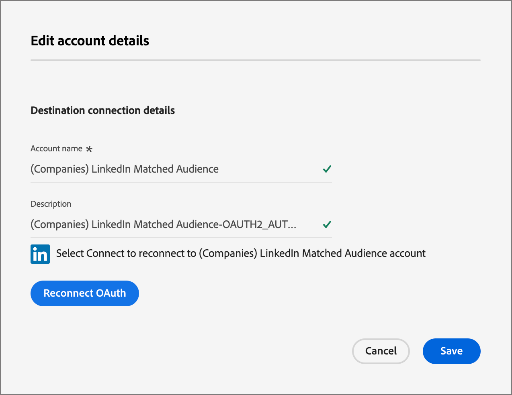

# LinkedIn 帐户匹配的受众

Journey Optimizer B2B edition提供通过帐户匹配受众生成LinkedIn广告受众的功能，旨在帮助您在购买群组中填充空角色。 通过定义一组购买群组过滤器，您可以维护一个LinkedIn匹配受众，以定位与您的购买群组参数匹配的潜在客户。 此功能利用 Experience Platform Destinations 来管理集成的某些方面。数据流上限为10个。

在从Journey Optimizer B2B edition启动数据流之前，必须至少有一个[（公司） LinkedIn匹配的受众目标连接器](https://experienceleague.adobe.com/zh-hans/docs/experience-platform/destinations/catalog/social/linkedin#connect){target="_blank"}的实例具有在Experience Platform应用程序中配置的LinkedIn营销活动管理器帐户。

## 配置新的 LinkedIn 帐户连接 {#linkedin-destination-setup}

>[!CONTEXTUALHELP]
>id="ajo-b2b_linkedin_destination_setup"
>title="需要设置 LinkedIn 目标"
>abstract="将按购买群组过滤的帐户发送到 Linkedin 目标，以便与潜在的购买群组成员参与。您可以为 10 个不同的过滤帐户组创建最多 10 个数据流。要开始使用此功能，请先添加 Linkedin 目标。"

1. 在Experience Platform中，转到左侧导航栏中的&#x200B;**[!UICONTROL 连接]** > **[!UICONTROL 目标]**，然后选择&#x200B;**[!UICONTROL 目录]**&#x200B;选项卡。

1. 在目录中，找到&#x200B;**[!UICONTROL （公司） LinkedIn匹配的受众]**&#x200B;连接器。

   >[!TIP]
   >
   >您可以在搜索框中输入`LinkedIn`以快速查找连接器。

1. 在连接器卡中，单击&#x200B;_更多_ (**...**)图标，然后选择&#x200B;**[!UICONTROL 配置新目标]**。

   {width="800" zoomable="yes"}

1. 选择&#x200B;**[!UICONTROL 新帐户]**&#x200B;并单击&#x200B;**[!UICONTROL 连接到目标]**。

   {width="500"}

1. 提供您的LinkedIn凭据并登录。

   身份验证后，LinkedIn帐户将作为Experience Platform中的目标进行连接。

   显示{width="400"}

   >[!IMPORTANT]
   >
   >此时，**不**&#x200B;输入&#x200B;_[!UICONTROL 目标详细信息]_。 只需要连接。

## 更新帐户详细信息

LinkedIn帐户的名称和描述对Journey Optimizer B2B edition中的购买群组可见。 最佳实践是更新此信息，以便与购买群组一起工作的营销人员能够轻松识别此信息。 您可以在Experience Platform或Journey Optimizer B2B edition UI中更改帐户详细信息。

1. 在左侧导航中转到&#x200B;**[!UICONTROL 连接]** > **[!UICONTROL 目标]**，然后选择&#x200B;**[!UICONTROL 帐户]**&#x200B;选项卡。

1. 对于您创建的新帐户，请单击&#x200B;_更多_ (**...**)菜单，然后选择&#x200B;**[!UICONTROL 编辑详细信息]**。

   {width="800" zoomable="yes"}

1. 在对话框中，更新名称和描述。

   {width="500"}

1. 单击&#x200B;**[!UICONTROL 保存]**。

## 激活购买群组的帐户

>[!NOTE]
>
>如果您已有10个数据流，则无法创建另一个数据流。 如果达到最大数量，请先删除Experience Platform中的一个，然后再在Journey Optimizer B2B edition中创建新一个。

1. 在 Journey Optimizer B2B Edition 中，前往左侧导航栏中的&#x200B;**[!UICONTROL 帐户]** > **[!UICONTROL 购买群组]**。

1. 选择&#x200B;**[!UICONTROL 浏览]**&#x200B;选项卡。

1. 单击右上角的&#x200B;**[!UICONTROL 激活到LinkedIn目标]**。

   {width="800" zoomable="yes"}

1. 为数据流提供描述性名称和描述（可选）。

   保存之后，为数据流指定的名称将带有&#x200B;_AJOB2B_&#x200B;前缀，以便帮助识别Experience Platform中的数据流。

1. 输入LinkedIn营销活动管理器帐户[&#128279;](https://www.linkedin.com/help/lms/answer/a424270)的帐户ID。

   您可以在Campaign Manager UI中按帐户名称查找帐户ID。

   {width="700" zoomable="yes"}

1. 单击&#x200B;**[!UICONTROL 选择购买群体过滤器]**&#x200B;并定义帐户受众的参数。

   >[!IMPORTANT]
   >
   >目前，在激活数据流后无法编辑过滤器。 在激活数据流之前，请仔细检查您的工作。

   {width="400"}

   对于&#x200B;**[!UICONTROL 参与度评分]**，运算符 `Between` 和百分比范围都已包含。例如，5.1 和 5 均在 5 和 6 _之间_。

   空条件将被视为`Is Any`。

   单击&#x200B;**[!UICONTROL 保存]**&#x200B;以添加指定的筛选器。

1. 单击&#x200B;**[!UICONTROL 选择LinkedIn目标]**，然后选择要使用的已配置LinkedIn目标。

   激活时，此设置使用目标配置和相应的虚拟区段创建数据流。

1. 双击设置，然后单击右上方的&#x200B;**[!UICONTROL 激活]**。

   在确认对话框中再次单击&#x200B;**[!UICONTROL 激活]**。

   此时会显示一个横幅，其中包含指向Experience Platform中的数据流菜单的链接，以便您查看数据流记录。

## 编排付费媒体参与

您可以通过付费媒体渠道（如LinkedIn广告受众）与帐户成员互动，以获取、培育客户并使其符合销售资格。 使用帐户历程中的&#x200B;_执行操作_&#x200B;节点，通过最适合不同帐户成员的外部渠道自动与帐户的关键成员进行交互。

>[!VIDEO](https://video.tv.adobe.com/v/3448682/?learn=on&captions=chi_hans)