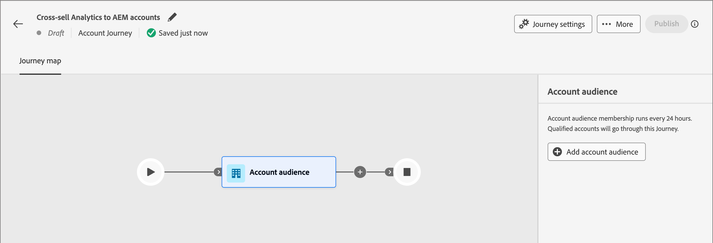

# 帐户受众历程节点

帐户受众节点指定哪些帐户进入历程。 当您[创建帐户历程](./create-publish-journey.md#create-a-journey)时，该历程始终以定义其输入的帐户受众节点开始。

对此历程节点使用以下输入选项之一：

* **[帐户受众](../audiences/account-audience-overview.md)** — 帐户受众表示从Experience Platform分段服务同步的基本受众。
* **[帐户列表](../accounts/account-lists.md)** — 帐户列表是指定帐户的集合，用于目标历程编排。 帐户使用定义的条件（如行业、位置或公司规模）列出指定帐户的目标。

## 设置帐户受众节点的受众

1. 单击&#x200B;**[!UICONTROL 帐户受众]**&#x200B;节点。 此操作在右侧显示节点属性。

   {width="700" zoomable="yes"}

1. 为进入历程的帐户选择输入类型：

   * **[!UICONTROL 帐户受众]**

     选择帐户受众选项。 然后，单击&#x200B;**[!UICONTROL 添加帐户受众]**。

     在&#x200B;_[!UICONTROL 添加受众]_&#x200B;对话框中，选择之前创建的受众区段。 然后，单击&#x200B;**[!UICONTROL 添加受众]**。

     {width="700" zoomable="yes"}

   * **[!UICONTROL 帐户列表]**

     选择帐户列表选项。 单击&#x200B;**[!UICONTROL 添加帐户列表]**。

     在&#x200B;_[!UICONTROL 选择实时帐户列表]_&#x200B;对话框中，选择已发布的帐户列表。 然后，单击&#x200B;**[!UICONTROL 保存]**。

     {width="700" zoomable="yes"}

     有关创建和发布帐户列表的详细信息，请参阅[帐户列表](../accounts/account-lists.md)。

## 创建受众区段

1. 在左侧导航中，选择&#x200B;**[!UICONTROL 帐户]** > **[!UICONTROL 受众]**。

1. 单击右上角的&#x200B;**[!UICONTROL 创建受众]**。

   {width="800" zoomable="yes"}

1. 按照[分段服务指南](https://experienceleague.adobe.com/zh-hans/docs/experience-platform/segmentation/types/account-audiences){target="_blank"}中的步骤操作。
