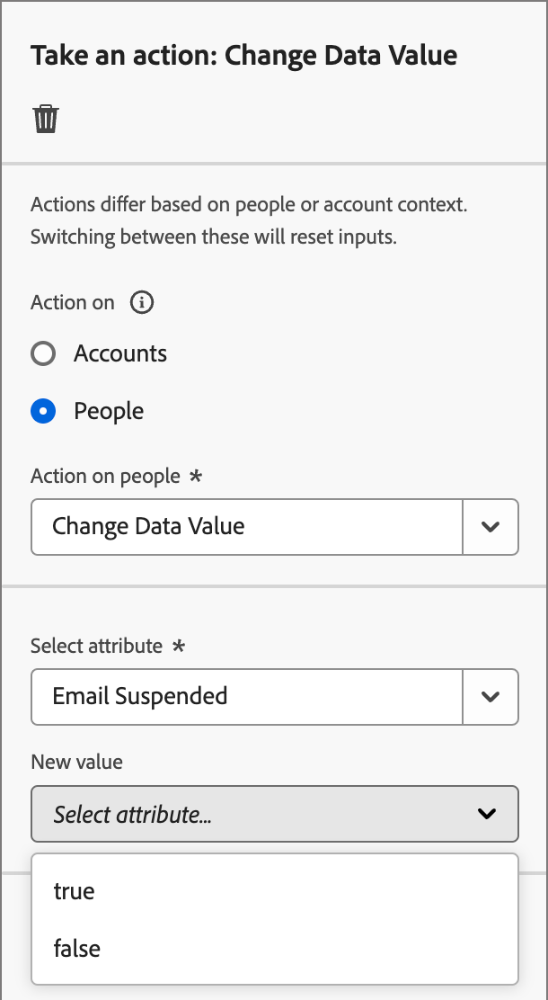
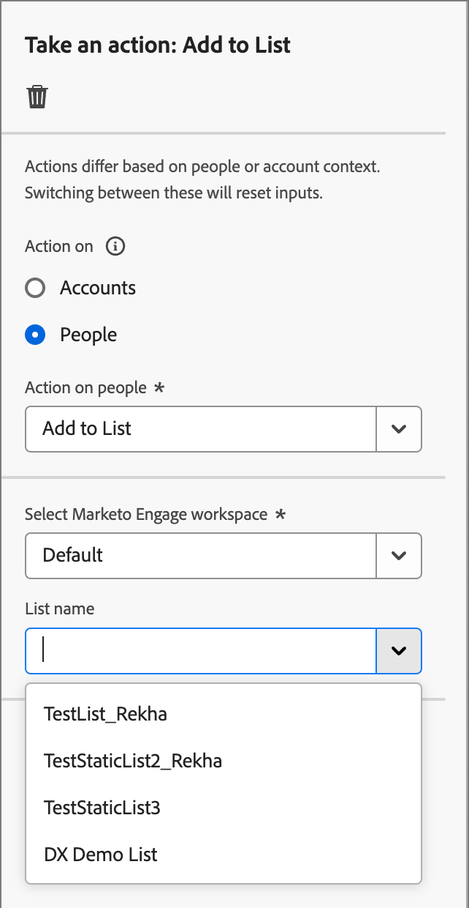

# 执行操作

在您的帐户历程中，您可以添加&#x200B;_[!UICONTROL 执行操作]_&#x200B;节点以执行操作，例如发送电子邮件、更改分数、分配给购买组等。 操作通常是您希望因某种类型的触发器（例如事件或上一个操作）而发生的操作。

{width="30"} [观看概述视频](#overview-video)

## 帐户操作

当您想要将更改应用到节点路径上属于帐户的所有人员时，请使用对帐户执行的操作。

### 操作和限制 {#account-action-constraints}

| 操作 | 约束 |
| ------ | ----------- |
| [!UICONTROL 帐户更改数据值] | 选择属性 新值 |
| [!UICONTROL 帐户有趣的时刻] | 类型（电子邮件、里程碑或Web） 描述（可选） |
| [!UICONTROL 将帐户添加到（其他）历程] | 选择实时帐户历程 |
| [!UICONTROL 添加到帐户列表] | 选择实时静态帐户列表 |
| [!UICONTROL 从历程中删除帐户] | 选择实时帐户历程 |
| [!UICONTROL 从帐户列表中删除] | 选择实时静态帐户列表 |
| [!UICONTROL 发送销售警报] | 选择感兴趣的解决方案 发送电子邮件至 |
| [!UICONTROL 更新购买团体阶段] | 选择解决方案兴趣 选择购买团体阶段 |
| [!UICONTROL 更新购买团体状态] | 选择感兴趣的解决方案 状态（必需，最多50个字符） |

### 添加基于帐户的操作

1. 导航到历程图。

1. 单击路径上的加号( **+** )图标，然后选择&#x200B;**[!UICONTROL 执行操作]**。

   {width="400"}

1. 在右侧的节点属性中，为操作选择&#x200B;**[!UICONTROL 帐户]**。

1. 从列表中选择一个操作，并设置该操作的任何值。

   {width="700" zoomable="yes"}

## 人员操作

当您要将更改应用于节点路径上的所有人员时，可对人员执行操作。 此节点类型可以按人员拆分路径内使用，也可以按帐户拆分路径内使用。

### 操作和限制 {#people-action-constraints}

| 上下文 | 操作 | 约束 |
| ------- | ------ | ----------- |
| [Journey Optimizer B2B](#journey-optimizer-b2b-actions) | [!UICONTROL 添加到外部客户受众] | 选择外部客户受众 |
| | [!UICONTROL 分配给购买组] | 选择感兴趣的解决方案 选择角色 |
| | [!UICONTROL 更改数据值] | 选择人员属性 设置新值 |
| | [!UICONTROL 更改得分] | 得分名称 得分更改 |
| | [!UICONTROL 个人有趣的时刻] | 类型 描述 |
| | [!UICONTROL 从购买群中删除] | 选择解决方案兴趣 |
| | [!UICONTROL 发送电子邮件] | 从Marketo Engage创建新电子邮件 选择电子邮件 |
| | [!UICONTROL 发送短信] | 创建短信 |
| [Marketo Engage](#marketo-engage-actions) | [!UICONTROL 添加到列表] | 选择Marketo Engage工作区 列表名称 |
| | [!UICONTROL 添加到Marketo Engage请求营销活动] | 选择Marketo Engage工作区 选择请求营销活动 |
| | [!UICONTROL 在Marketo Engage中更改人员分区] | 新建分区 |
| | [!UICONTROL 从列表中删除] | 选择Marketo Engage工作区 列表名称 |

### 添加基于人员的操作

1. 导航到历程图。

1. 单击路径上的加号( **+** )图标，然后选择&#x200B;**[!UICONTROL 执行操作]**。

1. 在右侧的节点属性中，为操作选择&#x200B;**[!UICONTROL 人员]**。

1. 从列表中选择一个操作，并设置该操作的任何值。

{width="700" zoomable="yes"}

### Journey Optimizer B2B操作

Journey Optimizer B2B基于人员的操作旨在通过配置的渠道管理通信，并管理购买组和帐户中的人员分类。 当具有人员配置文件的合格帐户到达节点时，历程将应用操作。

+++[!UICONTROL 添加到外部客户受众]

使用此操作可将人员推送至外部受众，该受众可通过付费媒体渠道激活，以进一步定位购买群组的成员。 此操作通过Real-Time CDP B2B/P版本执行。

>[!NOTE]
>
>当具有人员配置文件的合格帐户到达已发布历程中的&#x200B;_添加到外部客户受众_&#x200B;节点时，这些配置文件可能需要48小时才能填充到外部受众中。

{width="300"}

选择此基于人员的操作时，您可以创建新外部受众或从现有外部受众中选择。 对于现有受众，您可以从仅在Journey Optimizer B2B edition中创建的外部客户受众中进行选择。 在创建受众并将其用于此历程操作时，请确保连接目标。 有关详细信息，请参阅Experience Platform文档中的[创建新的目标连接](https://experienceleague.adobe.com/en/docs/experience-platform/destinations/ui/connect-destination){target="_blank"}和[激活概述](https://experienceleague.adobe.com/en/docs/experience-platform/destinations/ui/activate/activation-overview#activate-audiences-from-the-destinations-catalog){target="_blank"}。

{width="30"} [观看付费媒体编排的视频概述](../data/linkedin-account-matched-audiences.md#orchestrate-paid-media-engagement)

_创建外部受众：_

1. 选择&#x200B;**[!UICONTROL 新建]**。

1. 单击&#x200B;**[!UICONTROL 创建外部客户受众]**。

1. 为新外部受众输入&#x200B;**[!UICONTROL 名称]**（必需）和&#x200B;**[!UICONTROL 描述]**（可选）。

   {width="300"}

1. 单击&#x200B;**[!UICONTROL 创建]**。

   系统会创建新受众并显示确认消息。 然后，您可以继续将其用作节点操作的现有受众。

   >[!NOTE]
   >
   >从Journey Optimizer B2B edition创建新的外部客户受众时，将植入一个虚拟记录(`test@email.com`)。 将第一个实际用户档案添加到历程的外部受众后，就会覆盖此记录。

_要使用现有受众：_

1. 单击&#x200B;**[!UICONTROL 选择外部客户受众]**。

1. 在对话框中，选择要使用的受众。

   {width="700" zoomable="yes"}

1. 单击&#x200B;**[!UICONTROL 添加受众]**。

+++

+++[!UICONTROL 分配给购买组]

使用此操作可根据所选的解决方案兴趣和角色，将人员配置文件添加到[购买群](../buying-groups/buying-groups-overview.md)。

{width="300"}

+++

+++[!UICONTROL 更改数据值]

使用此操作更改[人员配置文件属性](../data/field-mapping.md#xdm-business-person-attributes)的值。 选择属性，然后设置新值。

{width="300"}

+++

+++[!UICONTROL 更改得分]

使用此操作可更改Marketo Engage中的人员得分。 [了解详情](https://experienceleague.adobe.com/en/docs/marketo-learn/tutorials/lead-and-data-management/lead-scoring-learn){target="_blank"}

{width="300"}

+++

+++[!UICONTROL 个人有趣的时刻]

使用此操作记录人员配置文件的有趣时刻。 选择类型（电子邮件、里程碑或Web）并添加说明（可选）。

{width="300"}

+++

+++[!UICONTROL 从购买群中删除]

使用此操作可根据所选的解决方案兴趣从[购买群](../buying-groups/buying-groups-overview.md)中删除人员配置文件。

{width="300"}

+++

+++[!UICONTROL 发送电子邮件]

使用此操作发送电子邮件。 在您[为节点](../content/add-email.md#add-an-email-to-your-journey)创建电子邮件后，您可以在电子邮件设计空间设计、个性化和预览电子邮件（请参阅[电子邮件创作](../content/email-authoring.md)）。 您还可以从Marketo Engage[&#128279;](https://experienceleague.adobe.com/en/docs/marketo/using/product-docs/email-marketing/general/creating-an-email/create-an-email){target="_blank"}发送电子邮件。 选择Marketo Engage工作区，然后选择要发送的电子邮件。

{width="300"}

+++

+++[!UICONTROL 发送短信]

使用此操作可发送短信消息。 您可以在可视设计器中创建、个性化和预览SMS消息（请参阅[SMS创作](../content/sms-authoring.md)）。

{width="300"}

+++

### Marketo Engage操作

Marketo Engage基于人员的操作可协调您在Journey Optimizer B2B edition中基于帐户的营销编排与Marketo Engage中基于商机的营销工作。 使用这些操作可编排列表成员资格、人员分区和请求营销活动。

+++[!UICONTROL 添加到列表]

使用此操作可从Marketo Engage中的[智能列表](https://experienceleague.adobe.com/en/docs/marketo/using/product-docs/core-marketo-concepts/smart-lists-and-static-lists/understanding-smart-lists){target="_blank"}删除人员。

首先，在连接的Marketo Engage实例中选择工作区。 接下来，选择列表名称。

{width="300"}

+++

+++[!UICONTROL 添加到Marketo请求营销活动]

使用此操作可将人员配置文件添加到Marketo Engage中的[请求营销活动](https://experienceleague.adobe.com/en/docs/marketo/using/product-docs/core-marketo-concepts/smart-campaigns/flow-actions/request-campaign){target="_blank"}。

首先，在连接的Marketo Engage实例中选择工作区。 接下来，选择请求营销活动名称。

{width="300"}

+++

+++[!UICONTROL 在Marketo Engage中更改人员分区]

使用此操作可更改Marketo Engage中的[人员分区](https://experienceleague.adobe.com/en/docs/marketo/using/product-docs/administration/workspaces-and-person-partitions/understanding-workspaces-and-person-partitions#person-partitions){target="_blank"}。

{width="300"}

+++

+++[!UICONTROL 从列表中删除]

使用此操作可从Marketo Engage中的[智能列表](https://experienceleague.adobe.com/en/docs/marketo/using/product-docs/core-marketo-concepts/smart-lists-and-static-lists/understanding-smart-lists){target="_blank"}删除人员。 首先，在连接的Marketo Engage实例中选择工作区。 接下来，选择列表名称。

{width="300"}

如果人员配置文件不是智能列表的成员，则该操作将被忽略。

+++

## 概述视频

>[!VIDEO](https://video.tv.adobe.com/v/3443207/?learn=on)
