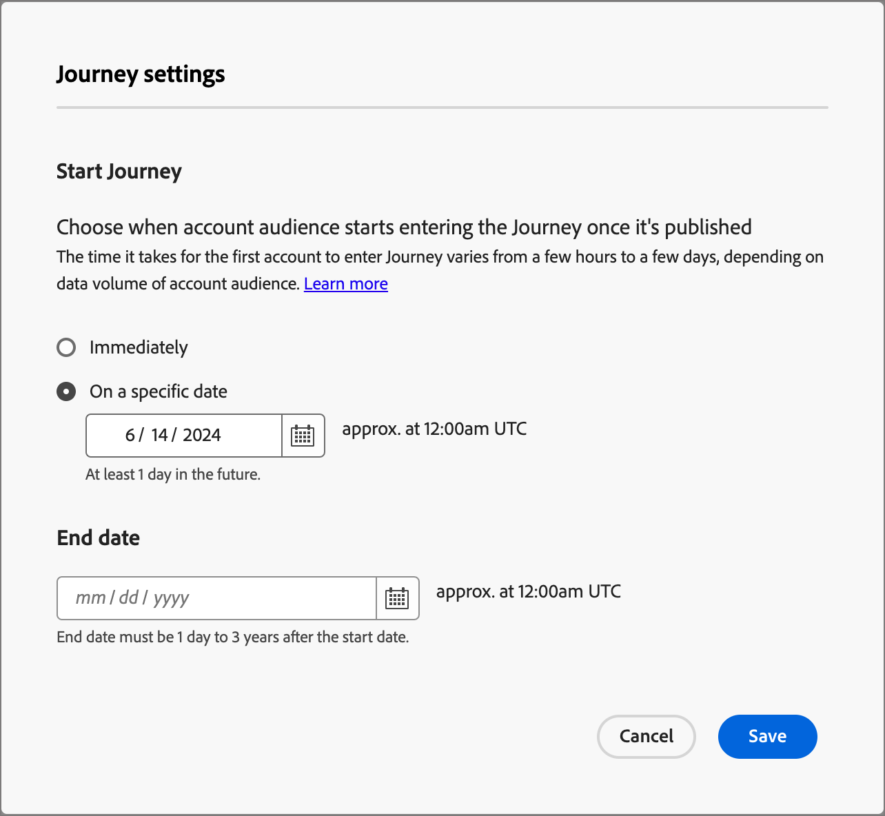

# 创建和发布帐户历程

要开始帐户历程，请创建历程，然后在历程图中构建节点和历程流。

{width="30"} [观看概述视频](#overview-video)

## 创建帐户历程

1. 在左侧导航栏中单击&#x200B;**[!UICONTROL 帐户历程]**。

1. 单击页面右上角的&#x200B;**[!UICONTROL 创建帐户历程]**。

1. 在对话框中，输入唯一的&#x200B;**[!UICONTROL Name]**（必需）和&#x200B;**[!UICONTROL Description]**（可选）。

   {width="400"}

1. 单击&#x200B;**[!UICONTROL 创建]**。

## 历程的构建基块

_历程图_&#x200B;是历程工作区的中心区域。 在此区域中，您可以添加并配置历程节点。 单击某个节点可打开其位于画布右侧的属性窗格，并根据您的设计设置这些窗格。 帐户历程始终以[帐户受众节点](./account-audience-nodes.md)开始，您可以在其中向历程添加输入。

创建帐户历程并添加受众后，使用节点构建历程。 历程图提供了一个画布，您可以在其中使用以下节点类型构建多步骤B2B营销用例以构建帐户历程：

* [执行操作](./action-nodes.md)
* [侦听事件](./listen-for-event-nodes.md)
* [拆分路径](./split-merge-paths-nodes.md)
* [等待](./wait-nodes.md)
* [合并路径](./split-merge-paths-nodes.md)

## 护栏

为了帮助您构建旅程而不会遇到错误，已设置以下护栏：

* _删除拆分路径节点_：删除节点需要删除每个路径中的所有后续节点。
* _删除合并节点_：仅当有一个路径连接到该合并节点时，才能删除该合并节点。 要删除合并节点，请仅保留一个选定的路径。
* _在帐户和人员之间切换_：将选择从帐户更改为人员将删除每个路径中的所有后续节点。

## 添加节点

1. 导航到历程图。

1. 单击路径上的加号( **+** )图标并选择节点类型。

1. 设置右侧的节点属性。

## 删除节点

1. 导航到历程图。

1. 在右侧的节点属性中，单击&#x200B;_删除_ （  ）图标。

1. 在配置对话框中，单击&#x200B;**[!UICONTROL 删除]**。

## 添加和删除路径

1. 导航到历程图。

1. 单击路径上的加号( **+** )图标，然后添加[拆分路径节点](./split-merge-paths-nodes.md#split-paths)。

1. 在右侧的节点属性中，选择&#x200B;**[!UICONTROL 帐户]**。

1. 要添加更多路径，请单击&#x200B;**[!UICONTROL 添加路径]**。

   对于历程中创建的每个路径，属性中都会显示一张新路径卡。

1. 导航到历程中的路径之一，并使用加号图标将[操作](./action-nodes.md)或[事件](./listen-for-event-nodes.md)节点添加到此路径中。

1. 选择[拆分路径](./split-merge-paths-nodes.md)节点以打开右侧的属性。

   不能删除上面有节点的路径。

1. 要删除这些路径，必须先删除该路径上的所有节点。

## 计划历程

发布历程时，历程可以立即开始，也可以在计划的未来日期开始。 结束日期最多可以为从开始日期起三年。 发布历程后（_实时_&#x200B;状态），您可以更新历程的结束日期，但不能更新开始日期。

1. 导航到历程图。

1. 单击标题中的&#x200B;**[!UICONTROL 历程设置]**&#x200B;以计划您的旅程。

1. 在对话框中，设置计划选项：

   * 选择计划类型。

     要在发布时激活历程，请选择&#x200B;**[!UICONTROL 立即]**。

     要在将来的某个日期激活历程，请选择&#x200B;**[!UICONTROL 在特定日期]**，然后单击&#x200B;_日历_&#x200B;图标以选择日期。

     {width="400" zoomable="no"}

   * 指定历程的&#x200B;**[!UICONTROL 结束日期]**。 从开始日期起最多可以为三年（发布时需要此字段）。

1. 单击&#x200B;**[!UICONTROL 保存]**。

   当您准备好发布历程时，您可以在单击&#x200B;_[!UICONTROL 发布]_&#x200B;时查看这些设置。

## 发布帐户历程

如果没有阻止程序错误，则可以发布历程。 发布后，历程状态更改为&#x200B;_实时_。如果历程有错误，_[!UICONTROL 发布]_&#x200B;按钮将灰显，内容信息为： `Resolve errors before publishing`。

>[!NOTE]
>
>发布帐户历程后，符合条件的帐户进入历程会有长达24小时的延迟。

1. 在历程图的右上方，单击&#x200B;**[!UICONTROL 发布]**。

1. 在&#x200B;_[!UICONTROL 查看历程设置]_&#x200B;对话框中，设置历程开始选项。

   如果已设置历程设置来定义计划，请查看设置。

   如果需要设置历程激活，请选择计划类型：

   * 要在发布时激活历程，请选择&#x200B;**[!UICONTROL 立即]**。

   * 要在将来的某个日期激活历程，请选择&#x200B;**[!UICONTROL 在特定日期]**，然后单击&#x200B;_日历_&#x200B;图标以选择日期。

1. 如果需要，请为历程指定&#x200B;**[!UICONTROL 结束日期]**。

   {width="400" zoomable="no"}

   从开始日期起最多可以为三年（发布时需要此字段）。

1. 单击&#x200B;**[!UICONTROL 下一步]**。

1. 在确认对话框中，单击&#x200B;**[!UICONTROL 发布]**。

## 概述视频

>[!VIDEO](https://video.tv.adobe.com/v/3443204/?learn=on)
