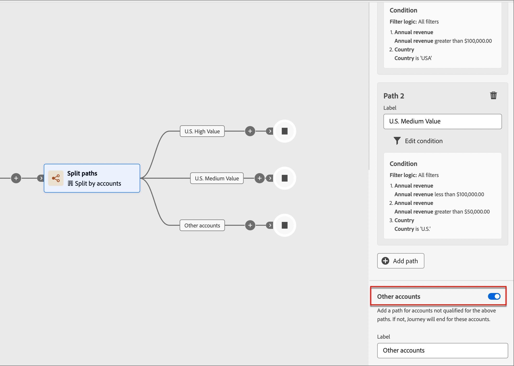

# 帐户历程节点

在您[创建帐户历程](journey-overview.md#create-an-account-journey)并[添加受众](journey-overview.md#add-the-account-audience-for-your-journey)之后，使用节点构建历程。 历程图提供了一个画布，您可以在其中构建多步骤B2B营销用例。

通过将不同的操作、事件和编排节点组合为多步骤、跨渠道方案来构建帐户历程。 历程的每个节点表示逻辑路径上的一个步骤。

## “帐户受众”节点

[帐户受众](journey-overview.md#add-the-account-audience-for-your-journey)节点定义历程的输入帐户受众(在Adobe Experience Platform中创建和管理)。 此节点始终是第一个节点，默认情况下会自动创建。

## 执行操作

执行操作，如发送电子邮件、更改得分等。

**对帐户的操作**：该操作适用于此路径上属于帐户的所有人员。

**对人员的操作**：该操作将应用于此路径上的所有人员。 对人员的操作可以在拆分路径中按人员使用，也可以在拆分路径中按帐户使用。

| 节点上下文 | 函数 | 约束 |
| ------------ | -------- | ----------- |
| [人员](#add-a-people-action) | 分配给购买组 | 选择感兴趣的解决方案 选择角色 |
| | 从购买组删除 | 选择解决方案兴趣 |
| | 发送短信 | 创建短信 |
| | 添加到Marketo Engage请求营销活动 | 选择Marketo Engage工作区 选择请求营销活动 |
| | 更改Marketo Engage中的人员分区 | 新建分区 |
| | 个人有趣的时刻 | 类型 描述 |
| | 更改得分 | 得分名称 更改 |
| | 发送电子邮件 | 创建新电子邮件 从Marketo Engage中选择电子邮件 |
| [帐户](#add-an-account-action) | 发送销售警报 | 选择感兴趣的解决方案 发送电子邮件至 |
| | 将帐户添加到（其他）历程 | 选择实时帐户历程 |
| | 更新购买组状态 | 感兴趣的解决方案 状态（必需，最多50个字符） |
| | 从（当前）历程中删除帐户 | 选择实时帐户历程 |
| | 帐户有趣时刻 | 类型（电子邮件、里程碑或Web） 描述（可选） |
| | 帐户更改数据值 | 选择属性 新值 |

### 添加帐户操作

1. 导航到历程编辑器。

1. 单击路径上的加号( **+** )图标，然后选择&#x200B;**[!UICONTROL 执行操作]**。

   {width="400"}

1. 在右侧的节点属性中，为操作选择&#x200B;**[!UICONTROL 帐户]**。

1. 从列表中选择一个操作，并设置该操作的任何值。

   {width="700" zoomable="yes"}

### 添加人员操作

1. 导航到历程编辑器。

1. 单击路径上的加号( **+** )图标，然后选择&#x200B;**[!UICONTROL 执行操作]**。

1. 在右侧的节点属性中，为操作选择&#x200B;**[!UICONTROL 人员]**。

1. 从列表中选择一个操作，并设置该操作的任何值。

{width="700" zoomable="yes"}

## 侦听事件

发生事件时，将受众前进到历程的下一步。

* 您还可以定义历程等待此事件的时间。 历程在超时后结束。
* 此外，您可以选择在超时路径中添加其他节点。

**侦听帐户上的事件**：如果帐户中至少有一个人触发了事件，则该帐户将前进到历程的下一步。

**侦听人员上的事件**：人员上的事件只能应用于帐户路径；它不可用于按人员节点拆分。

| 节点上下文 | 函数 | 约束 |
| ------------ | -------- | ----------- |
| [人员](#add-a-people-event) | 数据值更改 | 属性 其他约束（可选） 超时（可选） |
| | 单击电子邮件中的链接 | 电子邮件 其他约束（可选） 超时（可选） |
| | 已分配给购买组 | 解决方案兴趣 其他约束（可选） 超时（可选） |
| | 打开电子邮件 | 电子邮件 其他约束（可选） 超时（可选） |
| | 分数已更改 | 得分名称 其他约束（可选） 超时（可选） |
| | 已从购买组中移除 | 解决方案兴趣 活动日期（可选） 超时（可选） |
| [帐户](#add-an-account-event) | 购买组状态的更改 | 解决方案兴趣 其他约束（可选） 超时（可选） |
| | 完整性分数的更改 | 解决方案兴趣 其他约束（可选） 超时（可选） |
| | 账户有有趣的时刻 | 类型 其他约束（可选） 超时（可选） |
| | 参与度分数的更改 | 解决方案兴趣 其他约束（可选） 超时（可选） |
| | 帐户数据值更改 | 属性 其他约束（可选） 超时（可选） |

### 添加帐户事件

1. 导航到历程编辑器。

1. 单击路径上的加号( **+** )图标，然后选择&#x200B;**[!UICONTROL 侦听事件]**。

1. 在右侧的节点属性中，为事件类型选择&#x200B;**[!UICONTROL 帐户]**。

   {width="700" zoomable="yes"}

1. 从列表中选择一个事件。

1. 单击&#x200B;**[!UICONTROL 编辑事件]**&#x200B;并定义该事件的详细信息。

### 添加人员事件

1. 导航到历程编辑器。

1. 单击路径上的加号( **+** )图标，然后选择&#x200B;**[!UICONTROL 侦听事件]**。

1. 在右侧的节点属性中，为事件类型选择&#x200B;**[!UICONTROL 人员]**。

   {width="700" zoomable="yes"}

1. 从列表中选择一个事件。

1. 单击&#x200B;**[!UICONTROL 编辑事件]**&#x200B;并定义该事件的详细信息。

### 向事件节点添加超时

如果需要，可定义历程等待事件的时间。 历程在超时后结束。

1. 启用超时切换。

1. 选择历程在超时之前等待事件发生的持续时间。

   您可以选择在此处结束路径，或通过设置其他路径采取不同的操作过程。

1. 要在历程中创建一个新路径，以便在不发生事件时添加适用于帐户的操作和事件，请选中&#x200B;**[!UICONTROL 设置超时路径]**&#x200B;复选框。

   {width="700" zoomable="yes"}

## 拆分路径

根据筛选条件拆分受众。

>[!NOTE]
>
>最多支持25条路径。

**按帐户拆分路径**：按帐户拆分的路径可以同时包含帐户和人员操作及事件，并且可以进一步拆分这些路径。

_按帐户划分的拆分路径如何工作？_

* 添加拆分路径节点并选择&#x200B;_帐户_&#x200B;时，添加的每个路径都包含一个能够向每个边缘添加节点的结束节点。
* 可以按帐户重复分割路径，例如以嵌套方式。 拆分路径包括一个不添加默认路径的选项。
* 不符合其中一个拆分路径的客户/人员不会在历程中前进。
* 这些路径可以使用合并节点进行合并。

{width="700" zoomable="yes"}

**按人员拆分路径**：按人员拆分的路径只能包含人员操作，这些路径无法再次拆分。 路径会自动连接回来。

_按人员划分的路径如何工作？_

* 按人员节点划分的路径是分组节点。 它们会自动合并，以便受众中的所有人员能够前进到下一步，而不会丢失他们属于的帐户的上下文。
* 人员的拆分路径不能嵌套 — 不能为位于此分组节点中的路径上的人员添加拆分路径。
* 拆分路径包含一个用于不添加默认路径的选项。 不符合条件的客户/人员不会在历程中前进。

{width="700" zoomable="yes"}

| 节点上下文 | 路径条件 | 描述 |
| ------------ | -------- | ----------- |
| [人员](#add-a-split-path-by-people-node) | 人员属性 | |
| | 数据值已更改（例如筛选活动历史记录） | |
| | 已打开的电子邮件 | |
| | 已单击电子邮件中的链接 | |
| | 已单击网页上的链接 | |
| | 有个有趣的时刻 | |
| | 购买组的成员 | |
| [帐户](#add-a-split-path-by-account-node) | 更改帐户数据值（例如筛选活动历史记录） | |

### 按帐户节点添加拆分路径

1. 导航到历程编辑器。

1. 单击路径上的加号( **+** )图标，然后选择&#x200B;**[!UICONTROL 拆分路径]**。

   {width="300"}

1. 在右侧的节点属性中，为拆分选择&#x200B;**[!UICONTROL 帐户]**。

1. 要定义适用于&#x200B;_[!UICONTROL 路径1]_&#x200B;的条件，请单击&#x200B;**[!UICONTROL 应用条件]**。

   {width="500"}

1. 在条件编辑器中，添加一个或多个过滤器以定义拆分路径。

   * 从左侧导航中拖放过滤器属性并完成匹配定义。

   * 通过在顶部应用&#x200B;**[!UICONTROL 筛选器逻辑]**&#x200B;来优化条件。 您可以选择匹配所有属性条件或任何条件。

     {width="700" zoomable="yes"}

   * 单击&#x200B;**[!UICONTROL 完成]**。

1. 要添加更多路径，请单击&#x200B;**[!UICONTROL 添加路径]**，然后重复上述步骤以添加适用于此路径的条件。

   您还可以根据这些条件标记每个路径或使用默认标签。

1. （可选）为不符合其他路径条件的帐户添加默认路径。 如果没有，历程将针对这些帐户结束。

   {width="700" zoomable="yes"}

### 按人员节点添加拆分路径

1. 导航到历程编辑器。

1. 单击路径上的加号( **+** )图标，然后选择&#x200B;**[!UICONTROL 拆分路径]**。

   {width="300"}

1. 在右侧的节点属性中，为拆分选择&#x200B;**[!UICONTROL 人员]**。

1. 要定义适用于&#x200B;_[!UICONTROL 路径1]_&#x200B;的条件，请单击&#x200B;**[!UICONTROL 应用条件]**。

1. 在条件编辑器中，添加一个或多个过滤器以定义拆分路径。

   * 从左侧导航中拖放过滤器属性并完成匹配定义。

   * 通过在顶部应用&#x200B;**[!UICONTROL 筛选器逻辑]**&#x200B;来优化条件。 您可以选择匹配所有属性条件或任何条件。

   * 单击&#x200B;**[!UICONTROL 完成]**。

1. 要添加更多路径，请单击&#x200B;**[!UICONTROL 添加路径]**，然后重复上述步骤以添加适用于此路径的条件。

   您还可以根据这些条件标记每个路径或使用默认标签。

1. 最后，可以为不符合上述路径资格的用户添加默认路径。 如果没有，历程将针对这些人结束

当您为要在人员级别上拆分受众的每个路径定义条件时，您可以添加要对人员执行的操作。

>[!NOTE]
>
>按人员划分受众时，只能添加人员操作。

## 等待

请等待一定的持续时间，然后再转到下一步。

1. 导航到历程编辑器。

1. 单击路径上的加号( **+** )图标，然后选择&#x200B;**[!UICONTROL 等待]**。

1. 在右侧的节点属性中，设置历程进入路径中的下一个节点之前等待的&#x200B;**[!UICONTROL 持续时间]**&#x200B;时间。

{width="700" zoomable="yes"}

## 合并路径

使用此节点可以合并和取消合并历程中的不同路径。

1. 导航到历程编辑器。

1. 单击路径上的加号( **+** )图标，然后选择&#x200B;**[!UICONTROL 拆分路径]**。

1. 单击拆分节点以打开其右侧的属性。

1. 单击[!UICONTROL 添加路径]以创建三个路径。

1. 向每个路径中添加操作和事件的组合。

1. 单击其中任一路径的加号( **+** )图标，然后从显示的选项中选择&#x200B;**[!UICONTROL 合并]**。

   {width="400"}

1. 在合并节点属性中，选择要合并的路径。

   {width="600" zoomable="yes"}

   现在，您应该看到路径已合并，以便选定路径中的帐户合并为单个路径，并且可以继续完成历程。

1. 如果需要，您可以通过导航回合并节点属性并清除要删除的任何路径的复选框来取消合并路径。
