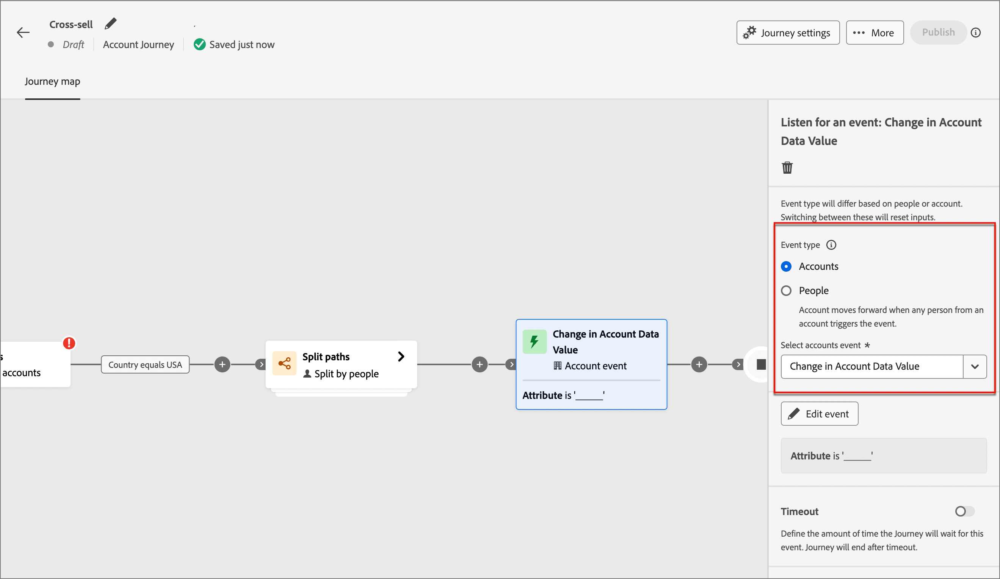
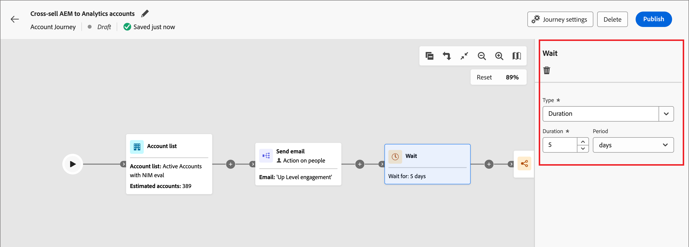

# 帐户历程节点

在您[创建帐户历程](journey-overview.md#create-an-account-journey)并[添加受众](journey-overview.md#add-the-account-audience-for-your-journey)之后，使用节点构建历程。 历程图提供了一个画布，您可以在其中构建多步骤B2B营销用例。

通过将不同的操作、事件和编排节点组合为多步骤、跨渠道方案来构建帐户历程。 历程的每个节点表示逻辑路径上的一个步骤。 使用以下节点类型构建帐户历程：

* [帐户受众](#account-audience-node)
* [执行操作](#take-an-action)
* [侦听事件](#listen-for-an-event)
* [拆分路径](#split-paths)
* [等待](#wait)
* [合并路径](#merge-paths)

## “帐户受众”节点

[帐户受众](journey-overview.md#add-the-account-audience-for-your-journey)节点定义历程的输入帐户受众(在Adobe Experience Platform中创建和管理)。 此节点始终是第一个节点，默认情况下会自动创建。

## 执行操作

执行操作，如发送电子邮件、更改分数、分配给购买组等。

**对帐户的操作**：该操作适用于此路径上属于帐户的所有人员。

**对人员的操作**：该操作将应用于此路径上的所有人员。 对人员的操作可以在拆分路径中按人员使用，也可以在拆分路径中按帐户使用。

### 操作和限制 {#action-nodes}

| 节点上下文 | 操作 | 约束 |
| ------------ | ------ | ----------- |
| [人员](#add-a-people-action) | 添加到列表 | 选择Marketo Engage工作区 列表名称 |
| | 添加到Marketo Engage请求营销活动 | 选择Marketo Engage工作区 选择请求营销活动 |
| | 分配给购买组 | 选择感兴趣的解决方案 选择角色 |
| | 更改Marketo Engage中的人员分区 | 新建分区 |
| | 更改得分 | 得分名称 更改 |
| | 个人有趣的时刻 | 类型 描述 |
| | 从购买组删除 | 选择解决方案兴趣 |
| | 从列表中删除 | 选择Marketo Engage工作区 列表名称 |
| | 发送电子邮件 | 创建新电子邮件 从Marketo Engage中选择电子邮件 |
| | 发送短信 | 创建短信 |
| [帐户](#add-an-account-action) | 帐户更改数据值 | 选择属性 新值 |
| | 帐户有趣时刻 | 类型（电子邮件、里程碑或Web） 描述（可选） |
| | 将帐户添加到（其他）历程 | 选择实时帐户历程 |
| | 从历程中删除帐户 | 选择实时帐户历程 |
| | 发送销售警报 | 选择感兴趣的解决方案 发送电子邮件至 |
| | 更新购买组阶段 | 选择解决方案兴趣 选择购买团体阶段 |
| | 更新购买组状态 | 选择感兴趣的解决方案 状态（必需，最多50个字符） |

### 添加帐户操作

1. 导航到历程编辑器。

1. 单击路径上的加号( **+** )图标，然后选择&#x200B;**[!UICONTROL 执行操作]**。

   {width="400"}

1. 在右侧的节点属性中，为操作选择&#x200B;**[!UICONTROL 帐户]**。

1. 从列表中选择一个操作，并设置该操作的任何值。

   {width="700" zoomable="yes"}

### 添加人员操作

1. 导航到历程编辑器。

1. 单击路径上的加号( **+** )图标，然后选择&#x200B;**[!UICONTROL 执行操作]**。

1. 在右侧的节点属性中，为操作选择&#x200B;**[!UICONTROL 人员]**。

1. 从列表中选择一个操作，并设置该操作的任何值。

{width="700" zoomable="yes"}

## 侦听事件

发生事件时，将受众前进到历程的下一步。

* 您还可以定义历程等待此事件的时间。 历程在超时后结束。
* 此外，您可以选择在超时路径中添加其他节点。

**侦听帐户上的事件**：如果帐户中至少有一个人触发了事件，则该帐户将前进到历程的下一步。

**侦听人员上的事件**：人员上的事件只能应用于帐户路径；它不可用于按人员节点拆分。

### 事件和约束 {#event-nodes}

| 节点上下文 | 活动 | 约束 |
| ------------ | ----- | ----------- |
| [人员](#add-a-people-event) | 已分配给购买组 | 解决方案兴趣 其他约束（可选）： <li>角色</li><li>活动日期</li> 超时（可选） |
| | 单击电子邮件中的链接 | 电子邮件 其他约束（可选）： <li>链接</li><li>链接Id</li><li>是移动设备</li><li>设备</li><li>平台</li><li>浏览器</li><li>是预测内容</li><li>是机器人活动</li><li>机器人活动模式</li><li>浏览器</li><li>活动日期</li><li>最低 次数</li> 超时（可选） |
| | 短信中的点击链接 | 电子邮件 其他约束（可选）： <li>链接</li><li>设备</li><li>平台</li><li>活动日期</li><li>最低 次数</li> 超时（可选） |
| | 数据值更改 | 人员属性 其他约束（可选）： <li>新值</li><li>上一个值</li><li>原因</li><li>来源</li><li>活动日期</li><li>最低 次数</li> 超时（可选） |
| | 打开电子邮件 | 电子邮件 其他约束（可选）： <li>链接</li><li>链接Id</li><li>是移动设备</li><li>设备</li><li>平台</li><li>浏览器</li><li>是预测内容</li><li>是机器人活动</li><li>机器人活动模式</li><li>浏览器</li><li>活动日期</li><li>最低 次数</li> 超时（可选） |
| | 已从购买组中移除 | 解决方案兴趣 活动日期（可选） 超时（可选） |
| | 分数已更改 | 得分名称 其他约束（可选）：<li>更改</li><li>新得分</li><li>紧急</li><li>优先级</li><li>相对分数</li><li>相对紧迫性</li><li>活动日期</li><li>最低 次数</li> 超时（可选） |
| | 短信退回 | SMS消息 其他约束（可选）： <li>活动日期</li><li>最小次数</li> 超时（可选） |
| [帐户](#add-an-account-event) | 账户有有趣的时刻 | 类型（电子邮件、里程碑或Web） 其他约束（可选）： <li>描述</li><li>来源</li><li>活动日期</li>  超时（可选） |
| | 帐户数据值更改 | 属性 其他约束（可选）： <li>新值</li><li>上一个值</li><li>活动日期</li>  超时（可选） |
| | 购买组阶段中的更改 | 解决方案兴趣 其他约束（可选）： <li>新阶段</li><li>上一阶段</li><li>活动日期</li> 超时（可选） |
| | 购买组状态的更改 | 解决方案兴趣 其他约束（可选）： <li>新状态</li><li>以前的状态</li><li>活动日期</li> 超时（可选） |
| | 完整性分数的更改 | 解决方案兴趣 其他约束（可选）： <li>新得分</li><li>上一个得分</li><li>活动日期</li> 超时（可选） |
| | 参与度分数的更改 | 解决方案兴趣 其他约束（可选）： <li>新得分</li><li>上一个得分</li><li>活动日期</li> 超时（可选） |

### 添加帐户事件

1. 导航到历程编辑器。

1. 单击路径上的加号( **+** )图标，然后选择&#x200B;**[!UICONTROL 侦听事件]**。

1. 在右侧的节点属性中，为事件类型选择&#x200B;**[!UICONTROL 帐户]**。

   {width="700" zoomable="yes"}

1. 从列表中选择一个事件。

1. 单击&#x200B;**[!UICONTROL 编辑事件]**&#x200B;并定义该事件的详细信息。

### 添加人员事件

1. 导航到历程编辑器。

1. 单击路径上的加号( **+** )图标，然后选择&#x200B;**[!UICONTROL 侦听事件]**。

1. 在右侧的节点属性中，为事件类型选择&#x200B;**[!UICONTROL 人员]**。

   {width="700" zoomable="yes"}

1. 从列表中选择一个事件。

1. 单击&#x200B;**[!UICONTROL 编辑事件]**&#x200B;并定义该事件的详细信息。

### 向事件节点添加超时

如果需要，可定义历程等待事件的时间。 历程在超时后结束。

1. 启用超时切换。

1. 选择历程在超时之前等待事件发生的持续时间。

   您可以选择在此处结束路径，或通过设置其他路径采取不同的操作过程。

1. 要在历程中创建一个新路径，以便在不发生事件时添加适用于帐户的操作和事件，请选中&#x200B;**[!UICONTROL 设置超时路径]**&#x200B;复选框。

   {width="700" zoomable="yes"}

## 拆分路径

根据筛选条件拆分受众。

>[!NOTE]
>
>最多支持25条路径。

**按帐户拆分路径**：按帐户拆分的路径可以同时包含帐户和人员操作及事件。 这些路径可以进一步拆分。

_按帐户划分的拆分路径如何工作？_

* 添加拆分路径节点并选择&#x200B;_帐户_&#x200B;时，添加的每个路径都包含一个能够向每个边缘添加节点的结束节点。
* 可以按帐户重复分割路径，例如以嵌套方式。 拆分路径包括一个不添加默认路径的选项。
* 如果客户/人员不符合其中一个拆分路径的资格，则它不会在此历程中前进。
* 这些路径可以使用合并节点进行合并。

{width="700" zoomable="yes"}

**按人员拆分路径**：按人员拆分的路径只能包含人员操作。 这些路径无法再次拆分并自动连接回来。

_按人员划分的路径如何工作？_

* 按人员节点划分的路径是分组节点。 路径会自动合并，以便受众中的所有人员能够前进到下一步骤，而不会丢失其帐户上下文。
* 人员的拆分路径不能嵌套 — 不能为位于此分组节点中的路径上的人员添加拆分路径。
* 拆分路径包括一个用于省略默认路径的选项。 没有匹配已定义路径的帐户/人员在历程中不会前进。
* 按人员划分的拆分路径支持使用&#x200B;_帐户 — 人员关系_，这允许您根据角色模板中定义的角色（如承包商或全职员工）筛选人员。

{width="700" zoomable="yes"}

### 路径条件 {#path-conditions}

| 节点上下文 | 路径条件 | 描述 |
| ------------ | --------------- | ----------- |
| [帐户](#add-a-split-path-by-account-node) | 帐户属性 | 帐户个人资料中的属性，包括： <li>年收入</li><li>城市</li><li>国家/地区</li><li>员工人数</li><li>行业</li><li>名称</li><li>SIC代码</li><li>State</li> |
| | [!UICONTROL 特殊筛选器] > [!UICONTROL 有购买群] | 客户是否根据以下一个或多个标准评估购买组成员： <li>解决方案兴趣</li><li>购买组状态</li><li>完整性分数</li><li>参与度分数</li> |
| [人员](#add-a-split-path-by-people-node) >仅[!UICONTROL 人员属性] | [!UICONTROL 人员属性] | 人员配置文件中的属性，包括： <li>城市</li><li>国家/地区</li><li>出生日期</li><li>电子邮件地址</li><li>电子邮件无效</li><li>电子邮件已暂停</li><li>名字</li><li>推断的状态区域</li><li>职务名称</li><li>姓氏</li><li>手机号码</li><li>电话号码</li><li>邮政编码</li><li>State</li><li>退订</li><li>取消订阅的原因</li> |
| | [!UICONTROL 活动历史记录] > [!UICONTROL 电子邮件] | 与历程关联的电子邮件活动： <li>[!UICONTROL 已单击电子邮件中的链接]</li><li>已打开的电子邮件</li><li>已送达电子邮件</li><li>已发送电子邮件</li> 使用历程中早期的选定电子邮件评估这些条件。 |
| | [!UICONTROL 活动历史记录] > [!UICONTROL 数据值已更改] | 对于选定的人员属性，发生值更改。 这些更改类型包括： <li>新值</li><li>上一个值</li><li>原因</li><li>来源</li><li>活动日期</li><li>最低 次数</li> |
| | [!UICONTROL 活动历史记录] > [!UICONTROL 快乐时光] | 在关联的Marketo Engage实例中定义的有趣时刻活动。 限制包括： <li>里程碑</li><li>电子邮件</li><li>Web</li> |
| | [!UICONTROL 特殊筛选器] > [!UICONTROL 购买团体成员] | 人员是否属于根据以下一个或多个标准评估的购买组成员： <li>解决方案兴趣</li><li>购买组状态</li><li>完整性分数</li><li>参与度分数</li><li>角色</li> |
| [人员](#add-a-split-path-by-people-node) >仅[!UICONTROL 帐户 — 人员属性] | 帐户属性中的角色 | 人员是否在帐户中被分配了角色。 可选约束： <li>输入角色名称</li> |

### 按帐户节点添加拆分路径

1. 导航到历程编辑器。

1. 单击路径上的加号( **+** )图标，然后选择&#x200B;**[!UICONTROL 拆分路径]**。

   {width="300"}

1. 在右侧的节点属性中，为拆分选择&#x200B;**[!UICONTROL 帐户]**。

1. 要定义适用于&#x200B;_[!UICONTROL 路径1]_&#x200B;的条件，请单击&#x200B;**[!UICONTROL 应用条件]**。

   {width="500"}

1. 在条件编辑器中，添加一个或多个过滤器以定义拆分路径。

   * 从左侧导航中拖放过滤器属性并完成匹配定义。

   * 通过在顶部应用&#x200B;**[!UICONTROL 筛选器逻辑]**&#x200B;来优化条件。 您可以选择匹配所有属性条件或任何条件。

     {width="700" zoomable="yes"}

   * 单击&#x200B;**[!UICONTROL 完成]**。

1. 要添加更多路径，请单击&#x200B;**[!UICONTROL 添加路径]**，然后重复上述步骤以添加适用于此路径的条件。

   您还可以根据这些条件标记每个路径或使用默认标签。

1. 如果需要，可根据所需的拆分优先级对路径重新排序。

   路径过滤将按自上而下的顺序进行计算。 每个帐户都沿匹配的第一个路径前进。

   单击每个路径卡右上角的向上和向下箭头，将其在路径列表中向上或向下移动。

   {width="500" zoomable="yes"}

1. 启用&#x200B;**[!UICONTROL 其他帐户]**&#x200B;选项，为与定义的路径不匹配的帐户添加默认路径。 否则，历程将针对这些人结束。

### 按人员节点添加拆分路径

1. 导航到历程编辑器。

1. 单击路径上的加号( **+** )图标，然后选择&#x200B;**[!UICONTROL 拆分路径]**。

   {width="300"}

1. 在右侧的节点属性中，为拆分选择&#x200B;**[!UICONTROL 人员]**。

1. 设置用于条件&#x200B;]**的**[!UICONTROL &#x200B;属性。

   * 选择&#x200B;**[!UICONTROL 仅人员属性]**&#x200B;以使用与人员配置文件和事件相关的条件。
   * 选择&#x200B;**[!UICONTROL 仅限帐户 — 人员属性]**&#x200B;以使用与帐户中人员的角色成员资格相关的条件。

1. 要定义适用于&#x200B;_[!UICONTROL 路径1]_&#x200B;的条件，请单击&#x200B;**[!UICONTROL 应用条件]**。

1. 在条件编辑器中，添加一个或多个过滤器以定义拆分路径。

   * 从左侧导航中拖放任何人员属性并完成匹配定义。

     >[!NOTE]
     >
     >如果您在Experience Platform的帐户受众架构中定义了自定义人员字段，则这些字段也可用作条件中的人员属性。

   * 通过在顶部应用&#x200B;**[!UICONTROL 筛选器逻辑]**&#x200B;来优化条件。 您可以选择匹配所有属性条件或任何条件。

     {width="700" zoomable="yes"}

   * 单击&#x200B;**[!UICONTROL 完成]**。

1. 要添加更多路径，请单击&#x200B;**[!UICONTROL 添加路径]**，然后重复上述步骤以添加适用于此路径的条件。

   您还可以根据这些条件标记每个路径或使用默认标签。

1. 如果需要，可根据所需的拆分优先级对路径重新排序。

   路径过滤将按自上而下的顺序进行计算。 每个人沿着第一个匹配的路径前进。

   单击每个路径卡右上角的向上和向下箭头，将其在路径列表中向上或向下移动。

   {width="500" zoomable="yes"}

1. 启用&#x200B;**[!UICONTROL 其他人]**&#x200B;选项，为与定义的路径不匹配的人添加默认路径。 否则，历程将针对这些人结束。

当为各个路径定义了条件，用于在人员级别拆分受众时，您可以添加要对人员执行的操作。

>[!NOTE]
>
>按人员拆分受众时，只能添加人员操作，直到关闭或合并路径为止。

## 等待

请等待一定的持续时间，然后再转到下一步。

1. 导航到历程编辑器。

1. 单击路径上的加号( **+** )图标，然后选择&#x200B;**[!UICONTROL 等待]**。

1. 在右侧的节点属性中，设置历程进入路径中的下一个节点之前等待的&#x200B;**[!UICONTROL 持续时间]**&#x200B;时间。

{width="700" zoomable="yes"}

## 合并路径

使用此节点可以合并和取消合并历程中的不同路径。

1. 导航到历程编辑器。

1. 单击路径上的加号( **+** )图标，然后选择&#x200B;**[!UICONTROL 拆分路径]**。

1. 单击拆分节点以打开其右侧的属性。

1. 单击[!UICONTROL 添加路径]以创建三个路径。

1. 向每个路径中添加操作和事件的组合。

1. 单击其中任一路径的加号( **+** )图标，然后从显示的选项中选择&#x200B;**[!UICONTROL 合并]**。

   {width="400"}

1. 在合并路径节点属性中，选择要合并的路径。

   {width="600" zoomable="yes"}

   此时，将合并路径，以便选定路径中的帐户合并为可以继续完成历程的单个路径。

1. 如果需要，您可以通过导航回合并路径节点属性并清除要删除的任何路径的复选框来取消合并路径。
