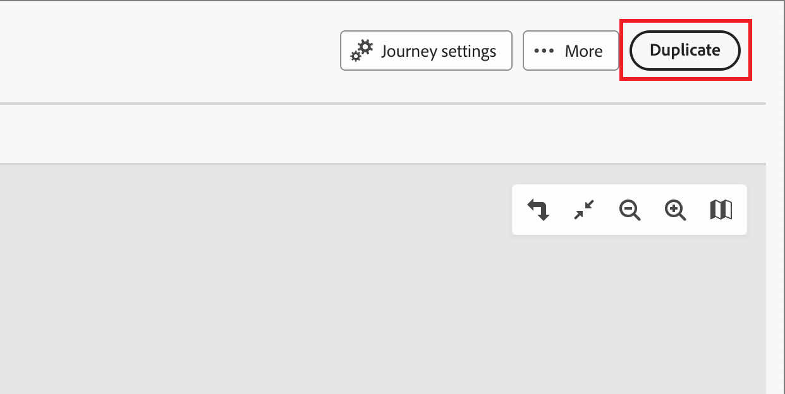

# 帐户历程

通过客户历程，您可以简化需求生成和购买团体资格鉴定，并推动对您的收购、追加销售/交叉销售和保留计划的更多合格需求。 使用电子邮件、短信、活动等自动参与功能，为每个购买组和购买组成员定制历程。

定义销售驱动型参与（包括电子邮件、短信和更多内部帐户历程），协调每个购买群组成员的入站营销和出站销售活动。

{width="30"} [观看概述视频](#overview-video)

## 开始使用历程

如要开始使用帐户历程：

1. [创建历程](./create-publish-journey.md#create-an-account-journey)。
1. 在历程图中[添加节点](./create-publish-journey.md#add-a-node)，然后[定义历程流程图](./create-publish-journey.md#add-and-delete-a-path)。
1. [发布历程](./create-publish-journey.md#publish-an-account-journey)。

## 访问并浏览帐户历程

1. 在 Adobe Experience Platform 主页中，单击 Adobe Journey Optimizer B2B Edition。

1. 在左侧导航栏中单击&#x200B;**[!UICONTROL 帐户历程]**。

   {width="800" zoomable="yes"}

   显示的历程页面包括以下几列：

   * [!UICONTROL 名称]（单击该名称以打开历程进行编辑）
   * [!UICONTROL 状态]
   * [!UICONTROL 描述]
   * [!UICONTROL 创建者]
   * [!UICONTROL 上次更新时间]
   * [!UICONTROL 上次更新者]
   * [!UICONTROL 发布日期]
   * [!UICONTROL 发布者]

使用顶部的&#x200B;_搜索_&#x200B;工具按名称查找历程。 您可以通过单击列标题按&#x200B;_[!UICONTROL 状态]_&#x200B;对列表进行排序。

通过单击右上角的&#x200B;_自定义表_ （ ）图标，可以自定义表中显示的列。 选中或清除对话框中的复选框，然后单击&#x200B;**[!UICONTROL 应用]**。

{width="800" zoomable="yes"}

## 帐户历程剖析

单击&#x200B;_[!UICONTROL 帐户历程]_&#x200B;列表中的名称（显示为链接），查看详细信息、进行更改并执行操作。

{width="800" zoomable="yes"}

每个帐户历程图的标题包括：

* 历程名称
* 访问以编辑历程名称（ _编辑_&#x200B;图标）
* 历程的状态

历程的状态可根据您应用的操作而更改。 根据历程的状态，某些操作在标题右侧不可用。

| 状态 | 描述 | 可用操作 |
| ------ | ----------- | ----------------- |
| _**草稿**_ | 可编辑的未发布历程。 | <ul><li>[发布](./create-publish-journey.md#publish-an-account-journey)</li><li>重复 </li><li>删除 </li></ul> |
| _**实时**_ | 历程发布后，历程状态就从草稿变为实时。在这种状态下，历程无法再编辑。 | <ul><li>重复 </li><li>对新登入关闭 </li><li>中止 </li></ul> |
| _**对新登入关闭**_ | 单击顶部导航中的[!UICONTROL 对新登入关闭]，历程状态从&#x200B;_实时_&#x200B;变为&#x200B;_对新登入关闭_。 | <ul><li>重复 </li><li>中止 </li></ul> |
| _**已中止**_ | 历程中止后，历程状态从&#x200B;_实时_&#x200B;或&#x200B;_对新登入关闭_&#x200B;改变。已中止历程无法重新开始。 | <ul><li>重复 </li><li>删除 </li></ul> |
| _**已完成**_ | 历程中的所有帐户都完成历程后，状态将从“实时”或“对新登入关闭”变为“已完成”。 | <ul><li>重复 </li><li>删除 </li></ul> |

## 管理历程

_帐户历程_&#x200B;列表包含您的Journey Optimizer B2B edition实例中的所有旅程。

### 中止历程

如果您中止（停止）实时历程或计划历程，则历程中的帐户将立即停止进度，并且不会发生进一步的历程进入。 已中止历程无法重新开始。

>[!IMPORTANT]
>
>当帐户历程用于来自&#x200B;_Take an action_&#x200B;节点的另一个历程时，该节点具有&#x200B;_Add Account to (other)历程_&#x200B;操作，将中止该历程中阻止该操作的历程。

1. 单击历程名称以将其打开。

1. 单击右上方的&#x200B;**[!UICONTROL 更多……]**&#x200B;菜单，然后选择&#x200B;**[!UICONTROL 中止]**。

   {width="450"}

1. 在确认对话框中，单击&#x200B;**[!UICONTROL 中止]**。

### 对新登入关闭

如果您关闭实时历程，则当前位于该历程中的帐户将继续其在该历程中的路径，并且无法进一步进入历程。 已关闭历程无法重新开始。您可以重复一个已关闭的历程。

>[!IMPORTANT]
>
>当帐户历程用于来自&#x200B;_Take an action_&#x200B;节点的另一个历程时，该节点具有&#x200B;_Add Account to (other)历程_&#x200B;操作，将其关闭以阻止该历程中的该操作的新条目。

1. 单击历程名称以将其打开。

1. 单击右上方的&#x200B;**[!UICONTROL 更多……]**&#x200B;菜单，然后选择&#x200B;**[!UICONTROL 关闭新条目]**。

1. 在确认对话框中，单击&#x200B;**[!UICONTROL 关闭新条目]**。

### 复制历程

复制操作与克隆函数类似，但复制的历程不包含任何创建的历程内容资产。 您可以复制帐户历程的详细信息，或仅复制流程和路径结构的简单&#x200B;_框架_。

1. 单击历程名称旁边的&#x200B;_更多_&#x200B;图标(**...**)，然后选择&#x200B;**[!UICONTROL 复制]**。

   {width="450"}

   根据帐户历程的状态，您还可以从历程详细信息或历程图访问重复操作：

   * 对于草稿历程，请单击右上方的&#x200B;**[!UICONTROL 更多……]**&#x200B;菜单，然后选择&#x200B;**[!UICONTROL 复制]**。

   * 对于所有其他历程状态，单击右上方的&#x200B;**[!UICONTROL 复制]**。

     {width="450"}

1. 在&#x200B;_重复历程_&#x200B;对话框中，为新历程设置&#x200B;**[!UICONTROL 名称]**&#x200B;和&#x200B;**[!UICONTROL 描述]**。

   默认情况下，该对话框使用附加了__copy_&#x200B;的重复历程的名称。 根据需要为历程输入另一个唯一名称。

   {width="400"}

1. 选择重复&#x200B;**[!UICONTROL 类型]**：

   * **[!UICONTROL 部分内容复制]** — 使用此类型复制历程中的所有内容，不包括任何创建的电子邮件或短信消息。 引用Marketo Engage电子邮件或短信消息的节点将完整保留。

   * **[!UICONTROL 复制但不包含详细信息]** — 使用此类型仅复制节点结构和路径。 所有节点设置和路径条件都未定义（默认），因此您可以使用不同的受众、操作和路径分段设置重用基本流程。 所有&#x200B;_Wait_&#x200B;节点都使用默认的5天。

1. 单击&#x200B;**[!UICONTROL 复制]**。

   重复的帐户历程在历程图中打开，您可以在其中设置详细信息并根据需要创建历程内容。

### 删除历程

使用删除操作永久删除历程。 您无法删除实时历程或计划历程。

1. 单击历程名称旁边的&#x200B;_更多_&#x200B;图标(**...**)，然后选择&#x200B;**[!UICONTROL 删除]**。

   根据帐户历程的状态，您还可以从历程详细信息或历程图访问删除操作：

   * 对于草稿历程，请单击右上方的&#x200B;**[!UICONTROL 更多……]**&#x200B;菜单，然后选择&#x200B;**[!UICONTROL 删除]**。

   * 对于其他历程状态，如&#x200B;_已完成_&#x200B;或&#x200B;_已中止_，请单击右上角的&#x200B;**[!UICONTROL 删除]**。

1. 在确认对话框中，单击&#x200B;**[!UICONTROL 删除]**。

## 概述视频

>[!VIDEO](https://video.tv.adobe.com/v/3443202/?learn=on)
