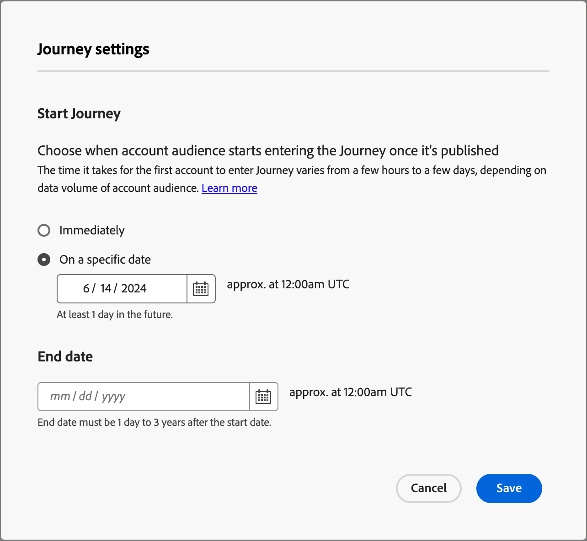

# 帐户历程

定义包括电子邮件、短信和更多内部帐户历程的销售驱动型参与，以协调入站营销与每个购买组成员的出站销售活动。

## 访问和浏览帐户历程

1. 在Adobe Experience Platform主页中，单击Adobe Journey Optimizer B2B Edition 。

1. 在左侧导航中，单击&#x200B;**[!UICONTROL 帐户历程]**。

   {width="800" zoomable="yes"}

   显示的历程页面包含以下列：

   * [!UICONTROL 名称] （单击该名称可打开帐户历程进行编辑）
   * [!UICONTROL 状态]
   * [!UICONTROL 描述]
   * [!UICONTROL 创建者]
   * [!UICONTROL 上次更新于]
   * [!UICONTROL 上次更新者]
   * [!UICONTROL 发布于]
   * [!UICONTROL 发布者]

此表包括按名称和创建者进行搜索的功能。 排序当前不可用。

您可以通过单击右上角的&#x200B;_列_&#x200B;图标并选择或清除复选框来自定义显示的表。

{width="800" zoomable="yes"}

## 帐户历程剖析

单击&#x200B;_[!UICONTROL 帐户历程]_&#x200B;列表中的名称（显示为链接）以查看详细信息、进行更改并采取操作。

{width="800" zoomable="yes"}

每个帐户历程的编辑器标题包括：

* 历程名称
* 能够编辑名称（_编辑_&#x200B;图标）
* 历程的状态

标头中提供了以下操作：

* **Publish** — 如果没有阻止程序错误，您可以发布旅程。 发布后，历程状态将更改为&#x200B;_实时_。 如果历程出现错误，按钮将灰显，并包含内容信息： `Resolve errors before publishing`。
* **复制** — 此操作类似于克隆函数，但复制的历程不包含任何资源。
* **关闭新条目** — 如果您关闭历程，则当前在历程中的帐户将继续其在历程中的路径，并且不会发生进一步的历程进入。 无法重新启动已关闭的历程。 您可以复制已关闭的历程。
* **中止** — 如果停止历程，则历程中的帐户将立即停止进度，并且不会发生进一步的历程进入。 无法重新启动停止的历程。 如果您阻止新进入而不阻止人们的进步，请考虑改为关闭历程。
* **删除** — 此操作将永久删除历程。

历程的状态会根据您应用的操作而更改。 根据历程的状态，某些操作在标题中不可用。

| 状态 | 描述 | 可用操作 |
| ------ | ----------- | ----------------- |
| _**草稿**_ | 可编辑的未发布历程。 | <ul><li>发布</li><li>复制 </li><li>删除 </li></ul> |
| _**实时**_ | 历程发布后，历程状态从草稿更改为实时。 在此状态下，它不再可编辑。 | <ul><li>复制 </li><li>关闭新条目 </li><li>中止 </li></ul> |
| _**对新条目关闭**_ | 在顶部导航中单击[!UICONTROL 关闭新条目]时，历程状态将从&#x200B;_实时_&#x200B;更改为&#x200B;_已关闭新条目_。 | <ul><li>复制 </li><li>中止 </li></ul> |
| _**已中止**_ | 当您中止历程时，历程状态从&#x200B;_实时_&#x200B;或&#x200B;_已关闭更改为新条目_。 无法重新启动已中止的历程。 | <ul><li>复制 </li><li>删除 </li></ul> |
| _**已完成**_ | 当历程中的所有帐户完成历程时，状态将从实时或已关闭更改为新条目，更改为已完成。 | <ul><li>复制 </li><li>删除 </li></ul> |

## 历程入门

要开始帐户历程，请创建历程，然后在历程编辑器中构建节点和历程流。

### 创建帐户历程

1. 在左侧导航中，单击&#x200B;**[!UICONTROL 帐户历程]**。

1. 单击页面右上角的&#x200B;**[!UICONTROL 创建帐户历程]**。

1. 在对话框中，输入唯一的&#x200B;**[!UICONTROL Name]**（必需）和&#x200B;**[!UICONTROL Description]**（可选）。

   {width="400"}

1. 单击&#x200B;**[!UICONTROL 创建]**。

### 为您的历程添加帐户受众

帐户历程始终以帐户受众开始，您可以在其中向历程添加输入。

1. 单击&#x200B;**[!UICONTROL 帐户受众]**&#x200B;节点可在右侧显示节点属性。

   {width="700" zoomable="yes"}

1. 单击&#x200B;**[!UICONTROL 添加帐户受众]**。

   您可以通过单击&#x200B;_[!UICONTROL 添加受众]_&#x200B;来选择以前选择的受众区段。

1. 要创建新的受众区段，请在左侧导航中选择&#x200B;**[!UICONTROL 帐户受众]**。

1. 单击&#x200B;**[!UICONTROL 创建受众]**，然后按照[分段服务指南](https://experienceleague.adobe.com/en/docs/experience-platform/segmentation/ui/account-audiences){target="_blank"}中所述的步骤操作。

### 历程的构建基块

_历程画布_&#x200B;是历程设计器中的中心区域。 在此区域中，您可以添加并配置历程节点。 单击某个节点可打开其位于画布右侧的属性窗格，并根据您的设计设置这些窗格。

您可以使用以下任一节点类型构建旅程：

* [侦听事件](journey-nodes.md#listen-for-an-event)
* [执行操作](journey-nodes.md#take-an-action)
* [拆分路径](journey-nodes.md#split-paths)
* [等待](journey-nodes.md#wait)
* [合并路径](journey-nodes.md#merge-paths)

### 护栏

为了帮助您构建旅程而不会遇到错误，已设置以下护栏：

* _删除拆分路径节点_：不能在不删除每个路径中所有后续节点的情况下删除节点。
* _删除合并节点_：仅当有一个路径连接到该合并节点时，才能删除该合并节点。 要删除合并节点，请仅保留一个选定的路径。
* _在帐户和人员之间切换_：如果不删除每个路径中的所有后续节点，则无法将选择从帐户更改为人员。

### 添加节点

1. 导航到历程编辑器。

1. 单击路径上的加号( **+** )图标并选择节点类型。

1. 设置右侧的节点属性。

### 删除节点

1. 导航到历程编辑器。

1. 在右侧的节点属性中，单击&#x200B;_删除_ （垃圾桶）图标。

1. 在配置对话框中，单击&#x200B;**[!UICONTROL 删除]**。

### 添加和删除路径

1. 导航到历程编辑器。

1. 单击路径上的加号( **+** )图标，然后添加拆分路径节点。

1. 在右侧的节点属性中，选择&#x200B;**[!UICONTROL 帐户]**。

1. 要添加更多路径，请单击&#x200B;**[!UICONTROL 添加路径]**。

   对于历程中创建的每个路径，属性中都会显示一张新路径卡。

1. 导航到历程中的路径之一，并使用加号图标将操作或事件节点添加到此路径。

1. 选择拆分路径节点以打开右侧的属性。

   请注意，无法删除上面有节点的路径。

1. 要删除这些路径，必须先删除该路径上的所有节点。

### 计划历程

发布历程时，历程可以立即开始，也可以在计划的未来日期开始。 结束日期最多可以为从开始日期起三年。 发布历程后（_实时_&#x200B;状态），您可以更新历程的结束日期，但不能更新开始日期。

1. 导航到历程编辑器。

1. 单击标题中的[!UICONTROL 历程设置]以计划您的旅程。

1. 在对话框中，设置计划选项：

   * 选择计划类型。

     要在发布时激活历程，请选择&#x200B;**[!UICONTROL 立即]**。

     要在将来的某个日期激活历程，请选择&#x200B;**[!UICONTROL 在特定日期]**，然后单击&#x200B;_日历_&#x200B;图标以选择日期。

     {width="400" zoomable="no"}

   * 指定历程的&#x200B;**[!UICONTROL 结束日期]**。 从开始日期起最多可以为三年（此字段为必填）。

1. 单击&#x200B;**[!UICONTROL 保存]**。

   当您准备好发布旅程时，您可以在单击&#x200B;_[!UICONTROL Publish]_&#x200B;时查看这些设置。
