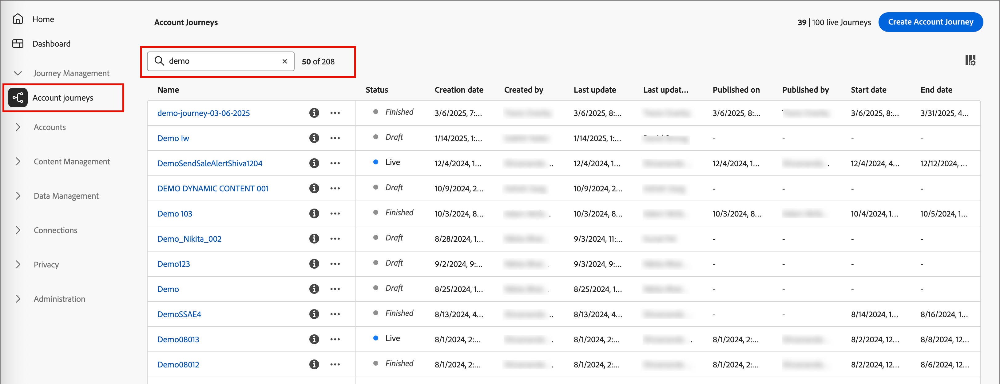

# 历程管理

在Journey Optimizer B2B edition中，历程是基于商机的自动多步客户营销计划，可跨渠道编排个性化体验，以响应参与、业务事件或计划的营销活动。 在中定义包括电子邮件、短信等在内的销售驱动型参与，以将入站营销与每个购买组成员的出站销售活动协调起来。

Journey Optimizer B2B edition支持两种历程类型：

* **客户历程** — 简化需求生成和购买团体资格认证，并为您的收购、追加销售/交叉销售和保留计划带来更多符合条件的需求。 通过电子邮件、短信、活动等自动参与方式，为每个购买群组和购买群组成员定制历程。

  {width="30"} [观看帐户历程概述视频](#overview-video)

* **人员历程** - (Beta)使用Experience Platform受众和数据编排基于潜在客户的营销。 对于人员历程，您的营销操作不依赖于Marketo Engage或Adobe Campaign/B2C工具链的解决方法，因此它们可以处理B2B用例。

  当与帐户历程和购买群组一起使用时，人员历程可以为营销人员提供将整个编排应用于购买历程的功能。

  +++人员历程的当前限制

  存在可能阻止某些用例或导致创建人员历程困难的限制。 许多问题都是初始Beta计划实施的结果，有待将来解决。

   * 事件不能与配置文件属性结合使用，以缩小受众定义的范围。
   * 符合历程用户档案条件的事件上下文不能用于个性化或编排。
   * 历程当前不能同时具有事件和配置文件区段录入条件。
   * 事件侦听器无法侦听多个事件。
   * 等待节点当前没有针对一周中的某天或每天时间的退出标准的整套选项。
   * 电子邮件编辑器错误地引用了仅适用于Account历程的功能和属性
   * 尚不支持自定义历程令牌（_我的令牌_）。
   * 从人员历程节点添加和删除当前不可从任一历程类型中使用。
   * 事件历史记录无法用于编排或个性化。
   * 相关对象（如帐户、购买群组、商机和自定义对象）无法用于编排或个性化。
   * 当前不支持Web、短信和广告平台渠道。

  +++

## 开始使用历程

开始您的第一个历程：

1. [创建历程](./create-publish-journey.md#create-a-journey)。
1. 在历程图中[添加节点](./create-publish-journey.md#add-a-node)，然后[定义历程流程图](./create-publish-journey.md#add-and-delete-a-path)。
1. [发布历程](./create-publish-journey.md#publish-a-journey)。

## 访问和浏览您的历程

>[!BEGINTABS]

>[!TAB 帐户历程]

在左侧导航栏中，展开&#x200B;**[!UICONTROL 历程管理]**，然后单击&#x200B;**[!UICONTROL 帐户历程]**。

在列表顶部的&#x200B;_搜索_&#x200B;工具中输入文本，按名称筛选所显示的列表。

{width="800" zoomable="yes"}

>[!TAB 人员历程(Beta)]

[!BADGE Beta 版]{type=Informative tooltip="作为测试版功能在简化的架构上提供"}

在左侧导航栏中，展开&#x200B;**[!UICONTROL 历程管理]**，然后单击&#x200B;**[!UICONTROL 人员历程]**。

在列表顶部的&#x200B;_搜索_&#x200B;工具中输入文本，以按名称筛选显示的列表。

{width="800" zoomable="yes"}

>[!ENDTABS]

### 历程列表列

历程列表页面包含以下列：

* [!UICONTROL 名称]（单击名称可打开历程进行编辑）
* [!UICONTROL 状态]
* [!UICONTROL 创建日期]
* [!UICONTROL 创建者]
* [!UICONTROL 上次更新]
* [!UICONTROL 上次更新者]
* [!UICONTROL 发布日期]
* [!UICONTROL 发布者]
* [!UICONTROL 开始日期]
* [!UICONTROL 结束日期]

您可以通过单击列标题按&#x200B;_[!UICONTROL 状态]_、_[!UICONTROL 创建日期]_&#x200B;或&#x200B;_[!UICONTROL 上次更新]_&#x200B;对列表进行排序。

要自定义（显示/隐藏）表中显示的列，请单击右上角的&#x200B;_自定义表_ （ ）图标。 选择或清除对话框中的复选框，然后单击&#x200B;**[!UICONTROL 应用]**。

{width="800" zoomable="yes"}

### 历程状态

历程的状态会根据您应用的操作而改变。根据历程的状态，标头右侧的某些操作可用/不可用。

| 状态 | 描述 | 可用操作 |
| ------ | ----------- | ----------------- |
| _**草稿**_ | 可编辑的未发布历程。 | <li>[发布](./create-publish-journey.md#publish-a-journey)<li>[重复](#duplicate-journey) <li>[删除](#delete-journey) |
| _**实时**_ | 历程发布后，历程状态从&#x200B;_草稿_&#x200B;更改为&#x200B;_实时_。 在这种状态下，历程无法再编辑。 | <li>[重复](#duplicate-journey)<li>[对新条目关闭](#close-to-new-entries) <li>[中止](#abort-journey) |
| _**对新条目关闭**_ | 单击顶部导航中的[!UICONTROL 对新条目关闭]，历程状态从&#x200B;_实时_&#x200B;变为&#x200B;_对新条目关闭_。 | <li>[重复](#duplicate-journey) <li>[中止](#abort-journey) |
| _**已中止**_ | 历程中止后，历程状态从&#x200B;_实时_&#x200B;或&#x200B;_对新条目关闭_&#x200B;改变。已中止历程无法重新开始。 | <li>[重复](#duplicate-journey) <li>[删除](#delete-journey) |
| _**已完成**_ | 当历程中的所有帐户或人员受众成员完成历程时，状态将从&#x200B;_实时_&#x200B;或&#x200B;_已关闭到新条目_&#x200B;更改为&#x200B;_已完成_。 | <li>[重复](#duplicate-journey) <li>[删除](#delete-journey) |

## 历程映射

单击历程列表中的名称（显示为链接）可查看详细信息、进行更改以及执行操作。

{width="800" zoomable="yes"}

每个历程图的标题包括：

* 历程名称
* 历程名称（ _编辑_&#x200B;图标）的编辑工具
* 历程的[状态](#journey-status)

从历程图中，您可以[添加节点](./create-publish-journey.md#add-a-node)和[定义历程流](./create-publish-journey.md#add-and-delete-a-path)。

## 历程操作

历程列表页面包含您的Journey Optimizer B2B edition实例中的所有帐户或人员历程。 从列表页面，您可以将多个操作应用到历程。

### 中止历程

如果您中止（停止）实时或已计划的历程，则历程中的帐户或人员会立即停止进度，并且不会发生进一步的历程进入。 已中止历程无法重新开始。

>[!IMPORTANT]
>
>当该历程用于来自&#x200B;_Take an action_&#x200B;节点的另一个历程时，该节点具有&#x200B;_[!UICONTROL Add Account to (other)历程]_&#x200B;操作，将中止该历程中阻止该操作的历程。

1. 单击历程名称将其打开。

1. 单击右上角的&#x200B;**[!UICONTROL 更多...]**&#x200B;菜单，然后选择&#x200B;**[!UICONTROL 中止]**。

   {width="450"}

1. 在确认对话框中单击&#x200B;**[!UICONTROL 中止]**。

### 对新条目关闭

如果关闭一个实时历程，当前在该历程中的帐户将继续其在历程中的路径，该历程无法再被进入。已关闭历程无法重新开始。您可以重复一个已关闭的历程。

>[!IMPORTANT]
>
>当该历程用于来自&#x200B;_Take an action_&#x200B;节点的另一个历程中时，该节点具有&#x200B;_[!UICONTROL Add Account to (other)历程]_&#x200B;操作，将其关闭以阻止该历程中的该操作的新条目。

1. 单击历程名称将其打开。

1. 单击右上角的&#x200B;**[!UICONTROL 更多...]**&#x200B;菜单，然后选择 **[!UICONTROL 对新条目关闭]**。

1. 在确认对话框中单击&#x200B;**[!UICONTROL 对新条目关闭]**。

### 复制历程

复制操作类似于克隆功能，但复制的历程不包含任何已创建的历程内容资产。您可以复制历程的详细信息，或仅复制流量和路径结构的简单&#x200B;_框架_。

>[!NOTE]
>
>此操作当前不适用于人员历程。

1. 单击历程名称旁边的&#x200B;_更多_&#x200B;图标 (**...**)，然后选择&#x200B;**[!UICONTROL 复制]**。

   {width="450"}

   根据历程的状态，您还可以从历程详细信息或历程图访问重复操作：

   * 对于草稿历程，请单击右上角的&#x200B;**[!UICONTROL 更多...]**&#x200B;菜单，然后选择&#x200B;**[!UICONTROL 复制]**。

   * 对于所有其他历程状态，请单击右上角的&#x200B;**[!UICONTROL 复制]**。

     {width="450"}

1. 在&#x200B;_复制历程_&#x200B;对话框中，设置新历程的&#x200B;**[!UICONTROL 名称]**&#x200B;和&#x200B;**[!UICONTROL 描述]**。

   在默认情况下，该对话框会使用所复制历程的名称加上 __copy_。根据需要为历程输入另一个唯一名称。

   {width="400"}

1. 选择复制&#x200B;**[!UICONTROL 类型]**：

   * **[!UICONTROL 部分内容复制]** - 使用此类型来复制历程中的所有内容，但不包括任何已创建的电子邮件或 SMS 消息。引用 Marketo Engage 电子邮件或 SMS 消息的节点会被完整保留。

   * **[!UICONTROL 复制但不包含详细信息]** - 使用此类型仅复制节点结构和路径。所有节点设置和路径条件均未定义（默认），以便您可以重复使用具有不同受众、操作和路径分段设置的基本流程。所有&#x200B;_等待_&#x200B;节点默认设置为五天。

1. 单击&#x200B;**[!UICONTROL 复制]**。

   重复的历程在历程图中打开，您可以在其中设置详细信息并根据需要创建历程内容。

### 删除历程

使用删除操作来永久删除历程。您不能删除正在进行或已计划的历程。

1. 单击历程名称旁边的&#x200B;_更多_&#x200B;图标 (**...**)，然后选择&#x200B;**[!UICONTROL 删除]**。

   根据历程的状态，您还可以从历程详细信息或历程图访问删除操作：

   * 对于草稿历程，请单击右上角的&#x200B;**[!UICONTROL 更多...]**&#x200B;菜单，然后选择&#x200B;**[!UICONTROL 删除]**。

   * 对于其他历程状态，例如&#x200B;_已完成_&#x200B;或&#x200B;_已中止_，请单击右上角的&#x200B;**[!UICONTROL 删除]**。

1. 在确认对话框中单击&#x200B;**[!UICONTROL 删除]**。

## 查看帐户进程

对于处于&#x200B;_实时_、_对新条目关闭_、_已中止_&#x200B;或&#x200B;_已完成_&#x200B;状态的已发布帐户历程，您可以打开历程映射以查看历程节点的帐户进度。 历程图中的每个节点都会显示达到该节点的帐户数量，以及（对于运行中的历程）当前停留在该节点的帐户数量。

{width="400"}

选择节点后，单击数字即可查看进入该节点或当前停留在该历程步骤的帐户列表。

{width="700" zoomable="yes"}

## 帐户历程概述视频 {#overview-video}

>[!VIDEO](https://video.tv.adobe.com/v/3443202/?learn=on)
