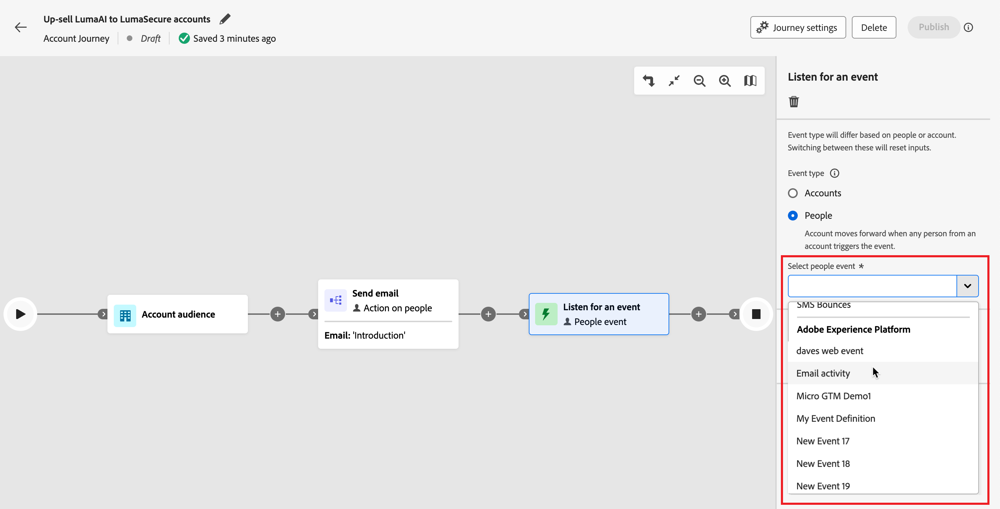

# 侦听事件

添加&#x200B;_侦听事件_&#x200B;节点，以便在事件发生时将受众前进到历程中的下一步。

{width=&quot;30&quot;， vertical-align=&quot;middle&quot;} [观看概述视频](#overview-video)

>[!NOTE]
>
>对于帐户历程，您无法按人员在拆分路径中添加此节点类型。

## 帐户事件

在帐户历程中，当您想要根据帐户活动触发的事件在历程中向前移动帐户时，可以根据帐户侦听事件。

### 事件和约束

| 活动 | 约束 |
| ----- | ----------- |
| [!UICONTROL 帐户有有趣的时刻] | 类型（电子邮件、里程碑或Web） 其他约束（可选）： <li>描述</li><li>来源</li><li>活动日期</li>  超时（可选） |
| [!UICONTROL 更改帐户数据值] | 属性 其他约束（可选）： <li>新值</li><li>上一个值</li><li>活动日期</li>  超时（可选） |
| 购买团体阶段[!UICONTROL 更改] | 解决方案兴趣 其他约束（可选）： <li>新阶段</li><li>上一阶段</li><li>活动日期</li> 超时（可选） |
| [!UICONTROL 购买群组状态更改] | 解决方案兴趣 其他约束（可选）： <li>新状态</li><li>以前的状态</li><li>活动日期</li> 超时（可选） |
| [!UICONTROL 完整性分数更改] | 解决方案兴趣 其他约束（可选）： <li>新得分</li><li>上一个得分</li><li>活动日期</li> 超时（可选） |
| [!UICONTROL 参与度得分更改] | 解决方案兴趣 其他约束（可选）： <li>新得分</li><li>上一个得分</li><li>活动日期</li> 超时（可选） |

### 添加帐户事件

1. 导航到历程图。

1. 单击路径上的加号( **+** )图标，然后选择&#x200B;**[!UICONTROL 侦听事件]**。

1. 在右侧的节点属性中，为事件类型选择&#x200B;**[!UICONTROL 帐户]**。

   {width="700" zoomable="yes"}

1. 从列表中选择一个事件。

1. 单击&#x200B;**[!UICONTROL 编辑事件]**&#x200B;并定义该事件的详细信息。

## 人员活动

在帐户历程中，当您想要根据人员活动触发的事件在历程中向前移动帐户时，可以根据人员侦听事件。 您还可以根据人员属性筛选事件，

### 事件和约束

| 输入类型 | 活动 | 约束 |
| ---------- | ----- | ----------- |
| Journey Optimizer B2B | [!UICONTROL 已分配给购买组] | 解决方案兴趣  其他约束（可选）： <li>角色</li><li>活动日期</li> 超时（可选） |
| | [!UICONTROL 点击电子邮件中的链接] | 电子邮件  其他约束（可选）： <li>链接</li><li>链接Id</li><li>是移动设备</li><li>设备</li><li>平台</li><li>浏览器</li><li>是预测内容</li><li>是机器人活动</li><li>机器人活动模式</li><li>浏览器</li><li>活动日期</li><li>最低 次数</li> 超时（可选） |
| | 短信中的[!UICONTROL 点击链接] | 电子邮件  其他约束（可选）： <li>链接</li><li>设备</li><li>平台</li><li>活动日期</li><li>最低 次数</li> 超时（可选） |
| | [!UICONTROL 数据值更改] | 人员属性  其他约束（可选）： <li>新值</li><li>上一个值</li><li>原因</li><li>来源</li><li>活动日期</li><li>最低 次数</li> 超时（可选） |
| | [!UICONTROL 打开电子邮件] | 电子邮件  其他约束（可选）： <li>链接</li><li>链接Id</li><li>是移动设备</li><li>设备</li><li>平台</li><li>浏览器</li><li>是预测内容</li><li>是机器人活动</li><li>机器人活动模式</li><li>浏览器</li><li>活动日期</li><li>最低 次数</li> 超时（可选） |
| | [!UICONTROL 已从购买群组中移除] | 解决方案兴趣 活动日期（可选） 超时（可选） |
| | [!UICONTROL 分数已更改] | 得分名称  其他约束（可选）：<li>更改</li><li>新得分</li><li>紧急</li><li>优先级</li><li>相对分数</li><li>相对紧迫性</li><li>活动日期</li><li>最低 次数</li> 超时（可选） |
| | [!UICONTROL 短信退回] | SMS消息  其他约束（可选）： <li>活动日期</li><li>最小次数</li> 超时（可选） |
| Marketo Engage | [!UICONTROL 访问网页] | 网页 选择一个或多个Marketo Engage页面进行匹配。   其他约束（可选）： <li>查询字符串</li><li>客户端IP地址</li><li>反向链接</li><li>用户代理</li><li>搜索引擎</li><li>搜索查询</li><li>令牌</li><li>浏览器</li><li>平台</li><li>设备</li><li>活动日期</li> |
| | [!UICONTROL 填写表单] | 表单 选择要匹配的一个或多个Marketo Engage表单。   其他约束（可选）： <li>活动日期</li><li>查询字符串</li><li>客户端IP地址</li><li>反向链接</li><li>用户代理</li><li>平台</li><li>设备</li> 超时（可选） |
| Adobe Experience Platform | [!UICONTROL 事件定义] | 事件类型  其他约束（可选）： <li>字段</li>  其他约束（不支持）： <li>活动日期</li><li>最低 次数</li> 超时（可选） |

### 人员事件过滤器

| 过滤器 | 描述 |
| ------------ | ----------- |
| [!UICONTROL 活动历史记录] > [!UICONTROL 电子邮件] | 电子邮件活动基于使用历程中早期的一个或多个选定电子邮件评估的条件： <li>[!UICONTROL 已单击电子邮件中的链接] <li>打开了电子邮件 <li>是通过电子邮件传递的 <li>已发送电子邮件<!--  **[!UICONTROL Switch to inactivity filter]** - Use this option to filter based on lack of activity (a person did not have the email activity).--> |
| [!UICONTROL 活动历史记录] > [!UICONTROL 短信消息] | 短信活动基于使用历程中较早时间的一个或多个选定短信消息评估的条件： <li>[!UICONTROL 点击短信中的链接] <li>[!UICONTROL 短信已退回] <!--   **[!UICONTROL Switch to inactivity filter]** - Use this option to filter based on lack of activity (a person did not have the SMS activity). --> |
| [!UICONTROL 活动历史记录] > [!UICONTROL 数据值已更改] | 对于选定的人员属性，发生值更改。 这些更改类型包括： <li>新值<li>上一个值<li>原因<li>来源<li>活动日期<li>最低 次数<!--   **[!UICONTROL Switch to inactivity filter]** - Use this option to filter based on lack of activity (a person did not have a data value change). --> |
| [!UICONTROL 活动历史记录] > [!UICONTROL 快乐时光] | 在关联的Marketo Engage实例中定义的有趣时刻活动。 限制包括： <li>里程碑<li>电子邮件<li>Web <!--  **[!UICONTROL Switch to inactivity filter]** - Use this option to filter based on lack of activity (a person did not have an interesting moment).--> |
| [!UICONTROL 活动历史记录] > [!UICONTROL 访问的网页] | 针对由关联的Marketo Engage实例管理的一个或多个网页的网页活动。 限制包括： <li>网页（必填）<li>活动日期<li>客户端IP地址 <li>查询字符串 <li>反向链接 <li>用户代理 <li>搜索引擎 <li>搜索查询 <li>个性化URL <li>令牌 <li>浏览器 <li>平台 <li>设备 <li>最低 次数<!--  **[!UICONTROL Switch to inactivity filter]** - Use this option to filter based on lack of activity (a person did not visit the web page). --> |
| [!UICONTROL 人员属性] | 人员配置文件中的属性，包括： <li>城市 <li>国家/地区 <li>出生日期 <li>电子邮件地址 <li>电子邮件无效 <li>电子邮件已暂停 <li>名字 <li>推断的状态区域<li>作业名称 <li>姓氏 <li>手机号码 <li>人员参与度分数 <li>电话号码 <li>邮政编码 <li>State <li>已取消订阅 <li>取消订阅的原因 |
| [!UICONTROL 特殊筛选器] > [!UICONTROL 购买团体成员] | 人员是否属于根据以下一个或多个标准评估的购买组成员： <li>解决方案兴趣</li><li>购买组状态</li><li>完整性分数</li><li>参与度评分</li><li>角色</li> |
| [!UICONTROL 特殊筛选器] > [!UICONTROL 列表成员] | 此人是否为一个或多个Marketo Engage列表的成员。 |
| [!UICONTROL 特殊筛选器] > [!UICONTROL 计划成员] | 此人是否为一个或多个Marketo Engage项目的成员。 |

### 添加人员事件

1. 导航到历程图。

1. 单击路径上的加号( **+** )图标，然后选择&#x200B;**[!UICONTROL 侦听事件]**。

1. 在右侧的节点属性中，为事件类型选择&#x200B;**[!UICONTROL 人员]**。

   {width="700" zoomable="yes"}

1. 从列表中选择一个事件。

1. 单击&#x200B;**[!UICONTROL 编辑事件]**&#x200B;并定义该事件的详细信息。

### 收听Marketo Engage活动

如果您在连接的Marketo Engage实例中有网页，则可以根据对这些网页的访问次数/未访问次数以及未填写的Marketo Engage表单触发事件。

1. 在历程映射中选择&#x200B;**[!UICONTROL 侦听事件]**&#x200B;节点。

1. 在右侧的节点属性中，为事件类型选择&#x200B;**[!UICONTROL 人员]**。

1. 单击&#x200B;**[!UICONTROL 选择人员事件]**&#x200B;选择器的箭头，并将菜单滚动到&#x200B;**[!UICONTROL Marketo Engage]**&#x200B;部分。

1. 选择市场参与活动类型：

   * **[!UICONTROL 访问网页]**。
   * **[!UICONTROL 填写表单]**

   {width="700" zoomable="yes"}

1. 单击&#x200B;**[!UICONTROL 编辑事件]**&#x200B;并定义一个或多个要匹配的网页以及该事件的任何其他约束。

   * （必需）在&#x200B;_[!UICONTROL 编辑事件]_&#x200B;对话框中，定义&#x200B;**[!UICONTROL 网页]**&#x200B;或&#x200B;**[!UICONTROL 填写表单]**&#x200B;约束。 使用&#x200B;**[!UICONTROL 是]**（默认值）匹配一个或多个选定的页面或表单。 使用&#x200B;**[!UICONTROL 不是]**&#x200B;在所有页面访问/表单上匹配，排除一个或多个选定的页面/表单。 或者，在任何Marketo Engage网页访问或填写的表单上使用&#x200B;**[!UICONTROL 是any]**&#x200B;运算符进行匹配。

   * （可选）单击&#x200B;**[!UICONTROL 添加约束]**，然后选择要用于约束的字段。 设置字段的运算符和值。

     {width="700" zoomable="yes"}

     您可以根据需要重复此操作以包含其他字段约束。

   * 如果需要，请选择&#x200B;**[!UICONTROL 筛选器]**&#x200B;选项卡以[添加事件筛选器](#add-a-filter-to-the-people-event)。

   * 定义约束和筛选器后，单击&#x200B;**[!UICONTROL 完成]**。

1. 如果需要，请设置&#x200B;**[!UICONTROL Timeout]**&#x200B;选项以限制侦听事件的时间段（请参阅[向事件节点添加超时](#add-a-timeout-to-an-event-node)）。

1. 在历程映射中，添加下一个要在事件发生时执行的节点。

### 收听体验活动

管理员可以选择[Adobe Experience Platform (AEP) Experience Events](https://experienceleague.adobe.com/en/docs/experience-platform/xdm/classes/experienceevent){target="_blank"}，这样营销人员就可以创建对事件做出近乎实时反应的帐户和人员历程。 在历程中使用体验事件包括两个步骤：

1. 管理员[选择事件类型和感兴趣的字段](../admin/configure-aep-events.md#select-an-event)，以便在历程中可用。

2. 在历程中，添加&#x200B;_侦听事件_&#x200B;节点，并为基于人员的事件选择Experience Platform事件类型。

<!--
{width="30", vertical-align="middle"} [Watch the video overview](../admin/configure-aep-events.md#overview-video) -->

要在历程中包含体验事件(_T):_

1. 在历程映射中选择&#x200B;**[!UICONTROL 侦听事件]**&#x200B;节点。

1. （仅限帐户历程）在右侧的节点属性中，为事件类型选择&#x200B;**[!UICONTROL 人员]**。

1. 选择事件。

   对于&#x200B;**_帐户历程_**，单击&#x200B;**[!UICONTROL 选择人员事件]**&#x200B;选择器的箭头，并将菜单滚动到&#x200B;**[!UICONTROL Adobe Experience Platform]**&#x200B;部分。

   {width="700" zoomable="yes"}

   对于人员历程，单击&#x200B;**[!UICONTROL 选择事件]**&#x200B;选择器的箭头并选择该事件。

1. 单击&#x200B;**[!UICONTROL 编辑事件]**&#x200B;并为该事件定义一个或多个约束。

   {width="400" zoomable="yes"}

   可用的约束定义为事件配置的托管字段。

   * 单击&#x200B;**[!UICONTROL 添加约束]**，然后选择要用于约束的字段。

   * 完成约束的条件。

     您可以使用默认的&#x200B;**[!UICONTROL 是]**&#x200B;运算符匹配一个或多个字段值。 或者，您可以使用&#x200B;**[!UICONTROL is not]**&#x200B;运算符来匹配所有值，并排除一个或多个指定的值。

     {width="700" zoomable="yes"}

   * 如果需要，请选择&#x200B;**[!UICONTROL 筛选器]**&#x200B;选项卡以[添加事件筛选器](#add-a-filter-to-the-people-event)。

   * （可选）单击&#x200B;**[!UICONTROL 添加约束]**&#x200B;并重复这些步骤以根据需要包含其他字段约束。

   * 定义约束和筛选器后，单击&#x200B;**[!UICONTROL 完成]**。

1. 如果需要，请设置&#x200B;**[!UICONTROL Timeout]**&#x200B;选项以限制侦听事件的时间段（请参阅[向事件节点添加超时](#add-a-timeout-to-an-event-node)）。

1. 在历程映射中，添加下一个要在事件发生时执行的节点。

1. 完成历程的其余节点，并[发布它](./journeys-overview.md)。

   当历程处于实时状态（已发布）并到达&#x200B;_侦听事件_&#x200B;节点时，它将开始侦听AEP体验事件。

### 将过滤器添加到人员事件

（仅限帐户历程）

1. 定义事件后，在&#x200B;**[!UICONTROL 编辑事件]**&#x200B;对话框中选择&#x200B;_[!UICONTROL 筛选器]_&#x200B;选项卡。

   {width="700" zoomable="yes"}

1. 添加一个或多个筛选器以定向事件的用户。

   * 从左侧导航中拖放任意[人员筛选器](#people-event-filters)并完成匹配定义。

     >[!NOTE]
     >
     >如果您在Experience Platform的帐户受众架构中定义了自定义人员字段，则这些字段也可在&#x200B;**[!UICONTROL 属性]**&#x200B;下用作过滤器中的人员属性。

   * 通过在顶部应用&#x200B;**[!UICONTROL 筛选器逻辑]**&#x200B;来优化您的筛选。 您可以选择匹配所有筛选器或任何筛选器。

     在事件定义中使用的{width="700" zoomable="yes"}

   * 单击&#x200B;**[!UICONTROL 完成]**。

## 向事件节点添加超时

如果需要，可定义历程等待事件的时间。 该历程在超时后结束，除非您定义了一个超时路径，您可以在其中添加其他节点。

1. 启用&#x200B;**[!UICONTROL 超时]**&#x200B;选项。

1. 选择历程在超时之前等待事件发生的持续时间。

   您可以选择在此处结束路径，或通过设置其他路径采取不同的操作过程。

1. 要在历程中创建一个新路径，以便在不发生事件时添加适用于帐户的操作和事件，请选中&#x200B;**[!UICONTROL 设置超时路径]**&#x200B;复选框。

   {width="700" zoomable="yes"}

<!-- ## Overview video

>[!VIDEO](https://video.tv.adobe.com/v/3443219/?learn=on) -->
