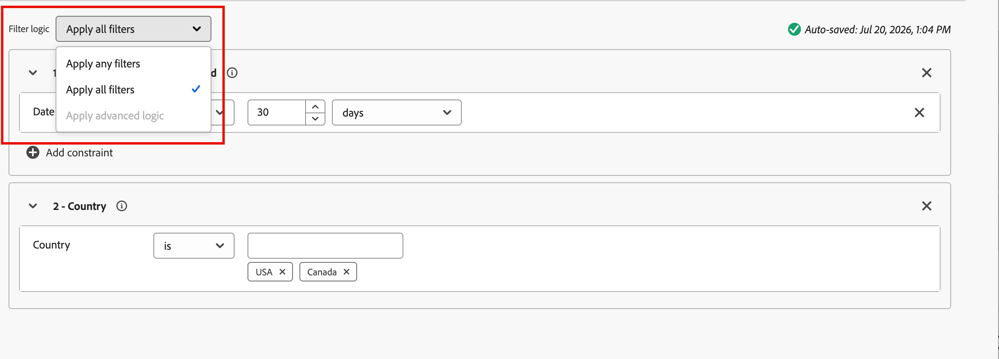
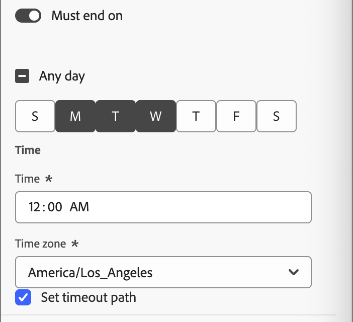

# 侦听事件

要在事件发生时将受众前进到[历程](./journeys-overview.md)中的下一步，请添加&#x200B;_侦听事件_&#x200B;节点。 根据历程类型，您可以使用此节点根据人员或帐户事件触发历程中的下一个节点。

<!--
{width="30", vertical-align="middle"} [Watch the overview video](#overview-video)
-->

## 帐户历程 {#account-journeys}

>[!NOTE]
>
>对于帐户历程，无法按人员添加拆分路径上的&#x200B;_[!UICONTROL 侦听事件]_&#x200B;节点类型。

1. 打开帐户历程画布。

1. 单击路径上的加号( **+** )图标，然后选择&#x200B;**[!UICONTROL 侦听事件]**。

   {width="400"}

1. 在右侧的节点属性中，使用&#x200B;_事件类型_&#x200B;选择器在&#x200B;**[!UICONTROL 帐户]**&#x200B;和&#x200B;**[!UICONTROL 人员]**&#x200B;之间进行选择。

1. 从列表中选择一个事件。

   * 对于&#x200B;_人员_&#x200B;事件类型，请选择要用于触发器的[人员事件](#people-events)。

     {width="500" zoomable="yes"}

   * 对于&#x200B;_帐户_&#x200B;事件类型，请选择要用于触发器的[帐户事件](#account-events)。

     {width="500" zoomable="yes"}上的事件

1. 单击&#x200B;**[!UICONTROL 编辑事件]**&#x200B;并定义该事件的详细信息。

   根据所选的事件类型和事件，定义事件匹配条件。

   * [人员活动](#people-events)
   * [帐户事件](#account-events)

   您还可以包含该事件的[筛选器](#filters-people-event)。

1. 单击&#x200B;**[!UICONTROL 完成]**。

   事件和筛选器定义显示在节点和节点属性中。

   {width="500"}

### 帐户历程的人员事件 {#people-events}

在帐户历程中，当您想要根据人员活动触发的事件在历程中向前移动帐户时，可以根据人员侦听事件。 您还可以根据事件历史记录和人员属性筛选事件。

>[!TIP]
>
>体验事件可在&#x200B;_前_&#x200B;人员进入历程时发生（例如先前的电子邮件点击或Web交互）。 要基于这些事件路由人员，请在[按人员拆分路径](./split-merge-paths-nodes.md#experience-event-history-filtering)节点中使用[!UICONTROL 事件历史记录]筛选器。

#### Journey Optimizer B2B事件 {#events-account-people}

| 活动 | 约束 |
| ----- | ----------- |
| [!UICONTROL 已分配给购买组] | 解决方案兴趣（必需）  其他约束（可选）： <li>角色</li><li>活动日期</li> 超时（可选） |
| [!UICONTROL 个人资料更改] | 属性（必需） 活动日期（可选） 新值（可选） 上一个值（可选） 原因（可选） Source（可选） |
| [!UICONTROL 已从购买群组中移除] | 解决方案兴趣（必需） 活动日期（可选） 超时（可选） |

1. 设置与事件匹配的所需值。

   如果需要，请为评估设置运算符。

1. 对于要包含用于事件匹配的每个可选约束，单击&#x200B;**[!UICONTROL 添加约束]**&#x200B;并在列表中选择一个约束。

   {width="700" zoomable="yes"}

1. （可选）选择&#x200B;**[!UICONTROL 筛选器]**&#x200B;选项卡以[为事件添加筛选器](#filters-people-event)。

1. 单击&#x200B;**[!UICONTROL 完成]**。

#### 体验事件 {#experience-events-account-people}

>[!PREREQUISITES]
>
>管理员可配置[Adobe Experience Platform (AEP) Experience Events](https://experienceleague.adobe.com/zh-hans/docs/experience-platform/xdm/classes/experienceevent){target="_blank"}，以便营销人员能够创建近乎实时地对事件做出反应的帐户和人员历程。
>
>要使体验事件可用于历程，产品管理员必须首先在[!DNL Journey Optimizer B2B Edition]中[添加感兴趣的事件类型和字段](../admin/configure-aep-events.md#add-an-event)。

1. 单击&#x200B;**[!UICONTROL 添加约束]**，然后选择要用于约束的字段。

   可用的约束定义为事件配置的托管字段。

1. 完成约束的条件。

   您可以使用默认的&#x200B;**[!UICONTROL 是]**&#x200B;运算符匹配一个或多个字段值。 或者，您可以使用&#x200B;**[!UICONTROL is not]**&#x200B;运算符来匹配所有值，并排除一个或多个指定的值。

   {width="700" zoomable="yes"}

1. （可选）选择&#x200B;**[!UICONTROL 筛选器]**&#x200B;选项卡以[为事件添加筛选器](#filters-people-event)。

1. 单击&#x200B;**[!UICONTROL 完成]**。

### 帐户事件 {#account-events}

在帐户历程中，当您想要根据帐户活动触发的事件在历程中向前移动帐户时，可以根据帐户侦听事件。

| 活动 | 约束 |
| ----- | ----------- |
| [!UICONTROL 帐户有有趣的时刻] | 类型（电子邮件、里程碑或Web） 其他约束（可选）： <li>描述</li><li>来源</li><li>活动日期</li>  超时（可选） |
| [!UICONTROL 更改帐户数据值] | 属性 其他约束（可选）： <li>新值</li><li>上一个值</li><li>活动日期</li>  超时（可选） |
| 购买团体阶段[!UICONTROL 更改] | 解决方案兴趣 其他约束（可选）： <li>新阶段</li><li>上一阶段</li><li>活动日期</li> 超时（可选） |
| [!UICONTROL 购买群组状态更改] | 解决方案兴趣 其他约束（可选）： <li>新状态</li><li>以前的状态</li><li>活动日期</li> 超时（可选） |
| [!UICONTROL 完整性分数更改] | 解决方案兴趣 其他约束（可选）： <li>新得分</li><li>上一个得分</li><li>活动日期</li> 超时（可选） |
| [!UICONTROL 参与度得分更改] | 解决方案兴趣 其他约束（可选）： <li>新得分</li><li>上一个得分</li><li>活动日期</li> 超时（可选） |

1. 设置与事件匹配的所需约束。

1. 对于要包含用于事件匹配的每个可选约束，单击&#x200B;**[!UICONTROL 添加约束]**&#x200B;并选择字段。

   {width="700" zoomable="yes"}

   设置评估的运算符和值。

1. 单击&#x200B;**[!UICONTROL 完成]**。

<!--

Removed from AJO B2B people events 

| [!UICONTROL Clicks link in email] | Email  Additional constraints (optional): <li>Link</li><li>Link ID</li><li>Is mobile device</li><li>Device</li><li>Platform</li><li>Browser</li><li>Is predictive content</li><li>Is bot activity</li><li>Bot activity pattern</li><li>Browser</li><li>Date of activity</li><li>Min. number of times</li> Timeout (optional) |
| [!UICONTROL Clicks link in SMS] | Email  Additional constraints (optional): <li>Link</li><li>Device</li><li>Platform</li><li>Date of activity</li><li>Min. number of times</li> Timeout (optional) |
| [!UICONTROL Data value changes] | Person attribute  Additional constraints (optional): <li>New value</li><li>Previous value</li><li>Reason</li><li>Source</li><li>Date of activity</li><li>Min. number of times</li> Timeout (optional) |
| [!UICONTROL Opens email] | Email  Additional constraints (optional): <li>Link</li><li>Link ID</li><li>Is mobile device</li><li>Device</li><li>Platform</li><li>Browser</li><li>Is predictive content</li><li>Is bot activity</li><li>Bot activity pattern</li><li>Browser</li><li>Date of activity</li><li>Min. number of times</li> Timeout (optional) |
| [!UICONTROL Score is changed] | Score name  Additional constraints (optional):<li>Change</li><li>New score</li><li>Urgency</li><li>Priority</li><li>Relative score</li><li>Relative urgency</li><li>Date of activity</li><li>Min. number of times</li> Timeout (optional) |
| [!UICONTROL SMS Bounces]| SMS message  Additional constraints (optional): <li>Date of activity</li><li>Min number of times</li> Timeout (optional) |

### Listen for a Marketo Engage event {#listen-for-marketo-engage-event}

| Marketo Engage | [!UICONTROL Visits Web Page] | Web page   Select one or more Marketo Engage pages to match.   Additional constraints (optional): <li>Querystring</li><li>Client IP address</li><li>Referrer</li><li>User Agent</li><li>Search engine</li><li>Search query</li><li>Token</li><li>Browser</li><li>Platform</li><li>Device</li><li>Date of activity</li> |
| | [!UICONTROL Fills out form] | Form   Select one or more Marketo Engage forms to match.   Additional constraints (optional): <li>Date of activity</li><li>Querystring</li><li>Client IP address</li><li>Referrer</li><li>User agent</li><li>Platform</li><li>Device</li> Timeout (optional) |
| Adobe Experience Platform | [!UICONTROL Event definition] | Event type   Additional constraints (optional): <li>Fields</li>  Additional constraints (not supported): <li>Date of activity</li><li>Min. number of times</li>  Timeout (optional) |

If you have web pages in your connected Marketo Engage instance, you can trigger an event based on a visit/no visit to these web pages, as well as Marketo Engage forms that were/were not filled. 

1. Use the **[!UICONTROL Select people event]** selector and scroll the menu to the **[!UICONTROL Marketo Engage]** section.

1. Select a Marketo Engage activity type:

   * **[!UICONTROL Visits Web Page]**.
   * **[!UICONTROL Fills Out Form]**

   {width="700" zoomable="yes"}

1. Click **[!UICONTROL Edit event]** and define one or more web pages to match and any additional constraints for the event.

   * (Required) In the _[!UICONTROL Edit event]_ dialog, define the **[!UICONTROL Web page]** or **[!UICONTROL Fills out form]** constraint. Use **[!UICONTROL is]** (default) to match on one or more selected pages or forms. Use **[!UICONTROL is not]** to match on all page visits/forms with the exclusion of one or more selected pages/forms. Or, use the **[!UICONTROL is any]** operator to match on any Marketo Engage web page visit or filled form.

   * (Optional) Click **[!UICONTROL Add constraint]** and choose the field that you want to use for the constraint. Set the operator and the value for the field.

     {width="700" zoomable="yes"}

     To include additional field constraints as needed, repeat this action.

   * If needed, select the **[!UICONTROL Filters]** tab to [add filters for the event](#add-a-filter-to-the-people-event).

   * When the constraints and filters are defined, click **[!UICONTROL Done]**.

1. If needed, set the **[!UICONTROL Timeout]** option to limit the time period to listen for the event (see [Add a timeout to an event node](#add-a-timeout-to-an-event-node)). 

1. In the journey canvas, add the next node to execute when the event occurs.

-->

## 人员历程 {#person-journeys}

1. 打开人员历程画布。

1. 单击路径上的加号( **+** )图标，然后选择&#x200B;**[!UICONTROL 侦听事件]**。

   {width="350"}

1. 在右侧的节点属性中，单击&#x200B;**[!UICONTROL 添加事件条件]**。

   {width="450"}

1. 添加事件并设置要与触发器匹配的约束。

   您可以使用[体验事件](#experience-events-person)和[人员配置文件更改](#person-profile-changes)来定义事件触发器。

   将事件触发器拖放到生成器空间中并设置定义。 为要用于优化事件匹配的每个约束单击&#x200B;**[!UICONTROL 添加约束]**。

   您可以添加多个要匹配的事件。 第一个符合条件事件会前进历程中的人员配置文件。

1. （可选）选择&#x200B;**[!UICONTROL 筛选器]**&#x200B;选项卡以[为事件添加筛选器](#filters-people-event)。

1. 单击&#x200B;**[!UICONTROL 完成]**。

   事件和筛选器定义显示在节点和节点属性中。

   {width="450"}

### 人员历程的体验事件 {#experience-events-person}

>[!PREREQUISITES]
>
>管理员可配置[Adobe Experience Platform (AEP) Experience Events](https://experienceleague.adobe.com/zh-hans/docs/experience-platform/xdm/classes/experienceevent){target="_blank"}，以便营销人员能够创建近乎实时地对事件做出反应的帐户和人员历程。
>
>要使体验事件可用于历程，产品管理员必须首先在[!DNL Journey Optimizer B2B Edition]中[添加感兴趣的事件类型和字段](../admin/configure-aep-events.md#add-an-event)。

您可以在&#x200B;_[!UICONTROL 编辑事件]_&#x200B;对话框中使用体验事件触发个人历程中的节点。

1. 展开左侧&#x200B;_[!UICONTROL 触发器]_&#x200B;列表中的&#x200B;**[!UICONTROL Sapphire AEP事件]**。

1. 将体验事件拖放到事件匹配生成器空间中。

   您可以使用&#x200B;_搜索_&#x200B;字段筛选事件名称中的关键字，如`email`。

1. 单击&#x200B;**[!UICONTROL 添加约束]**，然后选择要用于优化事件匹配的字段。

   可用的约束定义为事件配置的托管字段。

   {width="700" zoomable="yes"}

1. 为事件字段设置要匹配的运算符和值。

1. （可选）添加另一个体验事件或[人员配置文件更改](#person-profile-changes)。

   添加多个要匹配的事件时。 第一个符合条件事件会前进历程中的人员配置文件。

1. （可选）选择&#x200B;**[!UICONTROL 筛选器]**&#x200B;选项卡以[为事件添加筛选器](#filters-people-event)。

1. 单击&#x200B;**[!UICONTROL 完成]**。

### 人员轮廓更改 {#person-profile-changes}

您可以使用B2B人员配置文件属性中的更改在&#x200B;_[!UICONTROL 编辑事件]_&#x200B;对话框中触发人员历程中的节点。

1. 将&#x200B;**[!UICONTROL 人员配置文件更改]**&#x200B;从&#x200B;_[!UICONTROL 触发器]_&#x200B;列表拖放到事件匹配生成器空间中。

1. 单击&#x200B;**[!UICONTROL 添加约束]**&#x200B;并选择要用于事件触发器的属性更改。

   根据要匹配的更改设置字段值。

   {width="700" zoomable="yes"}

1. （可选）添加另一个要用作事件触发器的&#x200B;_人员配置文件更改_&#x200B;属性，或添加一个[体验事件](#experience-events-person)。

   添加多个要匹配的事件时。 第一个符合条件事件会前进历程中的人员配置文件。

1. （可选）选择&#x200B;**[!UICONTROL 筛选器]**&#x200B;选项卡以[为事件添加筛选器](#filters-people-event)。

1. 单击&#x200B;**[!UICONTROL 完成]**。

## 事件过滤器 {#filters-people-event}

当您在帐户历程[&#128279;](#people-events)中定义[人员事件，或在人员历程](#person-journeys)中定义事件时，您可以包含筛选以根据各种条件限制匹配的事件触发器：

| 过滤器 | 描述 |
| ------------ | ----------- |
| [!UICONTROL 事件历史记录] | 管理员配置的Experience事件。 请参阅&#x200B;_[选择体验事件和字段](../admin/configure-aep-events.md)_。 |
| [!UICONTROL 人员属性] | B2B人员配置文件中的属性，包括： <li>城市 <li>国家 <li>出生日期 <li>电子邮件地址 <li>电子邮件无效 <li>电子邮件已暂停 <li>名字 <li>推断的州区域<li>作业名称 <li>姓 <li>手机号码 <li>人员参与度评分 <li>电话号码 <li>邮政编码 <li>州 <li>取消订阅 <li>取消订阅的原因 |
| [!UICONTROL 人员属性] | （仅限人员历程）属性值 |
| [!UICONTROL 特殊筛选器] > [!UICONTROL 购买团体成员] | 人员是否属于根据以下一个或多个标准评估的购买组成员： <li>解决方案兴趣</li><li>购买组状态</li><li>完整性分数</li><li>参与度评分</li><li>已删除</li><li>角色</li> |

<!--
| [!UICONTROL Special filters] > [!UICONTROL Member of List] | The person is or is not a member of one or more Marketo Engage lists. |
| [!UICONTROL Special filters] > [!UICONTROL Member of Program] | The person is or is not a member of one or more Marketo Engage programs. |
-->

1. 定义事件触发器后，在&#x200B;_[!UICONTROL 编辑事件]_&#x200B;对话框中选择&#x200B;**[!UICONTROL 筛选器]**&#x200B;选项卡。

   {width="700" zoomable="yes"}

1. 要筛选事件的匹配项，请添加一个或多个筛选条件。

   * 从左侧导航中拖放任何筛选器并完成匹配定义。

     >[!NOTE]
     >
     >如果您在Experience Platform的帐户受众架构中定义了自定义人员字段，则这些字段也可在&#x200B;**[!UICONTROL 属性]**&#x200B;下用作过滤器中的人员属性。

   * 通过在顶部应用&#x200B;**[!UICONTROL 筛选器逻辑]**&#x200B;优化您的筛选。 您可以选择匹配所有筛选器或任何筛选器。

     在事件定义中使用的{width="600" zoomable="yes"}

1. 事件和筛选器定义完成后，单击&#x200B;**[!UICONTROL 完成]**。

## 向事件节点添加超时 {#timeouts}

如果需要，可定义历程等待事件的时间。 该历程在超时后结束，除非您定义了一个超时路径，您可以在其中添加其他节点。

启用节点属性中的&#x200B;**[!UICONTROL Timeout]**&#x200B;选项以为&#x200B;_侦听事件_&#x200B;节点指定超时。

1. 启用这些选项后，选择&#x200B;_类型_&#x200B;并指定超时参数：

   * **[!UICONTROL 持续时间]** — 使用此类型为事件触发器指定时间段。 如果事件没有在该时间段内触发，则人员或帐户不会继续在历程中前进。

     选择历程在超时之前等待事件发生的持续时间。 指定分钟数、小时数、天数、周数或月数。

     {width="500" zoomable="yes"}

     如果您希望时间段在一周中的特定日期结束，请启用&#x200B;**[!UICONTROL 必须于]**&#x200B;结束选项。 默认情况下会选择&#x200B;**[!UICONTROL 任意日期]**，并且会选择所有日期。 清除复选框，然后为结束日期选择一天或多天。 然后选择&#x200B;**时间**&#x200B;和&#x200B;**[!UICONTROL 时区]**。

     {width="300"}结束

   * **[!UICONTROL 日期]** — 使用此类型设置节点的到期日期。 如果事件未在指定的日期/时间触发，则人员或帐户不会继续在历程中继续。

     单击&#x200B;_日历_&#x200B;图标设置超时的日期和时间。

     {width="500" zoomable="yes"}

1. 定义超时路径。

   默认情况下已选中&#x200B;**[!UICONTROL 设置超时路径]**&#x200B;选项。 您可以使用此路径来定义监听事件节点超时后发生的情况。 您可以添加适用于未发生事件时人员配置文件的替代操作和事件。

   {width="600" zoomable="yes"}

   如果不想定义路径，可以清除&#x200B;_[!UICONTROL 设置超时路径]_&#x200B;复选框。

<!--
 ## Overview video

>[!VIDEO](https://video.tv.adobe.com/v/3443219/?learn=on) 
-->
