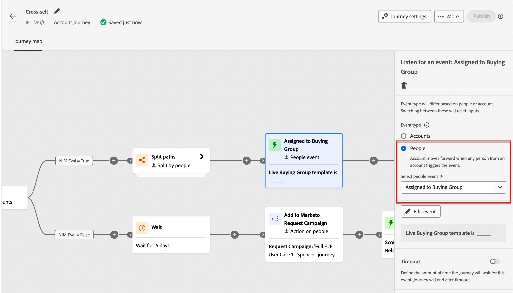

# 侦听事件

添加&#x200B;_侦听事件_&#x200B;节点，以便在事件发生时将受众前进到帐户历程中的下一步。

{width="30"} [观看概述视频](#overview-video)

>[!NOTE]
>
>无法按人员将此节点类型添加到拆分路径中。

## 帐户事件

当您想要根据帐户活动触发的事件在历程中向前移动帐户时，请根据帐户侦听事件。

### 事件和约束

| 活动 | 约束 |
| ----- | ----------- |
| 账户有有趣的时刻 | 类型（电子邮件、里程碑或Web） 其他约束（可选）： <li>描述</li><li>来源</li><li>活动日期</li>  超时（可选） |
| 帐户数据值更改 | 属性 其他约束（可选）： <li>新值</li><li>上一个值</li><li>活动日期</li>  超时（可选） |
| 购买组阶段中的更改 | 解决方案兴趣 其他约束（可选）： <li>新阶段</li><li>上一阶段</li><li>活动日期</li> 超时（可选） |
| 购买组状态的更改 | 解决方案兴趣 其他约束（可选）： <li>新状态</li><li>以前的状态</li><li>活动日期</li> 超时（可选） |
| 完整性分数的更改 | 解决方案兴趣 其他约束（可选）： <li>新得分</li><li>上一个得分</li><li>活动日期</li> 超时（可选） |
| 参与度分数的更改 | 解决方案兴趣 其他约束（可选）： <li>新得分</li><li>上一个得分</li><li>活动日期</li> 超时（可选） |

### 添加帐户事件

1. 导航到历程编辑器。

1. 单击路径上的加号( **+** )图标，然后选择&#x200B;**[!UICONTROL 侦听事件]**。

1. 在右侧的节点属性中，为事件类型选择&#x200B;**[!UICONTROL 帐户]**。

   {width="700" zoomable="yes"}

1. 从列表中选择一个事件。

1. 单击&#x200B;**[!UICONTROL 编辑事件]**&#x200B;并定义该事件的详细信息。

## 人员活动

根据人员活动触发的事件，侦听基于人员的事件，同时要根据人员活动在历程中向前移动帐户。

### 事件和约束

| 输入类型 | 活动 | 约束 |
| ---------- | ----- | ----------- |
| Journey Optimizer B2B | 已分配给购买组 | 解决方案兴趣  其他约束（可选）： <li>角色</li><li>活动日期</li> 超时（可选） |
| | 单击电子邮件中的链接 | 电子邮件  其他约束（可选）： <li>链接</li><li>链接Id</li><li>是移动设备</li><li>设备</li><li>平台</li><li>浏览器</li><li>是预测内容</li><li>是机器人活动</li><li>机器人活动模式</li><li>浏览器</li><li>活动日期</li><li>最低 次数</li> 超时（可选） |
| | 短信中的点击链接 | 电子邮件  其他约束（可选）： <li>链接</li><li>设备</li><li>平台</li><li>活动日期</li><li>最低 次数</li> 超时（可选） |
| | 数据值更改 | 人员属性  其他约束（可选）： <li>新值</li><li>上一个值</li><li>原因</li><li>来源</li><li>活动日期</li><li>最低 次数</li> 超时（可选） |
| | 打开电子邮件 | 电子邮件  其他约束（可选）： <li>链接</li><li>链接Id</li><li>是移动设备</li><li>设备</li><li>平台</li><li>浏览器</li><li>是预测内容</li><li>是机器人活动</li><li>机器人活动模式</li><li>浏览器</li><li>活动日期</li><li>最低 次数</li> 超时（可选） |
| | 已从购买组中移除 | 解决方案兴趣 活动日期（可选） 超时（可选） |
| | 分数已更改 | 得分名称  其他约束（可选）：<li>更改</li><li>新得分</li><li>紧急</li><li>优先级</li><li>相对分数</li><li>相对紧迫性</li><li>活动日期</li><li>最低 次数</li> 超时（可选） |
| | 短信退回 | SMS消息  其他约束（可选）： <li>活动日期</li><li>最小次数</li> 超时（可选） |
| Marketo Engage | 访问网页 | 网页 选择一个或多个Marketo Engage页面进行匹配。   其他约束（可选）： <li>查询字符串</li><li>客户端IP地址</li><li>反向链接</li><li>用户代理</li><li>搜索引擎</li><li>搜索查询</li><li>令牌</li><li>浏览器</li><li>平台</li><li>设备</li><li>活动日期</li> |
| | 填写表单 | 表单 选择要匹配的一个或多个Marketo Engage表单。    其他约束（可选）： <li>活动日期</li><li>查询字符串</li><li>客户端IP地址</li><li>反向链接</li><li>用户代理</li><li>平台</li><li>设备</li> 超时（可选） |
| Adobe Experience Platform | 事件定义 | 事件类型  其他约束（可选）： <li>字段</li>  其他约束（不支持）： <li>活动日期</li><li>最低 次数</li> 超时（可选） |

### 添加人员事件

1. 导航到历程编辑器。

1. 单击路径上的加号( **+** )图标，然后选择&#x200B;**[!UICONTROL 侦听事件]**。

1. 在右侧的节点属性中，为事件类型选择&#x200B;**[!UICONTROL 人员]**。

   {width="700" zoomable="yes"}

1. 从列表中选择一个事件。

1. 单击&#x200B;**[!UICONTROL 编辑事件]**&#x200B;并定义该事件的详细信息。

### 收听Marketo Engage活动

如果您在连接的Marketo Engage实例中创建了网页，则可以根据访问/未访问Marketo Engage网页以及未填写的Marketo Engage表单触发事件。

1. 在历程编辑器中选择&#x200B;**[!UICONTROL 侦听事件]**&#x200B;节点。

1. 在右侧的节点属性中，为事件类型选择&#x200B;**[!UICONTROL 人员]**。

1. 单击&#x200B;**[!UICONTROL 选择人员事件]**&#x200B;选择器的箭头，并将菜单滚动到&#x200B;**[!UICONTROL Marketo Engage]**&#x200B;部分。

1. 选择市场参与活动类型：

   * **[!UICONTROL 访问网页]**。
   * **[!UICONTROL 填写表单]**

   {width="700" zoomable="yes"}

1. 单击&#x200B;**[!UICONTROL 编辑事件]**&#x200B;并定义一个或多个要匹配的网页以及该事件的任何其他约束。

   * （必需）在&#x200B;_[!UICONTROL 编辑事件]_&#x200B;对话框中，定义&#x200B;**[!UICONTROL 网页]**&#x200B;或填写表单约束。 使用&#x200B;**[!UICONTROL 是]**（默认值）匹配一个或多个选定的页面或表单。 使用&#x200B;**[!UICONTROL 不是]**&#x200B;在所有页面访问/表单上匹配，排除一个或多个选定的页面/表单。 或者，在任何Marketo Engage网页访问或填写的表单中，使用&#x200B;**[!UICONTROL 为任何]**&#x200B;进行匹配。

   * （可选）单击&#x200B;**[!UICONTROL 添加约束]**，然后选择要用于约束的字段。 设置字段的运算符和值。

     {width="700" zoomable="yes"}

     您可以根据需要重复此操作以包含其他字段约束。

   * 定义约束后，单击&#x200B;**[!UICONTROL 完成]**。

1. 如果需要，请设置&#x200B;**[!UICONTROL Timeout]**&#x200B;选项以限制侦听事件的时间段（请参阅[向事件节点添加超时](#add-a-timeout-to-an-event-node)）。

1. 在历程编辑器中，添加下一个要在事件发生时执行的节点。

### 收听体验活动

管理员可以配置基于Adobe Experience Platform (AEP)的事件定义，这使得营销人员能够创建对[AEP Experience事件](https://experienceleague.adobe.com/en/docs/experience-platform/xdm/classes/experienceevent)做出反应的帐户历程。 在帐户历程中使用AEP体验事件包括两个步骤：

1. [创建并发布AEP事件定义](../admin/configure-aep-events.md)。

2. 在帐户历程中，添加&#x200B;_侦听事件_&#x200B;节点，并为基于人员的事件选择Experience Platform事件定义。

_要在您的历程中包含体验事件，请执行以下操作：_

1. 在历程编辑器中选择&#x200B;**[!UICONTROL 侦听事件]**&#x200B;节点。

1. 在右侧的节点属性中，为事件类型选择&#x200B;**[!UICONTROL 人员]**。

1. 单击&#x200B;**[!UICONTROL 选择人员事件]**&#x200B;选择器的箭头，并将菜单滚动到&#x200B;**[!UICONTROL Adobe Experience Platform]**&#x200B;部分。

   {width="700" zoomable="yes"}

1. 选择事件。

   事件类型在节点详细信息中显示为空。

   {width="400" zoomable="yes"}

1. 单击&#x200B;**[!UICONTROL 编辑事件]**&#x200B;并定义该事件的事件类型和任何其他约束。

   * （必需）在&#x200B;_[!UICONTROL 编辑事件]_&#x200B;对话框中，定义事件类型。 您可以使用默认的&#x200B;**[!UICONTROL is]**&#x200B;运算符匹配一个或多个选定的事件类型。 或者，您可以使用&#x200B;**[!UICONTROL is not]**&#x200B;运算符在所有事件类型上进行匹配，并排除一个或多个选定的事件类型。

   * （可选）单击&#x200B;**[!UICONTROL 添加约束]**，然后选择要用于约束的字段。 设置字段的运算符和值。

     {width="700" zoomable="yes"}

     >[!NOTE]
     >
     >不支持活动&#x200B;_的_&#x200B;日期和&#x200B;_最小次数_&#x200B;的约束。

     您可以根据需要重复此操作以包含其他字段约束。

   * 定义约束后，单击&#x200B;**[!UICONTROL 完成]**。

1. 如果需要，请设置&#x200B;**[!UICONTROL Timeout]**&#x200B;选项以限制侦听事件的时间段（请参阅[向事件节点添加超时](#add-a-timeout-to-an-event-node)）。

1. 在历程编辑器中，添加下一个要在事件发生时执行的节点。

1. 完成历程的其余节点，并[发布它](./journey-overview.md)。

   当历程处于实时状态（已发布）并到达&#x200B;_侦听事件_&#x200B;节点时，它会开始侦听AEP体验事件。

## 向事件节点添加超时

如果需要，可定义历程等待事件的时间。 该历程在超时后结束，除非您定义了一个超时路径，您可以在其中添加其他节点。

1. 启用&#x200B;**[!UICONTROL 超时]**&#x200B;选项。

1. 选择历程在超时之前等待事件发生的持续时间。

   您可以选择在此处结束路径，或通过设置其他路径采取不同的操作过程。

1. 要在历程中创建一个新路径，以便在不发生事件时添加适用于帐户的操作和事件，请选中&#x200B;**[!UICONTROL 设置超时路径]**&#x200B;复选框。

   {width="700" zoomable="yes"}

## 概述视频

>[!VIDEO](https://video.tv.adobe.com/v/3443219/?learn=on)
