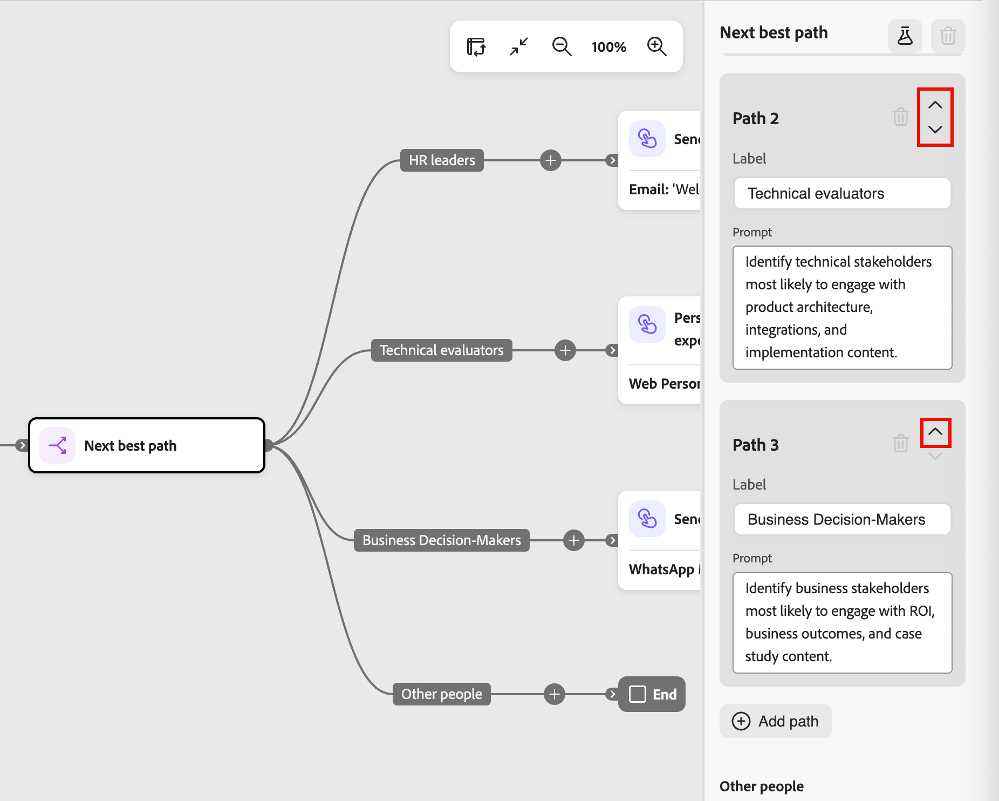

# 下一个最佳路径节点

_下一个最佳路径_&#x200B;节点将AI驱动的分割路径决策直接引入历程画布。 您不是在[拆分路径](./split-merge-paths-nodes.md)节点上配置筛选条件，而是用自然语言描述您的意图，让系统确定与每个人最相关的路径。

>[!NOTE]
>
>下一个最佳路径节点仅在人员历程中可用。 帐户历程中不支持它们。

在B2B购买中，个人资料似乎是一种类型的买家，但他们的行为、电影数据和参与背景揭示了一个更微妙的故事。 下一个最佳路径节点会评估该上下文以做出智能路由决策，同时允许您在激活历程之前查看、修改或覆盖任何AI推荐。

AI会使用输入的组合，根据定义的路径提示评估每个人：

* **参与历史记录** — 来自当前和之前历程的电子邮件打开、链接点击、网页访问和其他行为信号
* **实时信号** — 表单填写和定价页面访问等高意图事件
* **个人资料属性** — 人口统计、职务、角色和第一类数据
* **帐户属性** — 与人员帐户关联的固件和技术说明数据

当人员到达节点时，系统会获取用户档案上下文、应用约束，并使用LLM选择最适合的路径。 每个决策都记录有置信度得分和用于透明度和可观察性的自然语言推理。

如果没有强匹配路径，或者提示引用了用户档案不可用的数据，则人员将被路由到默认的回退路径。

## 添加下一个最佳路径节点 {#add-next-best-path-node}

1. 打开人员历程并导航到历程图。

1. 单击路径上的加号( **+** )图标，然后选择&#x200B;**[!UICONTROL 下一个最佳路径]**。

   {width="350" zoomable="no"}

   节点将添加到画布中，AI拆分配置面板将显示在右侧。 它以一条路径和默认的&#x200B;_其他人_&#x200B;路径开始，路由不符合任何已定义路径资格的人员。

   {width="500"}

## 配置路径 {#configure-paths}

对于每个路径，定义一个名称和自然语言提示符，用于描述应路由到那里的人员。 提示输入将完全替换筛选条件UI；没有要配置的属性条件。

1. 对于要包含到节点的每个其他路径，单击&#x200B;**[!UICONTROL 添加路径]**。

   要删除路径，请单击路径卡上的&#x200B;_删除_ （  ）图标。

1. 对于右侧面板中的每个路径卡：

   * 输入反映该区段受众或意图的&#x200B;**[!UICONTROL 标签]**。

   * 输入自然语言描述属于此路径的&#x200B;**[!UICONTROL 提示]**。 关注意图和结果，而不是特定的属性值。

     <!-- To get prompt ideas, click **[!UICONTROL Suggest prompts]**. The system provides several example prompts tailored to the path context that you can use as-is or adapt. -->

     {width="500"}

     **示例提示三路径拆分：**

      * _Path 1 - HR主管&#x200B;:_确定HR领导角色中最可能参与人才管理和员工体验内容的人员。
      * _Path 2 — 技术评估人员&#x200B;:_确定最有可能参与产品体系结构、集成和实施内容的技术利益相关者。
      * _Path 3 — 业务决策者&#x200B;:_确定最有可能参与ROI、业务成果和案例研究内容的业务利益相关者。

1. 如果需要，可重新排列路径顺序以设置匹配的优先级顺序。

   路径过滤将按自上而下的顺序进行计算。 每个人沿着第一个匹配的路径前进。

   单击每个路径卡右上角的向上和向下箭头，将其在路径列表中向上或向下移动。

   {width="500"}

1. 查看默认路径（路径列表中的最后一个）并根据需要更改标签。

   当AI无法放心地将人员分配给任何定义的路径或相关数据不可用时，将使用默认路径。 当提示引用给定用户档案的数据集中不存在的数据时，系统会将该用户档案路由到默认路径并标记数据间隙。

### 人在回路控制 {#human-in-the-loop}

AI推荐不具约束性。 在激活历程之前，您可以：

* 编辑任意路径提示以优化路由逻辑。
* 添加、删除或重新排序路径。
* 根据需要使用自定义条件覆盖AI建议。

在发布旅程之前，AI驱动的路径分配不会生效。

## 按用例提示示例 {#examples}

以下示例显示如何在常见的B2B营销用例中编写有效的路径提示。 使用它们作为起点，并调整语言以匹配历程上下文和受众数据。

### 积极研究和购买信号 {#active-research}

+++路径1 — 活跃的产品研究人员

_识别积极研究CRM软件的人员。 查找过去30天内重复的产品页面访问次数、包含比较内容的参与度、频繁的回访以及提升的第三方意图信号。_

+++

+++路径2 — 定价比较行为

_识别过去14天内多次查看定价或计划比较页面的用户，尤其是那些在定价和功能文档页面之间切换的用户。_

+++

+++路径3 — 高意图，无转化

_识别过去21天内参与过产品演示、定价页面或集成文档但尚未提交表单或转换的高意图访客。_

+++

+++路径4 — 犹豫的结账行为

_确定已开始结帐或演示预订流程但未完成这些流程的用户，以及至少返回一次但未转换的用户。_

+++

### 流失和保留风险 {#churn-retention}

+++路径1 — 流失风险信号

_根据过去60天内产品使用量下降、登录频率降低、支持票证峰值和营销参与度降低来识别表现出流失迹象的客户。_

+++

+++路径2 — 脱离超级用户

_识别参与速度在过去30天内与其历史基线相比显着下降的以前参与的用户。_

+++

### 从教育到评价的差距 {#education-evaluation}

+++路径1 — 定价顺序研究

_识别下载电子书，然后在7天内访问定价页面但未请求演示的用户。_

+++

+++路径2 — 无跟进的网络研讨会

_识别参加网络研讨会并随后返回产品页但从未预订演示或联系销售人员的用户。_

+++

+++路径3 — 以比较为导向的评估

_识别查看竞争对手比较文章，然后在14天内访问集成或迁移文档的访客。_

+++

### 电子邮件参与序列 {#email-engagement}

+++路径1 — 无点击打开

_识别在30天内打开了三封或更多营销电子邮件，但从未点击过该网站的潜在客户。_

+++

+++路径2 — 已单击，但没有更深入的参与

_识别从电子邮件点击到产品页面但未浏览其他页面或在7天内回访的用户。_

+++

### 试用和转换模式 {#trial-conversion}

+++路径1 — 快速转换器

_识别在开始试用后30天内升级并在试用期显示高产品参与度的客户。_

+++

+++路径2 — 试用版停止的用户

_识别在第一周登录但随后显示最小活动且在试用过期之前未转换的试用用户。_

+++

### 多渠道购买者 {#multi-channel}

+++路径1 — 广告和自然收敛

_识别最初通过付费广告参与，然后在14天内通过直接或有机渠道返回的用户。_

+++

+++路径2 — 产品评估事件

_识别参与面对面或虚拟活动并随后在30天内增加产品研究行为的客户。_

+++

+++路径3 — 社交网站研究人员

_识别参与社交内容后访问高意图页面（如定价或演示预订）的用户。_

+++

### 地区购买信号 {#regional-buying}

+++路径1 — 特定区域出现激增

_识别北美地区的客户，这些客户在过去30天内表现出比其历史基线更多的产品研究活动和更高的第三方意图信号。_

+++

+++途径2 — 新兴市场发展势头

_识别APAC中参与速度在过去14天内显着增加的客户，即使总体参与量仍然适中。_

+++

+++路径3 — 特定于区域的企业兴趣

_确定过去21天内在EMEA从事法规遵从性、数据驻留或安全文档工作的企业规模客户。_

+++

+++路径4 — 未渗透的区域

_在已分配的销售地区中识别已显示意图信号但尚未联系销售的高匹配度客户。_

+++

### 行为计时信号 {#behavioral-timing}

+++路径1 — 非工作时间研究人员

_识别在本地时区正常工作时间以外重复使用产品和定价页面的用户。_

+++

+++路径2 — 压缩的研究窗口

_识别在多个产品领域的短72小时内表现出异常高的参与度密度的客户。_

+++

+++路径3 — 季度末活动尖峰

_识别在财政季度的最后30天内评估阶段活动激增的帐户。_

+++

## 发布前模拟决策 {#simulate}

在历程上线之前，使用模拟测试AI如何针对实际受众评估您的提示。 仅当历程处于&#x200B;_草稿_&#x200B;状态并且对任何已发布的历程没有影响时，它才可用。 使用它来验证路由逻辑并在AI推荐中构建置信度。

### 运行模拟 {#run-simulation}

1. 选择下一个最佳路径节点，然后单击右侧面板顶部的&#x200B;_模拟_ （  ）图标。

   {width="500"}

1. 在对话框中，选择要用于模拟的受众：

   * **[!UICONTROL 原始人员列表]** — 使用受众节点中的受众。 指定全部受众超出模拟阈值时的样本大小。
   * **[!UICONTROL 动态和静态列表]** — 使用[!DNL Marketo Engage]静态或动态列表。
   * **[!UICONTROL 测试记录]** — 使用AI建议的测试配置文件。

   {width="300"}

   >[!NOTE]
   >
   >如果所选受众超出模拟阈值，则系统对100个用户档案的示例运行模拟。 UI中的指示器显示结果基于示例。
   >
   >如果所选受众尚未实现，则会阻止模拟。 内联警告会指导您首先实体化受众。

1. 单击&#x200B;**[!UICONTROL 模拟]**。

### 查看模拟结果 {#review-simulation-results}

模拟运行后，右侧面板显示用户档案在各个路径中的分布方式以及这些任务背后的人工智能推理：

| 结果 | 描述 |
| ------ | ----------- |
| **轮廓** | 路由到路径的配置文件数。 |
| **拆分** | 路由到路径的配置文件的百分比。 |
| **置信度** | 路径分配的AI置信度。 置信度反映了数据新鲜度、信号强度和一致性，以及类似路由模式的历史成功度。 |
| **提示** | 为路径评估的提示。 |
| **AI推理** | 有关为何将配置文件集体分配给此路径的自然语言解释。 |

{width="400"}的结果

>[!NOTE]
>
>当可用数据或范围限制决策时，结果将包含有关限制的信息。 例如，当数据集中不存在所需的属性时，结果会包含一个显式指示器，说明缺少的数据如何影响结果。

使用结果优化提示并确认路由选择可反映预期结果。 您可以修改路径提示，并在发布之前根据需要多次重新运行模拟。

## 发布和监测旅程 {#publish-and-monitor}

验证仿真结果后：

1. 将人员受众连接到历程进入节点。

1. [发布历程](./create-publish-journey.md#publish-a-journey)。

历程处于活动状态后，下一个最佳路径节点将在执行时运行。 当每个人都到达该节点时，人工智能会使用最新的信号对其进行实时评估，并将其路由到最相关的路径。

对于已发布的历程，请打开历程图并选择下一个最佳路径节点，以在右侧面板中查看&#x200B;**[!UICONTROL 实时结果]**&#x200B;部分。 实时结果显示：

* 每个路径中的配置文件分布百分比
* 每个路径分配的置信度分数
* 路径级和配置文件级推理，可展开各个配置文件的详细信息

实时结果也可在历程控制台中以及通过AI中心的[历程可观察性技能](../agents/journey-agent.md#journey-observability-skill)获得。
