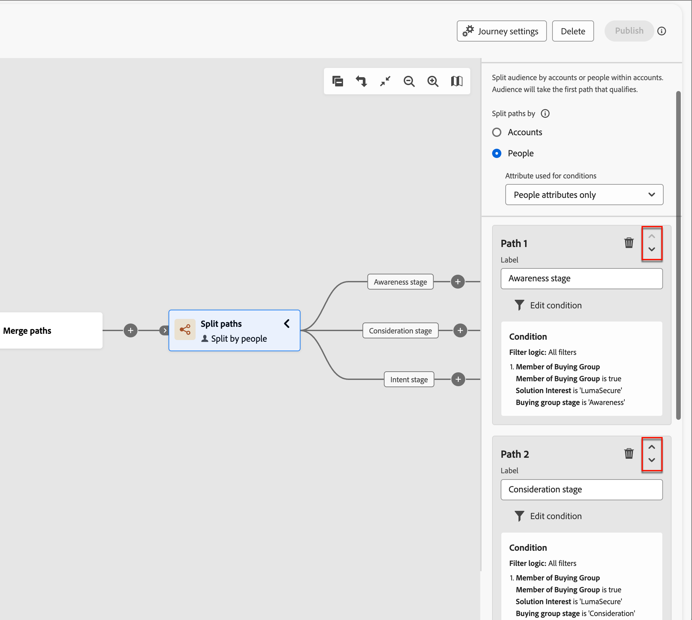

# 拆分和合并路径

使用拆分和合并路径节点，根据您定义的条件划分人员或帐户。 根据条件为受众或帐户列表创建路径，使用区段的操作和事件节点定义每个路径，然后组合路径并继续历程。

{width="30"} [观看概述视频](#overview-video)

_拆分路径_&#x200B;节点根据&#x200B;**__**&#x200B;帐户或人员筛选器定义一个或多个分段路径。 基于人员过滤器的拆分使用合并路径节点自动关闭，以便所有人员都可以前进到下一步而不会丢失其帐户上下文。

>[!NOTE]
>
>最多支持25条路径。

## 按帐户拆分路径

按帐户拆分路径可以同时包含帐户和人员操作及事件。 这些路径可以进一步拆分。

_&#x200B;**按帐户划分的拆分路径节点的工作方式**&#x200B;_

* 您添加的每个路径都包含一个能够向每个边缘添加节点的结束节点。
* 可以嵌套“按帐户拆分”节点（可以重复按帐户拆分路径）。
* 每个路径的评估是从上到下。 如果帐户与第一条和第二条路径匹配，则它仅沿着第一条路径前进。
* 可以使用合并节点合并两个或多个路径。
* 该节点支持&#x200B;_[!UICONTROL 其他帐户]_&#x200B;路径的定义，您可以在其中为与定义的段/路径之一不匹配的帐户添加操作或事件。

{width="700" zoomable="yes"}

### 帐户路径条件

| 路径条件 | 描述 |
| --------------- | ----------- |
| 帐户属性 | 帐户个人资料中的属性，包括： <li>年收入 <li>城市 <li>国家/地区 <li>员工人数 <li>行业 <li>名称 <li>SIC代码 <li>State <li>具有`<relational schema>` （请参阅[自定义数据筛选](#custom-data-filtering)） |
| [!UICONTROL 特殊筛选器] > [!UICONTROL 帐户与购买团体匹配] | 该帐户与一个或多个购买群体匹配。 对于匹配的购买组，可以根据以下一个或多个约束对其进行评估： <li>解决方案兴趣 <li>购买组阶段 <li>购买组状态 <li>参与度评分 <li>完整性分数 <li> 购买群组角色中的人数 |
| [!UICONTROL 特殊筛选器] > [!UICONTROL 有购买群] | 该帐户是否具有购买组的成员。 也可以根据以下一个或多个标准对其进行评估： <li>解决方案兴趣 <li>购买组阶段 <li>购买组状态 <li>参与度评分 <li>完整性分数 |

>[!NOTE]
>
>_[!UICONTROL 已标记为将来弃用“购物组]_”筛选器。 对于新历程，使用&#x200B;_[!UICONTROL 帐户与购买组]_&#x200B;筛选器匹配，该筛选器包括所有相同的约束。

### 按帐户节点添加拆分路径

1. 导航到历程图。

1. 单击路径上的加号( **+** )图标，然后选择&#x200B;**[!UICONTROL 拆分路径]**。

   {width="300" zoomable="no"}

1. 在右侧的节点属性中，为拆分选择&#x200B;**[!UICONTROL 帐户]**。

1. 要定义适用于&#x200B;_[!UICONTROL 路径1]_&#x200B;的条件，请单击&#x200B;**[!UICONTROL 应用条件]**。

   {width="500" zoomable="yes"}

1. 在条件编辑器中，添加一个或多个过滤器以定义拆分路径。

   * 从左侧导航中拖放过滤器属性并完成匹配定义。

   * 通过在顶部应用&#x200B;**[!UICONTROL 筛选器逻辑]**&#x200B;来优化条件。 您可以选择匹配所有筛选器或任何筛选器。

     {width="700" zoomable="yes"}

   * 单击&#x200B;**[!UICONTROL 完成]**。

1. 要添加更多路径，请单击&#x200B;**[!UICONTROL 添加路径]**，然后重复上述步骤以添加适用于此路径的条件。

   您还可以根据这些条件标记每个路径或使用默认标签。

1. 如果需要，可根据所需的拆分优先级对路径重新排序。

   路径过滤将按自上而下的顺序进行计算。 每个帐户都沿匹配的第一个路径前进。

   单击每个路径卡右上角的向上和向下箭头，将其在路径列表中向上或向下移动。

   {width="500" zoomable="yes"}

1. 启用&#x200B;**[!UICONTROL 其他帐户]**&#x200B;选项，以便为与所定义的区段/路径不匹配的帐户定义默认路径。

   未启用此选项时，历程结束的帐户与拆分中定义的区段/路径不匹配。

### 为帐户购买组筛选 {#buying-group-filtering-accounts}

您可以为与购买组关联的帐户定义路径，并使用购买组标准筛选路径。 使用&#x200B;**[!UICONTROL 帐户与购买组]**&#x200B;匹配以使用匹配的购买组定义路径区段。 此过滤器还包括根据匹配购买组中分配的角色数确定帐户的选项。

例如，您可能希望根据不同角色中的深度（人员数）来评估购买群体准备情况，例如三个决策者和两个影响者。 在这种情况下，将条件设置为在匹配购买组中至少有三(3)名决策者和两(2)名影响者的目标客户：

1. 单击&#x200B;**[!UICONTROL 添加筛选器]**，然后选择&#x200B;**[!UICONTROL 购买团体角色的人员数]**&#x200B;筛选器。

   {width="700" zoomable="yes"}

1. 定义第一个角色参数。

   * 将人数评估设置为`at least`，值为`3`。
   * 将角色评估设置为`is`并从角色列表中选择`Decision Maker`。

1. 重复步骤1以添加另一个购买组角色参数。

1. 定义第二个角色参数。

   * 将人数评估设置为`at least`，值为`2`。
   * 将角色评估设置为`is`并从角色列表中选择`Influencer`。

   {width="700" zoomable="yes"}

1. 为路径定义所有条件后，单击&#x200B;**[!UICONTROL 完成]**。

对于已标识的帐户，您可能需要在路径中添加操作节点，以更新购买组或阶段的状态，或者发送销售警报电子邮件。

### 自定义数据筛选

[!BADGE Beta]{type=Informative url="/help/user/admin/engagement-score-weighting.md" tooltip="作为测试版功能在简化的架构上提供"}

可以使用关系架构（基于模型的类）按帐户拆分路径。 自定义对象是在&#x200B;_关系架构_&#x200B;中定义的，产品管理员可以在[中](../admin/xdm-field-management.md#relational-schemas)配置关系架构字段[!DNL Journey Optimizer B2B Edition]。 条件编辑器中提供了选定的架构字段以用于按帐户节点拆分路径中。

选件{width="700" zoomable="yes"}条件示例

<!-- SPHR-23746

Note: These are currently going under Account Attributes folder, which is a bug (SPHR-21734). This will move to Special filters when resolved (January release).

This will also be available for split paths by people (under special filters) for the M 1.5 GA release.
-->

## 按人员拆分路径

按人员拆分路径只能包含人员操作。 这些路径无法再次拆分并自动连接回来。

_&#x200B;**按人员节点划分的拆分路径的工作方式**&#x200B;_

* 在&#x200B;_分组节点_&#x200B;拆分合并组合中按人员节点进行拆分的功能。 拆分路径会自动合并，以便所有人员能够前进到下一步而不会丢失其帐户上下文。
* 无法嵌套按人员节点拆分（无法为位于此分组节点中的路径上的人员添加拆分路径）。
* 每个路径的评估是从上到下。 如果人员与第一条和第二条路径匹配，则他们仅沿着第一条路径前进。
* 该节点支持使用&#x200B;_帐户 — 人员关系_，这允许您根据关系中定义的角色（如承包商或全职员工）筛选人员。
* 该节点支持&#x200B;_[!UICONTROL 其他人员]_&#x200B;路径的定义，您可以在其中添加与定义的区段/路径之一不匹配的人员的操作或事件。

{width="700" zoomable="yes"}

### 人员路径过滤器

| 过滤器 | 描述 |
| ------------ | ----------- |
| [!UICONTROL 活动历史记录] > [!UICONTROL 电子邮件] | 电子邮件活动基于使用历程中早期的一个或多个选定电子邮件评估的条件： <li>[!UICONTROL 已单击电子邮件中的链接] <li>打开了电子邮件 <li>已送达电子邮件 <li>已发送电子邮件 **[!UICONTROL 切换到非活动筛选器&#x200B;]**— 使用此选项可根据缺少活动进行筛选（某人没有电子邮件活动）。 |
| [!UICONTROL 活动历史记录] > [!UICONTROL 短信消息] | 短信活动基于使用历程中较早时间的一个或多个选定短信消息评估的条件： <li>[!UICONTROL 点击短信中的链接] <li>[!UICONTROL 短信已退回]  **[!UICONTROL 切换到非活动筛选器&#x200B;]**— 使用此选项可根据缺少活动进行筛选（某人没有短信活动）。 |
| [!UICONTROL 活动历史记录] > [!UICONTROL 数据值已更改] | 对于选定的人员属性，发生值更改。 这些更改类型包括： <li>新值<li>上一个值<li>原因<li>来源<li>活动日期<li>最低  **[!UICONTROL 切换到非活动筛选器的次数&#x200B;]**— 使用此选项可根据缺少活动（人员没有数据值更改）进行筛选。 |
| [!UICONTROL 活动历史记录] > [!UICONTROL 快乐时光] | 在关联的[!DNL Marketo Engage]实例中定义的有趣时刻活动。 限制包括： <li>里程碑<li>电子邮件<li>Web  **[!UICONTROL 切换到非活动筛选器&#x200B;]**— 使用此选项可基于缺少活动（人员没有快乐的时光）进行筛选。 |
| [!UICONTROL 活动历史记录] > [!UICONTROL 访问的网页] | 由关联的[!DNL Marketo Engage]实例管理的一个或多个网页的网页活动。 限制包括： <li>网页（必填）<li>活动日期<li>客户端IP地址 <li>查询字符串 <li>反向链接 <li>用户代理 <li>搜索引擎 <li>搜索查询 <li>个性化URL <li>令牌 <li>浏览器 <li>平台 <li>设备 <li>最低  **[!UICONTROL 切换到非活动筛选器的次数&#x200B;]**— 使用此选项可根据缺少活动（用户未访问网页）进行筛选。 |
| [!UICONTROL 人员属性] | 人员配置文件中的属性，包括： <li>城市 <li>国家/地区 <li>出生日期 <li>电子邮件地址 <li>电子邮件无效 <li>电子邮件已暂停 <li>名字 <li>推断的状态区域<li>作业名称 <li>姓氏 <li>手机号码 <li>人员参与度分数 <li>电话号码 <li>邮政编码 <li>State <li>已取消订阅 <li>取消订阅的原因 |
| [!UICONTROL 特殊筛选器] > [!UICONTROL 购买团体成员] | 人员是否属于根据以下一个或多个标准评估的购买组成员： <li>解决方案兴趣</li><li>购买组状态</li><li>完整性分数</li><li>参与度评分</li><li>角色</li> |
| [!UICONTROL 特殊筛选器] > [!UICONTROL 列表成员] | 此人是否为一个或多个[!DNL Marketo Engage]列表的成员。 |
| [!UICONTROL 特殊筛选器] > [!UICONTROL 计划成员] | 此人是否为一个或多个[!DNL Marketo Engage]项目的成员。 |

### 帐户 — 人员路径条件

| 路径条件 | 描述 |
| --------------- | ----------- |
| 帐户中的[!UICONTROL 角色] | 人员是否在帐户中被分配了角色。 可选约束： <li>角色名称 |

### 按人员节点添加拆分路径

>[!NOTE]
>
>按人员拆分路径时，将自动插入&#x200B;_封闭拆分路径_&#x200B;节点以结束拆分。 按人员拆分路径只允许对人员节点&#x200B;_执行操作_。

1. 导航到历程图。

1. 单击路径上的加号( **+** )图标，然后选择&#x200B;**[!UICONTROL 拆分路径]**。

   {width="300" zoomable="no"}

1. 在右侧的节点属性中，为拆分选择&#x200B;**[!UICONTROL 人员]**。

1. 设置用于条件&#x200B;**[!UICONTROL 的]**&#x200B;属性。

   * 选择&#x200B;**[!UICONTROL 仅人员属性]**&#x200B;以使用与人员配置文件相关的条件。
   * 选择&#x200B;**[!UICONTROL 仅限帐户 — 人员属性]**&#x200B;以使用与帐户中人员的角色成员资格相关的条件。

1. 要定义适用于&#x200B;_[!UICONTROL 路径1]_&#x200B;的条件，请单击&#x200B;**[!UICONTROL 应用条件]**。

1. 在条件编辑器中，添加一个或多个过滤器以定义拆分路径。

   * 从左侧导航中拖放任何人员筛选器并完成匹配定义。

     >[!NOTE]
     >
     >如果您在Experience Platform的帐户受众架构中定义了自定义人员字段，则这些字段也可用作条件中的人员属性。

   * 通过在顶部应用&#x200B;**[!UICONTROL 筛选器逻辑]**&#x200B;来优化条件。 您可以选择匹配所有属性条件或任何条件。

     {width="700" zoomable="yes"}

   * 单击&#x200B;**[!UICONTROL 完成]**。

1. 要添加更多路径，请单击&#x200B;**[!UICONTROL 添加路径]**，然后重复上述步骤以添加适用于此路径的条件。

   您还可以根据这些条件标记每个路径或使用默认标签。

1. 如果需要，可根据所需的拆分优先级对路径重新排序。

   路径过滤将按自上而下的顺序进行计算。 每个人沿着第一个匹配的路径前进。

   单击每个路径卡右上角的向上和向下箭头，将其在路径列表中向上或向下移动。

   {width="500" zoomable="yes"}

1. 启用&#x200B;**[!UICONTROL 其他人]**&#x200B;选项，为与定义的路径不匹配的人添加默认路径。

   未启用此选项时，与定义的区段/路径不匹配的用户将越过拆分，继续历程中的下一步。

   当为各个路径定义了条件，用于在人员级别拆分受众时，您可以添加要对人员执行的操作。

### 活动筛选

对于按人员划分的拆分路径，您可以根据与以下项相关的人员活动定义路径：

* 历程中较早时间的电子邮件
* 来自历程中更早时间的短信消息
* 人员配置文件中的数据值更改
* 与电子邮件、网页或里程碑关联的有趣时刻（在[!DNL Marketo Engage]中跟踪）
* 访问网页（在[!DNL Marketo Engage]中跟踪）

>[!BEGINSHADEBOX “非活动筛选”]

对于每个&#x200B;_[!UICONTROL 活动历史记录]_&#x200B;筛选器，您可以启用&#x200B;**[!UICONTROL 切换到非活动筛选器]**&#x200B;选项。 此选项将过滤器更改为缺少该活动类型的评估。 例如，添加&#x200B;_[!UICONTROL 电子邮件]_ > _[!UICONTROL 已打开电子邮件]_&#x200B;筛选器以创建&#x200B;_&#x200B;**未**&#x200B;_&#x200B;打开历程中早期电子邮件的人的路径。 启用非活动选项并指定电子邮件。 最佳做法是使用活动的&#x200B;_[!UICONTROL 日期]_&#x200B;约束来定义非活动的时段。

{width="700" zoomable="yes"}

>[!ENDSHADEBOX]

### 成员资格筛选

在&#x200B;_[!UICONTROL 特殊过滤器]_&#x200B;部分中，有多个过滤器可用于评估购买团体或[!DNL Marketo Engage]列表中的人员成员资格。 例如，如果要为购买组成员并分配了特定角色的用户创建路径，请添加&#x200B;_[!UICONTROL 特殊筛选器]_ > _[!UICONTROL 购买组成员筛选器]_。 对于筛选器，将成员资格设置为&#x200B;_true_，选择与一个或多个购买组关联的&#x200B;_[!UICONTROL 解决方案兴趣]_，并设置要匹配的&#x200B;_[!UICONTROL 角色]_。

{width="700" zoomable="yes"}

>[!BEGINSHADEBOX “Marketo Engage列表成员资格”]

在[!DNL Marketo Engage]中，_Smart Campaigns_&#x200B;检查计划成员身份，确保潜在客户不会收到重复的电子邮件，并且不会同时是多个电子邮件流的成员。 在Journey Optimizer B2B中，您可以检查[!DNL Marketo Engage]列表成员资格，作为按人员拆分路径的条件，以帮助消除旅程活动中的重复。

要在拆分条件中使用列表成员资格，请展开&#x200B;**[!UICONTROL 特殊筛选器]**，并将&#x200B;**[!UICONTROL 列表成员]**&#x200B;条件拖入筛选器空间。 完成筛选器定义以评估一个或多个[!DNL Marketo Engage]列表中的成员资格。

![按[!DNL Marketo Engage]列表成员资格的人员条件拆分路径](./assets/node-split-paths-conditions-people-member-of-list.png){width="700" zoomable="yes"}

>[!ENDSHADEBOX]

## 合并路径

添加&#x200B;_合并路径_&#x200B;节点以在您的历程中按帐户组合不同的拆分路径。

1. 导航到历程图。

1. 单击路径上的加号( **+** )图标，然后选择&#x200B;**[!UICONTROL 拆分路径]**。

1. 单击拆分节点以打开其右侧的属性。

1. 单击[!UICONTROL 添加路径]以创建三个路径。

1. 向每个路径中添加操作和事件的组合。

1. 单击其中任一路径的加号( **+** )图标，然后从显示的选项中选择&#x200B;**[!UICONTROL 合并]**。

   {width="400" zoomable="no"}

1. 在合并路径节点属性中，选择要合并的路径。

   {width="600" zoomable="yes"}

   此时，将合并路径，以便选定路径中的帐户合并为可以继续完成历程的单个路径。

1. 如果需要，您可以通过导航回合并路径节点属性并清除要删除的任何路径的复选框来取消合并路径。

## 概述视频

>[!VIDEO](https://video.tv.adobe.com/v/3443266/?captions=chi_hans&learn=on)
