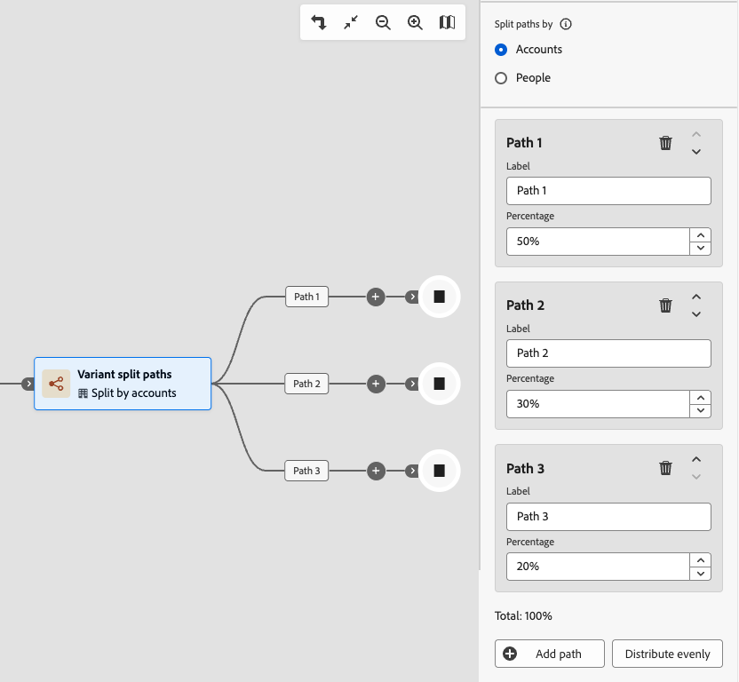

# 变体拆分路径

使用&#x200B;_变量拆分路径_&#x200B;节点，根据您定义的百分比分配，将帐户随机分布到两个或更多历程路径中。 此节点可用于探索性地测试帐户受众区段之间的不同消息传递、时间或参与策略，而无需应用条件规则。 它不适用于需要为每个帐户分配一致的受控A/B实验。

>[!AVAILABILITY]
>
>变体拆分路径节点当前可作为有限测试版选择客户，仅适用于&#x200B;**_帐户历程_**。 计划在将来的版本中支持人员历程。 要获取访问权限，请联系您的Adobe代表。

## 与拆分路径比较 {#compare-split-paths}

_[拆分路径](./split-merge-paths-nodes.md)_&#x200B;和&#x200B;_变量拆分路径_&#x200B;都将帐户划分为多个历程分支，但它们使用不同的机制：

| 长宽比 | 拆分路径 | 变体拆分路径 |
| -------- | ----------- | ------------------- |
| **分配逻辑** | _基于规则的条件式_ — 每个帐户都根据定义的条件进行评估，并沿其匹配的第一个路径前进。 | _基于百分比的随机分配_ — 根据配置的百分比（无筛选条件）跨路径分配帐户。 |
| **确定性** | _Deterministic_ — 相同帐户始终遵循相同的路径，只要它匹配相同的条件。 | 非确定性 — 同一帐户在重新进入时可能遵循不同的路径。 |
| **用例** | 按已知帐户或购买组属性进行分段；按优先级顺序进行评估。 | 在帐户受众中随机分发帐户以测试消息、时间或战术。 |
| **其他帐户路径** | _受支持_ — 可以将不匹配任何已定义路径的帐户路由到默认路径。 | _不适用_ — 每个帐户都分配给其中一个已定义的路径。 |

## 按帐户拆分 {#split-by-account}

当帐户到达变量拆分路径节点时，该节点会根据配置的百分比，将其仅分配给一个路径。 分配使用基于配额的算法，跟踪分配给每个路径的帐户数量，并随时间调整以保持配置的比率。

* 每个帐户只分配到一个路径。
* 分配是随机的，并且基于配额。 算法动态调整分配，以接近总体群体的已配置百分比。
* 该节点支持2到20条路径。 每个路径都有一个可配置的名称和从1到99的整数百分比。 所有路径百分比的总和必须恰好等于100%。

>[!IMPORTANT]
>
>**基于配额的算法：不确定**
>
>分配算法使用基于配额的随机分配。 此算法是&#x200B;**_非确定性_**：每次进入或重新进入历程时，可以将同一帐户分配给不同的路径。 路径分配取决于评估时当前的配额状态，而不是固定帐户属性。 有关此影响哪些用例的详细信息，请参阅[限制](#limitations)。

### 分发算法 {#distribution-algorithm}

变量拆分路径节点使用基于&#x200B;**_配额的随机分配_**&#x200B;算法。 当帐户到达节点时，系统会评估每个路径的现有帐户分配，并将帐户路由到距离其配置的配额最远的路径。 算法有两个关键属性：

* 分布情况将密切跟踪所有帐户卷上配置的百分比。 由于算法主动维护配额计数，因此，当总计未均匀分配时，由于四舍五入，实际分配在每个路径上最多只能有一个帐户。
* 该算法在配额评估期间使用悲观锁定来序列化分配，从而确保在并发执行下准确的计数跟踪。

### 限制 {#limitations}

在历程中使用变体拆分路径之前，请查看这些限制。

>[!CAUTION]
>
>**路径分配不是确定性的。**
>
>基于配额的算法不能保证相同的帐户始终遵循相同的路径。 如果帐户退出并重新进入历程，则可能会根据重新进入时的配额状态将其分配到不同的路径。 对于需要跨历程实例一致的按帐户路径分配的用例，请勿使用变体拆分路径。

| 限制 | 描述 |
| ---------- | ----------- |
| **不适用于对照实验** | 由于路径分配不是确定性的，因此变量拆分路径为&#x200B;**不适用于**，它适用于A/B实验或归因场景，这些场景需要给定帐户始终获得相同的处理。 取决于每个账户一致性的用例（如衡量响应率或把结果归因于特定体验）可能会产生不可靠的结果。 |
| **小舍入偏移** | 当总帐户数无法由配置的百分比平均分配时，每个路径最多只能有一个帐户禁用分配。 这是预期的舍入行为，不是错误。 |
| **路径分配不是幂等** | 重新进入历程可能会为同一帐户生成不同的路径分配。 如果您的旅程设计假定帐户在拆分节点后始终遵循相同的路径，则此假定不成立。 |
| **仅限帐户历程** | 仅帐户历程支持变量拆分路径。 当前不支持人员历程。 |
| **无条件筛选** | 与&#x200B;_拆分路径_&#x200B;不同，变体拆分路径不应用条件。 到达节点的每个帐户都分配给一个路径。 |

## 按人员拆分 {#split-by-people}

在帐户历程中，您还可以使用变量拆分路径节点将帐户&#x200B;_中的_&#x200B;人随机分布到基于百分比的路径中。 当您要在人员级别测试不同的内容或体验时（因为帐户继续在历程中移动），此拆分类型很有用。 按人员划分的变量拆分路径节点具有以下防护：

* 该节点作为&#x200B;_分组节点_&#x200B;运行，该分组节点为拆分合并组合。 拆分路径会在相应的合并节点处自动关闭，以便所有用户都可以在不丢失帐户上下文的情况下前进。
* 根据配置的百分比，帐户中的每个人都只能被分配到一条路径。
* 用于帐户的基于配额的算法同样适用于人。 路径分配不具有确定性，同一人在重新进入时可能遵循不同的路径。
* 路径中仅支持人员的&#x200B;_[!UICONTROL 执行操作]_&#x200B;节点。 路径无法进一步拆分。

>[!BEGINSHADEBOX “跨人员的分发行为”]

帐户中的人员将作为批次处理。 分配给每个路径的数字计算为`floor(percentage / 100 × people_in_account)`，最后配置的&#x200B;**路径接收所有剩余的人员**。 这意味着：

* 当帐户具有奇数人数时，最后一个路径会比先前的路径多接收一个人。
* 对于只有单个人员的帐户，无论配置的百分比如何，都会将该人员分配到第一个路径。
* 对于人手很少（少于10人）的帐户，按帐户分配的情况可能与配置的百分比有明显差异。 跨多个帐户进行测量时，分配会收敛到配置的比率。

>[!NOTE]
>
>此舍入行为适用于每个帐户批，而不适用于历程中的所有帐户。 当帐户大小为奇数时，最后一条路径系统性地接收的人数略多于配置人数。 这是预期行为。

>[!ENDSHADEBOX]

## 添加变量拆分路径节点 {#add-variant-split-paths-node}

1. 导航到历程图。

1. 单击路径上的加号( **+** )图标，然后选择&#x200B;**[!UICONTROL 变体拆分路径]**。

   {width="300" zoomable="no"}

   添加的节点具有两个起始路径。

1. 在右侧的节点属性中，为拆分选择&#x200B;**[!UICONTROL 帐户]**&#x200B;或&#x200B;**[!UICONTROL 人员]**。

   如果您使用&#x200B;_[!UICONTROL 人员]_&#x200B;类型，则会自动插入&#x200B;_关闭变体拆分路径_&#x200B;节点以关闭分组拆分。

   {width="700" zoomable="yes"}

1. 查看或更新每个路径的&#x200B;**[!UICONTROL 标签]**。

   路径标签在历程画布上显示为边缘标签，并帮助区分历程分析中的路径。

   {width="600" zoomable="yes"}

1. 为每个路径设置&#x200B;**[!UICONTROL 百分比]**。

   值必须是1到99之间的整数。

   {width="500" zoomable="yes"}

   运行总计指示器显示所有路径百分比的总和。 总数必须正好等于100%，然后才能发布历程。 当总计不等于100%时，会显示错误状态。

   {width="500" zoomable="yes"}

   若要将百分比平均分配到所有路径，请单击“平均分配”****。 系统计算相等的份额并调整任何舍入，以确保总数等于100%。

1. 若要定义其他路径，请单击每个路径的&#x200B;**[!UICONTROL 添加路径]**。

   该节点最多支持20条路径。 添加更多路径时，请调整&#x200B;_[!UICONTROL 百分比]_，使总数等于100%。

   您可以通过单击路径卡中的&#x200B;_删除_ （ ）图标来删除路径。 仅当至少保留两个路径时，才能删除路径。

### 验证规则 {#validation-rules}

以下规则适用于变量拆分路径配置。 违规阻止历程发布。

| 规则 | 要求 |
| ---- | ----------- |
| 最小路径 | 2 |
| 最大路径 | 20 |
| 每个路径的百分比 | 1到99的整数 |
| 总百分比 | 必须精确等于100% |
