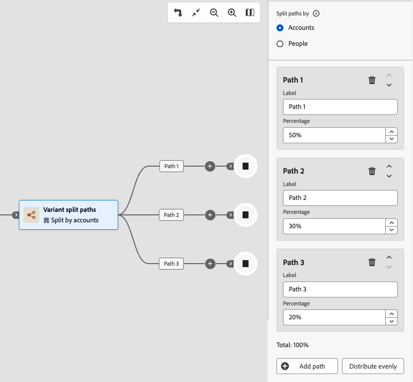

# 变体拆分路径

使用&#x200B;_变量拆分路径_&#x200B;节点，根据您定义的百分比分配，将帐户或人员分布在两个或更多历程路径上。 如果您希望在不应用条件规则的情况下跨受众区段测试不同的消息传送、计时或参与策略，此节点非常有用。

>[!AVAILABILITY]
>
>帐户和人员历程的&#x200B;_变量拆分路径_&#x200B;节点可用于选择客户作为有限可用性功能。 要获取访问权限，请联系您的Adobe代表。

## 按历程类型比较 {#journey-type-comparison}

变量拆分路径节点根据历程类型使用不同的分配算法。 了解这一区别对于为每种历程类型选择正确的用例非常重要。

| | 帐户历程 | 人员历程 |
| - | ---------------- | --------------- |
| **算法** | 基于配额的随机分配 | 确定性散列分配 |
| **确定性** | 非确定性 — 根据当前的配额状态，相同的帐户可能会在重新进入时分配给不同的路径。 | 确定性 — 对于给定的已发布历程，始终将同一人员分配到同一路径，无论他们进入或重新进入的次数如何。 |
| **A/B 测试** | 不适用 — 路径分配在重新进入时不稳定。 | 适合 — 一致的每人路径分配支持对照实验和归因。 |
| **重新进入行为** | 每次进入历程时，帐户可能遵循不同的路径。 | 人员始终遵循其在首次登录时分配的相同路径。 |
| **分发精度** | 由于配额强制，每个路径在一个帐户内。 | 在1,000个或更多历程条目时，收敛到占配置百分比的±2%以内。 |

## 与拆分路径比较 {#compare-split-paths}

_[拆分路径](./split-merge-paths-nodes.md)_&#x200B;和&#x200B;_变量拆分路径_&#x200B;都将历程划分为多个分支（路径），但它们使用不同的机制：

| 长宽比 | 拆分路径 | 变体拆分路径 |
| -------- | ----------- | ------------------- |
| **分配逻辑** | _基于规则的条件式_ — 每个实体都根据定义的条件进行评估，并沿其匹配的第一个路径前进。 | _基于百分比的分配_ — 实体根据配置的百分比跨路径分布，无筛选条件。 |
| **确定性** | _Deterministic_ — 相同实体始终遵循相同的路径，只要它匹配相同的条件。 | _取决于历程类型_ — 人员历程具有确定性（已发布历程中的同一人员始终遵循同一路径）。 帐户历程不是确定性的（基于配额）。 |
| **其他帐户/人员路径** | _支持_ — 可以将不匹配任何已定义路径的实体路由到默认路径。 | _不适用_ — 到达节点的每个实体都分配给一个路径。 |
| **用例** | 按已知的帐户或人员属性进行分段；按优先级排序的评估。 | 分发实体以测试消息、时间或战术。 人员历程：适用于A/B实验。 帐户历程：适用于没有每个帐户一致性的随机分配。 |

## 帐户历程 {#account-journeys}

对于帐户历程，分配算法使用[基于配额的随机分配](#account-journeys--quota-based-random-assignment)。 此算法是&#x200B;**_非确定性_**：每次进入或重新进入历程时，可以将同一帐户分配给不同的路径。 路径分配取决于评估时当前的配额状态，而不是固定帐户属性。

### 按帐户拆分 {#split-by-account}

当帐户到达变量拆分路径节点时，运行时将评估在当前历程实例期间已向每个路径分配了多少帐户，并将帐户路由到距离其配置的配额最远的路径。

* 每个帐户只分配到一个路径。
* 分配基于配额。 算法动态调整分配，以接近总体群体的已配置百分比。
* 由于算法跟踪配额计数，因此，当总计未均匀划分时，由于四舍五入，实际分配在每个路径上最多只偏移一个帐户。

### 按人员拆分 {#split-by-people}

在帐户历程中，您还可以使用变量拆分路径节点将帐户&#x200B;_中的_&#x200B;人随机分布到基于百分比的路径中。 当您想要在人员级别测试不同的内容或体验时，此拆分类型很有用。 客户会继续在整个历程中移动。 按人员划分的变量拆分路径节点具有以下防护：

* 该节点作为&#x200B;_分组节点_&#x200B;运行，该分组节点为拆分合并组合。 拆分路径会在相应的合并节点处自动关闭，以便所有用户都可以在不丢失帐户上下文的情况下前进。
* 根据配置的百分比，帐户中的每个人都只能被分配到一条路径。
* 用于帐户的基于配额的算法同样适用于人。 路径分配不具有确定性，同一人在重新进入时可能遵循不同的路径。
* 路径中仅支持人员的&#x200B;_[!UICONTROL 执行操作]_&#x200B;节点。 路径无法进一步拆分。

>[!BEGINSHADEBOX “跨人员的分发行为”]

帐户中的人员将作为批次处理。 分配给每个路径的数字计算为`floor(percentage / 100 × people_in_account)`，最后配置的&#x200B;**路径接收所有剩余的人员**。 这意味着：

* 当帐户具有奇数人数时，最后一个路径会比先前的路径多接收一个人。
* 对于只有单个人员的帐户，无论配置的百分比如何，都会将该人员分配到第一个路径。
* 对于人手很少（少于10人）的帐户，按帐户分配的情况可能与配置的百分比有明显差异。 跨多个帐户进行测量时，分配会收敛到配置的比率。

>[!NOTE]
>
>此舍入行为适用于每个帐户批，而不适用于历程中的所有帐户。 当帐户大小为奇数时，最后一条路径系统性地接收的人数略多于配置人数。 这是预期行为。

>[!ENDSHADEBOX]

## 人员历程 {#person-journeys}

当人员到达变量拆分路径节点时，运行时会根据其ID和历程ID的哈希将它们映射到路径。

* 每个人员只分配到一个路径。
* 分配是确定性的 — 对于给定的已发布历程，同一人员始终会收到相同的路径分配，无论他们进入或重新进入的次数如何。
* 哈希仅从人员ID和历程ID中计算。 它不依赖于节点位置、输入时间或任何配额状态。 这意味着重新进入旅程每次都会产生相同的路径分配。

>[!NOTE]
>
>**人员历程变量拆分适用于A/B测试和实验。**
>
>由于分配具有确定性并在多次重新进入之间保持一致，因此人员历程中的变量拆分路径支持对照实验，其中同一人员必须始终获得相同的体验。 使用[历程详细信息](./journey-details.md)视图监视历程处于实时状态后路径之间的分布。

## 分发算法

应用的分发算法取决于历程类型。

### 帐户历程 — 基于配额的随机分配

帐户历程中的变量拆分路径节点使用基于&#x200B;**配额的随机分配**&#x200B;算法。 当帐户到达节点时，运行时将评估在当前历程实例期间已向每个路径分配了多少帐户，并将帐户路由到距离其配置的配额最远的路径。

基于配额的算法的&#x200B;**Key属性：**

* 分布情况将密切跟踪所有帐户卷上配置的百分比。 由于算法主动维护配额计数，因此当总计未均匀划分时，由于四舍五入，实际分配在每个路径上最多只漂移一个帐户。

### 人员历程 — 确定性哈希分配

人员历程中的变量拆分路径节点使用&#x200B;**确定性哈希分配**&#x200B;算法。 当人员到达节点时，运行时根据人员ID和历程ID计算哈希值，然后根据配置的百分比范围将结果映射到路径。 使用以下工作流应用算法：

1. 运行时从组合人员ID和历程ID的复合密钥计算MurmurHash3 32位哈希。
1. 哈希值将映射到10,000个大小相等的存储桶中的位置。
1. 存储桶根据配置的路径百分比进行分区。 例如，如果路径数分别为30%、30%和40%，则前3,000个存储段分别对应于路径1、后3,000个和路径3，其余4,000个分别对应于路径3。
1. 将人员分配到其存储段范围包含其哈希位置的路径。

确定性哈希算法有两个关键属性：

* **_一致性_** — 对于给定的历程ID，始终将同一人员分配到同一存储段。 重新进入历程每次都会生成相同的路径分配。
* **_统计分布_** — 当至少1,000个独特人员进入历程时，分布收敛到配置的百分比的±2%以内。 如果受众较少，则每路径计数与配置的比率可能相差更显着。

## 限制 {#limitations}

在历程中使用变体拆分路径之前，请查看这些限制。

### 帐户历程限制 {#account-journey-limitations}

>[!IMPORTANT]
>
>**路径分配不是确定性的。**
>
>基于配额的算法不能保证相同的帐户始终遵循相同的路径。 如果帐户退出并重新进入历程，则可能会根据重新进入时的配额状态将其分配到不同的路径。 对于需要跨历程实例一致的按帐户路径分配的用例，请勿使用帐户历程变量拆分路径。

| 限制 | 描述 |
| ---------- | ----------- |
| **不适用于对照实验** | 由于路径分配不是确定性的，因此帐户历程中的变体拆分路径&#x200B;**不适用于**，它适用于需要给定帐户始终获得相同处理的A/B实验或归因方案。 |
| **小舍入偏移** | 当总帐户数无法由配置的百分比平均分配时，每个路径最多只能有一个帐户禁用分配。 这是预期的舍入行为，不是错误。 |
| **路径分配不是幂等** | 重新进入历程可能会为同一帐户生成不同的路径分配。 |
| **无条件筛选** | 与&#x200B;_拆分路径_&#x200B;不同，变体拆分路径不应用条件。 到达节点的每个帐户都分配给一个路径。 |

### 人员历程限制 {#person-journey-limitations}

| 限制 | 描述 |
| ---------- | ----------- |
| **小尺度统计方差** | 当至少1,000个独特访客进入历程时，分布会收敛到约±2%内的配置百分比。 如果条目较少，则每路径计数与配置的比率可能相差更明显。 这是哈希分发的预期行为，不是错误。 |
| **无条件筛选** | 与&#x200B;_拆分路径_&#x200B;不同，变体拆分路径不应用条件。 到达节点的每个人都会被分配到一条路径。 |

## 添加变量拆分路径节点 {#add-variant-split-paths-node}

添加和配置变量拆分路径节点的步骤与帐户和人员历程相同。

1. 导航到历程图。

1. 单击路径上的&#x200B;_添加_ ( **+** )图标，然后选择&#x200B;**[!UICONTROL 变体拆分路径]**。

   {width="300" zoomable="no"}

   在历程图上，节点有两个默认路径。

1. （_仅限帐户历程_）在右侧的节点属性中，为拆分选择&#x200B;**[!UICONTROL 帐户]**&#x200B;或&#x200B;**[!UICONTROL 人员]**。

   如果您使用&#x200B;_[!UICONTROL 人员]_&#x200B;类型，则会自动插入&#x200B;_关闭变体拆分路径_&#x200B;节点以关闭分组拆分。

   {width="700" zoomable="yes"}

1. 查看或更新每个路径的&#x200B;**[!UICONTROL 标签]**。

   路径标签在历程画布上显示为边缘标签，并帮助区分历程分析中的路径。

   {width="600" zoomable="yes"}

1. 为每个路径设置&#x200B;**[!UICONTROL 百分比]**。

   值必须是1到99之间的整数。

   {width="500" zoomable="yes"}

   运行总计指示器显示所有路径百分比的总和。 总数必须正好等于100%，然后才能发布历程。 当总计不等于100%时，会显示错误状态。

   {width="500" zoomable="yes"}

   若要将百分比平均分配到所有路径，请单击“平均分配”****。 系统计算相等的份额并调整任何舍入，以确保总数等于100%。

1. 若要定义其他路径，请单击每个路径的&#x200B;**[!UICONTROL 添加路径]**。

   该节点最多支持20条路径。 添加更多路径时，请调整&#x200B;_[!UICONTROL 百分比]_，使总数等于100%。

   您可以通过单击路径卡中的&#x200B;_删除_ （ ）图标来删除路径。 仅当至少保留两个路径时，才能删除路径。

   以下规则适用于变量拆分路径配置。 违规阻止历程发布。

   | 规则 | 要求 |
   | ---- | ----------- |
   | 最小路径 | 2 |
   | 最大路径 | 20 |
   | 每个路径的百分比 | 1到99的整数 |
   | 总百分比 | 必须精确等于100% |
