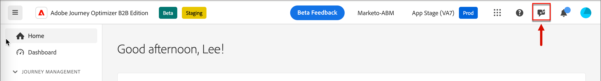

# 使用AI助手

在Journey Optimizer B2B版本中，AI Assistant是一项用户界面功能，可用于了解基于帐户的营销概念，并快速导航和了解Journey Optimizer B2B版本功能<!-- get operational insights for your specific environment -->。 Adobe Experience Cloud的多个产品中也提供了此功能。

要访问AI助手，请单击标题中的图标。 AI助手将在右侧的面板中打开。

{width="600" zoomable="yes"}

>[!IMPORTANT]
>
>在使用AI助手之前，需要先签署Adobe Experience Cloud创作AI用户指南协议。 有关此协议和使用准则的更多信息，请参阅[Adobe Experience Cloud Generative AI用户准则](https://www.adobe.com/legal/licenses-terms/adobe-dx-gen-ai-user-guidelines.html)。

在Adobe Journey Optimizer B2B版本中，AI Assistant支持以下用例：

* **产品知识** (Beta)

  产品知识问题涉及与Adobe Journey Optimizer各个方面相关的Journey Optimizer B2B版本概念。 产品知识问题的一些示例包括：

   * 如何设置短信提供商帐户？
   * 如何在帐户历程中发送电子邮件？
   * 如何个性化我的电子邮件内容？

<!-- 
* **Operational insights** in journeys (Beta)

    Operational insight questions are about the journey objects in your organization's sandbox. Some examples of operational insight questions or prompts include:

    * How many live journeys do I have in Adobe Journey Optimizer?
    * Give me a list of all the scheduled journeys
    * How many Journeys have been created in the last 7 days?

    >[!NOTE]
    >
    >The only Adobe Journey Optimizer B2B Edition object you have access to ask the AI Assistant operational insights questions about is **Journeys**. It will only have data for the sandbox you are currently in.
-->
要提出问题，请在面板底部的字段中输入问题，然后按Enter键。

{width="450" zoomable="yes"}

检查答案并使用&#x200B;**显示源**&#x200B;按钮获取产品文档的直接链接并了解更多信息。

{width="450" zoomable="yes"}

使用向上或向下拇指对答案的质量进行评级。

要了解如何使用AI助手，请查看可以使用AI助手实现的示例目标，并了解AI助手的工作原理，请参阅[Adobe Experience Platform文档](https://experienceleague.adobe.com/en/docs/experience-platform/ai-assistant/home){target="_blank"}。
