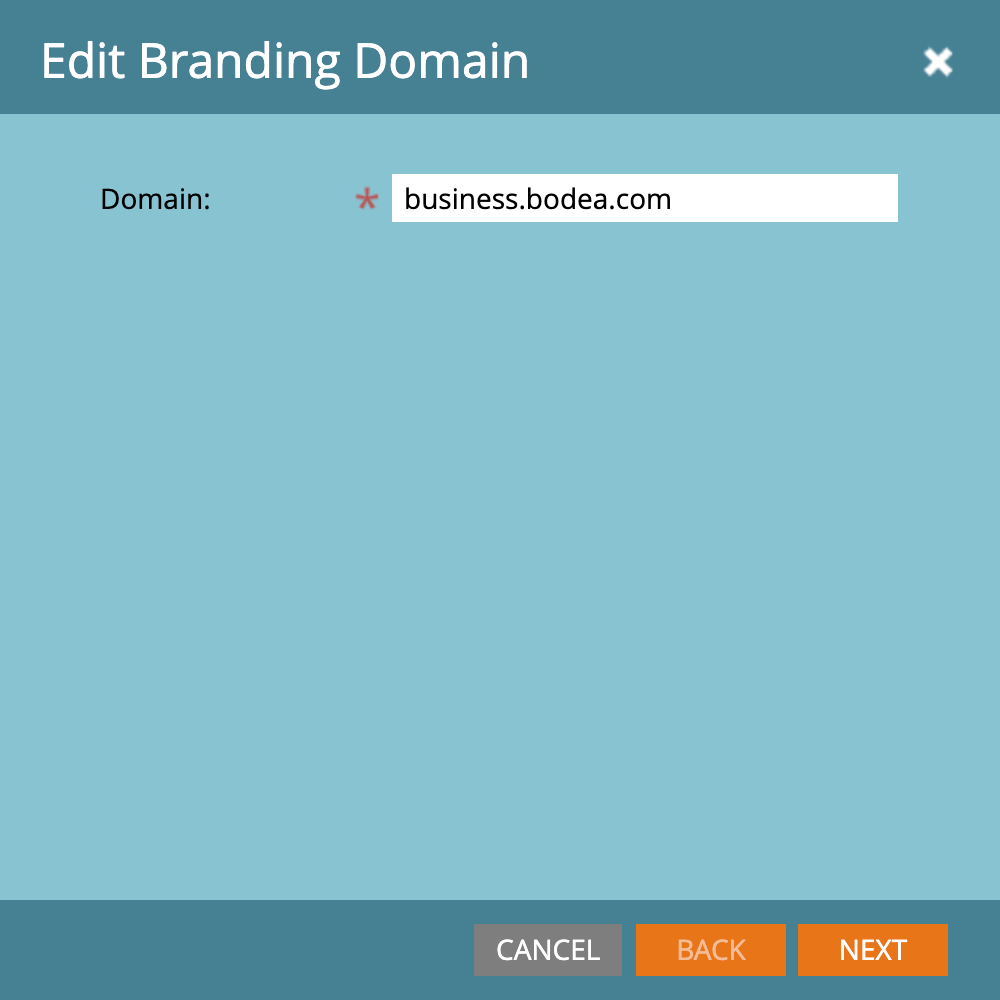
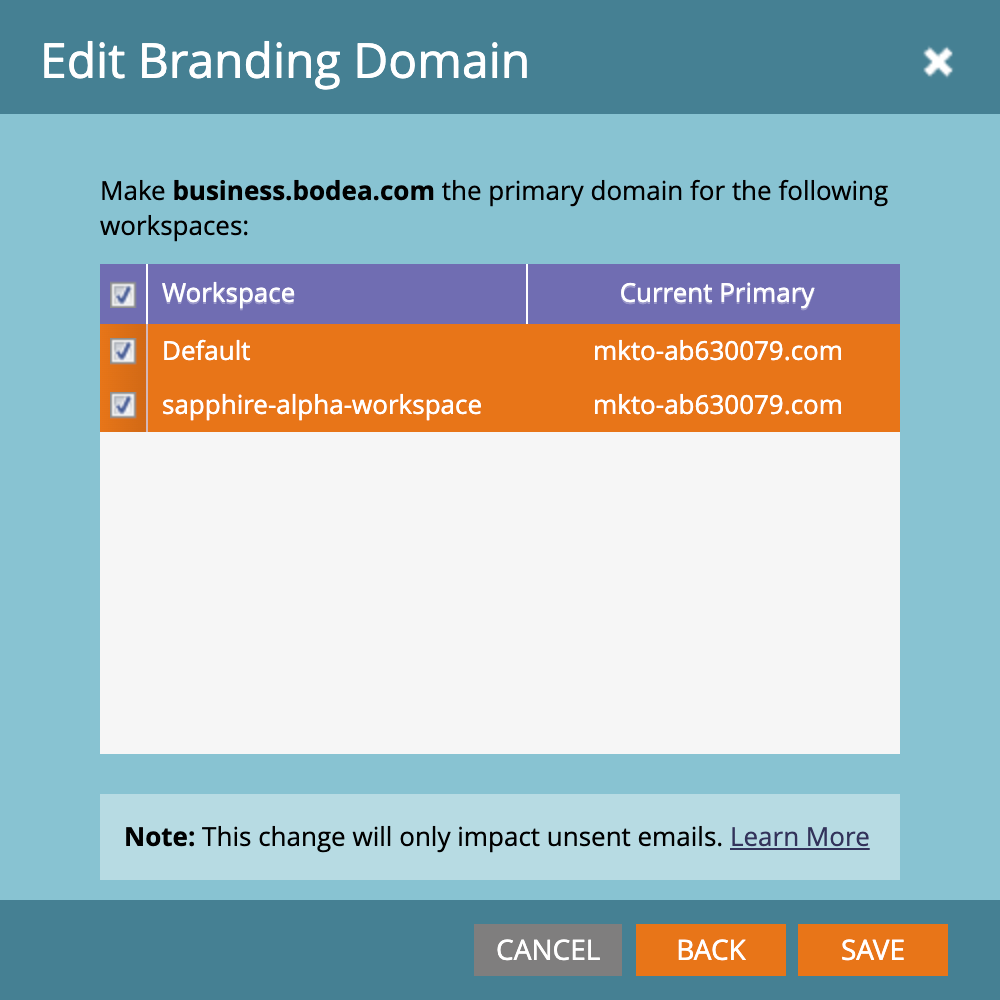
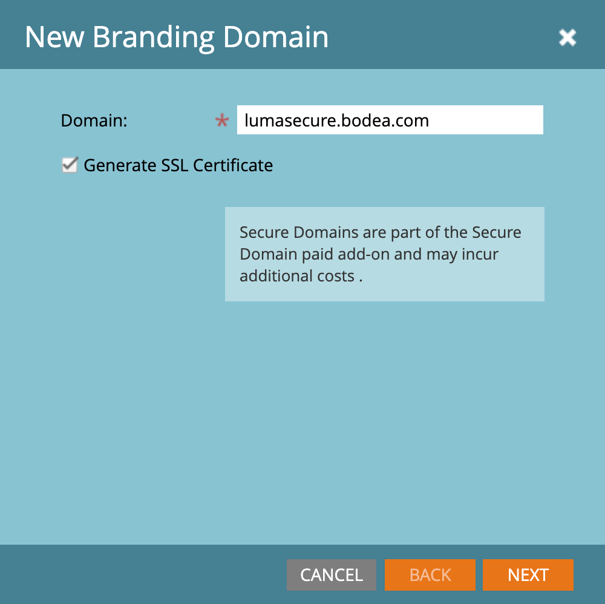

# 配置品牌策略域

Marketo Engage中的品牌策略域是一个自定义子域（如`links.yourcompany.com`），用于重写链接和跟踪电子邮件点击并确保它们反映您的品牌而非通用域。 每个品牌推广域都充当点击跟踪域，通过将电子邮件和登陆页面链接与域进行配对来增强可投放性和信任度。

* 它在电子邮件超链接中将通用链接替换为您自己的品牌。
* 当帐户潜在客户单击链接时，它通过此自定义域进行重定向，以允许在对电子邮件过滤器显示合法性的同时进行性能跟踪。
* 如果您拥有多个品牌，则可以配置其他品牌策略域以支持不同的业务单位或品牌。

>[!BEGINSHADEBOX]

**用于跟踪链接的唯一CNAME**

电子邮件跟踪链接必须是新的，并且对于附加的Marketo Engage实例必须是唯一的。 如果您有现有的CNAME用于跟踪指向预先存在的（生产）Marketo Engage实例的链接，则未经修改便无法重复使用它们。

您可以在生产Marketo Engage实例和附加实例之间共享返回路径域品牌化，但这是后端更改。 打开支持工单并提供您的Marketo Engage前缀(Munchkin ID)和新的Journey Optimizer B2B edition前缀(Munchkin ID)，以请求共享返回路径域品牌化。

>[!ENDSHADEBOX]

>[!PREREQUISITES]
>
>在UI中编辑或添加域之前，必须将[CNAME映射到Adobe提供的Marketo Engage域](https://experienceleague.adobe.com/zh-hans/docs/marketo/using/getting-started/initial-setup/setup-steps#customize-your-landing-page-urls-with-a-cname){target="_blank"}。
>
>添加域时，系统会检查预先存在的SSL，这些SSL可能在之前已手动创建。 如果遇到此验证，请在不选择SSL创建的情况下创建域，然后将其作为单独的过程连接。

## 访问Marketo Engage中的品牌化域

1. 转到Marketo Engage实例中的&#x200B;**[!UICONTROL 管理员]**&#x200B;区域，然后选择&#x200B;**[!UICONTROL 电子邮件]**。

1. 向下滚动到&#x200B;**[!UICONTROL 品牌化域]**&#x200B;面板。

   在“管理员”中的“电子邮件”下{width="700" zoomable="yes"}

   该列表显示了Marketo Engage实例的默认域。

## 编辑您的默认品牌策略域

使用品牌域的第一步是编辑在Marketo Engage实例中定义的默认品牌域。

>[!NOTE]
>
>在编辑通用默认域之前，您无法定义其他品牌策略域。

1. 在&#x200B;_[!UICONTROL 品牌化域]_&#x200B;面板中，选择通用域并单击顶部的&#x200B;**[!UICONTROL 编辑]**。

   {width="500"}

1. 在&#x200B;_[!UICONTROL 编辑品牌策略域]_&#x200B;对话框中，在&#x200B;**[!UICONTROL 域]**&#x200B;字段中输入默认域的名称。

   {width="400"}

1. 如果您为Marketo Engage实例定义了多个工作区，请单击&#x200B;**[!UICONTROL 下一步]**。

   选择要应用已更新主域的每个工作区。

   {width="400"}

1. 单击&#x200B;**[!UICONTROL 保存]**。

## 定义其他域

在编辑默认域后，您可以添加另一个品牌域来支持您的Journey Optimizer B2B Edition环境中的多个品牌，其中每个品牌都有自己的品牌跟踪链接。 添加域时，有以下选项：

>* _使主域_：使它成为工作区的主域。 选择此选项时，所有现有未发送电子邮件都会设置为默认主域，所有新创建的电子邮件都会自动默认到此主域。 营销人员可以根据需要选择替代品牌推广域。
>
>* _生成SSL证书_：创建域以创建安全套接字层(SSL)。 第一个跟踪域启动一次性的基础结构设置，这可能需要几个小时。 系统会在完成时发送通知。

添加域&#x200B;:_(_T)

1. 在&#x200B;_[!UICONTROL 品牌策略域]_&#x200B;面板中，单击顶部的&#x200B;**[!UICONTROL 添加]**。

   {width="500"}

1. 在&#x200B;_[!UICONTROL 新品牌策略域]_&#x200B;对话框中，在&#x200B;**[!UICONTROL 域]**&#x200B;字段中输入品牌策略域的名称。

1. （可选）选中&#x200B;**[!UICONTROL 生成SSL证书]**&#x200B;复选框以自动为域生成SSL。

   {width="400"}

   如果需要并且可用，您还可以选中&#x200B;_创建主域_&#x200B;复选框。

   >[!NOTE]
   >
   >**_自定义SSL_**：如果您需要自定义SSL，则可以提交[支持票证](https://experienceleague.adobe.com/zh-hans/support){target="_blank"}。 请勿将复选框用于SSL创建。

1. 如果您为Marketo Engage实例定义了多个工作区，请单击&#x200B;**[!UICONTROL 下一步]**。

   如果需要，请选择要应用新域作为主域的每个工作区。

   {width="400"}

1. 单击&#x200B;**[!UICONTROL 保存]**。

## 编辑现有品牌策略域的SSL

按照以下步骤为现有域启用SSL。

1. 从&#x200B;_[!UICONTROL 管理员]_&#x200B;区域，选择&#x200B;**[!UICONTROL 电子邮件]**。

1. 在&#x200B;_[!UICONTROL 品牌化域]_&#x200B;面板中，选择域行并单击&#x200B;**[!UICONTROL 添加SSL]**。

   {width="500"}

1. 在对话框中，单击&#x200B;**[!UICONTROL 确认]**。

   {width="400"}

## 错误消息

| 错误 | 详细信息 |
| ----- | ------- |
| `Domain already exists.` | 具有相同名称的域已存在。 |
| `Domain is not mapped to the default domain.` | 自定义域未正确映射到默认域。 验证域映射设置，并确保DNS配置指向正确的默认域。 |
| `SSL certificates could not be issued due to unsupported CAA records. Request your IT to update your CAA records.` | CAA记录不是最新的。 对于使用Adobe管理的SSL证书的用户而言，CAA记录必须更新为供应商推荐的证书。 |
| `SSL certificate has already been issued.` | 此自定义域已存在SSL证书。 除非证书已过期或需要重新颁发，否则无需执行进一步操作。 |
| `The default domain was not found. Please contact Support for assistance.` | 尝试查找默认域时出现问题。 联系Adobe支持以触发调查。 |
| `Unexpected error encountered while creating a domain. Please contact Support for assistance.` | 出现意外错误。 收集日志和错误详细信息，然后将问题上报给Adobe支持部门。 |

## 删除品牌策略域

>[!NOTE]
>
>如果要删除主品牌域（在一个或多个工作区中），则必须首先为每个工作区选择不同的品牌域作为主品牌域。
>
>删除域&#x200B;**_不会_**&#x200B;删除SSL证书。 此护栏可防止导致网站没有SSL证书的用户错误。 如果您确实要删除SSL证书，请联系Adobe支持。

在&#x200B;_[!UICONTROL 品牌化域]_&#x200B;面板中，选择域并单击顶部的&#x200B;**[!UICONTROL 删除]**。
