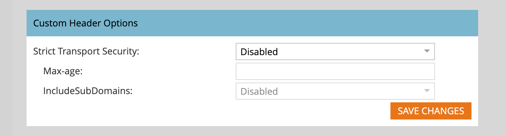

# 电子邮件设置

要支持由附加的Marketo Engage实例提供的电子邮件投放基础架构，请设置以下电子邮件选项。 Marketo Engage产品管理员可以通过导航到Marketo Engage实例中的&#x200B;**[!UICONTROL 管理员]**&#x200B;区域并选择&#x200B;**[!UICONTROL 电子邮件]**&#x200B;来配置这些设置。

## 电子邮件设置

要为附加的Marketo Engage实例设置电子邮件默认值，请更改配置值以反映营销组织的使用情况。

### 发件人电子邮件和标签

更改发件人电子邮件和标签的值，以便新电子邮件自动填充这些默认值。

>[!NOTE]
>
>此更改仅适用于您创建的电子邮件，而不适用于其他Marketo Engage或Journey Optimizer B2B edition用户。

1. 转到附加的Marketo Engage实例中的&#x200B;**[!UICONTROL 管理员]**&#x200B;区域，然后选择&#x200B;**[!UICONTROL 电子邮件]**。

1. 在&#x200B;_[!UICONTROL 设置]_&#x200B;面板中，输入您希望&#x200B;**[!UICONTROL 来自电子邮件]**&#x200B;和&#x200B;**[!UICONTROL 来自标签]**&#x200B;的默认值。

   {width="500"}

1. 单击&#x200B;**[!UICONTROL 保存更改]**。

### 取消订阅消息

对于非运营营销电子邮件，取消订阅文本和链接会附加到底部。 作为产品管理员，您应该配置默认的HTML以及在营销人员未将电子邮件标记为可操作时填充的文本。

1. 转到附加的Marketo Engage实例中的&#x200B;**[!UICONTROL 管理员]**&#x200B;区域，然后选择&#x200B;**[!UICONTROL 电子邮件]**。

1. 在&#x200B;_[!UICONTROL 设置]_&#x200B;面板中，为&#x200B;**[!UICONTROL 取消订阅HTML]**&#x200B;和&#x200B;**[!UICONTROL 取消订阅文本]**&#x200B;输入所需的默认值。

   >[!TIP]
   >
   >营销人员可以使用系统令牌更改取消订阅HTML在其电子邮件中的位置。

   {width="500"}

   >[!CAUTION]
   >
   >以下变量至关重要。 **不删除**&#x200B;它们。
   >
   >* `%mkt_opt_out_prefix%`
   >* `mkt_unsubscribe=1&mkt_tok=##MKT_TOK##`

1. 单击&#x200B;**[!UICONTROL 保存更改]**。

如果需要还原到默认系统内容，请复制并粘贴以下内容：

+++ 系统默认取消订阅文本

```
<p><font face="Verdana" size="1">If you no longer wish to receive these emails, click on the following link: <a href="%mkt_opt_out_prefix%UnsubscribePage.html?mkt_unsubscribe=1&mkt_tok=##MKT_TOK##">Unsubscribe</a><br/></font></p>` [!UICONTROL Unsubscribe Text]:
%mkt_opt_out_prefix%UnsubscribePage.html?mkt_unsubscribe=1&mkt_tok=##MKT_TOK##
```

+++

### 以网页形式查看

电子邮件内容的显示功能有限（CSS有限，无JavaScript或表单）。 营销人员可以使用&#x200B;_以网页形式查看_&#x200B;选项，通过Marketo Munchkin为电子邮件收件人应用Cookie。 作为产品管理员，您应该配置默认的HTML以及在营销人员选择此选项时填充的文本。

1. 转到附加的Marketo Engage实例中的&#x200B;**[!UICONTROL 管理员]**&#x200B;区域，然后选择&#x200B;**[!UICONTROL 电子邮件]**。

1. 在&#x200B;_[!UICONTROL 设置]_&#x200B;面板中，更改&#x200B;**[!UICONTROL 以网页形式查看HTML]**&#x200B;和&#x200B;**[!UICONTROL 以网页形式查看文本]**&#x200B;字段中的内容以反映您的语调和消息。

   {width="500"}

   >[!CAUTION]
   >
   >以下变量至关重要。 **不删除**&#x200B;它们。
   >
   >`%mkt_webview_url%?mkt_tok=##MKT_TOK##`
   >
   >第二部分`##MKT_TOK##`是该人员的Munchkin Cookie。 它确保在电子邮件收件人单击链接时正确应用Cookie。
   >
   >请务必避免：
   >
   >* 向任一HTML框添加其他URL
   >* 在文本版本中置入HTML

1. 单击&#x200B;**[!UICONTROL 保存更改]**。

如果您需要还原到默认系统内容，请复制并粘贴以下内容：

+++ 系统默认网页HTML

```
<div style="text-align: center"><font face="Verdana" size="1">To view this email as a web page, <a href="%mkt_webview_url%?mkt_tok=##MKT_TOK##">click here</a></font></div>
```

+++

+++ 系统默认网页文本

```
To view this email as a web page, go to the following address:
`%mkt_webview_url%?mkt_tok=##MKT_TOK##`
```

+++

## 自定义对象检索限制

如果使用[!DNL Velocity Script]在电子邮件中显示自定义对象数据，请调整父自定义对象检索限制。 默认情况下，该限制允许从Velocity脚本访问10个父自定义对象。 如果需要，您可以提高此限制。

[[!DNL Apache Velocity]](https://velocity.apache.org/)是基于[!DNL Java]构建的语言，专为模板化和编写HTML内容脚本而设计。 Marketo Engage电子邮件基础架构支持通过脚本令牌在电子邮件上下文中使用它，利用脚本令牌可访问存储在自定义对象中的数据。

您可以引用直接连接到潜在客户或联系人的父自定义对象和子自定义对象，但不能引用第三级自定义对象。 对于每个自定义对象，每个人员/联系人的10个最近更新的记录在运行时可用，并且按照从最近更新（在`0`）到最旧更新（在`9`）的顺序排列。

更改限制(_T):_

1. 转到附加的Marketo Engage实例中的&#x200B;**[!UICONTROL 管理员]**&#x200B;区域，然后选择&#x200B;**[!UICONTROL 电子邮件]**。

1. 滚动到&#x200B;_[!UICONTROL 自定义对象检索限制]_&#x200B;面板，然后在&#x200B;**[!UICONTROL 父检索限制中输入一个新值]**
字段。

   {width="500"}

   支持10 - 100之间的值。 系统自动设置&#x200B;_[!UICONTROL 子检索限制]_，方法是将1000除以父项限制。 例如，如果将父限制设置为50，则子限制的计算公式为20 (1000 ÷ 50 = 20)。

1. 单击&#x200B;**[!UICONTROL 保存更改]**。

## 自定义标题选项

更改电子邮件的&#x200B;_[!UICONTROL 自定义标头选项]_&#x200B;以配置电子邮件跟踪链接标头。 启用这些选项以使用具有严格传输的HTTPS实施安全跟踪链接。

1. 转到附加的Marketo Engage实例中的&#x200B;**[!UICONTROL 管理员]**&#x200B;区域，然后选择&#x200B;**[!UICONTROL 电子邮件]**。

1. 滚动到&#x200B;_[!UICONTROL 自定义标题选项]_&#x200B;面板，并根据您的跟踪链接策略更改设置：

   {width="500"}

   * **[!UICONTROL 严格传输安全性]** — 将此选项设置为&#x200B;_已启用_，以确保始终通过HTTPS提供跟踪链接。 仅对包含受SSL保护的跟踪链接的订阅启用此项。
   * **[!UICONTROL Max-age]** — 此字段支持强制指令以秒为单位指定浏览器应记住仅通过HTTPS访问域的时间。
   * **[!UICONTROL IncludeSubDomains]** — 使用此选项可以包含将HSTS策略应用于主机所有子域的指令。

   >[!IMPORTANT]
   >
   >请与您的IT团队一起查看这些设置，以确保它们与贵组织的策略保持一致。 不正确的设置可能会阻止某些访客访问您的电子邮件链接。

1. 单击&#x200B;**[!UICONTROL 保存更改]**。

## 筛选电子邮件机器人活动 {#filter-email-bots}

电子邮件机器人活动(也称为非人工交互(NHI))可能会夸大您的电子邮件&#x200B;_打开_&#x200B;和&#x200B;_点击_&#x200B;数据，扭曲您的参与量度，并触发基于事件的历程进程。 使用电子邮件机器人筛选来维护点击参与量度和分析的完整性。 识别可疑机器人活动的方法有两种：

* _&#x200B;**[!UICONTROL 与IAB机器人列表匹配]**&#x200B;_ — 与[Interactive Advertising Bureau机器人列表](https://www.iab.com/guidelines/iab-abc-international-spiders-bots-list/){target="_blank"}（用户代理/IP地址）上的任何内容匹配的活动将被标记为机器人。
* _&#x200B;**[!UICONTROL 与邻近模式匹配]**&#x200B;_ — 将同时发生的两个或多个活动（在一秒之内）识别为机器人。 比较过程中考虑的属性包括：
   * 商机ID（应相同）
   * 电子邮件资源（应相同）
   * 链接点击或电子邮件打开

对于电子邮件链接点击和电子邮件打开活动，属性将填充为以下值：

* 识别为机器人的活动 — _机器人活动_ = `true`和&#x200B;_机器人活动模式_ =识别的模式/方法
* 识别为非机器人的活动 — _机器人活动_ = `false`和&#x200B;_机器人活动模式_ = `n/a`

### 设置筛选器

1. 转到附加的Marketo Engage实例中的&#x200B;**[!UICONTROL 管理员]**&#x200B;区域，然后选择&#x200B;**[!UICONTROL 电子邮件]**。

1. 选择&#x200B;**[!UICONTROL 机器人活动]**&#x200B;选项卡。

   {width="700" zoomable="yes"}

   机器人活动识别面板显示两个可用于识别机器人活动的滑块。

1. 切换滑块以启用一个或两个。

   对于您启用的每个方法，请选择&#x200B;_[!UICONTROL 日志机器人活动]_&#x200B;或&#x200B;_[!UICONTROL 过滤机器人活动]_。

   >[!IMPORTANT]
   >
   >如果选择[!UICONTROL 过滤机器人活动]，您可能会看到电子邮件打开数和点击数下降，因为虚假活动会被消除。

   {width="500"}

   对于&#x200B;_[!UICONTROL 与邻近关系模式匹配]_，您还可以设置活动之间&#x200B;**[!UICONTROL 持续时间]**&#x200B;的秒数（默认值为`0`，最大值为`3`）。

   >[!NOTE]
   >
   >将“活动之间的持续时间”_设置为`0`秒，Marketo Engage可识别在该秒发生的电子邮件活动。_&#x200B;如果在指定的秒数内发生了多个电子邮件活动，则会将其识别为机器人活动。

   要禁用任一过滤方法，请将滑块切换到左侧。 如果这样做，数据将不会重置。

### IP阻止列表

Adobe已识别出负责生成虚假参与的IP地址。 自动过滤来自这些IP的参与，并将其从Marketo Engage实例中排除。 此筛选可能会减少电子邮件打开次数、点击次数和其他相关活动。 此列表可能会定期更新。

+++ 阻止的IP地址

* 40.94.34.52
* 40.94.34.86
* 52.34.76.65
* 54.70.53.60
* 54.71.187.124
* 60.28.2.248
* 64.235.150.252
* 64.235.153.10
* 64.235.153.2
* 64.235.154.105
* 64.235.154.109
* 64.235.154.140
* 64.74.215.1
* 64.74.215.100
* 64.74.215.138
* 64.74.215.139
* 64.74.215.142
* 64.74.215.146
* 64.74.215.150
* 64.74.215.154
* 64.74.215.158
* 64.74.215.162
* 64.74.215.164
* 64.74.215.166
* 64.74.215.170
* 64.74.215.174
* 64.74.215.176
* 64.74.215.178
* 64.74.215.51
* 64.74.215.56
* 64.74.215.58
* 64.74.215.59
* 64.74.215.86
* 64.74.215.98
* 65.154.226.101
* 66.249.91.149
* 70.42.131.106
* 74.125.217.116
* 74.217.90.250
* 104.129.41.4
* 104.47.55.126
* 104.47.58.126
* 104.47.70.126
* 104.47.73.126
* 104.47.73.254
* 104.47.74.126
* 128.220.160.1
* 155.70.39.101
* 162.129.251.14
* 162.129.251.42
* 208.52.157.204

>[!NOTE]
>
>在将IP地址列入此列表之前，将仔细分析和审查每个IP地址，确保仅拦截最关键和最有害的IP。

+++
